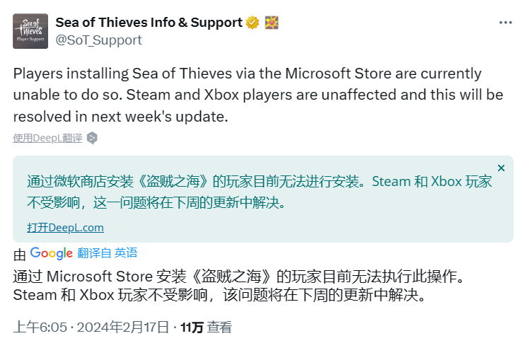
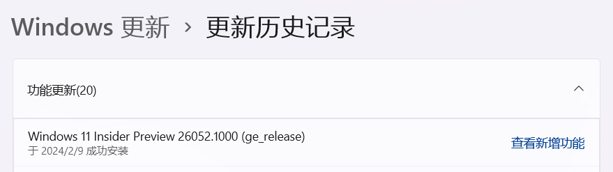
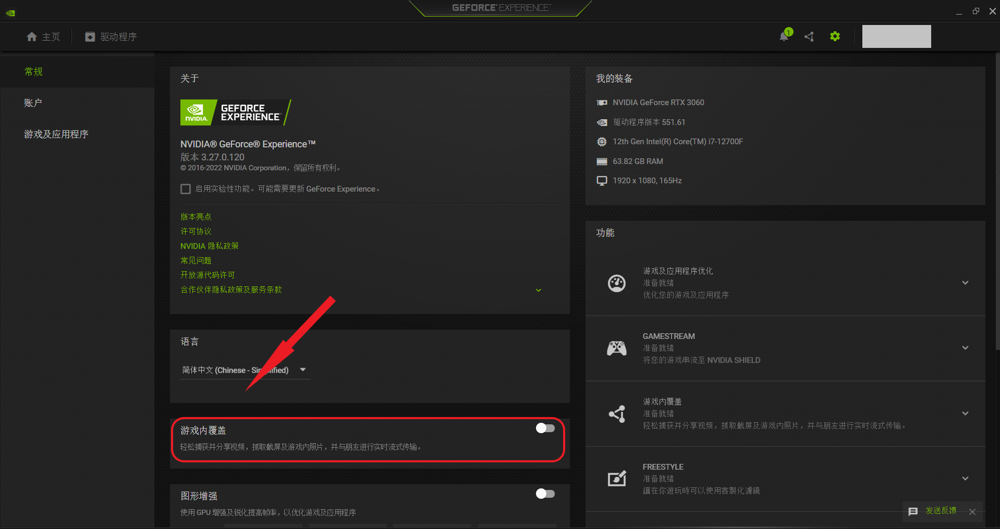

## ✦ Canary - 归档 (已做出更改 >28 天) ✦

&emsp;&emsp;记录 Microsoft 已做出更改 >28 天的问题 & 超过 45 日无新增赞成票的问题。

&emsp;&emsp;无特殊情况，问题归档后不再更新。

|      编号       |                             问题                             |   状态    |
| :-------------: | :----------------------------------------------------------: | :-------: |
|    **—————**    | **✦** [**Canary - 公告已知问题**](README.md) **✦ \| ✦** [**Canary - 用户反馈问题**](README.md) **✦ \| ✦** [**Canary - 归档 (已做出更改 >14 天)**](README.md) **✦** | **—————** |
| [LG000](#LG000) |       无法下载 Build 26016 更新，显示 8024200D 错误。        | 已修复 ✓  |
| [LG003](#LG003) |            点击 “设置”>“系统”>“电源” 时菜单崩溃。            | 已修复 ✓  |
| [LG005](#LG005) |             Windows RE (恢复环境) 无法正确呈现。             | 已修复 ✓  |
| [LG006](#LG006) | 无法在桌面上使用 Ctrl 快捷键、ALT + F4 快捷键、Del 删除键。  | 已修复 ✓  |
| [LG038](#LG038) | Windows 电脑自动安装 HP Smart 应用 / 打印机图标变化，型号显示为 LaserJet M101-M106 / 双击打印机时显示 “此页面无可用任务” 错误。 | 已修复 ✓  |
| [LG009](#LG009) |              通过快捷键截图后无法直接打开图片。              | 已修复 ✓  |
| [LG011](#LG011) |      无法通过任务栏 “快速设置” 导航至 “节能模式” 菜单。      | 已修复 ✓  |
| [LG014](#LG014) |  在文件资源管理器中打开上下文菜单时崩溃 / 显示为旧版样式。   | 已修复 ✓  |
| [LG016](#LG016) |     文件资源管理器中 Filter 功能被错误地翻译为 “滤镜”。      | 已修复 ✓  |
| [LG017](#LG017) |            反馈中心无法在中国大陆网络环境中使用。            | 已修复 ✓  |
| [LG023](#LG023) | 电脑显示 Microsoft 365 家庭版订阅已过期，但实际上仍处于激活状态。 | 已修复 ✓  |
| [LG012](#LG012) |           截图工具的 “设置” 页面存在中文语法错误。           | 已修复 ✓  |
| [LG001](#LG001) |            可能无法打开设置菜单 / 设置菜单崩溃。             | 已修复 ✓  |
| [LG010](#LG010) |              任务栏 “快速设置” 中滑块颜色异常。              | 已修复 ✓  |
| [LG020](#LG020) |          部分游戏无法识别 Xbox 控制器 (手柄) 输入。          | 已修复 ✓  |
| [LG025](#LG025) |                   关闭电脑时电脑重新启动。                   | 已修复 ✓  |
| [LG026](#LG026) |                无法在 Microsoft Edge 中打印。                | 已修复 ✓  |
| [LG027](#LG027) | 打开 “设置”>“Windows 更新” 页面一段时间后设置菜单随机崩溃。  | 已修复 ✓  |
| [LG029](#LG029) |                桌面背景变黑 / 桌面图标消失。                 | 已修复 ✓  |
| [LG032](#LG032) | 连接 Citrix Desktop Viewer (CDViewer.exe) 几秒钟后，USER32.dll 崩溃。 | 已修复 ✓  |
| [LG036](#LG036) |      任务栏自动隐藏后，鼠标悬停在托盘区域无法将其激活。      | 已修复 ✓  |
| [LG039](#LG039) |               Copilot (预览版) 可能无法启动。                | 已修复 ✓  |
| [LG041](#LG041) |                   SurfShark VPN 停止工作。                   | 已修复 ✓  |
| [LG042](#LG042) |             自动 HDR 功能在游戏过程中意外关闭。              | 已修复 ✓  |
| [LG043](#LG043) |    Copilot 无法与其他窗口正确重叠 / 显示在其他窗口后方。     | 已修复 ✓  |
| [LG044](#LG044) |  将鼠标悬停在 Copilot 图标上时，单词错误地拼写为 Co-pilot。  | 已修复 ✓  |
| [LG051](#LG051) | Windows 更新菜单 “使用时段” 中显示的时间与选择的时间不一致。 | 已修复 ✓  |
| [LG052](#LG052) |    锁屏界面 Windows 聚焦随机显示其他语言的内容 (如泰文)。    | 已修复 ✓  |
| [LG067](#LG067) |       设置 > 个性化 > 任务栏位置的 Copilot 图标偏黄。        | 已修复 ✓  |
| [LG053](#LG053) |                使用多显示器时，屏幕可能冻结。                | 已修复 ✓  |
| [LG004](#LG004) |            打开打印队列时提示 “找不到应用程序”。             | 已修复 ✓  |
| [LG008](#LG008) |        “Wallpaper Engine：壁纸引擎” 等壁纸软件崩溃。         | 已修复 ✓  |
| [LG007](#LG007) |            切换桌面时任务栏应用图标可能随机消失。            | 已修复 ✓  |
| [LG021](#LG021) |      调节任务栏 “快速设置” 中的音量滑块时不再发出声音。      | 已修复 ✓  |
| [LG035](#LG035) |  极限竞速 (Forza Motorsport) Racing World 无法运行 / 崩溃。  | 已修复 ✓  |
| [LG047](#LG047) |         运行 WinSCP 时电脑出现 win32kbase.sys 绿屏。         | 已修复 ✓  |
| [LG048](#LG048) | 极限竞速：地平线 5 (Forza Horizon 5) 游戏停止运行，显示 0xc0000005 错误。 | 已修复 ✓  |
| [LG050](#LG050) |          启动 Print Spooler 服务时显示错误 / 崩溃。          | 已修复 ✓  |
| [LG056](#LG056) |             显示器黑屏 / 电脑无法从睡眠中唤醒。              | 已修复 ✓  |
| [LG054](#LG054) |   Microsoft Store 中的部分视频流媒体应用可能无法正常播放。   | 已修复 ✓  |
| [LG075](#LG075) |     “设置”>“系统”>“可选功能” 页面中所有功能均为 0 字节。     | 已修复 ✓  |
| [LG022](#LG022) |     Windows Sandbox 显示 0x80072746 / 0x800736b3 错误。      | 已修复 ✓  |
| [LG076](#LG076) |    “设置”>“Windows 更新” 页面的 “上次检查时间” 存在错误。    | 已修复 ✓  |
| [LG028](#LG028) | 文件资源管理器地址栏中图标和箭头间有一个缝隙，可能导致不小心切换为编辑模式。 | 已修复 ✓  |
| [LG045](#LG045) |                        共享窗口崩溃。                        | 已修复 ✓  |
| [LG096](#LG096) |   安装 KB5035384 (26052.1100) 更新时显示 0x800f0904 错误。   | 已修复 ✓  |
| [LG018](#LG018) | Oracle VM VirtualBox 软件无法启动，显示 “Unknown rc=-3748” 错误。 | 已修复 ✓  |
| [LG019](#LG019) |            远程桌面显示 “图形组件无法启动” 错误。            | 已修复 ✓  |
| [LG024](#LG024) | Tips (提示) 应用现已移除，但 “Windows 更新”>“更新历史记录” 页面中的 “查看新增功能” 选项仍指向此应用，导致显示 “没有可打开 ms-get-started 链接的应用” 错误。 | 已修复 ✓  |
| [LG031](#LG031) |    Microsoft Edge (正式版) “固定到任务栏” 功能可能失效。     | 已修复 ✓  |
| [LG037](#LG037) |    显示 WDAG (Edge) - Container: Error: 0x80004005 错误。    | 已修复 ✓  |
| [LG040](#LG040) |    文件资源管理器 “登录时还原上一个文件夹窗口” 选项失效。    | 已修复 ✓  |
| [LG046](#LG046) |           远程桌面显示 0x3 错误 / 0x11 扩展错误。            | 已修复 ✓  |
| [LG064](#LG064) |   全新安装 Windows 11 时，系统生成 Windows.old 空文件夹。    | 已修复 ✓  |
| [LG078](#LG078) |                      电脑无法播放音频。                      | 已修复 ✓  |
| [LG095](#LG095) | 通过 Microsoft Store / Xbox 下载盗贼之海 (Sea of Thieves) 游戏时显示 0x87E0000D 错误。 | 已修复 ✓  |
| [LG070](#LG070) |  连接 VPN 时，托盘网络图标 / 部分应用可能提示无 Internet。   | 已修复 ✓  |
| [LG072](#LG072) | 此版本无法显示在 “设置”>“Windows 更新”>“更新历史记录” 页面。 | 已修复 ✓  |
| [LG074](#LG074) |                小组件看板可能不显示任何内容。                | 已修复 ✓  |
| [LG108](#LG108) |        Microsoft Edge 在 Canary 预览体验版本中崩溃。         | 已修复 ✓  |
| [LG105](#LG105) |         Microsoft Edge 无法打开网页，提示内存不足。          | 已修复 ✓  |
| [LG065](#LG065) |              使用浏览器观看视频时屏幕可能冻结。              | 已修复 ✓  |
| [LG079](#LG079) |            无法使用 Office，显示 0x426-0x0 错误。            | 已修复 ✓  |
| [LG002](#LG002) |                部分热门游戏可能无法正常运行。                | 已修复 ✓  |
| [LGH00](#LGH00) | **[集合]** 大量游戏 / 反作弊系统 / 游戏平台无法正常运行。(含列表) | 已修复 ✓  |
| [LG068](#LG068) |         回退系统将导致开发驱动器硬盘损坏并丢失数据。         | 已修复 ✓  |
| [LG066](#LG066) | 设置 > 系统 > 屏幕 > 显示卡位置出现 “显示连接” 选项，点击时菜单崩溃。 | 已修复 ✓  |
| [LG071](#LG071) |    输入切换器 (WIN + 空格) 变为旧版样式，且显示位置错误。    | 已修复 ✓  |
| [LG055](#LG055) |              隐藏 “购物” 等小组件后其再次出现。              | 已修复 ✓  |
| [LG077](#LG077) |        启用 “管理移动设备” 时，“手机连接” 应用断线。         | 已修复 ✓  |
| [LG080](#LG080) |                       Visio 应用崩溃。                       | 已修复 ✓  |
| [LG081](#LG081) |               无法登录 Microsoft Sudoku 游戏。               | 已修复 ✓  |
| [LG093](#LG093) |                   放大镜无法跟随鼠标移动。                   | 已修复 ✓  |
| [LG104](#LG104) |      文件资源管理器崩溃 / 冻结 / 卡顿 / CPU 占用率高。       | 已修复 ✓  |
| [LG106](#LG106) |         “设置”>“Windows 更新” 菜单可能无法正常加载。         | 已修复 ✓  |
| [LG109](#LG109) |              Copilot 一直提示 “尝试重新连接”。               | 已修复 ✓  |
| [LG112](#LG112) |  重复开关设置菜单中的 Copilot 选项时，任务栏图标可能消失。   | 已修复 ✓  |
| [LG102](#LG102) |                      屏幕画面变为紫色。                      | 已修复 ✓  |
| [LG103](#LG103) |            执行某些操作时电脑一直黑屏且无法恢复。            | 已修复 ✓  |
| [LG073](#LG073) |         文件资源管理器的右键菜单可能丢失亚克力效果。         | 已修复 ✓  |
| [LG083](#LG083) |   [合并] 光标阴影 / 形状 / 颜色异常，光标随机消失 / 卡住。   | 已修复 ✓  |
| [LG082](#LG082) |       文件资源管理器右键菜单中的图标显示在错误的位置。       | 已修复 ✓  |
| [LG113](#LG113) |                 sudo pwsh 命令无法正常执行。                 | 已修复 ✓  |
| [LG087](#LG087) |               新版 Microsoft Teams 应用崩溃。                | 已修复 ✓  |
| [LG119](#LG119) |        文件夹中图片和视频的缩略图可能显示为黑色方块。        | 已修复 ✓  |
| [LG124](#LG124) |            电脑随机 IRQL_NOT_LESS_OR_EQUAL 绿屏。            | 已修复 ✓  |
| [LG049](#LG049) |  事件查看器显示 DeviceSetupManager 元数据错误 (事件 131)。   | 已修复 ✓  |
| [LG058](#LG058) | 在 Microsoft Store 更新 “快速助手” 应用时显示 0x80073CFB 错误。 | 已修复 ✓  |
| [LG094](#LG094) |           相机和 Studio Effects 可能无法正常工作。           | 已修复 ✓  |
| [LG107](#LG107) |                   笔记本电脑指纹模块失灵。                   | 已修复 ✓  |
| [LG110](#LG110) |        重启电脑后，桌面背景由 Windows 聚焦变为图片。         | 已修复 ✓  |
| [LG118](#LG118) |                  音量滑块可能无法正常使用。                  | 已修复 ✓  |
| [LG120](#LG120) |           有大约 2.5GB - 3GB 的临时文件无法清理。            | 已修复 ✓  |
| [LG121](#LG121) |            任务栏 Windows 安全中心图标随机消失。             | 已修复 ✓  |
| [LG115](#LG115) |                右键菜单变为 Windows 10 样式。                | 已修复 ✓  |
| [LG069](#LG069) |    安装 Canary 版本时可能自动回退，错误代码 0xC1900101。     | 已修复 ✓  |
| [LG125](#LG125) |         电脑风扇负荷更重 / 温度更高 / 电池续航更短。         | 已修复 ✓  |
| [LG131](#LG131) |                     播放视频时鼠标卡顿。                     | 已修复 ✓  |
| [LG117](#LG117) |                任务栏应用缩略图无法正常显示。                | 已修复 ✓  |
| [LG122](#LG122) |                      Copilot 功能消失。                      | 中止调查  |
| [LG126](#LG126) |                Surface 设备的摄像头可能失效。                | 已修复 ✓  |
| [LG127](#LG127) |                  在手写板上写字时文字错位。                  | 已修复 ✓  |
| [LG128](#LG128) |              SteelSeries 耳机软件无法正常使用。              | 已修复 ✓  |
| [LG132](#LG132) |               部分第三方壁纸软件无法正常运行。               | 已修复 ✓  |
| [LG133](#LG133) |            鼠标在锁屏界面无法显示为设定的主题色。            | 已修复 ✓  |
| [LG134](#LG134) |            重启电脑后，已下载的语言包被自动删除。            | 已修复 ✓  |
| [LG135](#LG135) |               鼠标和键盘无法在安全模式中使用。               | 已修复 ✓  |
| [LG136](#LG136) |                Visual Studio 2022 IDE 崩溃。                 | 已修复 ✓  |
| [LG137](#LG137) |                    添加小组件时窗口冻结。                    | 已修复 ✓  |
| [LG138](#LG138) |                    任务栏小组件图标过小。                    | 已修复 ✓  |
| [LG141](#LG141) |                        电脑可能绿屏。                        | 已修复 ✓  |

编号：LG000  
版本：Canary 26016  
**问题**：**无法下载 Build 26016 更新，显示 8024200D 错误**。  
状态：Canary 26020 -  - 已修复 ✓  
Microsoft 官方回复：“部分 Insiders 可能遇到 ‘下载循环’，即 Build 26016 更新多次下载后出现 8024200D 错误。通常第 4 次尝试时可以成功下载并安装。我们正在积极监控中。” *(Ling 译)* 

---

编号：LG003  
版本：Canary 26016  
**问题**：**点击 “设置”>“系统”>“电源” 时菜单崩溃**。  
状态：Canary 26020 -  - 已修复 ✓  
Microsoft 官方回复：“您可以使用命令在电脑上配置电源模式，作为一种变通方案。使用 powercfg /overlaysetactive 设置用户配置的活动电源模式，使用 powercfg /q OVERLAY_SCHEME_CURRENT 获取用户配置的活动电源模式。查看下面的网站详细了解 powercfg。” *(Ling 译)* 

[自定义 Windows 性能电源滑块](https://learn.microsoft.com/windows-hardware/customize/desktop/customize-power-slider) *(Microsoft Learn)*

---

编号：LG005  
版本：Canary 26010  
**问题**：**Windows RE (恢复环境) 无法正确呈现**。  
状态：Canary 26016 -  - 已修复 ✓

---

编号：LG006  
版本：Canary 26002 - 26010  
**问题**：**无法在桌面上使用 Ctrl 快捷键、ALT + F4 快捷键、Del 删除键**。  
状态：Canary 26016 -  - 已修复 ✓  
Microsoft 官方回复：“如果您需要操作桌面文件，请暂时访问文件资源管理器中的 ‘桌面’ 文件夹。导致三种按键失效的根本原因一致，我们已经确认原因并将其在 Build 26016 中修复。” *(Ling 译)*   
典型反馈：[aka.ms/AAo73hv](https://aka.ms/AAo73hv)

---

编号：LG038  
版本：ALL  
**问题**：**Windows 电脑自动安装 HP Smart 应用 / 打印机图标变化，型号显示为 LaserJet M101-M106 / 双击打印机时显示 “此页面无可用任务” 错误**。  
状态：2023 年 12 月 16 日 -  - 已修复 ✓  
Microsoft 官方回复：“Microsoft 正在调查此问题，并与合作伙伴协调解决方案。我们的调查表明，此问题不是由惠普方面引起的。在大多数情况下，打印机应当仍可正常使用。用户可以使用下面的 ‘Microsoft 打印机元数据疑难解答工具’ 解决此问题。” *(Ling 译)*   
典型反馈：[Known issues](https://learn.microsoft.com/en-us/windows/release-health/status-windows-11-23H2#printer-names-and-icons-might-be-changed-and-hp-smart-app-automatically-installs)

[KB5034510：Microsoft 打印机元数据疑难解答工具 - 2023 年 12 月](https://support.microsoft.com/zh-cn/topic/kb5034510-microsoft-%E6%89%93%E5%8D%B0%E6%9C%BA%E5%85%83%E6%95%B0%E6%8D%AE%E7%96%91%E9%9A%BE%E8%A7%A3%E7%AD%94%E5%B7%A5%E5%85%B7-2023-%E5%B9%B4-12-%E6%9C%88-b3197f24-fd25-430d-96d2-70f2044ce6a1) *(Microsoft Support)*

---

编号：LG009  
版本：ALL  
**问题**：**通过快捷键截图后无法直接打开图片**。  
状态：截图工具 11.2310.54.0 -  - 已修复 ✓  
Microsoft 官方回复：“Snipping 工作人员已完成调查，并在 11.2310.54.0 版本中包含了修复程序。如果您在使用此版本 (或更高版本) 时仍然遇到问题，请立即提交新的反馈。” *(Ling 译)*   
典型反馈：[aka.ms/AAo7jbd](https://aka.ms/AAo7jbd)

---

编号：LG011  
版本：Canary 26002 - 26016  
**问题**：**无法通过任务栏 “快速设置” 导航至 “节能模式” 菜单**。  
状态：Canary 26020 -  - 已修复 ✓  
典型反馈：[aka.ms/AAo74m3](https://aka.ms/AAo74m3)

---

编号：LG014  
版本：Canary 25997 - 26002  
**问题**：**在文件资源管理器中打开上下文菜单时崩溃 / 显示为旧版样式**。  
状态：Canary 26010 -  - 已修复 ✓  
Microsoft 官方回复：“此问题应当已经在 Canary 频道 Build 26010 中得到修复。如果您在更新后仍然遇到问题，请立即提交新的反馈。” *(Ling 译)*   
典型反馈：[aka.ms/AAnslj4](https://aka.ms/AAnslj4)

---

编号：LG016  
版本：ALL - Canary 25992  
**问题**：**文件资源管理器中 Filter 功能被错误地翻译为 “滤镜”**。  
状态：Canary 25997 -  - 已修复 ✓  
典型反馈：[aka.ms/AAo5wfq](https://aka.ms/AAo5wfq)

---

编号：LG017  
版本：ALL  
**问题**：**反馈中心无法在中国大陆网络环境中使用**。  
状态：2023 年 10 月 20 日 -  - 已修复 ✓  
典型反馈：[aka.ms/AAo6pov](https://aka.ms/AAo6pov)

---

编号：LG023  
版本：Canary 26010  
**问题**：**电脑显示 Microsoft 365 家庭版订阅已过期，但实际上仍处于激活状态**。  
状态：Canary 26016 -  - 已修复 ✓  
Microsoft 官方回复：“我们已经完成了调查，并在服务器端进行了更改，因此这个问题现在应该已经解决。您可能需要重新启动一次电脑。” *(Ling 译)*   
典型反馈：[aka.ms/AAo6y4m](https://aka.ms/AAo6y4m)

---

编号：LG012  
版本：ALL  
**问题**：**截图工具的 “设置” 页面存在中文语法错误**。  
状态：截图工具 11.2312.33.0 -  - 已修复 ✓  
典型反馈：[aka.ms/AAo6pkw](https://aka.ms/AAo6pkw)

---

编号：LG001  
版本：Canary 26010 - 26020  
**问题**：**可能无法打开设置菜单 / 设置菜单崩溃**。  
状态：Canary 26040 -  - 已修复 ✓  
Microsoft 官方回复：“我们正在调查导致部分 Insiders 无法打开 ‘设置’ 菜单的问题。如果您正在受此影响，请查看下面的社区话题了解解决方案。” *(Ling 译)* 

[临时解决方案](https://aka.ms/26010SettingsCrash) *(Jason Howard 整理)*

---

编号：LG010  
版本：Canary 26010 - 26020  
**问题**：**任务栏 “快速设置” 中滑块颜色异常**。  
状态：Canary 26040 -  - 已修复 ✓  
典型反馈：[aka.ms/AAo74l5](https://aka.ms/AAo74l5)

---

编号：LG020  
版本：Canary 25982 - 26020  
**问题**：**部分游戏无法识别 Xbox 控制器 (手柄) 输入**。  
状态：Canary 26040 -  - 已修复 ✓  
典型反馈：[aka.ms/AAny4gq](https://aka.ms/AAny4gq)

---

编号：LG025  
版本：未知 - Canary 26020  
**问题**：**关闭电脑时电脑重新启动**。  
状态：Canary 26040 -  - 已修复 ✓  
典型反馈：[aka.ms/AAo6y4u](https://aka.ms/AAo6y4u)

---

编号：LG026  
版本：ALL  
**问题**：**无法在 Microsoft Edge 中打印**。  
状态： - 已修复 ✓  
Microsoft 官方回复：“Edge 团队正在处理此事。” *(Ling 译)*   
典型反馈：[aka.ms/AAo7djt](https://aka.ms/AAo7djt)

---

编号：LG027  
版本：Canary 26010 - 26020  
**问题**：**打开 “设置”>“Windows 更新” 页面一段时间后设置菜单随机崩溃**。  
状态：Canary 26040 -  - 已修复 ✓  
典型反馈：[aka.ms/AAo6qvy](https://aka.ms/AAo6qvy)

---

编号：LG029  
版本：Canary 26002 - 26020  
**问题**：**桌面背景变黑 / 桌面图标消失**。  
状态：Canary 26040 -  - 已修复 ✓  
Microsoft 官方回复：“此问题似乎与部分壁纸软件或桌面个性化软件有关。在我们调查期间，您可能需要暂时关闭这类软件。” *(Ling 译)*   
典型反馈：[aka.ms/AAo7kvj](https://aka.ms/AAo7kvj)

---

编号：LG032  
版本：Canary 26016 - 26020  
**问题**：**连接 Citrix Desktop Viewer (CDViewer.exe) 几秒钟后，USER32.dll 崩溃**。  
状态：Canary 26040 -  - 已修复 ✓  
典型反馈：[aka.ms/AAoa2a8](https://aka.ms/AAoa2a8)

---

编号：LG036  
版本：Canary 26002 - 26020  
**问题**：**任务栏自动隐藏后，鼠标悬停在托盘区域无法将其激活**。  
状态：Canary 26040 -  - 已修复 ✓  
Microsoft 官方回复：“我们已经找出问题所在，正在修复中。” *(Ling 译)*   
典型反馈：[aka.ms/AAo9oc7](https://aka.ms/AAo9oc7)

---

编号：LG039  
版本：Canary 26016 - 26020  
**问题**：**Copilot (预览版) 可能无法启动**。  
状态：Canary 26040 -  - 已修复 ✓  
典型反馈：[aka.ms/AAoan4g](https://aka.ms/AAoan4g)

---

编号：LG041  
版本：Canary 26016 - 26020  
**问题**：**SurfShark VPN 停止工作**。  
状态：Canary 26040 -  - 已修复 ✓  
典型反馈：[aka.ms/AAobhcg](https://aka.ms/AAobhcg)

---

编号：LG042  
版本：未知 - Canary 26020  
**问题**：**自动 HDR 功能在游戏过程中意外关闭**。  
状态：Canary 26040 -  - 已修复 ✓  
Microsoft 官方回复：“我们需要更多细节。请在反馈中心使用 ‘重现问题’ 功能，向我们发送日志。” *(Ling 译)*  
  
典型反馈：[aka.ms/AAo77ve](https://aka.ms/AAo77ve)

---

编号：LG043  
版本：Canary 26020  
**问题**：**Copilot 无法与其他窗口正确重叠 / 显示在其他窗口后方**。  
状态：Canary 26040 -  - 已修复 ✓  
典型反馈：[aka.ms/AAoi08a](https://aka.ms/AAoi08a)

---

编号：LG044  
版本：Canary 26020  
**问题**：**将鼠标悬停在 Copilot 图标上时，单词错误地拼写为 Co-pilot**。  
状态：Canary 26040 -  - 已修复 ✓  
典型反馈：[aka.ms/AAoi08e](https://aka.ms/AAoi08e)

---

编号：LG051  
版本：Canary 26016 - 26020  
**问题**：**Windows 更新菜单 “使用时段” 中显示的时间与选择的时间不一致**。  
状态：Canary 26040 -  - 已修复 ✓  
Microsoft 官方回复：“我们正在努力修复此问题。” *(Ling 译)*   
典型反馈：[aka.ms/AAoj5el](https://aka.ms/AAoj5el)

---

编号：LG052  
版本：Canary 26020  
**问题**：**锁屏界面 Windows 聚焦随机显示其他语言的内容 (如泰文)**。  
状态：Canary 26040 -  - 已修复 ✓  
典型反馈：[aka.ms/AAopddk](https://aka.ms/AAopddk)

----

编号：LG067  
版本：Canary 26040  
**问题**：**设置 > 个性化 > 任务栏位置的 Copilot 图标偏黄**。  
状态：Canary 26052 -  - 已修复 ✓  
典型反馈：[aka.ms/AAou9q9](https://aka.ms/AAou9q9)

---

编号：LG053  
版本：Canary 26040  
**问题**：**使用多显示器时，屏幕可能冻结**。  
状态：Canary 26052 -  - 已修复 ✓  
Microsoft 官方回复：“如果遇到此问题，请按下 CTRL + WIN + Shift + B 快捷键重启 DWM。” *(Ling 译)*  

---

编号：LG004  
版本：Canary 26010 - 26040  
**问题**：**打开打印队列时提示 “找不到应用程序”**。  
状态：Canary 26052 -  - 已修复 ✓  
Microsoft 官方回复：“我们已经找出问题所在，正在修复中。您可以复制 explorer.exe shell:appsFolder\Microsoft.Windows.PrintQueueActionCenter_cw5n1h2txyewy!App 到运行窗口 (WIN + R 快捷键) 打开打印队列，作为一种变通方案。” *(Caozhi Li 线索，Ling 译)*   
典型反馈：[aka.ms/AAod17l](https://aka.ms/AAod17l)

---

编号：LG008  
版本：Canary 26002 - 26040  
**问题**：**“Wallpaper Engine：壁纸引擎” 等壁纸软件崩溃**。  
状态：Wallpaper Engine Beta -  - 已修复 ✓  
典型反馈：[aka.ms/AAnwevt](https://aka.ms/AAnwevt)

---

编号：LG007  
版本：ALL - Canary 26040  
**问题**：**切换桌面时任务栏应用图标可能随机消失**。  
状态：Dev 23580 -  - 已修复 ✓  
Microsoft 官方回复：“我们在 Dev 频道中对此进行了修复，正在持续调查有关此问题的报告。” *(Ling 译)*  
  
典型反馈：[aka.ms/AAo73ko](https://aka.ms/AAo73ko)

---

编号：LG021  
版本：Canary 26002 - 26040  
**问题**：**调节任务栏 “快速设置” 中的音量滑块时不再发出声音**。  
状态：Canary 26052 -  - 已修复 ✓  
典型反馈：[aka.ms/AAo4oyt](https://aka.ms/AAo4oyt)

---

编号：LG035  
版本：Canary 26016 - 26040  
**问题**：**极限竞速 (Forza Motorsport) Racing World 无法运行 / 崩溃**。  
状态：Canary 26052 -  - 已修复 ✓  
典型反馈：[aka.ms/AAo9e77](https://aka.ms/AAo9e77)

---

编号：LG047  
版本：Canary 26020 - 26040  
**问题**：**运行 WinSCP 时电脑出现 win32kbase.sys 绿屏**。  
状态：Canary 26052 -  - 已修复 ✓  
典型反馈：[aka.ms/AAoiwp6](https://aka.ms/AAoiwp6)

---

编号：LG048  
版本：Canary 26016 - 26040  
**问题**：**极限竞速：地平线 5 (Forza Horizon 5) 游戏停止运行，显示 0xc0000005 错误**。  
状态：Canary 26052 -  - 已修复 ✓  
典型反馈：[aka.ms/AAojirz](https://aka.ms/AAojirz)

---

编号：LG050  
版本：Canary 26016 - 26040  
**问题**：**启动 Print Spooler 服务时显示错误 / 崩溃**。  
状态：Canary 26052 -  - 已修复 ✓  
典型反馈：[aka.ms/AAoiwqe](https://aka.ms/AAoiwqe)

---

编号：LG056  
版本：Canary 26040 - 26052  
**问题**：**显示器黑屏 / 电脑无法从睡眠中唤醒**。  
状态：Canary 26058 -  - 已修复 ✓  
Microsoft 官方回复：“如果您遇到了这种情况，请尝试按下键盘快捷键 WIN + CTRL + Shift + B，看看能否解决问题。” *(Ling 译)*   
典型反馈：[aka.ms/AAovgp0](https://aka.ms/AAovgp0)

---

编号：LG054  
版本：Canary 26040 - 26052  
**问题**：**Microsoft Store 中的部分视频流媒体应用可能无法正常播放**。  
状态：Canary 26058 -  - 已修复 ✓  
Microsoft 官方回复：“请暂时使用浏览器播放视频，作为一种变通方案。” *(Ling 译)* 

---

编号：LG075  
版本：Canary 26052  
**问题**：**“设置”>“系统”>“可选功能” 页面中所有功能均为 0 字节**。  
状态：Canary 26058 -  - 已修复 ✓  
典型反馈：[aka.ms/AAp5tnp](https://aka.ms/AAp5tnp)

---

编号：LG022  
版本：Canary 25997 - 26052  
**问题**：**Windows Sandbox 显示 0x80072746 / 0x800736b3 错误**。  
状态：Canary 26058 -  - 已修复 ✓  
典型反馈：[aka.ms/AAo6y4i](https://aka.ms/AAo6y4i)

---

编号：LG076  
版本：Canary 26052  
**问题**：**“设置”>“Windows 更新” 页面的 “上次检查时间” 存在错误**。  
状态：Canary 26058 -  - 已修复 ✓

---

编号：LG028  
版本：未知 - Canary 26052  
**问题**：**文件资源管理器地址栏中图标和箭头间有一个缝隙，可能导致不小心切换为编辑模式**。  
状态：Canary 26058 -  - 已修复 ✓  
典型反馈：[aka.ms/AAo7kib](https://aka.ms/AAo7kib)

---

编号：LG045  
版本：ALL  
**问题**：**共享窗口崩溃**。  
状态：ALL -  - 已修复 ✓  
典型反馈：[aka.ms/AAohsni](https://aka.ms/AAohsni)

---

编号：LG096  
版本：Canary 26052  
**问题**：**安装 KB5035384 (26052.1100) 更新时显示 0x800f0904 错误**。  
状态：Canary 26058 -  - 已修复 ✓  
典型反馈：[aka.ms/AAp7pch](https://aka.ms/AAp7pch)

---

编号：LG018  
版本：Canary 25987 - 26058  
**问题**：**Oracle VM VirtualBox 软件无法启动，显示 “Unknown rc=-3748” 错误**。  
状态：Canary 26063 -  - 已修复 ✓  
典型反馈：[aka.ms/AAo7kst](https://aka.ms/AAo7kst)

---

编号：LG019  
版本：Canary 25997 - 26058  
**问题**：**远程桌面显示 “图形组件无法启动” 错误**。  
状态：Canary 26063 -  - 已修复 ✓  
典型反馈：[aka.ms/AAnyzb4](https://aka.ms/AAnyzb4)

---

编号：LG024  
版本：Canary 26002 - 26058  
**问题**：**Tips (提示) 应用现已移除，但 “Windows 更新”>“更新历史记录” 页面中的 “查看新增功能” 选项仍指向此应用，导致显示 “没有可打开 ms-get-started 链接的应用” 错误**。  
状态：Canary 26063 -  - 已修复 ✓  
典型反馈：[aka.ms/AAo7div](https://aka.ms/AAo7div)

---

编号：LG031  
版本：ALL  
**问题**：**Microsoft Edge (正式版) “固定到任务栏” 功能可能失效**。  
状态：Edge Canary 124.0.2422.0 -  - 已修复 ✓  
Microsoft 官方回复：“Edge 团队正在积极研究中。” *(Ling 译)* 

---

编号：LG037  
版本：Canary 25997 - 26058  
**问题**：**显示 WDAG (Edge) - Container: Error: 0x80004005 错误**。  
状态：Canary 26052 -  - 已修复 ✓  
Microsoft 官方回复：“我们正在努力修复此问题。” *(Ling 译)*   
典型反馈：[aka.ms/AAnzef8](https://aka.ms/AAnzef8)

---

编号：LG040  
版本：未知 - Canary 26058  
**问题**：**文件资源管理器 “登录时还原上一个文件夹窗口” 选项失效**。  
状态：Canary 26063 -  - 已修复 ✓  
典型反馈：[aka.ms/AAoawwk](https://aka.ms/AAoawwk)

---

编号：LG046  
版本：Canary 26020 - 26058  
**问题**：**远程桌面显示 0x3 错误 / 0x11 扩展错误**。  
状态：Canary 26063 -  - 已修复 ✓  
典型反馈：[aka.ms/AAnyjyk](https://aka.ms/AAnyjyk)

---

编号：LG064  
版本：Canary 26040 - 26058  
**问题**：**全新安装 Windows 11 时，系统生成 Windows.old 空文件夹**。  
状态：Canary 26063 -  - 已修复 ✓  
典型反馈：[aka.ms/AAovgrv](https://aka.ms/AAovgrv)

---

编号：LG078  
版本：Canary 26052 - 26058  
**问题**：**电脑无法播放音频**。  
状态：Canary 26063 -  - 已修复 ✓  
Microsoft 官方回复：“如果您受到此问题影响，请尽可能地提交反馈，捕获 ‘尝试播放音频但没有声音’ 的跟踪信息。请向 ‘设备和驱动程序’ - ‘音频和声音’ 类别提交。” *(Ling 译)*   
典型反馈：[aka.ms/AAp2b8r](https://aka.ms/AAp2b8r)

---

编号：LG095  
版本：ALL  
**问题**：**通过 Microsoft Store / Xbox 下载盗贼之海 (Sea of Thieves) 游戏时显示 0x87E0000D 错误**。  
状态：ALL -  - 已修复 ✓  
Microsoft 官方回复：“感谢反馈，请查看下方的图片。” *(Ling 译)*   
典型反馈：[aka.ms/AAp7hon](https://aka.ms/AAp7hon)

---

编号：LG070  
版本：Canary 26058  
**问题**：**连接 VPN 时，托盘网络图标 / 部分应用可能提示无 Internet**。  
状态：Canary 26063 -  - 已修复 ✓

---

编号：LG072  
版本：Canary 26058  
**问题**：**此版本无法显示在 “设置”>“Windows 更新”>“更新历史记录” 页面**。  
状态：Canary 26063 -  - 已修复 ✓

---

编号：LG074  
版本：Canary 26058  
**问题**：**小组件看板可能不显示任何内容**。  
状态：Canary 26063 -  - 已修复 ✓

---

编号：LG108  
版本：Canary  
**问题**：**Microsoft Edge 在 Canary 预览体验版本中崩溃**。  
状态：Edge 124.0.2450.2 -  - 已修复 ✓  
典型反馈：[aka.ms/AApgp5t](https://aka.ms/AApgp5t) 

---

编号：LG105  
版本：ALL  
**问题**：**Microsoft Edge 无法打开网页，提示内存不足**。  
状态：Edge 124.0.2450.2 -  - 已修复 ✓  
典型反馈：[aka.ms/AApdw0m](https://aka.ms/AApdw0m) 

---

编号：LG065  
版本：Canary 26040 - 26080  
**问题**：**使用浏览器观看视频时屏幕可能冻结**。  
状态：Edge 124.0.2450.2 -  - 已修复 ✓  
典型反馈：[aka.ms/AAoxr0y](https://aka.ms/AAoxr0y)

---

编号：LG079  
版本：Canary 26040 - 26063  
**问题**：**无法使用 Office，显示 0x426-0x0 错误**。  
状态：Sandboxie 1.13.1/5.68.1 -  - 已修复 ✓  
Microsoft 官方回复：“请尝试将 Sandboxie 更新至 1.13.1/5.68.1 或更高版本。” *(Ling 译)*   
典型反馈：[aka.ms/AAp3qas](https://aka.ms/AAp3qas)

---

编号：LG002  
版本：Canary 25951 - 26063  
**问题**：**部分热门游戏可能无法正常运行**。  
状态：Canary 26080 -  - 已修复 ✓ -   
Microsoft 官方回复：“从 Build 26016 开始，更多游戏正在受到多个错误的影响。从 Build 26040 开始，部分游戏可能导致电脑绿屏。**大多数游戏应当可以在 Build 26080 中恢复正常运行**。如果您在预览体验版本中玩游戏时发现任何问题，请务必在反馈中心提交。” *(Ling 译)* 

---

编号：LGH00  
版本：Canary  
**集合**：**大量游戏 / 反作弊系统 / 游戏平台无法正常运行**。  
状态： Canary 26080 -  - 已修复 ✓ -   
Microsoft 官方回复：“从 Build 26016 开始，更多游戏正在受到多个错误的影响。从 Build 26040 开始，部分游戏可能导致电脑绿屏。**大多数游戏应当可以在 Build 26080 中恢复正常运行**。如果您在预览体验版本中玩游戏时发现任何问题，请务必在反馈中心提交。” *(Ling 译)* 

列表 (排名不分先后)

- 阿凡达：潘多拉边境 (Avatar Frontiers of Pandora)
- Grand Theft Auto V (GTA 5)
- 战眼 (BattlEye) 反作弊系统
- 罗布乐思 (Roblox)
- 堡垒之夜 (Fortnite)
- EA 反作弊系统
- 彩虹六号：围攻 (Rainbow Six Siege)
- 绝地求生 (PUBG)
- 战地风云 2042 (Battlefield 2042)
- 逃离塔科夫 (Escape from Tarkov)
- Steam 平台
- Xbox 应用
- 百战天虫：大杀器 (Worms W.M.D)
- 生化危机4：重制版 (Resident Evil 4 Remake)
- 命运 2 (Destiny 2)
- 最终决战 (THE FINALS)
- 战地 5 (BattlefieldⅤ)
- 赛博朋克 2077 (Cyberpunk 2077)
- 守望先锋：归来 (OVERWATCH2)
- EA SPORTS FC 24

[展开反馈列表](LGH00.md)

---

编号：LG068  
版本：Canary 26052 - 26063  
**问题**：**回退系统将导致开发驱动器硬盘损坏并丢失数据**。  
状态：Canary 26080 -  - 已修复 ✓  
Microsoft 官方回复：“请在回退前备份开发驱动器硬盘。” *(Ling 译)* 

---

编号：LG066  
版本：Canary 26052 - 26063  
**问题**：**设置 > 系统 > 屏幕 > 显示卡位置出现 “显示连接” 选项，点击时菜单崩溃**。  
状态：Canary 26080 -  - 已修复 ✓  
Microsoft 官方回复：“此选项将在未来的版本中移除。” *(Ling 译)* 

---

编号：LG071  
版本：Canary 26052 - 26063  
**问题**：**输入切换器 (WIN + 空格) 变为旧版样式，且显示位置错误**。  
状态：Canary 26080 -  - 已修复 ✓  
Microsoft 官方回复：“我们正在调查此问题，请耐心等待。” *(Ling 译)*   
典型反馈：[aka.ms/AAp5tgd](https://aka.ms/AAp5tgd)

---

编号：LG055  
版本：Canary 26040 - 26063  
**问题**：**隐藏 “购物” 等小组件后其再次出现**。  
状态：Canary 26080 -  - 已修复 ✓  
典型反馈：[aka.ms/AAotzrh](https://aka.ms/AAotzrh)

---

编号：LG077  
版本：ALL  
**问题**：**启用 “管理移动设备” 时，“手机连接” 应用断线**。  
状态：Canary 26080 -  - 已修复 ✓  
典型反馈：[aka.ms/AAp2105](https://aka.ms/AAp2105)

---

编号：LG080  
版本：Canary 26052 - 26063  
**问题**：**Visio 应用崩溃**。  
状态：Canary 26080 -  - 已修复 ✓  
Microsoft 官方回复：“我们已经找出问题所在，正在修复中。” *(Ling 译)*   
典型反馈：[aka.ms/AAp5m7i](https://aka.ms/AAp5m7i)

---

编号：LG081  
版本：ALL  
**问题**：**无法登录 Microsoft Sudoku 游戏**。  
状态：Canary 26080 -  - 已修复 ✓  
典型反馈：[aka.ms/AAp536h](https://aka.ms/AAp536h)

---

编号：LG093  
版本：Canary 26058 - 26063  
**问题**：**放大镜无法跟随鼠标移动**。  
状态：Canary 26080 -  - 已修复 ✓  
典型反馈：[aka.ms/AAp5woq](https://aka.ms/AAp5woq)

---

编号：LG104  
版本：Canary 26063  
**问题**：**文件资源管理器崩溃 / 冻结 / 卡顿 / CPU 占用率高**。  
状态：Canary 26080 -  - 已修复 ✓  
典型反馈：[aka.ms/AApeedv](https://aka.ms/AApeedv) 

---

编号：LG106  
版本：Canary 26063  
**问题**：**“设置”>“Windows 更新” 菜单可能无法正常加载**。  
状态：Canary 26080 -  - 已修复 ✓  
典型反馈：[aka.ms/AApdw0q](https://aka.ms/AApdw0q) 

---

编号：LG109  
版本：Canary 26063  
**问题**：**Copilot 一直提示 “尝试重新连接”**。  
状态：Canary 26080 -  - 已修复 ✓  
典型反馈：[aka.ms/AApgp5x](https://aka.ms/AApgp5x)

---

编号：LG112  
版本：Canary 26040 - 26063  
**问题**：**重复开关设置菜单中的 Copilot 选项时，任务栏图标可能消失**。  
状态：Canary 26080 -  - 已修复 ✓  
典型反馈：[aka.ms/AApgw8j](https://aka.ms/AApgw8j)

---

编号：LG102  
版本：Canary 26063  
**问题**：**屏幕画面变为紫色**。  
状态：Canary 26080 -  - 已修复 ✓  
典型反馈：[aka.ms/AApe1cn](https://aka.ms/AApe1cn)

Ling 注：此问题与电脑显示器色深有关，将显示器输出颜色深度调整为 8 bpc 可以暂时缓解问题。

---

编号：LG103  
版本：Canary 26063  
**问题**：**执行某些操作时电脑一直黑屏且无法恢复**。  
状态：Canary 26080 -  - 已修复 ✓  
典型反馈：[aka.ms/AApe1cu](https://aka.ms/AApe1cu) 

Ling 注：在 NVIDIA GeForce Experience 应用中关闭 “游戏内覆盖” 功能可以暂时缓解问题。

---

编号：LG084  
版本：Canary 26058 - 26080  
**问题**：**光标随机消失 / 卡住**。  
状态：合并至 LG083  
典型反馈：[aka.ms/AAp4op2](https://aka.ms/AAp4op2)

---

编号：LG073  
版本：Canary 26058 - 26080  
**问题**：**文件资源管理器的右键菜单可能丢失亚克力效果**。  
状态：Canary 26085 -  - 已修复 ✓  
Microsoft 官方回复：“此问题将在未来的版本中得到修复。” *(Ling 译)* 

---

编号：LG083  
版本：Canary 26058 - 26080  
**问题**：**光标阴影 / 形状 / 颜色异常，光标随机消失 / 卡住**。  
状态：Canary 26085 -  - 已修复 ✓  
Microsoft 官方回复：“Canary 26080 版本包含大量修复程序，有助于解决光标异常问题。” *(Ling 译)*  
  
典型反馈：[aka.ms/AAp4zrc](https://aka.ms/AAp4zrc)

---

编号：LG082  
版本：Canary 26058 - 26080  
**问题**：**文件资源管理器右键菜单中的图标显示在错误的位置**。  
状态：Canary 26085 -  - 已修复 ✓  
典型反馈：[aka.ms/AAp536r](https://aka.ms/AAp536r)

---

编号：LG113  
版本：Canary 26080  
**问题**：**sudo pwsh 命令无法正常执行**。  
状态：Canary 26085 -  - 已修复 ✓

---

编号：LG087  
版本：Canary 26040 - 26080  
**问题**：**新版 Microsoft Teams 应用崩溃**。  
状态：Canary 26085 -  - 已修复 ✓  
典型反馈：[aka.ms/AAp5inl](https://aka.ms/AAp5inl)

---

编号：LG119  
版本：Canary 26080  
**问题**：**文件夹中图片和视频的缩略图可能显示为黑色方块**。  
状态：Canary 26085 -  - 已修复 ✓  
典型反馈：[aka.ms/AApkl32](https://aka.ms/AApkl32)

---

编号：LG124  
版本：Canary 26080  
**问题**：**电脑随机 IRQL_NOT_LESS_OR_EQUAL 绿屏**。  
状态：Canary 26085 -  - 已修复 ✓  
典型反馈：[aka.ms/AApmnko](https://aka.ms/AApmnko)

---

编号：LG049  
版本：Canary 26020 - 26080  
**问题**：**事件查看器显示 DeviceSetupManager 元数据错误 (事件 131)**。  
状态：Canary 26085 -  - 已修复 ✓  
典型反馈：[aka.ms/AAoipfs](https://aka.ms/AAoipfs)

---

编号：LG058  
版本：Canary 26040 - 26080  
**问题**：**在 Microsoft Store 更新 “快速助手” 应用时显示 0x80073CFB 错误**。  
状态：Canary 26085 -  - 已修复 ✓  
典型反馈：[aka.ms/AAov9fo](https://aka.ms/AAov9fo)

---

编号：LG094  
版本：Canary 26052 - 26080  
**问题**：**相机和 Studio Effects 可能无法正常工作**。  
状态：Canary 26085 -  - 已修复 ✓  
典型反馈：[aka.ms/AAp3q1v](https://aka.ms/AAp3q1v)

---

编号：LG107  
版本：Canary 26063 - 26080  
**问题**：**笔记本电脑指纹模块失灵**。  
状态：Canary 26085 -  - 已修复 ✓  
典型反馈：[aka.ms/AApe79t](https://aka.ms/AApe79t)

---

编号：LG110  
版本：Canary 26063 - 26080  
**问题**：**重启电脑后，桌面背景由 Windows 聚焦变为图片**。  
状态：Canary 26085 -  - 已修复 ✓  
典型反馈：[aka.ms/AApgw7x](https://aka.ms/AApgw7x)

---

编号：LG118  
版本：Canary 26080  
**问题**：**音量滑块可能无法正常使用**。  
状态：Canary 26085 -  - 已修复 ✓  
典型反馈：[aka.ms/AApjd8k](https://aka.ms/AApjd8k)

---

编号：LG120  
版本：Canary 26080  
**问题**：**有大约 2.5GB - 3GB 的临时文件无法清理**。  
状态：Canary 26085 -  - 已修复 ✓  
典型反馈：[aka.ms/AAplnvk](https://aka.ms/AAplnvk)

---

编号：LG121  
版本：Canary 26080  
**问题**：**任务栏 Windows 安全中心图标随机消失**。  
状态：Canary 26085 -  - 已修复 ✓  
典型反馈：[aka.ms/AApmjv6](https://aka.ms/AApmjv6)

---

编号：LG115  
版本：Canary 26080 - 26085  
**问题**：**右键菜单变为 Windows 10 样式**。  
状态：Canary 26090 -  - 已修复 ✓  
典型反馈：[aka.ms/AApjkju](https://aka.ms/AApjkju) 

---

编号：LG069  
版本：Canary 26058 - 26085  
**问题**：**安装 Canary 版本时可能自动回退，错误代码 0xC1900101**。  
状态：Canary 26090 -  - 已修复 ✓  
Microsoft 官方回复：“我们做了很多更改以帮助缓解回退现象，并将继续调查用户反馈。” *(Ling 译)*  
 

---

编号：LG125  
版本：Canary 26080 - 26085  
**问题**：**电脑风扇负荷更重 / 温度更高 / 电池续航更短**。  
状态：Canary 26090 -  - 已修复 ✓  
典型反馈：[aka.ms/AApmnl6](https://aka.ms/AApmnl6)

---

编号：LG131  
版本：Canary 26085  
**问题**：**播放视频时鼠标卡顿**。  
状态：Canary 26090 -  - 已修复 ✓  
典型反馈：[aka.ms/AApqopo](https://aka.ms/AApqopo)

---

编号：LG117  
版本：Canary 26080 - 26085  
**问题**：**任务栏应用缩略图无法正常显示**。  
状态：Canary 26090 -  - 已修复 ✓  
典型反馈：[aka.ms/AApjd83](https://aka.ms/AApjd83)

---

编号：LG122  
版本：Canary 26080 - 26090  
**问题**：**Copilot 功能消失**。  
状态：中止调查  
典型反馈：[aka.ms/AApmcet](https://aka.ms/AApmcet)

---

编号：LG126  
版本：Canary 26085 - 26090  
**问题**：**Surface 设备的摄像头可能失效**。  
状态：Canary 26100 -  - 已修复 ✓  
典型反馈：[aka.ms/AApno2g](https://aka.ms/AApno2g)

---

编号：LG127  
版本：Canary 26085 - 26090  
**问题**：**在手写板上写字时文字错位**。  
状态：Canary 26100 -  - 已修复 ✓  
典型反馈：[aka.ms/AApnq5x](https://aka.ms/AApnq5x)

---

编号：LG128  
版本：Canary 26085 - 26090  
**问题**：**SteelSeries 耳机软件无法正常使用**。  
状态：Canary 26100 -  - 已修复 ✓  
典型反馈：[aka.ms/AApoga9](https://aka.ms/AApoga9)

---

编号：LG132  
版本：Canary 26085 - 26090  
**问题**：**部分第三方壁纸软件无法正常运行**。  
状态：Canary 26100 -  - 已修复 ✓  
典型反馈：[aka.ms/AApsqd8](https://aka.ms/AApsqd8)

---

编号：LG133  
版本：Canary 26085 - 26090  
**问题**：**鼠标在锁屏界面无法显示为设定的主题色**。  
状态：Canary 26100 -  - 已修复 ✓  
典型反馈：[aka.ms/AAps4ch](https://aka.ms/AAps4ch)

---

编号：LG134  
版本：Canary 26085 - 26090  
**问题**：**重启电脑后，已下载的语言包被自动删除**。  
状态：Canary 26100 -  - 已修复 ✓  
典型反馈：[aka.ms/AApr6d2](https://aka.ms/AApr6d2)

---

编号：LG135  
版本：Canary 26085 - 26090  
**问题**：**鼠标和键盘无法在安全模式中使用**。  
状态：Canary 26100 -  - 已修复 ✓  
典型反馈：[aka.ms/AApqyoc](https://aka.ms/AApqyoc)

---

编号：LG136  
版本：Canary 26090  
**问题**：**Visual Studio 2022 IDE 崩溃**。  
状态：Canary 26100 -  - 已修复 ✓  
典型反馈：[aka.ms/AApthgp](https://aka.ms/AApthgp)

---

编号：LG137  
版本：Canary 26090  
**问题**：**添加小组件时窗口冻结**。  
状态：Canary 26100 -  - 已修复 ✓  
典型反馈：[aka.ms/AApuv37](https://aka.ms/AApuv37)

---

编号：LG138  
日期：2024 年 4 月 2 日  
版本：Canary 26090  
**问题**：**任务栏小组件图标过小**。  
状态：Canary 26100 -  - 已修复 ✓  
典型反馈：[aka.ms/AApv7a6](https://aka.ms/AApv7a6)

---

编号：LG141  
日期：2024 年 4 月 2 日  
版本：Canary 26090  
**问题**：**电脑可能绿屏**。  
状态：Canary 26100 -  - 已修复 ✓  
典型反馈：[aka.ms/AApuzil](https://aka.ms/AApuzil)

---

[回到顶部](#HEAD)

  

在 “[署名 - 相同方式共享 4.0](https://creativecommons.org/licenses/by-sa/4.0/legalcode.zh-Hans)” 协议 (CC BY-SA 4.0) 之条款下提供。

2023 - 2024, 高楷修 (Ling Gao), 灵糕中心 (Linggao Hub), [github.com/Lingggao/LGHUB](https://github.com/Lingggao/LGHUB)

[字体许可使用授权书](Images/字体许可使用授权书.png) |  (访问次数统计：今日 / 累计)