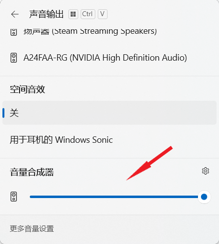
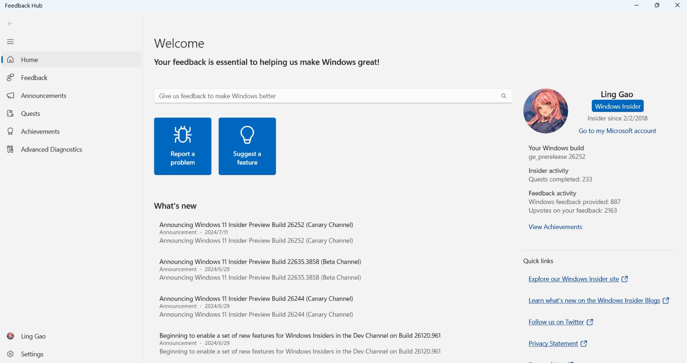
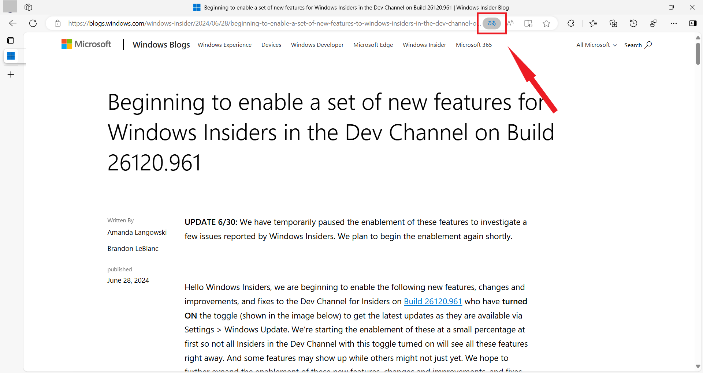
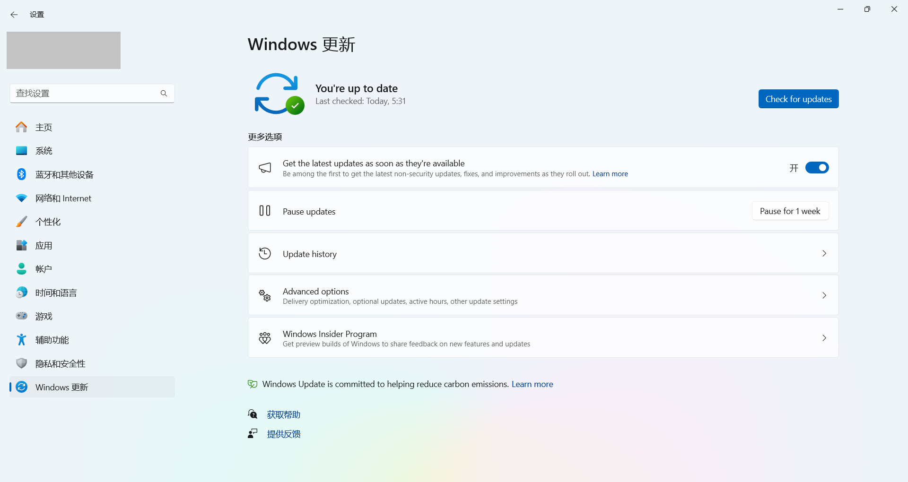
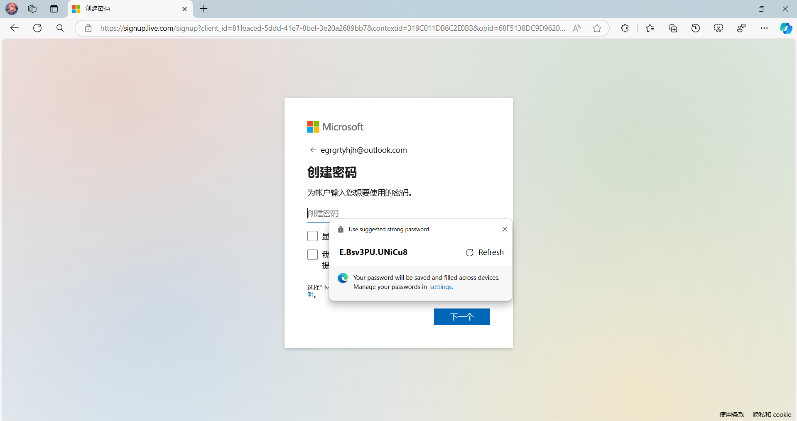
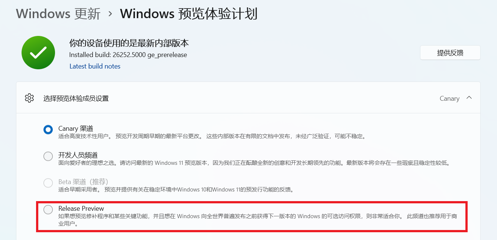
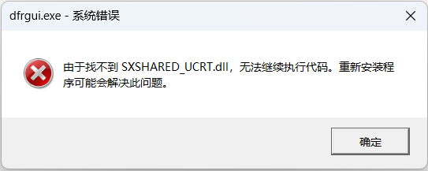
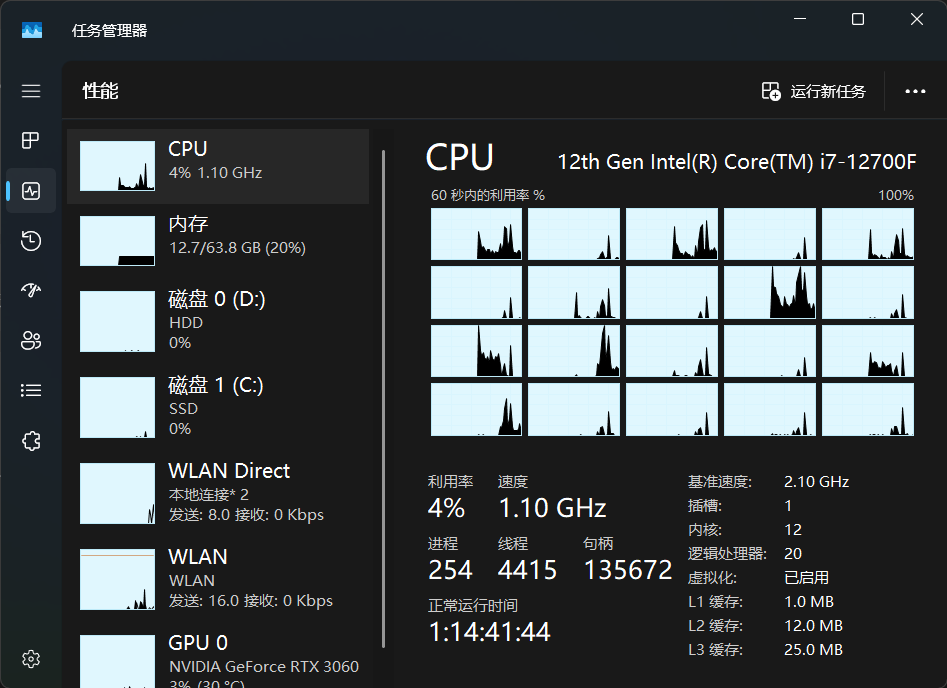
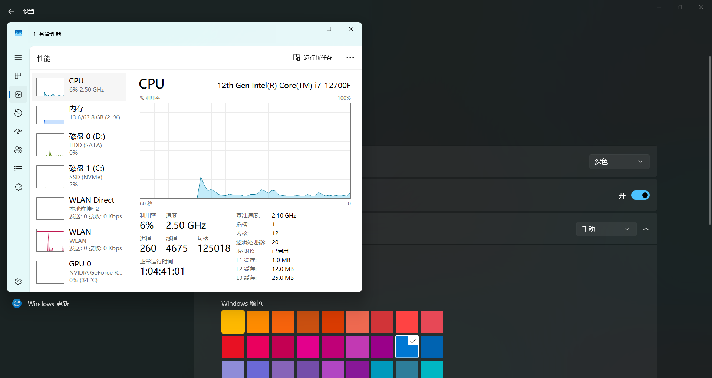

<SPAN ID = 'HEAD'/>

## Canary - 归档 (已做出更改 >7 天)

> [!TIP]
>
> &emsp;记录 Microsoft 已做出更改 >7 天的问题 & 超过 21 天无新增赞成票的问题。
>
> &emsp;无特殊情况，问题归档后不再更新。

|      编号       |                             问题                             |   状态   |
| :-------------: | :----------------------------------------------------------: | :------: |
|      —————      | [**公告已知问题**](README.md) \| [**用户反馈问题**](README.md) \| [**归档 (已做出更改 0 - 7 天)**](README.md) |  —————   |
| [LG000](#LG000) |       无法下载 Build 26016 更新，显示 8024200D 错误。        | 已修复 ✓ |
| [LG003](#LG003) |            点击 “设置”>“系统”>“电源” 时菜单崩溃。            | 已修复 ✓ |
| [LG005](#LG005) |             Windows RE (恢复环境) 无法正确呈现。             | 已修复 ✓ |
| [LG006](#LG006) | 无法在桌面上使用 Ctrl 快捷键、ALT + F4 快捷键、Del 删除键。  | 已修复 ✓ |
| [LG038](#LG038) | Windows 电脑自动安装 HP Smart 应用 / 打印机图标变化，型号显示为 LaserJet M101-M106 / 双击打印机时显示 “此页面无可用任务” 错误。 | 已修复 ✓ |
| [LG009](#LG009) |              通过快捷键截图后无法直接打开图片。              | 已修复 ✓ |
| [LG011](#LG011) |      无法通过任务栏 “快速设置” 导航至 “节能模式” 菜单。      | 已修复 ✓ |
| [LG014](#LG014) |  在文件资源管理器中打开上下文菜单时崩溃 / 显示为旧版样式。   | 已修复 ✓ |
| [LG016](#LG016) |     文件资源管理器中 Filter 功能被错误地翻译为 “滤镜”。      | 已修复 ✓ |
| [LG017](#LG017) |            反馈中心无法在中国大陆网络环境中使用。            | 已修复 ✓ |
| [LG023](#LG023) | 电脑显示 Microsoft 365 家庭版订阅已过期，但实际上仍处于激活状态。 | 已修复 ✓ |
| [LG012](#LG012) |           截图工具的 “设置” 页面存在中文语法错误。           | 已修复 ✓ |
| [LG001](#LG001) |            可能无法打开设置菜单 / 设置菜单崩溃。             | 已修复 ✓ |
| [LG010](#LG010) |              任务栏 “快速设置” 中滑块颜色异常。              | 已修复 ✓ |
| [LG020](#LG020) |          部分游戏无法识别 Xbox 控制器 (手柄) 输入。          | 已修复 ✓ |
| [LG025](#LG025) |                   关闭电脑时电脑重新启动。                   | 已修复 ✓ |
| [LG026](#LG026) |                无法在 Microsoft Edge 中打印。                | 已修复 ✓ |
| [LG027](#LG027) | 打开 “设置”>“Windows 更新” 页面一段时间后设置菜单随机崩溃。  | 已修复 ✓ |
| [LG029](#LG029) |                桌面背景变黑 / 桌面图标消失。                 | 已修复 ✓ |
| [LG032](#LG032) | 连接 Citrix Desktop Viewer (CDViewer.exe) 几秒钟后，USER32.dll 崩溃。 | 已修复 ✓ |
| [LG036](#LG036) |      任务栏自动隐藏后，鼠标悬停在托盘区域无法将其激活。      | 已修复 ✓ |
| [LG039](#LG039) |               Copilot (预览版) 可能无法启动。                | 已修复 ✓ |
| [LG041](#LG041) |                   SurfShark VPN 停止工作。                   | 已修复 ✓ |
| [LG042](#LG042) |             自动 HDR 功能在游戏过程中意外关闭。              | 已修复 ✓ |
| [LG043](#LG043) |    Copilot 无法与其他窗口正确重叠 / 显示在其他窗口后方。     | 已修复 ✓ |
| [LG044](#LG044) |  将鼠标悬停在 Copilot 图标上时，单词错误地拼写为 Co-pilot。  | 已修复 ✓ |
| [LG051](#LG051) | Windows 更新菜单 “使用时段” 中显示的时间与选择的时间不一致。 | 已修复 ✓ |
| [LG052](#LG052) |    锁屏界面 Windows 聚焦随机显示其他语言的内容 (如泰文)。    | 已修复 ✓ |
| [LG067](#LG067) |       设置 > 个性化 > 任务栏位置的 Copilot 图标偏黄。        | 已修复 ✓ |
| [LG053](#LG053) |                使用多显示器时，屏幕可能冻结。                | 已修复 ✓ |
| [LG004](#LG004) |            打开打印队列时提示 “找不到应用程序”。             | 已修复 ✓ |
| [LG008](#LG008) |        “Wallpaper Engine：壁纸引擎” 等壁纸软件崩溃。         | 已修复 ✓ |
| [LG007](#LG007) |            切换桌面时任务栏应用图标可能随机消失。            | 已修复 ✓ |
| [LG021](#LG021) |      调节任务栏 “快速设置” 中的音量滑块时不再发出声音。      | 已修复 ✓ |
| [LG035](#LG035) |  极限竞速 (Forza Motorsport) Racing World 无法运行 / 崩溃。  | 已修复 ✓ |
| [LG047](#LG047) |         运行 WinSCP 时电脑出现 win32kbase.sys 绿屏。         | 已修复 ✓ |
| [LG048](#LG048) | 极限竞速：地平线 5 (Forza Horizon 5) 游戏停止运行，显示 0xc0000005 错误。 | 已修复 ✓ |
| [LG050](#LG050) |          启动 Print Spooler 服务时显示错误 / 崩溃。          | 已修复 ✓ |
| [LG056](#LG056) |             显示器黑屏 / 电脑无法从睡眠中唤醒。              | 已修复 ✓ |
| [LG054](#LG054) |   Microsoft Store 中的部分视频流媒体应用可能无法正常播放。   | 已修复 ✓ |
| [LG075](#LG075) |     “设置”>“系统”>“可选功能” 页面中所有功能均为 0 字节。     | 已修复 ✓ |
| [LG022](#LG022) |     Windows Sandbox 显示 0x80072746 / 0x800736b3 错误。      | 已修复 ✓ |
| [LG076](#LG076) |    “设置”>“Windows 更新” 页面的 “上次检查时间” 存在错误。    | 已修复 ✓ |
| [LG028](#LG028) | 文件资源管理器地址栏中图标和箭头间有一个缝隙，可能导致不小心切换为编辑模式。 | 已修复 ✓ |
| [LG045](#LG045) |                        共享窗口崩溃。                        | 已修复 ✓ |
| [LG096](#LG096) |   安装 KB5035384 (26052.1100) 更新时显示 0x800f0904 错误。   | 已修复 ✓ |
| [LG018](#LG018) | Oracle VM VirtualBox 软件无法启动，显示 “Unknown rc=-3748” 错误。 | 已修复 ✓ |
| [LG019](#LG019) |            远程桌面显示 “图形组件无法启动” 错误。            | 已修复 ✓ |
| [LG024](#LG024) | Tips (提示) 应用现已移除，但 “Windows 更新”>“更新历史记录” 页面中的 “查看新增功能” 选项仍指向此应用，导致显示 “没有可打开 ms-get-started 链接的应用” 错误。 | 已修复 ✓ |
| [LG031](#LG031) |    Microsoft Edge (正式版) “固定到任务栏” 功能可能失效。     | 已修复 ✓ |
| [LG037](#LG037) |    显示 WDAG (Edge) - Container: Error: 0x80004005 错误。    | 已修复 ✓ |
| [LG040](#LG040) |    文件资源管理器 “登录时还原上一个文件夹窗口” 选项失效。    | 已修复 ✓ |
| [LG046](#LG046) |           远程桌面显示 0x3 错误 / 0x11 扩展错误。            | 已修复 ✓ |
| [LG064](#LG064) |   全新安装 Windows 11 时，系统生成 Windows.old 空文件夹。    | 已修复 ✓ |
| [LG078](#LG078) |                      电脑无法播放音频。                      | 已修复 ✓ |
| [LG095](#LG095) | 通过 Microsoft Store / Xbox 下载盗贼之海 (Sea of Thieves) 游戏时显示 0x87E0000D 错误。 | 已修复 ✓ |
| [LG070](#LG070) |  连接 VPN 时，托盘网络图标 / 部分应用可能提示无 Internet。   | 已修复 ✓ |
| [LG072](#LG072) | 此版本无法显示在 “设置”>“Windows 更新”>“更新历史记录” 页面。 | 已修复 ✓ |
| [LG074](#LG074) |                小组件看板可能不显示任何内容。                | 已修复 ✓ |
| [LG108](#LG108) |        Microsoft Edge 在 Canary 预览体验版本中崩溃。         | 已修复 ✓ |
| [LG105](#LG105) |         Microsoft Edge 无法打开网页，提示内存不足。          | 已修复 ✓ |
| [LG065](#LG065) |              使用浏览器观看视频时屏幕可能冻结。              | 已修复 ✓ |
| [LG079](#LG079) |            无法使用 Office，显示 0x426-0x0 错误。            | 已修复 ✓ |
| [LG002](#LG002) |                部分热门游戏可能无法正常运行。                | 已修复 ✓ |
| [LGH00](#LGH00) | **[集合]** 大量游戏 / 反作弊系统 / 游戏平台无法正常运行。(含列表) | 已修复 ✓ |
| [LG068](#LG068) |         回退系统将导致开发驱动器硬盘损坏并丢失数据。         | 已修复 ✓ |
| [LG066](#LG066) | 设置 > 系统 > 屏幕 > 显示卡位置出现 “显示连接” 选项，点击时菜单崩溃。 | 已修复 ✓ |
| [LG071](#LG071) |    输入切换器 (WIN + 空格) 变为旧版样式，且显示位置错误。    | 已修复 ✓ |
| [LG055](#LG055) |              隐藏 “购物” 等小组件后其再次出现。              | 已修复 ✓ |
| [LG077](#LG077) |        启用 “管理移动设备” 时，“手机连接” 应用断线。         | 已修复 ✓ |
| [LG080](#LG080) |                       Visio 应用崩溃。                       | 已修复 ✓ |
| [LG081](#LG081) |               无法登录 Microsoft Sudoku 游戏。               | 已修复 ✓ |
| [LG093](#LG093) |                   放大镜无法跟随鼠标移动。                   | 已修复 ✓ |
| [LG104](#LG104) |      文件资源管理器崩溃 / 冻结 / 卡顿 / CPU 占用率高。       | 已修复 ✓ |
| [LG106](#LG106) |         “设置”>“Windows 更新” 菜单可能无法正常加载。         | 已修复 ✓ |
| [LG109](#LG109) |              Copilot 一直提示 “尝试重新连接”。               | 已修复 ✓ |
| [LG112](#LG112) |  重复开关设置菜单中的 Copilot 选项时，任务栏图标可能消失。   | 已修复 ✓ |
| [LG102](#LG102) |                      屏幕画面变为紫色。                      | 已修复 ✓ |
| [LG103](#LG103) |            执行某些操作时电脑一直黑屏且无法恢复。            | 已修复 ✓ |
| [LG073](#LG073) |         文件资源管理器的右键菜单可能丢失亚克力效果。         | 已修复 ✓ |
| [LG083](#LG083) |   [合并] 光标阴影 / 形状 / 颜色异常，光标随机消失 / 卡住。   | 已修复 ✓ |
| [LG082](#LG082) |       文件资源管理器右键菜单中的图标显示在错误的位置。       | 已修复 ✓ |
| [LG113](#LG113) |                 sudo pwsh 命令无法正常执行。                 | 已修复 ✓ |
| [LG087](#LG087) |               新版 Microsoft Teams 应用崩溃。                | 已修复 ✓ |
| [LG119](#LG119) |        文件夹中图片和视频的缩略图可能显示为黑色方块。        | 已修复 ✓ |
| [LG124](#LG124) |            电脑随机 IRQL_NOT_LESS_OR_EQUAL 绿屏。            | 已修复 ✓ |
| [LG049](#LG049) |  事件查看器显示 DeviceSetupManager 元数据错误 (事件 131)。   | 已修复 ✓ |
| [LG058](#LG058) | 在 Microsoft Store 更新 “快速助手” 应用时显示 0x80073CFB 错误。 | 已修复 ✓ |
| [LG094](#LG094) |           相机和 Studio Effects 可能无法正常工作。           | 已修复 ✓ |
| [LG107](#LG107) |                   笔记本电脑指纹模块失灵。                   | 已修复 ✓ |
| [LG110](#LG110) |        重启电脑后，桌面背景由 Windows 聚焦变为图片。         | 已修复 ✓ |
| [LG118](#LG118) |                  音量滑块可能无法正常使用。                  | 已修复 ✓ |
| [LG120](#LG120) |           有大约 2.5GB - 3GB 的临时文件无法清理。            | 已修复 ✓ |
| [LG121](#LG121) |            任务栏 Windows 安全中心图标随机消失。             | 已修复 ✓ |
| [LG115](#LG115) |                右键菜单变为 Windows 10 样式。                | 已修复 ✓ |
| [LG069](#LG069) |    安装 Canary 版本时可能自动回退，错误代码 0xC1900101。     | 已修复 ✓ |
| [LG125](#LG125) |         电脑风扇负荷更重 / 温度更高 / 电池续航更短。         | 已修复 ✓ |
| [LG131](#LG131) |                     播放视频时鼠标卡顿。                     | 已修复 ✓ |
| [LG117](#LG117) |                任务栏应用缩略图无法正常显示。                | 已修复 ✓ |
| [LG122](#LG122) |                      Copilot 功能消失。                      | 中止调查 |
| [LG126](#LG126) |                Surface 设备的摄像头可能失效。                | 已修复 ✓ |
| [LG127](#LG127) |                  在手写板上写字时文字错位。                  | 已修复 ✓ |
| [LG128](#LG128) |              SteelSeries 耳机软件无法正常使用。              | 已修复 ✓ |
| [LG132](#LG132) |               部分第三方壁纸软件无法正常运行。               | 已修复 ✓ |
| [LG133](#LG133) |            鼠标在锁屏界面无法显示为设定的主题色。            | 已修复 ✓ |
| [LG134](#LG134) |            重启电脑后，已下载的语言包被自动删除。            | 已修复 ✓ |
| [LG135](#LG135) |               鼠标和键盘无法在安全模式中使用。               | 已修复 ✓ |
| [LG136](#LG136) |                Visual Studio 2022 IDE 崩溃。                 | 已修复 ✓ |
| [LG137](#LG137) |                    添加小组件时窗口冻结。                    | 已修复 ✓ |
| [LG138](#LG138) |                    任务栏小组件图标过小。                    | 已修复 ✓ |
| [LG141](#LG141) |                        电脑可能绿屏。                        | 已修复 ✓ |
| [LG116](#LG116) |                  电脑无法正常关机 / 睡眠。                   | 已修复 ✓ |
| [LG129](#LG129) | 在 Microsoft Store 和 Windows 更新页面下载时显示 0x80240067 错误。 | 已修复 ✓ |
| [LG130](#LG130) |        更新 Windows 后，已禁用的音频设备被自动启用。         | 已修复 ✓ |
| [LG140](#LG140) |                 记事本应用崩溃 / 无法关闭。                  | 已修复 ✓ |
| [LG151](#LG151) |                    鼠标指针可能随机变大。                    | 已修复 ✓ |
| [LG155](#LG155) |         无法安装 Realtek - SoftwareComponent 更新。          | 已修复 ✓ |
| [LG156](#LG156) |               切换窗口时输入法自动变化中英文。               | 已修复 ✓ |
| [LG159](#LG159) |                  无法使用截图工具录制视频。                  | 已修复 ✓ |
| [LG162](#LG162) |                       Xbox 应用崩溃。                        | 已修复 ✓ |
| [LG157](#LG157) |             调整账户照片时显示 0x80070520 错误。             | 已修复 ✓ |
| [LG154](#LG154) |        连接着手柄关机时，提示 explorer.exe 内存错误。        | 已修复 ✓ |
| [LGH01](#LGH01) | [集合] 仍有一些游戏在 Build 26080+ 中无法正常运行。(含列表)  | 已修复 ✓ |
| [LG139](#LG139) |     以 “禁用驱动程序强制签名” 选项启动 Windows 时崩溃。      | 已修复 ✓ |
| [LG144](#LG144) |            无法使用 Visual Studio 调试应用程序。             | 已修复 ✓ |
| [LG145](#LG145) |          无法在 VMware Workstation 中开启 3D 加速。          | 已修复 ✓ |
| [LG146](#LG146) |       无法连接蓝牙耳机 / 连接蓝牙耳机后无法播放音频。        | 已修复 ✓ |
| [LG147](#LG147) |         Microsoft Family Safety 无法添加家庭组成员。         | 已修复 ✓ |
| [LG150](#LG150) |                 无法使用 PIN 登录安全模式。                  | 已修复 ✓ |
| [LG153](#LG153) |  C:\Windows\Microsoft.NET\\... 配置解析器 0x80004005 错误。  | 已修复 ✓ |
| [LG161](#LG161) |                快速设置页面中的蓝牙功能丢失。                | 已修复 ✓ |
| [LG163](#LG163) |        无法更改 Windows 启动设置 (如进入安全模式等)。        | 已修复 ✓ |
| [LG164](#LG164) |                      电脑开机动画消失。                      | 已修复 ✓ |
| [LG165](#LG165) |                      无法安装可选功能。                      | 已修复 ✓ |
| [LG166](#LG166) |          在中文系统中，小组件的部分内容显示为英文。          | 已修复 ✓ |
| [LG167](#LG167) |                蓝屏 / 绿屏页面无法正确呈现。                 | 已修复 ✓ |
| [LG152](#LG152) |          拖动音量合成器滑块时 “快速设置” 窗口崩溃。          | 已修复 ✓ |
| [LG170](#LG170) |              Microsoft Edge 在启动时频繁崩溃。               | 已修复 ✓ |
| [LG171](#LG171) |        Microsoft Edge “右键”>“在 Web 中搜索” 时崩溃。        | 已修复 ✓ |
| [LG111](#LG111) |                任务视图卡顿或 CPU 占用率高。                 | 已修复 ✓ |
| [LG158](#LG158) |                  电脑卡顿 / CPU 性能下降。                   | 已修复 ✓ |
| [LG148](#LG148) |            无法调整启动 “照片” 应用时窗口的大小。            | 已修复 ✓ |
| [LG169](#LG169) |            “照片” 应用在 HDR 显示模式中亮度异常。            | 已修复 ✓ |
| [LG173](#LG173) |                   桌面壁纸突然变为纯黑色。                   | 已修复 ✓ |
| [LG183](#LG183) |        无法点击 MSN 天气 “看到了不同的天气？” 按钮。         | 已修复 ✓ |
| [LGH03](#LGH03) |           **[集合]** 小组件中的软件缺陷。(含列表)            | 已修复 ✓ |
| [LG172](#LG172) |          开关笔记本电脑的盖子时，缩放比例自动重置。          | 已修复 ✓ |
| [LG175](#LG175) |          文本建议干扰 Visual Studio Code 中的命令。          | 已修复 ✓ |
| [LG176](#LG176) |          CrossDeviceService.exe 大量占用 CPU 资源。          | 已修复 ✓ |
| [LG180](#LG180) |                在反馈中心提交的反馈可能丢失。                | 已修复 ✓ |
| [LG186](#LG186) |       找不到在反馈中心提交的反馈 / 反馈活动数据丢失。        | 已修复 ✓ |
| [LG184](#LG184) |   Copilot 的 “更有创造力” “更平衡” “更精确” 选项可能消失。   | 已修复 ✓ |
| [LG200](#LG200) |       反馈中心应用内置的 “使用必应翻译” 功能无法使用。       | 已修复 ✓ |
| [LG196](#LG196) |                   反馈中心应用变为纯英文。                   | 已修复 ✓ |
| [LG197](#LG197) |          点击 Microsoft Edge 的 “翻译” 按钮无响应。          | 已修复 ✓ |
| [LG185](#LG185) |          Windows 更新菜单中的文本显示为英文或消失。          | 已修复 ✓ |
| [LG174](#LG174) |              无法使用语音键入 (WIN + H) 功能。               | 已修复 ✓ |
| [LG179](#LG179) |                部分设备随机出现绿屏 (GSOD)。                 | 已修复 ✓ |
| [LG181](#LG181) |          OpenRGB 和 ColorEngine 应用无法正常运行。           | 已修复 ✓ |
| [LG182](#LG182) |             开始菜单中的应用可能无法按字母排序。             | 已修复 ✓ |
| [LG013](#LG013) |           “设置”>“应用”>“启动” 页面中的图标异常。            | 已修复 ✓ |
| [LG168](#LG168) | 将 “合并任务栏按钮并隐藏标签” 调整为 “从不” 时部分图标消失。 | 已修复 ✓ |
| [LG204](#LG204) |  Microsoft Edge “编辑图像”>“标记” 时线条与画笔位置不一致。   | 已修复 ✓ |
| [LG205](#LG205) |             “搜索” 窗口中的图标和文字出现错乱。              | 已修复 ✓ |
| [LG198](#LG198) |              Microsoft Edge 生成强密码时崩溃。               | 已修复 ✓ |
| [LG187](#LG187) |       可以由 Canary 频道切换至 Release Preview 频道。        | 已修复 ✓ |
| [LG190](#LG190) |     启动 VoiceMeeter 应用时出现 MEMORY_MANAGEMENT 绿屏。     | 已修复 ✓ |
| [LG192](#LG192) |   便签打印机 / 雕刻机 / 绘图仪等特殊设备可能无法正常使用。   | 已修复 ✓ |
| [LG193](#LG193) |          在 Copilot+ 设备中，鼠标指针可能变为黑色。          | 已修复 ✓ |
| [LG194](#LG194) |                  Mica (云母) 效果可能失效。                  | 已修复 ✓ |
| [LG123](#LG123) |                 接收不到 Build 26080+ 更新。                 | 已修复 ✓ |
| [LG201](#LG201) |        无法启动 Windows 沙盒，显示 0x80370106 错误。         | 已修复 ✓ |
| [LG203](#LG203) |            “物理键盘文本建议” 功能无法正常工作。             | 已修复 ✓ |
| [LG188](#LG188) |                 安装 WSL 时显示灾难性错误。                  | 已修复 ✓ |
| [LG189](#LG189) |           将大图片设置为桌面背景时，其显示为黑色。           | 已修复 ✓ |
| [LG195](#LG195) |              手写笔在 Surface 设备中精度变低。               | 已修复 ✓ |
| [LG199](#LG199) |               Windows 通知被前台应用窗口遮挡。               | 已修复 ✓ |
| [LG209](#LG209) |    Euro Truck Simulator 2 (欧洲卡车模拟 2) 游戏无法运行。    | 已修复 ✓ |
| [LG210](#LG210) |           Microsoft Edge (Canary 频道) 频繁崩溃。            | 已修复 ✓ |
| [LG149](#LG149) |  Windows 安全中心 “防火墙和网络保护” 页面中的图标变为方块。  | 已修复 ✓ |
| [LG213](#LG213) | 打开 “碎片整理和优化驱动器” 时，显示 “找不到 SXSHARED_UCRT.dll” 错误。 | 已修复 ✓ |
| [LGH02](#LGH02) |       **[集合]** 文件资源管理器中的软件缺陷。(*含列表)       | 已修复 ✓ |
| [LG177](#LG177) |              任务管理器 “性能” 选项卡颜色异常。              | 已修复 ✓ |
| [LG191](#LG191) | 将桌面背景设置为 “Windows 聚焦” 时，其在一段时间后变为 “图片”。 | 已修复 ✓ |
| [LG206](#LG206) |     点击手机连接应用中的 “新照片” 通知时，截图工具崩溃。     | 已修复 ✓ |
| [LG208](#LG208) |      “设置”>“账户”>“关联的设备” 菜单中的内容不断闪烁。       | 已修复 ✓ |
| [LG015](#LG015) |      在文件资源管理器中按下两次 F11 后地址栏将被冻结。       | 已修复 ✓ |
| [LG220](#LG220) |       Windows 更新失败自动回退，显示 0xC1900101 错误。       | 已修复 ✓ |
| [LG202](#LG202) |               表情符号面板可能意外地自动关闭。               | 已修复 ✓ |
| [LG178](#LG178) |          任务管理器设置菜单 Mica (云母) 效果异常。           | 已修复 ✓ |
| [LG207](#LG207) |                   截图工具可能挂起或闪退。                   | 已修复 ✓ |
| [LG211](#LG211) |                      鼠标光标随机卡住。                      | 已修复 ✓ |
| [LG214](#LG214) |         “设置” 菜单最小化时，有时无法从任务栏打开。          | 已修复 ✓ |
| [LG217](#LG217) |           Microsoft Edge (Canary 频道) 频繁崩溃。            | 已修复 ✓ |
| [LG218](#LG218) |                输入法的文本建议可能出现重叠。                | 已修复 ✓ |
| [LG219](#LG219) |          出现覆盖 2/3 桌面且无法移除的白色空窗口。           | 已修复 ✓ |
| [LG221](#LG221) |         无法在 “电影和电视” 应用中播放已购买的内容。         | 已修复 ✓ |
| [LG215](#LG215) |       在 Canary 版本中，“设置” 菜单显示版本号为 Dev。        | 中止调查 |
| [LG216](#LG216) |         在以管理员权限运行的应用中无法使用触摸键盘。         | 中止调查 |
| [LG224](#LG224) |          部分 Microsoft 休闲游戏 (如纸牌等) 崩溃。           | 已修复 ✓ |
| [LG228](#LG228) |               启动 Roblox (罗布乐思) 时崩溃。                | 已修复 ✓ |
| [LG030](#LG030) | 在 Microsoft Store 中下载 Xbox Identity Provider 时显示 0x80073CFB 错误。 | 已修复 ✓ |
| [LG232](#LG232) |            无法使用 “反馈中心” 应用查看中文反馈。            | 已修复 ✓ |
| [LG229](#LG229) | **[NVIDIA 显卡]** 电脑黑屏 / 显示器无响应 / 驱动程序无法正常工作。 | 已修复 ✓ |
| [LG230](#LG230) |      电脑绿屏，显示 PAGE_FAULT_IN_NONPAGED_AREA 错误。       | 已修复 ✓ |
| [LG222](#LG222) | 表情符号面板 & 剪贴板历史记录无法在部分窗口内 (如注册表) 打开。 | 已修复 ✓ |
| [LG223](#LG223) |            运行 SFC /scannow 命令时可能显示错误。            | 已修复 ✓ |
| [LG226](#LG226) |               剪贴板历史记录可能始终显示为空。               | 已修复 ✓ |
| [LG234](#LG234) | 在 ARM 设备中使用 GitHub Desktop 应用时，无法执行 Push 等操作。 | 已修复 ✓ |
| [LG236](#LG236) |           任务管理器可能显示应用和进程的数量为 0。           | 已修复 ✓ |
| [LG237](#LG237) |                    部分远程连接软件崩溃。                    | 已修复 ✓ |
| [LG238](#LG238) |  此版本在欧洲经济区 (EEA) 适用《数字市场法》方面存在问题。   | 已修复 ✓ |
| [LG233](#LG233) |   无法更新 “Microsoft 必应的 Web 搜索” 应用，0x80073CFB。    | 已修复 ✓ |
| [LG235](#LG235) | 通过 “ms-settings:windowsinsider” 进入菜单时，顶部缺失部分文本。 | 已修复 ✓ |
| [LG231](#LG231) |         使用多个显示器时，桌面背景可能无法正常显示。         | 已修复 ✓ |
| [LG241](#LG241) |               讲述人在使用部分自然语音时崩溃。               | 已修复 ✓ |
| [LG245](#LG245) |                 无法使用密码登录至 Windows。                 | 已修复 ✓ |
| [LG246](#LG246) |   在 Chrome 浏览器中保存密码时，Windows 安全中心显示错误。   | 已修复 ✓ |
| [LG249](#LG249) |   鼠标悬停或右键点击任务栏中的应用时，Explorer.exe 崩溃。    | 已修复 ✓ |
| [LG244](#LG244) |           无法启动 “战争雷霆” (War Thunder) 游戏。           | 已修复 ✓ |
| [LG248](#LG248) |       无法启动使用 Easy Anti-Cheat 反作弊服务的游戏。        | 已修复 ✓ |
| [LG243](#LG243) |         电脑出现 PAGE_FAULT_IN_NONPAGED_AREA 绿屏。          | 已修复 ✓ |
| [LG242](#LG242) |              实时字幕功能崩溃 / 无法正常使用。               | 已修复 ✓ |
| [LG247](#LG247) |         开启 “管理员保护” 功能时 LogonUI.exe 崩溃。          | 已修复 ✓ |
| [LG250](#LG250) |               任务栏预览窗口的边角处渲染异常。               | 已修复 ✓ |
| [LG227](#LG227) |        安装 Canary 版本时仍可能出现 0xC1900101 回退。        | 已修复 ✓ |
| [LG251](#LG251) | 安装第三方应用时提示 “您的组织使用 App Control 阻止了此应用”。 | 已修复 ✓ |
| [LG253](#LG253) |                最小化、最大化、关闭按钮消失。                | 已修复 ✓ |
| [LG254](#LG254) |        点击 “开始”>“电源” 按钮时，菜单出现速度变慢。         | 已修复 ✓ |
| [LG255](#LG255) |         系统闲置时每间隔 20 - 30 分钟记录一个错误。          | 已修复 ✓ |
| [LG239](#LG239) |                无法显示窗口边框强调色和阴影。                | 已修复 ✓ |
| [LG240](#LG240) |                   无法关闭窗口启动等动画。                   | 已修复 ✓ |
| [LG261](#LG261) |                     无法运行 Xbox 应用。                     | 已修复 ✓ |
| [LG262](#LG262) |          鼠标光标在 Microsoft Edge Canary 中消失。           | 已修复 ✓ |
| [LG264](#LG264) |    使用 MTSC.exe 进行远程桌面操作时显示 0x80080005 错误。    | 已修复 ✓ |
| [LG260](#LG260) |                Windows 更新试图安装旧版驱动。                | 已修复 ✓ |
| [LG266](#LG266) |               无法运行 Topaz DeNoise AI 应用。               | 已修复 ✓ |
| [LG267](#LG267) |                任务管理器无法显示深色主题色。                | 已修复 ✓ |
| [LG270](#LG270) |                无法使用 “相机” 应用拍摄视频。                | 已修复 ✓ |
| [LG275](#LG275) |     **[2025 年 1 月 23 日]** Outlook 与 Word 应用崩溃。      | 已修复 ✓ |
| [LG276](#LG276) |     连接 Microsoft 账户进行共享时显示 0x80860010 错误。      | 已修复 ✓ |
| [LG282](#LG282) |          无法启动 Infinite Wealth (Yakuza 8) 游戏。          | 已修复 ✓ |
| [LG263](#LG263) |         颜色配置文件在睡眠后 / 启动时无法正确加载。          | 已修复 ✓ |
| [LG268](#LG268) |       Microsoft .NET Framework 3.5 和 2.0 被自动移除。       | 已修复 ✓ |
| [LG278](#LG278) |             电脑 WIN32K_CRITICAL_FAILURE 绿屏。              | 已修复 ✓ |
| [LG284](#LG284) |                      无法重置登录密码。                      | 已修复 ✓ |
| [LG285](#LG285) |              表情符号面板显示搜索数据缺失错误。              | 已修复 ✓ |
| [LG305](#LG305) |     Microsoft Edge 新标签页中的徽标和搜索框出现在底部。      | 已修复 ✓ |
| [LG256](#LG256) |              运行 SFC /scannow 命令时显示错误。              | 已修复 ✓ |
| [LG287](#LG287) |        Canary 27788 安装失败，显示 0x8007000d 错误。         | 已修复 ✓ |
| [LG257](#LG257) |        最小化并恢复文件资源管理器时窗口无法正确显示。        | 已修复 ✓ |
| [LG288](#LG288) |                    设置菜单主页可能崩溃。                    | 已修复 ✓ |
| [LG259](#LG259) |           文件资源管理器的 “全部解压缩” 按钮失效。           | 已修复 ✓ |
| [LG274](#LG274) |   Windows 安全中心 “动态锁” 与 “管理员保护” 功能间距过大。   | 已修复 ✓ |
| [LG280](#LG280) |                  DAC 音频设备无法正常工作。                  | 已修复 ✓ |
| [LG290](#LG290) |  更新 Bitdefender 时电脑 PAGE_FAULT_IN_NONPAGED_AREA 绿屏。  | 已修复 ✓ |
| [LG291](#LG291) |             Powershell 和 CMD 无法识别 Winget。              | 已修复 ✓ |
| [LG292](#LG292) |                       无法加载小组件。                       | 已修复 ✓ |
| [LG293](#LG293) |     HTML 在 Windows Spotlight 的图像描述中显示为纯文本。     | 已修复 ✓ |
| [LG294](#LG294) | Microsoft 账户登录窗口随机弹出，提示需要连接网络 (0x800704cf)。 | 已修复 ✓ |
| [LG295](#LG295) |          运行 Get-BitLockerVolume 命令时显示错误。           | 已修复 ✓ |
| [LG296](#LG296) |              Surface 电脑温度过高 / 续航降低。               | 已修复 ✓ |
| [LG297](#LG297) |               Conexant - MEDIA 驱动更新失败。                | 已修复 ✓ |
| [LG298](#LG298) |      以管理员身份运行应用时，鼠标指针样式自动变回默认。      | 已修复 ✓ |
| [LG299](#LG299) |                        音频服务崩溃。                        | 已修复 ✓ |
| [LG300](#LG300) |                   MIDI 键盘无法正常使用。                    | 已修复 ✓ |
| [LG302](#LG302) |                  部分游戏可能导致电脑绿屏。                  | 已修复 ✓ |
| [LG303](#LG303) |               在部分应用中打印时电脑可能绿屏。               | 已修复 ✓ |
| [LG304](#LG304) |   将颜色设置为 “自定义” 时，新的彩色电池图标无法正常显示。   | 已修复 ✓ |
| [LG269](#LG269) |             开始菜单和搜索功能无法显示搜索结果。             | 已修复 ✓ |
| [LG283](#LG283) |      Hyper-V 及其他依赖它的功能 (WSL 等) 无法正常工作。      | 已修复 ✓ |
| [LG271](#LG271) |  开启 “管理员保护” 功能后无法安装 Visual Studio Code 应用。  | 已修复 ✓ |
| [LG272](#LG272) |       无法启动 Windows Sandbox，显示 0x80070005 错误。       | 已修复 ✓ |
| [LG273](#LG273) |               启动 Insurgency 游戏时电脑绿屏。               | 已修复 ✓ |
| [LG306](#LG306) |    **[27802+]** 部分应用因 d3d9.dll 崩溃而无法正常运行。     | 已修复 ✓ |
| [LG307](#LG307) |   Windows 更新时自动重置蜂窝设置，导致 eSIM 设备丢失网络。   | 已修复 ✓ |
| [LG333](#LG333) |          Microsoft Edge 菜单 UI 周围出现一圈边框。           | 已修复 ✓ |
| [LG225](#LG225) |        文件资源管理器 “...” 二级菜单无法向下方弹出。         | 已修复 ✓ |
| [LG308](#LG308) |    最小化并使用 ALT + TAB 还原文件资源管理器时 UI 异常。     | 已修复 ✓ |
| [LG312](#LG312) |               在截图工具中使用画笔时应用冻结。               | 已修复 ✓ |
| [LG313](#LG313) |      **[3 月 22 日]** 搜索功能的结果出现速度大幅变慢。       | 已修复 ✓ |
| [LG314](#LG314) |                  记事本应用更新后性能变差。                  | 已修复 ✓ |
| [LG315](#LG315) |             无法启动 IP Helper (IpHlpSvc) 服务。             | 已修复 ✓ |
| [LG088](#LG088) |       无法使用截图工具对开始菜单 / 右键菜单进行截图。        | 已修复 ✓ |
| [LG316](#LG316) |   “在最新更新可用后立即获取” 选项无法正确呈现并自动关闭。    | 已修复 ✓ |
| [LG310](#LG310) |    启动部分应用 / 功能时 WHEA_UNCORRECTABLE_ERROR 绿屏。     | 已修复 ✓ |
| [LG265](#LG265) |        Windows 安全中心 “智能应用控制” 功能丢失图标。        | 已修复 ✓ |
| [LG319](#LG319) |       “系统信息” 菜单顶部选项卡显示的内存速度不正确。        | 已修复 ✓ |
| [LG320](#LG320) |             “天气” 应用加载缓慢 / 无法显示内容。             | 已修复 ✓ |
| [LG321](#LG321) |    点击文件资源管理器左侧的导航窗格时，右侧仍停留在主页。    | 已修复 ✓ |
| [LG324](#LG324) |     无法启动 Tailscale VPN 等基于 IP Helper 服务的应用。     | 已修复 ✓ |
| [LG326](#LG326) |             “照片” 应用自动从任务栏中取消固定。              | 已修复 ✓ |
| [LG327](#LG327) |                MIDI 键盘 / 设备无法正常工作。                | 已修复 ✓ |
| [LG328](#LG328) |                        DWM 随机崩溃。                        | 已修复 ✓ |
| [LG329](#LG329) |                        电脑随机关机。                        | 已修复 ✓ |
| [LG331](#LG331) |              退出云流媒体游戏时 Xbox 应用崩溃。              | 已修复 ✓ |
| [LG332](#LG332) |     “AVC 编码器视频扩展” 无法在 Microsoft Store 中安装。     | 已修复 ✓ |
| [LG335](#LG335) |              无法启动 DELL SupportAssist 应用。              | 已修复 ✓ |
| [LG336](#LG336) |                “MSN 资讯” 应用无法显示内容。                 | 已修复 ✓ |
| [LG322](#LG322) |                        夜间模式失效。                        | 已修复 ✓ |
| [LG330](#LG330) |     连接 Xbox 手柄时电脑 SYSTEM_SERVICE_EXCEPTION 绿屏。     | 已修复 ✓ |
| [LG309](#LG309) |        以平板电脑方式使用时，任务栏中的图标不会变大。        | 已修复 ✓ |
| [LG318](#LG318) |        无法使用 Hyper-V 及依赖它的功能 (如 WSL 等)。         | 已修复 ✓ |
| [LGH04](LGH04)  |          **[集合]** 启动部分游戏时崩溃 / 电脑绿屏。          | 已修复 ✓ |
| [LG289](#LG289) | 使用深色模式时，“电池使用情况” 菜单中的鼠标悬停提示显示为浅色。 | 已修复 ✓ |
| [LG301](#LG301) |     在文件资源管理器中新建标签页时，地址栏中的路径不变。     | 已修复 ✓ |
| [LG334](#LG334) |            无法使用 Windows Hello 面部识别登录。             | 已修复 ✓ |
| [LG337](#LG337) |           间歇性无法在开始菜单中输入文本进行搜索。           | 已修复 ✓ |
| [LG338](#LG338) |      无法安装 Canary 27842 更新，错误代码 0x8007000d。       | 已修复 ✓ |
| [LG339](#LG339) |     开始菜单、任务栏、文件资源管理器等组件无法显示文字。     | 已修复 ✓ |
| [LG340](#LG340) |         Canary 27842 安装极度缓慢，耗时超过 2 小时。         | 已修复 ✓ |
| [LG341](#LG341) |                       WLAN 网络故障。                        | 已修复 ✓ |
| [LG343](#LG343) |       打开文件资源管理器时，地址栏中不显示 “此电脑”。        | 已修复 ✓ |
| [LG344](#LG344) |         Canary 27842 稳定性表现不佳，电脑随机绿屏。          | 已修复 ✓ |
| [LG345](#LG345) |             “画图” 应用在 Canary 27842 中崩溃。              | 已修复 ✓ |
| [LG346](#LG346) |            安装 Canary 27842 更新时卡在黑屏状态。            | 已修复 ✓ |
| [LG349](#LG349) |             无法在小组件中登录 Microsoft 账户。              | 已修复 ✓ |
| [LG350](#LG350) |                    AMD 显卡驱动持续崩溃。                    | 已修复 ✓ |
| [LG351](#LG351) |             可变刷新率功能 (VRR) 无法正常工作。              | 已修复 ✓ |
| [LG352](#LG352) |                电脑因 dxgmms2.sys 错误绿屏。                 | 已修复 ✓ |
| [LG353](#LG353) |              无法启动 Windows 终端 (Terminal)。              | 已修复 ✓ |
| [LG354](#LG354) |                  更新后无法登录 OneDrive。                   | 已修复 ✓ |
| [LG355](#LG355) |       电脑 SYSTEM_THREAD_EXCEPTION_NOT_HANDLED 绿屏。        | 已修复 ✓ |
| [LG356](#LG356) |          连接多个显示器时，鼠标自动向左或向上滑动。          | 已修复 ✓ |
| [LG358](#LG358) |        在 Hyper-V 中使用虚拟机时，鼠标控制上下颠倒。         | 已修复 ✓ |
| [LG359](#LG359) |               显卡驱动因实时内核事件频繁崩溃。               | 已修复 ✓ |
| [LG360](#LG360) |                反馈中心应用中的成就变为灰色。                | 已修复 ✓ |
| [LG363](#LG363) |                    点击开始菜单没有反应。                    | 已修复 ✓ |
| [LG362](#LG362) |                打开 OneDrive 时桌面图标变乱。                | 已修复 ✓ |
| [LG364](#LG364) |              在小组件中滚动鼠标浏览新闻时卡住。              | 已修复 ✓ |
| [LG369](#LG369) |      Windows Sandbox 初始化失败，显示 0xc0370106 错误。      | 已修复 ✓ |
| [LG365](#LG365) |                     手写笔无法正常使用。                     | 已修复 ✓ |
| [LG375](#LG375) |              触摸屏的双击、长按右键等操作失效。              | 已修复 ✓ |
| [LG374](#LG374) |            高采样率 (192 kHz) 设备无法播放音频。             | 已修复 ✓ |
| [LG385](#LG385) | 启用基于虚拟化的安全 (VBS) 后，依赖于虚拟化的应用将无法运行。 | 已修复 ✓ |
| [LG366](#LG366) |               任务管理器的搜索和筛选功能失效。               | 已修复 ✓ |
| [LG323](#LG323) | 将鼠标悬停在 “系统信息” 菜单顶部的选项卡时，边框显示为直角。 | 已修复 ✓ |
| [LG389](#LG389) |     “禁用小组件面板” (Disable Widgets Board) 策略失效。      | 已修复 ✓ |
| [LG415](#LG415) |             在 Edge 中新建无痕窗口时浏览器崩溃。             | 已修复 ✓ |
| [LG404](#LG404) |               UAC、任务管理器等窗口出现乱码。                | 已修复 ✓ |
| [LG342](#LG342) |                 打开组策略编辑器时提示错误。                 | 已修复 ✓ |
| [LG372](#LG372) |                   玩 DNF 游戏时电脑绿屏。                    | 已修复 ✓ |
| [LG373](#LG373) |         电脑 WIN32K_CRITICAL_FAILURE (0x164) 绿屏。          | 已修复 ✓ |
| [LG376](#LG376) |           使用 NVIDIA GeForce NOW 平台时电脑绿屏。           | 已修复 ✓ |
| [LG377](#LG377) |                红外 (IR) 摄像头无法正常工作。                | 已修复 ✓ |
| [LG397](#LG397) |                   ActionsServer 反复崩溃。                   | 已修复 ✓ |
| [LG398](#LG398) |      Microsoft Edge 不断检查更新，但始终无法完成更新。       | 已修复 ✓ |
| [LG402](#LG402) | Microsoft Defender 安全智能定义更新失败，显示 8024402e 错误。 | 已修复 ✓ |
| [LG392](#LG392) |               任务栏 “搜索” 功能显示纯白界面。               | 已修复 ✓ |
| [LG368](#LG368) |              任务栏材质效果消失，变成了深灰色。              | 已修复 ✓ |
| [LG405](#LG405) |      “设置”>“系统”>“恢复” 中的 “重置此电脑” 功能失效。       | 已修复 ✓ |
| [LG406](#LG406) |     在 “设置”>“系统”>“声音” 中打开麦克风属性时菜单崩溃。     | 已修复 ✓ |
| [LG311](#LG311) |          文件资源管理器地址栏溢出列表无法正确呈现。          | 已修复 ✓ |
| [LG348](#LG348) |       安装 Windows 11 时，菜单按照从右到左的方式排列。       | 已修复 ✓ |
| [LG367](#LG367) |            安装 Canary 更新时，屏幕显示白色画面。            | 已修复 ✓ |
| [LG370](#LG370) |                  重启 explorer.exe 时白屏。                  | 已修复 ✓ |
| [LG371](#LG371) |              开启 “自动隐藏任务栏” 后出现黑边。              | 已修复 ✓ |
| [LG382](#LG382) |              微信输入法候选框周围出现黑粗边框。              | 已修复 ✓ |
| [LG388](#LG388) |             “设置”>“应用”>“操作” 菜单变为空白。              | 已修复 ✓ |
| [LG393](#LG393) | 截图工具可以正常启动，但无法截图 (WIN + Shift + S 也失效)。  | 已修复 ✓ |
| [LG399](#LG399) |                ZTHELPER.dll 显示 15100 错误。                | 已修复 ✓ |
| [LG401](#LG401) |       连接较旧的 Dolby Vision 显示器时，屏幕严重偏色。       | 已修复 ✓ |
| [LG407](#LG407) |            部分应用的任务栏窗口预览无法正常显示。            | 已修复 ✓ |
| [LG408](#LG408) |                 最小化应用时的动画存在异常。                 | 已修复 ✓ |
| [LG412](#LG412) |         使用 ISO 安装 Canary 27881 时卡住几个小时。          | 已修复 ✓ |
| [LG418](#LG418) |            文件资源管理器和桌面无法保留视图更改。            | 已修复 ✓ |
| [LG378](#LG378) |           记事本文档中的下划线 “_” 无法正常显示。            | 已修复 ✓ |
| [LG380](#LG380) |      使用 “照片” 应用裁剪图片后，保存时屏幕会闪烁一下。      | 已修复 ✓ |
| [LG417](#LG417) |   在 ARM64 设备中使用远程桌面时，出现图形失真和渲染错误。    | 已修复 ✓ |
| [LG383](#LG383) | 开启 “管理员保护” 功能并以管理员身份运行终端时，UAC 对话框死锁。 | 已修复 ✓ |
| [LG390](#LG390) | 开启 “管理员保护” 功能后，无法使用 Windows 11 媒体创建工具。 | 已修复 ✓ |
| [LG411](#LG411) |         在 OOBE 期间按下 Shift + F10 无法启动 CMD。          | 已修复 ✓ |
| [LG414](#LG414) |              sudo 不适用于 “管理员保护” 功能。               | 已修复 ✓ |
| [LG422](#LG422) |    Edge Canary 浏览器 (版本 140.0.3443.0) 频繁随机崩溃。     | 已修复 ✓ |
| [LG423](#LG423) |    “设置”>“系统”>“电源和电池” 页面不显示电池电量百分比。     | 已修复 ✓ |
| [LG425](#LG425) |               Steam 游戏的桌面图标分辨率很低。               | 已修复 ✓ |
| [LG426](#LG426) |            印地语和马拉地语拼音键盘无法正常工作。            | 已修复 ✓ |
| [LG428](#LG428) |                更新系统后应用崩溃、系统迟缓。                | 已修复 ✓ |
| [LG258](#LG258) |            拖动表情符号面板中的滚动条时卡顿严重。            | 已修复 ✓ |
| [LG420](#LG420) |     连接 VPN 时出现 KERNEL_SECURITY_CHECK_FAILURE 绿屏。     | 已修复 ✓ |
| [LG419](#LG419) |           电脑开机时发出 Windows Vista 启动声音。            | 已修复 ✓ |
| [LG416](#LG416) |          “设置”>“系统”>“电源和电池” 菜单可能崩溃。           | 已修复 ✓ |
| [LG421](#LG421) |          “设置” 菜单等对话框中的撇号变为随机字符。           | 已修复 ✓ |
| [LG430](#LG430) | “任务栏” 菜单中的 “笔菜单” 和 “虚拟触控板” 图标无法正确呈现。 | 已修复 ✓ |
| [LG432](#LG432) |              Windows 安全中心内仍有 “â?” 乱码。              | 已修复 ✓ |
| [LG431](#LG431) |            更新过程中，进度条显示为 ▯ 方块形状。             | 已修复 ✓ |
| [LG434](#LG434) |                远程桌面多显示器支持出现异常。                | 已修复 ✓ |
| [LG442](#LG442) |                     小组件无法正常工作。                     | 已修复 ✓ |
| [LG387](#LG387) |        玩 “Path of Exile” (流放之路) 游戏时电脑死机。        | 已修复 ✓ |
| [LG394](#LG394) |                玩 X-Plane 12 游戏时电脑绿屏。                | 已修复 ✓ |
| [LG409](#LG409) |            搜索菜单 “更多选项” 列表的间距不一致。            | 已修复 ✓ |
| [LG433](#LG433) |                    开启 HDR 后鼠标过曝。                     | 已修复 ✓ |
| [LG435](#LG435) |                  鼠标周围突然出现十字准星。                  | 已修复 ✓ |
| [LG436](#LG436) |     每次更新系统后，“英特尔睿频加速” 功能会被自动禁用。      | 已修复 ✓ |
| [LG441](#LG441) |       dao360.dll 存在潜在问题，可能导致部分应用崩溃。        | 已修复 ✓ |
| [LG444](#LG444) | **[Copilot+ 电脑]** “单击以执行” 中的文本和图片操作无法正常工作。 | 已修复 ✓ |
| [LG440](#LG440) |                 打开组策略编辑器时提示错误。                 | 已修复 ✓ |
| [LG212](#LG212) | **[Copilot+ 电脑]** 加入 Canary 频道后，PIN 和生物识别信息将丢失。 | 已修复 ✓ |
| [LG439](#LG439) |                  设置菜单主页响应速度较慢。                  | 已修复 ✓ |
| [LG446](#LG446) | 在 “运行” 中启动 CMD 时，出现的是控制台主机而非 Windows 终端。 | 已修复 ✓ |
| [LG447](#LG447) |              DWM 崩溃 (黑屏 / 闪烁) 次数增加。               | 已修复 ✓ |
| [LG438](#LG438) |                   进入安全模式时电脑绿屏。                   | 已修复 ✓ |
| [LG452](#LG452) |                  Windows 搜索无法正常工作。                  | 已修复 ✓ |
| [LG454](#LG454) | 使用 ISO 安装 Canary 27924 的过程中，无法使用 “讲述人” 功能。 | 已修复 ✓ |
| [LG455](#LG455) |                 文件资源管理器窗口随机死锁。                 | 已修复 ✓ |
| [LG456](#LG456) |               “重置此电脑” 功能无法正常使用。                | 已修复 ✓ |
| [LG445](#LG445) |           深色模式下文件资源管理器中的颜色不正确。           | 已修复 ✓ |
| [LG252](#LG252) |              组策略编辑器和服务管理器 UI 错误。              | 已修复 ✓ |
| [LG437](#LG437) |       登录界面中 “Microsoft 账户密码” 选项不显示图标。       | 已修复 ✓ |
| [LG450](#LG450) |           关闭工作室效果后，控制中心仍显示其开启。           | 已修复 ✓ |
| [LG453](#LG453) |   使用 “将当前用户设置复制到......” 选项时，设置菜单崩溃。   | 已修复 ✓ |
| [LG459](#LG459) |               点击开始菜单时有 1 - 2 秒延迟。                | 已修复 ✓ |
| [LG461](#LG461) |        启动记事本应用时，会在输入法列表添加一个键盘。        | 已修复 ✓ |
| [LG465](#LG465) |                 任务栏应用窗口预览发生错位。                 | 已修复 ✓ |
| [LG467](#LG467) |         使用 “wt” 启动 Windows 终端时出现显示异常。          | 已修复 ✓ |
| [LG468](#LG468) |   更新 Canary 27934 版本后出现 “不满足最低系统要求” 提示。   | 已修复 ✓ |
| [LG471](#LG471) |        “更新并关机” 选项被错误地翻译为 “更新和关闭”。        | 已修复 ✓ |
| [LG475](#LG475) |         更新 Canary 27934 版本后 Windows 激活丢失。          | 已修复 ✓ |
| [LG443](#LG443) |         “设置”>“系统”>“存储”>“临时文件” 扫描时卡住。         | 已修复 ✓ |
| [LG469](#LG469) |               dao360.dll 崩溃问题未完全修复。                | 已修复 ✓ |
| [LG473](#LG473) |                    HDR 功能无法正常工作。                    | 已修复 ✓ |
| [LG474](#LG474) |   运行 netsh.exe 时事件查看器会记录 Change-Monitor 错误。    | 已修复 ✓ |
| [LG476](#LG476) |              “位置” 选项未经用户许可自动开启。               | 已修复 ✓ |

<SPAN ID = 'LG000'/>编号：LG000  
版本：Canary 26016  
**问题**：**无法下载 Build 26016 更新，显示 8024200D 错误**。  
状态：Canary 26020 -  - 已修复 ✓  
Microsoft 官方回复：“部分 Insiders 可能遇到 ‘下载循环’，即 Build 26016 更新多次下载后出现 8024200D 错误。通常第 4 次尝试时可以成功下载并安装。我们正在积极监控中。” *(Ling 译)* 

---

<SPAN ID = 'LG003'/>编号：LG003  
版本：Canary 26016  
**问题**：**点击 “设置”>“系统”>“电源” 时菜单崩溃**。  
状态：Canary 26020 -  - 已修复 ✓  
Microsoft 官方回复：“您可以使用命令在电脑上配置电源模式，作为一种变通方案。使用 powercfg /overlaysetactive 设置用户配置的活动电源模式，使用 powercfg /q OVERLAY_SCHEME_CURRENT 获取用户配置的活动电源模式。查看下面的网站详细了解 powercfg。” *(Ling 译)* 

[自定义 Windows 性能电源滑块](https://learn.microsoft.com/windows-hardware/customize/desktop/customize-power-slider) *(Microsoft Learn)*

---

<SPAN ID = 'LG005'/>编号：LG005  
版本：Canary 26010  
**问题**：**Windows RE (恢复环境) 无法正确呈现**。  
状态：Canary 26016 -  - 已修复 ✓

---

<SPAN ID = 'LG006'/>编号：LG006  
版本：Canary 26002 - 26010  
**问题**：**无法在桌面上使用 Ctrl 快捷键、ALT + F4 快捷键、Del 删除键**。  
状态：Canary 26016 -  - 已修复 ✓  
Microsoft 官方回复：“如果您需要操作桌面文件，请暂时访问文件资源管理器中的 ‘桌面’ 文件夹。导致三种按键失效的根本原因一致，我们已经确认原因并将其在 Build 26016 中修复。” *(Ling 译)*   
典型反馈：[aka.ms/AAo73hv](https://aka.ms/AAo73hv)

---

<SPAN ID = 'LG038'/>编号：LG038  
版本：ALL  
**问题**：**Windows 电脑自动安装 HP Smart 应用 / 打印机图标变化，型号显示为 LaserJet M101-M106 / 双击打印机时显示 “此页面无可用任务” 错误**。  
状态：2023 年 12 月 16 日 -  - 已修复 ✓  
Microsoft 官方回复：“Microsoft 正在调查此问题，并与合作伙伴协调解决方案。我们的调查表明，此问题不是由惠普方面引起的。在大多数情况下，打印机应当仍可正常使用。用户可以使用下面的 ‘Microsoft 打印机元数据疑难解答工具’ 解决此问题。” *(Ling 译)*   
典型反馈：[Known issues](https://learn.microsoft.com/en-us/windows/release-health/status-windows-11-23H2#printer-names-and-icons-might-be-changed-and-hp-smart-app-automatically-installs)

[KB5034510：Microsoft 打印机元数据疑难解答工具 - 2023 年 12 月](https://support.microsoft.com/zh-cn/topic/kb5034510-microsoft-%E6%89%93%E5%8D%B0%E6%9C%BA%E5%85%83%E6%95%B0%E6%8D%AE%E7%96%91%E9%9A%BE%E8%A7%A3%E7%AD%94%E5%B7%A5%E5%85%B7-2023-%E5%B9%B4-12-%E6%9C%88-b3197f24-fd25-430d-96d2-70f2044ce6a1) *(Microsoft Support)*


---

<SPAN ID = 'LG009'/>编号：LG009  
版本：ALL  
**问题**：**通过快捷键截图后无法直接打开图片**。  
状态：截图工具 11.2310.54.0 -  - 已修复 ✓  
Microsoft 官方回复：“Snipping 工作人员已完成调查，并在 11.2310.54.0 版本中包含了修复程序。如果您在使用此版本 (或更高版本) 时仍然遇到问题，请立即提交新的反馈。” *(Ling 译)*   
典型反馈：[aka.ms/AAo7jbd](https://aka.ms/AAo7jbd)

---

<SPAN ID = 'LG011'/>编号：LG011  
版本：Canary 26002 - 26016  
**问题**：**无法通过任务栏 “快速设置” 导航至 “节能模式” 菜单**。  
状态：Canary 26020 -  - 已修复 ✓  
典型反馈：[aka.ms/AAo74m3](https://aka.ms/AAo74m3)


---

<SPAN ID = 'LG014'/>编号：LG014  
版本：Canary 25997 - 26002  
**问题**：**在文件资源管理器中打开上下文菜单时崩溃 / 显示为旧版样式**。  
状态：Canary 26010 -  - 已修复 ✓  
Microsoft 官方回复：“此问题应当已经在 Canary 频道 Build 26010 中得到修复。如果您在更新后仍然遇到问题，请立即提交新的反馈。” *(Ling 译)*   
典型反馈：[aka.ms/AAnslj4](https://aka.ms/AAnslj4)

---

<SPAN ID = 'LG016'/>编号：LG016  
版本：ALL - Canary 25992  
**问题**：**文件资源管理器中 Filter 功能被错误地翻译为 “滤镜”**。  
状态：Canary 25997 -  - 已修复 ✓  
典型反馈：[aka.ms/AAo5wfq](https://aka.ms/AAo5wfq)

---

<SPAN ID = 'LG017'/>编号：LG017  
版本：ALL  
**问题**：**反馈中心无法在中国大陆网络环境中使用**。  
状态：2023 年 10 月 20 日 -  - 已修复 ✓  
典型反馈：[aka.ms/AAo6pov](https://aka.ms/AAo6pov)


---

<SPAN ID = 'LG023'/>编号：LG023  
版本：Canary 26010  
**问题**：**电脑显示 Microsoft 365 家庭版订阅已过期，但实际上仍处于激活状态**。  
状态：Canary 26016 -  - 已修复 ✓  
Microsoft 官方回复：“我们已经完成了调查，并在服务器端进行了更改，因此这个问题现在应该已经解决。您可能需要重新启动一次电脑。” *(Ling 译)*   
典型反馈：[aka.ms/AAo6y4m](https://aka.ms/AAo6y4m)


---

<SPAN ID = 'LG012'/>编号：LG012  
版本：ALL  
**问题**：**截图工具的 “设置” 页面存在中文语法错误**。  
状态：截图工具 11.2312.33.0 -  - 已修复 ✓  
典型反馈：[aka.ms/AAo6pkw](https://aka.ms/AAo6pkw)


---

<SPAN ID = 'LG001'/>编号：LG001  
版本：Canary 26010 - 26020  
**问题**：**可能无法打开设置菜单 / 设置菜单崩溃**。  
状态：Canary 26040 -  - 已修复 ✓  
Microsoft 官方回复：“我们正在调查导致部分 Insiders 无法打开 ‘设置’ 菜单的问题。如果您正在受此影响，请查看下面的社区话题了解解决方案。” *(Ling 译)* 

[临时解决方案](https://aka.ms/26010SettingsCrash) *(Jason Howard 整理)*

---

<SPAN ID = 'LG010'/>编号：LG010  
版本：Canary 26010 - 26020  
**问题**：**任务栏 “快速设置” 中滑块颜色异常**。  
状态：Canary 26040 -  - 已修复 ✓  
典型反馈：[aka.ms/AAo74l5](https://aka.ms/AAo74l5)


---

<SPAN ID = 'LG020'/>编号：LG020  
版本：Canary 25982 - 26020  
**问题**：**部分游戏无法识别 Xbox 控制器 (手柄) 输入**。  
状态：Canary 26040 -  - 已修复 ✓  
典型反馈：[aka.ms/AAny4gq](https://aka.ms/AAny4gq)

---

<SPAN ID = 'LG025'/>编号：LG025  
版本：未知 - Canary 26020  
**问题**：**关闭电脑时电脑重新启动**。  
状态：Canary 26040 -  - 已修复 ✓  
典型反馈：[aka.ms/AAo6y4u](https://aka.ms/AAo6y4u)

---

<SPAN ID = 'LG026'/>编号：LG026  
版本：ALL  
**问题**：**无法在 Microsoft Edge 中打印**。  
状态： - 已修复 ✓  
Microsoft 官方回复：“Edge 团队正在处理此事。” *(Ling 译)*   
典型反馈：[aka.ms/AAo7djt](https://aka.ms/AAo7djt)

---

<SPAN ID = 'LG027'/>编号：LG027  
版本：Canary 26010 - 26020  
**问题**：**打开 “设置”>“Windows 更新” 页面一段时间后设置菜单随机崩溃**。  
状态：Canary 26040 -  - 已修复 ✓  
典型反馈：[aka.ms/AAo6qvy](https://aka.ms/AAo6qvy)

---

<SPAN ID = 'LG029'/>编号：LG029  
版本：Canary 26002 - 26020  
**问题**：**桌面背景变黑 / 桌面图标消失**。  
状态：Canary 26040 -  - 已修复 ✓  
Microsoft 官方回复：“此问题似乎与部分壁纸软件或桌面个性化软件有关。在我们调查期间，您可能需要暂时关闭这类软件。” *(Ling 译)*   
典型反馈：[aka.ms/AAo7kvj](https://aka.ms/AAo7kvj)

---

<SPAN ID = 'LG032'/>编号：LG032  
版本：Canary 26016 - 26020  
**问题**：**连接 Citrix Desktop Viewer (CDViewer.exe) 几秒钟后，USER32.dll 崩溃**。  
状态：Canary 26040 -  - 已修复 ✓  
典型反馈：[aka.ms/AAoa2a8](https://aka.ms/AAoa2a8)

---

<SPAN ID = 'LG036'/>编号：LG036  
版本：Canary 26002 - 26020  
**问题**：**任务栏自动隐藏后，鼠标悬停在托盘区域无法将其激活**。  
状态：Canary 26040 -  - 已修复 ✓  
Microsoft 官方回复：“我们已经找出问题所在，正在修复中。” *(Ling 译)*   
典型反馈：[aka.ms/AAo9oc7](https://aka.ms/AAo9oc7)


---

<SPAN ID = 'LG039'/>编号：LG039  
版本：Canary 26016 - 26020  
**问题**：**Copilot (预览版) 可能无法启动**。  
状态：Canary 26040 -  - 已修复 ✓  
典型反馈：[aka.ms/AAoan4g](https://aka.ms/AAoan4g)


---

<SPAN ID = 'LG041'/>编号：LG041  
版本：Canary 26016 - 26020  
**问题**：**SurfShark VPN 停止工作**。  
状态：Canary 26040 -  - 已修复 ✓  
典型反馈：[aka.ms/AAobhcg](https://aka.ms/AAobhcg)

---

<SPAN ID = 'LG042'/>编号：LG042  
版本：未知 - Canary 26020  
**问题**：**自动 HDR 功能在游戏过程中意外关闭**。  
状态：Canary 26040 -  - 已修复 ✓  
Microsoft 官方回复：“我们需要更多细节。请在反馈中心使用 ‘重现问题’ 功能，向我们发送日志。” *(Ling 译)*  
  
典型反馈：[aka.ms/AAo77ve](https://aka.ms/AAo77ve)

---

<SPAN ID = 'LG043'/>编号：LG043  
版本：Canary 26020  
**问题**：**Copilot 无法与其他窗口正确重叠 / 显示在其他窗口后方**。  
状态：Canary 26040 -  - 已修复 ✓  
典型反馈：[aka.ms/AAoi08a](https://aka.ms/AAoi08a)

---

<SPAN ID = 'LG044'/>编号：LG044  
版本：Canary 26020  
**问题**：**将鼠标悬停在 Copilot 图标上时，单词错误地拼写为 Co-pilot**。  
状态：Canary 26040 -  - 已修复 ✓  
典型反馈：[aka.ms/AAoi08e](https://aka.ms/AAoi08e)

---

<SPAN ID = 'LG051'/>编号：LG051  
版本：Canary 26016 - 26020  
**问题**：**Windows 更新菜单 “使用时段” 中显示的时间与选择的时间不一致**。  
状态：Canary 26040 -  - 已修复 ✓  
Microsoft 官方回复：“我们正在努力修复此问题。” *(Ling 译)*   
典型反馈：[aka.ms/AAoj5el](https://aka.ms/AAoj5el)


---

<SPAN ID = 'LG052'/>编号：LG052  
版本：Canary 26020  
**问题**：**锁屏界面 Windows 聚焦随机显示其他语言的内容 (如泰文)**。  
状态：Canary 26040 -  - 已修复 ✓  
典型反馈：[aka.ms/AAopddk](https://aka.ms/AAopddk)

----

<SPAN ID = 'LG067'/>编号：LG067  
版本：Canary 26040  
**问题**：**设置 > 个性化 > 任务栏位置的 Copilot 图标偏黄**。  
状态：Canary 26052 -  - 已修复 ✓  
典型反馈：[aka.ms/AAou9q9](https://aka.ms/AAou9q9)


---

<SPAN ID = 'LG053'/>编号：LG053  
版本：Canary 26040  
**问题**：**使用多显示器时，屏幕可能冻结**。  
状态：Canary 26052 -  - 已修复 ✓  
Microsoft 官方回复：“如果遇到此问题，请按下 CTRL + WIN + Shift + B 快捷键重启 DWM。” *(Ling 译)*  


---

<SPAN ID = 'LG004'/>编号：LG004  
版本：Canary 26010 - 26040  
**问题**：**打开打印队列时提示 “找不到应用程序”**。  
状态：Canary 26052 -  - 已修复 ✓  
Microsoft 官方回复：“我们已经找出问题所在，正在修复中。您可以复制 explorer.exe shell:appsFolder\Microsoft.Windows.PrintQueueActionCenter_cw5n1h2txyewy!App 到运行窗口 (WIN + R 快捷键) 打开打印队列，作为一种变通方案。” *(Caozhi Li 线索，Ling 译)*   
典型反馈：[aka.ms/AAod17l](https://aka.ms/AAod17l)

---

<SPAN ID = 'LG008'/>编号：LG008  
版本：Canary 26002 - 26040  
**问题**：**“Wallpaper Engine：壁纸引擎” 等壁纸软件崩溃**。  
状态：Wallpaper Engine Beta -  - 已修复 ✓  
典型反馈：[aka.ms/AAnwevt](https://aka.ms/AAnwevt)

---

<SPAN ID = 'LG007'/>编号：LG007  
版本：ALL - Canary 26040  
**问题**：**切换桌面时任务栏应用图标可能随机消失**。  
状态：Dev 23580 -  - 已修复 ✓  
Microsoft 官方回复：“我们在 Dev 频道中对此进行了修复，正在持续调查有关此问题的报告。” *(Ling 译)*  
  
典型反馈：[aka.ms/AAo73ko](https://aka.ms/AAo73ko)


---

<SPAN ID = 'LG021'/>编号：LG021  
版本：Canary 26002 - 26040  
**问题**：**调节任务栏 “快速设置” 中的音量滑块时不再发出声音**。  
状态：Canary 26052 -  - 已修复 ✓  
典型反馈：[aka.ms/AAo4oyt](https://aka.ms/AAo4oyt)

---

<SPAN ID = 'LG035'/>编号：LG035  
版本：Canary 26016 - 26040  
**问题**：**极限竞速 (Forza Motorsport) Racing World 无法运行 / 崩溃**。  
状态：Canary 26052 -  - 已修复 ✓  
典型反馈：[aka.ms/AAo9e77](https://aka.ms/AAo9e77)

---

<SPAN ID = 'LG047'/>编号：LG047  
版本：Canary 26020 - 26040  
**问题**：**运行 WinSCP 时电脑出现 win32kbase.sys 绿屏**。  
状态：Canary 26052 -  - 已修复 ✓  
典型反馈：[aka.ms/AAoiwp6](https://aka.ms/AAoiwp6)

---

<SPAN ID = 'LG048'/>编号：LG048  
版本：Canary 26016 - 26040  
**问题**：**极限竞速：地平线 5 (Forza Horizon 5) 游戏停止运行，显示 0xc0000005 错误**。  
状态：Canary 26052 -  - 已修复 ✓  
典型反馈：[aka.ms/AAojirz](https://aka.ms/AAojirz)

---

<SPAN ID = 'LG050'/>编号：LG050  
版本：Canary 26016 - 26040  
**问题**：**启动 Print Spooler 服务时显示错误 / 崩溃**。  
状态：Canary 26052 -  - 已修复 ✓  
典型反馈：[aka.ms/AAoiwqe](https://aka.ms/AAoiwqe)

---

<SPAN ID = 'LG056'/>编号：LG056  
版本：Canary 26040 - 26052  
**问题**：**显示器黑屏 / 电脑无法从睡眠中唤醒**。  
状态：Canary 26058 -  - 已修复 ✓  
Microsoft 官方回复：“如果您遇到了这种情况，请尝试按下键盘快捷键 WIN + CTRL + Shift + B，看看能否解决问题。” *(Ling 译)*   
典型反馈：[aka.ms/AAovgp0](https://aka.ms/AAovgp0)

---

<SPAN ID = 'LG054'/>编号：LG054  
版本：Canary 26040 - 26052  
**问题**：**Microsoft Store 中的部分视频流媒体应用可能无法正常播放**。  
状态：Canary 26058 -  - 已修复 ✓  
Microsoft 官方回复：“请暂时使用浏览器播放视频，作为一种变通方案。” *(Ling 译)* 

---

<SPAN ID = 'LG075'/>编号：LG075  
版本：Canary 26052  
**问题**：**“设置”>“系统”>“可选功能” 页面中所有功能均为 0 字节**。  
状态：Canary 26058 -  - 已修复 ✓  
典型反馈：[aka.ms/AAp5tnp](https://aka.ms/AAp5tnp)

---

<SPAN ID = 'LG022'/>编号：LG022  
版本：Canary 25997 - 26052  
**问题**：**Windows Sandbox 显示 0x80072746 / 0x800736b3 错误**。  
状态：Canary 26058 -  - 已修复 ✓  
典型反馈：[aka.ms/AAo6y4i](https://aka.ms/AAo6y4i)

---

<SPAN ID = 'LG076'/>编号：LG076  
版本：Canary 26052  
**问题**：**“设置”>“Windows 更新” 页面的 “上次检查时间” 存在错误**。  
状态：Canary 26058 -  - 已修复 ✓

---

<SPAN ID = 'LG028'/>编号：LG028  
版本：未知 - Canary 26052  
**问题**：**文件资源管理器地址栏中图标和箭头间有一个缝隙，可能导致不小心切换为编辑模式**。  
状态：Canary 26058 -  - 已修复 ✓  
典型反馈：[aka.ms/AAo7kib](https://aka.ms/AAo7kib)


---

<SPAN ID = 'LG045'/>编号：LG045  
版本：ALL  
**问题**：**共享窗口崩溃**。  
状态：ALL -  - 已修复 ✓  
典型反馈：[aka.ms/AAohsni](https://aka.ms/AAohsni)

---

<SPAN ID = 'LG096'/>编号：LG096  
版本：Canary 26052  
**问题**：**安装 KB5035384 (26052.1100) 更新时显示 0x800f0904 错误**。  
状态：Canary 26058 -  - 已修复 ✓  
典型反馈：[aka.ms/AAp7pch](https://aka.ms/AAp7pch)

---

<SPAN ID = 'LG018'/>编号：LG018  
版本：Canary 25987 - 26058  
**问题**：**Oracle VM VirtualBox 软件无法启动，显示 “Unknown rc=-3748” 错误**。  
状态：Canary 26063 -  - 已修复 ✓  
典型反馈：[aka.ms/AAo7kst](https://aka.ms/AAo7kst)

---

<SPAN ID = 'LG019'/>编号：LG019  
版本：Canary 25997 - 26058  
**问题**：**远程桌面显示 “图形组件无法启动” 错误**。  
状态：Canary 26063 -  - 已修复 ✓  
典型反馈：[aka.ms/AAnyzb4](https://aka.ms/AAnyzb4)

---

<SPAN ID = 'LG024'/>编号：LG024  
版本：Canary 26002 - 26058  
**问题**：**Tips (提示) 应用现已移除，但 “Windows 更新”>“更新历史记录” 页面中的 “查看新增功能” 选项仍指向此应用，导致显示 “没有可打开 ms-get-started 链接的应用” 错误**。  
状态：Canary 26063 -  - 已修复 ✓  
典型反馈：[aka.ms/AAo7div](https://aka.ms/AAo7div)


---

<SPAN ID = 'LG031'/>编号：LG031  
版本：ALL  
**问题**：**Microsoft Edge (正式版) “固定到任务栏” 功能可能失效**。  
状态：Edge Canary 124.0.2422.0 -  - 已修复 ✓  
Microsoft 官方回复：“Edge 团队正在积极研究中。” *(Ling 译)* 


---

<SPAN ID = 'LG037'/>编号：LG037  
版本：Canary 25997 - 26058  
**问题**：**显示 WDAG (Edge) - Container: Error: 0x80004005 错误**。  
状态：Canary 26052 -  - 已修复 ✓  
Microsoft 官方回复：“我们正在努力修复此问题。” *(Ling 译)*   
典型反馈：[aka.ms/AAnzef8](https://aka.ms/AAnzef8)

---

<SPAN ID = 'LG040'/>编号：LG040  
版本：未知 - Canary 26058  
**问题**：**文件资源管理器 “登录时还原上一个文件夹窗口” 选项失效**。  
状态：Canary 26063 -  - 已修复 ✓  
典型反馈：[aka.ms/AAoawwk](https://aka.ms/AAoawwk)


---

<SPAN ID = 'LG046'/>编号：LG046  
版本：Canary 26020 - 26058  
**问题**：**远程桌面显示 0x3 错误 / 0x11 扩展错误**。  
状态：Canary 26063 -  - 已修复 ✓  
典型反馈：[aka.ms/AAnyjyk](https://aka.ms/AAnyjyk)

---

<SPAN ID = 'LG064'/>编号：LG064  
版本：Canary 26040 - 26058  
**问题**：**全新安装 Windows 11 时，系统生成 Windows.old 空文件夹**。  
状态：Canary 26063 -  - 已修复 ✓  
典型反馈：[aka.ms/AAovgrv](https://aka.ms/AAovgrv)

---

<SPAN ID = 'LG078'/>编号：LG078  
版本：Canary 26052 - 26058  
**问题**：**电脑无法播放音频**。  
状态：Canary 26063 -  - 已修复 ✓  
Microsoft 官方回复：“如果您受到此问题影响，请尽可能地提交反馈，捕获 ‘尝试播放音频但没有声音’ 的跟踪信息。请向 ‘设备和驱动程序’ - ‘音频和声音’ 类别提交。” *(Ling 译)*   
典型反馈：[aka.ms/AAp2b8r](https://aka.ms/AAp2b8r)

---

<SPAN ID = 'LG095'/>编号：LG095  
版本：ALL  
**问题**：**通过 Microsoft Store / Xbox 下载盗贼之海 (Sea of Thieves) 游戏时显示 0x87E0000D 错误**。  
状态：ALL -  - 已修复 ✓  
Microsoft 官方回复：“感谢反馈，请查看下方的图片。” *(Ling 译)*   
典型反馈：[aka.ms/AAp7hon](https://aka.ms/AAp7hon)


---

<SPAN ID = 'LG070'/>编号：LG070  
版本：Canary 26058  
**问题**：**连接 VPN 时，托盘网络图标 / 部分应用可能提示无 Internet**。  
状态：Canary 26063 -  - 已修复 ✓

---

<SPAN ID = 'LG072'/>编号：LG072  
版本：Canary 26058  
**问题**：**此版本无法显示在 “设置”>“Windows 更新”>“更新历史记录” 页面**。  
状态：Canary 26063 -  - 已修复 ✓


---

<SPAN ID = 'LG074'/>编号：LG074  
版本：Canary 26058  
**问题**：**小组件看板可能不显示任何内容**。  
状态：Canary 26063 -  - 已修复 ✓

---

<SPAN ID = 'LG108'/>编号：LG108  
版本：Canary  
**问题**：**Microsoft Edge 在 Canary 预览体验版本中崩溃**。  
状态：Edge 124.0.2450.2 -  - 已修复 ✓  
典型反馈：[aka.ms/AApgp5t](https://aka.ms/AApgp5t) 

---

<SPAN ID = 'LG105'/>编号：LG105  
版本：ALL  
**问题**：**Microsoft Edge 无法打开网页，提示内存不足**。  
状态：Edge 124.0.2450.2 -  - 已修复 ✓  
典型反馈：[aka.ms/AApdw0m](https://aka.ms/AApdw0m) 

---

<SPAN ID = 'LG065'/>编号：LG065  
版本：Canary 26040 - 26080  
**问题**：**使用浏览器观看视频时屏幕可能冻结**。  
状态：Edge 124.0.2450.2 -  - 已修复 ✓  
典型反馈：[aka.ms/AAoxr0y](https://aka.ms/AAoxr0y)

---

<SPAN ID = 'LG079'/>编号：LG079  
版本：Canary 26040 - 26063  
**问题**：**无法使用 Office，显示 0x426-0x0 错误**。  
状态：Sandboxie 1.13.1/5.68.1 -  - 已修复 ✓  
Microsoft 官方回复：“请尝试将 Sandboxie 更新至 1.13.1/5.68.1 或更高版本。” *(Ling 译)*   
典型反馈：[aka.ms/AAp3qas](https://aka.ms/AAp3qas)

---

<SPAN ID = 'LG002'/>编号：LG002  
版本：Canary 25951 - 26063  
**问题**：**部分热门游戏可能无法正常运行**。  
状态：Canary 26080 -  - 已修复 ✓ -   
Microsoft 官方回复：“从 Build 26016 开始，更多游戏正在受到多个错误的影响。从 Build 26040 开始，部分游戏可能导致电脑绿屏。**大多数游戏应当可以在 Build 26080 中恢复正常运行**。如果您在预览体验版本中玩游戏时发现任何问题，请务必在反馈中心提交。” *(Ling 译)* 

---

<SPAN ID = 'LGH00'/>编号：LGH00  
版本：Canary  
**集合**：**大量游戏 / 反作弊系统 / 游戏平台无法正常运行**。  
状态： Canary 26080 -  - 已修复 ✓ -   
Microsoft 官方回复：“从 Build 26016 开始，更多游戏正在受到多个错误的影响。从 Build 26040 开始，部分游戏可能导致电脑绿屏。**大多数游戏应当可以在 Build 26080 中恢复正常运行**。如果您在预览体验版本中玩游戏时发现任何问题，请务必在反馈中心提交。” *(Ling 译)* 

列表 (排名不分先后)

- 阿凡达：潘多拉边境 (Avatar Frontiers of Pandora)
- Grand Theft Auto V (GTA 5)
- 战眼 (BattlEye) 反作弊系统
- 罗布乐思 (Roblox)
- 堡垒之夜 (Fortnite)
- EA 反作弊系统
- 彩虹六号：围攻 (Rainbow Six Siege)
- 绝地求生 (PUBG)
- 战地风云 2042 (Battlefield 2042)
- 逃离塔科夫 (Escape from Tarkov)
- Steam 平台
- Xbox 应用
- 百战天虫：大杀器 (Worms W.M.D)
- 生化危机4：重制版 (Resident Evil 4 Remake)
- 命运 2 (Destiny 2)
- 最终决战 (THE FINALS)
- 战地 5 (BattlefieldⅤ)
- 赛博朋克 2077 (Cyberpunk 2077)
- 守望先锋：归来 (OVERWATCH2)
- EA SPORTS FC 24

[展开反馈列表](LGH00.md)

---

<SPAN ID = 'LG068'/>编号：LG068  
版本：Canary 26052 - 26063  
**问题**：**回退系统将导致开发驱动器硬盘损坏并丢失数据**。  
状态：Canary 26080 -  - 已修复 ✓  
Microsoft 官方回复：“请在回退前备份开发驱动器硬盘。” *(Ling 译)* 

---

<SPAN ID = 'LG066'/>编号：LG066  
版本：Canary 26052 - 26063  
**问题**：**设置 > 系统 > 屏幕 > 显示卡位置出现 “显示连接” 选项，点击时菜单崩溃**。  
状态：Canary 26080 -  - 已修复 ✓  
Microsoft 官方回复：“此选项将在未来的版本中移除。” *(Ling 译)* 


---

<SPAN ID = 'LG071'/>编号：LG071  
版本：Canary 26052 - 26063  
**问题**：**输入切换器 (WIN + 空格) 变为旧版样式，且显示位置错误**。  
状态：Canary 26080 -  - 已修复 ✓  
Microsoft 官方回复：“我们正在调查此问题，请耐心等待。” *(Ling 译)*   
典型反馈：[aka.ms/AAp5tgd](https://aka.ms/AAp5tgd)


---

<SPAN ID = 'LG055'/>编号：LG055  
版本：Canary 26040 - 26063  
**问题**：**隐藏 “购物” 等小组件后其再次出现**。  
状态：Canary 26080 -  - 已修复 ✓  
典型反馈：[aka.ms/AAotzrh](https://aka.ms/AAotzrh)


---

<SPAN ID = 'LG077'/>编号：LG077  
版本：ALL  
**问题**：**启用 “管理移动设备” 时，“手机连接” 应用断线**。  
状态：Canary 26080 -  - 已修复 ✓  
典型反馈：[aka.ms/AAp2105](https://aka.ms/AAp2105)

---

<SPAN ID = 'LG080'/>编号：LG080  
版本：Canary 26052 - 26063  
**问题**：**Visio 应用崩溃**。  
状态：Canary 26080 -  - 已修复 ✓  
Microsoft 官方回复：“我们已经找出问题所在，正在修复中。” *(Ling 译)*   
典型反馈：[aka.ms/AAp5m7i](https://aka.ms/AAp5m7i)

---

<SPAN ID = 'LG081'/>编号：LG081  
版本：ALL  
**问题**：**无法登录 Microsoft Sudoku 游戏**。  
状态：Canary 26080 -  - 已修复 ✓  
典型反馈：[aka.ms/AAp536h](https://aka.ms/AAp536h)

---

<SPAN ID = 'LG093'/>编号：LG093  
版本：Canary 26058 - 26063  
**问题**：**放大镜无法跟随鼠标移动**。  
状态：Canary 26080 -  - 已修复 ✓  
典型反馈：[aka.ms/AAp5woq](https://aka.ms/AAp5woq)

---

<SPAN ID = 'LG104'/>编号：LG104  
版本：Canary 26063  
**问题**：**文件资源管理器崩溃 / 冻结 / 卡顿 / CPU 占用率高**。  
状态：Canary 26080 -  - 已修复 ✓  
典型反馈：[aka.ms/AApeedv](https://aka.ms/AApeedv) 

---

<SPAN ID = 'LG106'/>编号：LG106  
版本：Canary 26063  
**问题**：**“设置”>“Windows 更新” 菜单可能无法正常加载**。  
状态：Canary 26080 -  - 已修复 ✓  
典型反馈：[aka.ms/AApdw0q](https://aka.ms/AApdw0q) 

---

<SPAN ID = 'LG109'/>编号：LG109  
版本：Canary 26063  
**问题**：**Copilot 一直提示 “尝试重新连接”**。  
状态：Canary 26080 -  - 已修复 ✓  
典型反馈：[aka.ms/AApgp5x](https://aka.ms/AApgp5x)

---

<SPAN ID = 'LG112'/>编号：LG112  
版本：Canary 26040 - 26063  
**问题**：**重复开关设置菜单中的 Copilot 选项时，任务栏图标可能消失**。  
状态：Canary 26080 -  - 已修复 ✓  
典型反馈：[aka.ms/AApgw8j](https://aka.ms/AApgw8j)

---

<SPAN ID = 'LG102'/>编号：LG102  
版本：Canary 26063  
**问题**：**屏幕画面变为紫色**。  
状态：Canary 26080 -  - 已修复 ✓  
典型反馈：[aka.ms/AApe1cn](https://aka.ms/AApe1cn)

Ling 注：此问题与电脑显示器色深有关，将显示器输出颜色深度调整为 8 bpc 可以暂时缓解问题。


---

<SPAN ID = 'LG103'/>编号：LG103  
版本：Canary 26063  
**问题**：**执行某些操作时电脑一直黑屏且无法恢复**。  
状态：Canary 26080 -  - 已修复 ✓  
典型反馈：[aka.ms/AApe1cu](https://aka.ms/AApe1cu) 

Ling 注：在 NVIDIA GeForce Experience 应用中关闭 “游戏内覆盖” 功能可以暂时缓解问题。


---

<SPAN ID = 'LG084'/>编号：LG084  
版本：Canary 26058 - 26080  
**问题**：**光标随机消失 / 卡住**。  
状态：合并至 LG083  
典型反馈：[aka.ms/AAp4op2](https://aka.ms/AAp4op2)

---

<SPAN ID = 'LG073'/>编号：LG073  
版本：Canary 26058 - 26080  
**问题**：**文件资源管理器的右键菜单可能丢失亚克力效果**。  
状态：Canary 26085 -  - 已修复 ✓  
Microsoft 官方回复：“此问题将在未来的版本中得到修复。” *(Ling 译)* 

---

<SPAN ID = 'LG083'/>编号：LG083  
版本：Canary 26058 - 26080  
**问题**：**光标阴影 / 形状 / 颜色异常，光标随机消失 / 卡住**。  
状态：Canary 26085 -  - 已修复 ✓  
Microsoft 官方回复：“Canary 26080 版本包含大量修复程序，有助于解决光标异常问题。” *(Ling 译)*  
  
典型反馈：[aka.ms/AAp4zrc](https://aka.ms/AAp4zrc)

---

<SPAN ID = 'LG082'/>编号：LG082  
版本：Canary 26058 - 26080  
**问题**：**文件资源管理器右键菜单中的图标显示在错误的位置**。  
状态：Canary 26085 -  - 已修复 ✓  
典型反馈：[aka.ms/AAp536r](https://aka.ms/AAp536r)

---

<SPAN ID = 'LG113'/>编号：LG113  
版本：Canary 26080  
**问题**：**sudo pwsh 命令无法正常执行**。  
状态：Canary 26085 -  - 已修复 ✓

---

<SPAN ID = 'LG087'/>编号：LG087  
版本：Canary 26040 - 26080  
**问题**：**新版 Microsoft Teams 应用崩溃**。  
状态：Canary 26085 -  - 已修复 ✓  
典型反馈：[aka.ms/AAp5inl](https://aka.ms/AAp5inl)

---

<SPAN ID = 'LG119'/>编号：LG119  
版本：Canary 26080  
**问题**：**文件夹中图片和视频的缩略图可能显示为黑色方块**。  
状态：Canary 26085 -  - 已修复 ✓  
典型反馈：[aka.ms/AApkl32](https://aka.ms/AApkl32)

---

<SPAN ID = 'LG124'/>编号：LG124  
版本：Canary 26080  
**问题**：**电脑随机 IRQL_NOT_LESS_OR_EQUAL 绿屏**。  
状态：Canary 26085 -  - 已修复 ✓  
典型反馈：[aka.ms/AApmnko](https://aka.ms/AApmnko)

---

<SPAN ID = 'LG049'/>编号：LG049  
版本：Canary 26020 - 26080  
**问题**：**事件查看器显示 DeviceSetupManager 元数据错误 (事件 131)**。  
状态：Canary 26085 -  - 已修复 ✓  
典型反馈：[aka.ms/AAoipfs](https://aka.ms/AAoipfs)

---

<SPAN ID = 'LG058'/>编号：LG058  
版本：Canary 26040 - 26080  
**问题**：**在 Microsoft Store 更新 “快速助手” 应用时显示 0x80073CFB 错误**。  
状态：Canary 26085 -  - 已修复 ✓  
典型反馈：[aka.ms/AAov9fo](https://aka.ms/AAov9fo)

---

<SPAN ID = 'LG094'/>编号：LG094  
版本：Canary 26052 - 26080  
**问题**：**相机和 Studio Effects 可能无法正常工作**。  
状态：Canary 26085 -  - 已修复 ✓  
典型反馈：[aka.ms/AAp3q1v](https://aka.ms/AAp3q1v)

---

<SPAN ID = 'LG107'/>编号：LG107  
版本：Canary 26063 - 26080  
**问题**：**笔记本电脑指纹模块失灵**。  
状态：Canary 26085 -  - 已修复 ✓  
典型反馈：[aka.ms/AApe79t](https://aka.ms/AApe79t)

---

<SPAN ID = 'LG110'/>编号：LG110  
版本：Canary 26063 - 26080  
**问题**：**重启电脑后，桌面背景由 Windows 聚焦变为图片**。  
状态：Canary 26085 -  - 已修复 ✓  
典型反馈：[aka.ms/AApgw7x](https://aka.ms/AApgw7x)

---

<SPAN ID = 'LG118'/>编号：LG118  
版本：Canary 26080  
**问题**：**音量滑块可能无法正常使用**。  
状态：Canary 26085 -  - 已修复 ✓  
典型反馈：[aka.ms/AApjd8k](https://aka.ms/AApjd8k)

---

<SPAN ID = 'LG120'/>编号：LG120  
版本：Canary 26080  
**问题**：**有大约 2.5GB - 3GB 的临时文件无法清理**。  
状态：Canary 26085 -  - 已修复 ✓  
典型反馈：[aka.ms/AAplnvk](https://aka.ms/AAplnvk)

---

<SPAN ID = 'LG121'/>编号：LG121  
版本：Canary 26080  
**问题**：**任务栏 Windows 安全中心图标随机消失**。  
状态：Canary 26085 -  - 已修复 ✓  
典型反馈：[aka.ms/AApmjv6](https://aka.ms/AApmjv6)

---

<SPAN ID = 'LG115'/>编号：LG115  
版本：Canary 26080 - 26085  
**问题**：**右键菜单变为 Windows 10 样式**。  
状态：Canary 26090 -  - 已修复 ✓  
典型反馈：[aka.ms/AApjkju](https://aka.ms/AApjkju) 

---

<SPAN ID = 'LG069'/>编号：LG069  
版本：Canary 26058 - 26085  
**问题**：**安装 Canary 版本时可能自动回退，错误代码 0xC1900101**。  
状态：Canary 26090 -  - 已修复 ✓  
Microsoft 官方回复：“我们做了很多更改以帮助缓解回退现象，并将继续调查用户反馈。” *(Ling 译)*  
 

---

<SPAN ID = 'LG125'/>编号：LG125  
版本：Canary 26080 - 26085  
**问题**：**电脑风扇负荷更重 / 温度更高 / 电池续航更短**。  
状态：Canary 26090 -  - 已修复 ✓  
典型反馈：[aka.ms/AApmnl6](https://aka.ms/AApmnl6)

---

<SPAN ID = 'LG131'/>编号：LG131  
版本：Canary 26085  
**问题**：**播放视频时鼠标卡顿**。  
状态：Canary 26090 -  - 已修复 ✓  
典型反馈：[aka.ms/AApqopo](https://aka.ms/AApqopo)

---

<SPAN ID = 'LG117'/>编号：LG117  
版本：Canary 26080 - 26085  
**问题**：**任务栏应用缩略图无法正常显示**。  
状态：Canary 26090 -  - 已修复 ✓  
典型反馈：[aka.ms/AApjd83](https://aka.ms/AApjd83)

---

<SPAN ID = 'LG122'/>编号：LG122  
版本：Canary 26080 - 26090  
**问题**：**Copilot 功能消失**。  
状态：中止调查  
典型反馈：[aka.ms/AApmcet](https://aka.ms/AApmcet)

---

<SPAN ID = 'LG126'/>编号：LG126  
版本：Canary 26085 - 26090  
**问题**：**Surface 设备的摄像头可能失效**。  
状态：Canary 26100 -  - 已修复 ✓  
典型反馈：[aka.ms/AApno2g](https://aka.ms/AApno2g)

---

<SPAN ID = 'LG127'/>编号：LG127  
版本：Canary 26085 - 26090  
**问题**：**在手写板上写字时文字错位**。  
状态：Canary 26100 -  - 已修复 ✓  
典型反馈：[aka.ms/AApnq5x](https://aka.ms/AApnq5x)

---

<SPAN ID = 'LG128'/>编号：LG128  
版本：Canary 26085 - 26090  
**问题**：**SteelSeries 耳机软件无法正常使用**。  
状态：Canary 26100 -  - 已修复 ✓  
典型反馈：[aka.ms/AApoga9](https://aka.ms/AApoga9)

---

<SPAN ID = 'LG132'/>编号：LG132  
版本：Canary 26085 - 26090  
**问题**：**部分第三方壁纸软件无法正常运行**。  
状态：Canary 26100 -  - 已修复 ✓  
典型反馈：[aka.ms/AApsqd8](https://aka.ms/AApsqd8)

---

<SPAN ID = 'LG133'/>编号：LG133  
版本：Canary 26085 - 26090  
**问题**：**鼠标在锁屏界面无法显示为设定的主题色**。  
状态：Canary 26100 -  - 已修复 ✓  
典型反馈：[aka.ms/AAps4ch](https://aka.ms/AAps4ch)

---

<SPAN ID = 'LG134'/>编号：LG134  
版本：Canary 26085 - 26090  
**问题**：**重启电脑后，已下载的语言包被自动删除**。  
状态：Canary 26100 -  - 已修复 ✓  
典型反馈：[aka.ms/AApr6d2](https://aka.ms/AApr6d2)

---

<SPAN ID = 'LG135'/>编号：LG135  
版本：Canary 26085 - 26090  
**问题**：**鼠标和键盘无法在安全模式中使用**。  
状态：Canary 26100 -  - 已修复 ✓  
典型反馈：[aka.ms/AApqyoc](https://aka.ms/AApqyoc)

---

<SPAN ID = 'LG136'/>编号：LG136  
版本：Canary 26090  
**问题**：**Visual Studio 2022 IDE 崩溃**。  
状态：Canary 26100 -  - 已修复 ✓  
典型反馈：[aka.ms/AApthgp](https://aka.ms/AApthgp)

---

<SPAN ID = 'LG137'/>编号：LG137  
版本：Canary 26090  
**问题**：**添加小组件时窗口冻结**。  
状态：Canary 26100 -  - 已修复 ✓  
典型反馈：[aka.ms/AApuv37](https://aka.ms/AApuv37)

---

<SPAN ID = 'LG138'/>编号：LG138  
日期：2024 年 4 月 2 日  
版本：Canary 26090  
**问题**：**任务栏小组件图标过小**。  
状态：Canary 26100 -  - 已修复 ✓  
典型反馈：[aka.ms/AApv7a6](https://aka.ms/AApv7a6)

---

<SPAN ID = 'LG141'/>编号：LG141  
日期：2024 年 4 月 2 日  
版本：Canary 26090  
**问题**：**电脑可能绿屏**。  
状态：Canary 26100 -  - 已修复 ✓  
典型反馈：[aka.ms/AApuzil](https://aka.ms/AApuzil)

---

<SPAN ID = 'LG116'/>编号：LG116  
版本：Canary 26080 - 26090  
**问题**：**电脑无法正常关机 / 睡眠**。  
状态：Canary 26100 -  - 已修复 ✓  
Microsoft 官方回复：“不幸的是，我们看到一些反馈称 Build 26085+ 版本中仍然存在这一问题。我们正在努力修复，请暂时使用 shutdown -t 0 -s 命令关机。” *(Ling 译)*   
典型反馈：[aka.ms/AApjd80](https://aka.ms/AApjd80)

---

<SPAN ID = 'LG129'/>编号：LG129  
版本：Canary 26085 - 26090  
**问题**：**在 Microsoft Store 和 Windows 更新页面下载时显示 0x80240067 错误**。  
状态：Canary 26100 -  - 已修复 ✓  
典型反馈：[aka.ms/AApqooc](https://aka.ms/AApqooc)

---

<SPAN ID = 'LG130'/>编号：LG130  
版本：Canary 26085 - 26100  
**问题**：**更新 Windows 后，已禁用的音频设备被自动启用**。  
状态：Canary 26200 -  - 已修复 ✓  
典型反馈：[aka.ms/AApsxmc](https://aka.ms/AApsxmc)

---

<SPAN ID = 'LG140'/>编号：LG140  
日期：2024 年 4 月 2 日  
版本：Canary 26090 - 26100  
**问题**：**记事本应用崩溃 / 无法关闭**。  
状态：ALL -  - 已修复 ✓  
典型反馈：[aka.ms/AApuzi9](https://aka.ms/AApuzi9)

---

<SPAN ID = 'LG151'/>编号：LG151  
日期：2024 年 4 月 10 日  
版本：Canary 26100  
**问题**：**鼠标指针可能随机变大**。  
状态：Canary 26200 -  - 已修复 ✓  
典型反馈：[aka.ms/AApzunq](https://aka.ms/AApzunq)

---

<SPAN ID = 'LG155'/>编号：LG155  
日期：2024 年 4 月 14 日  
版本：Canary 26100  
**问题**：**无法安装 Realtek - SoftwareComponent 更新**。  
状态：Canary 26200 -  - 已修复 ✓  
典型反馈：[aka.ms/AApyfxg](https://aka.ms/AApyfxg) & [aka.ms/AAq1jhj](https://aka.ms/AAq1jhj)

---

<SPAN ID = 'LG156'/>编号：LG156  
日期：2024 年 4 月 14 日  
版本：Canary 26100  
**问题**：**切换窗口时输入法自动变化中英文**。  
状态：Canary 26200 -  - 已修复 ✓  
典型反馈：[aka.ms/AAq0mfy](https://aka.ms/AAq0mfy)

---

<SPAN ID = 'LG159'/>编号：LG159  
日期：2024 年 4 月 17 日  
版本：ALL  
**问题**：**无法使用截图工具录制视频**。  
状态：ALL -  - 已修复 ✓  
典型反馈：[aka.ms/AAq1obu](https://aka.ms/AAq1obu)

---

<SPAN ID = 'LG162'/>编号：LG162  
日期：2024 年 4 月 19 日  
版本：Canary 26100  
**问题**：**Xbox 应用崩溃**。  
状态：Canary 26200 -  - 已修复 ✓  
典型反馈：[aka.ms/AAq33qo](https://aka.ms/AAq33qo)

---

<SPAN ID = 'LG157'/>编号：LG157  
日期：2024 年 4 月 16 日  
版本：ALL  
**问题**：**调整账户照片时显示 0x80070520 错误**。  
状态：ALL -  - 已修复 ✓  
典型反馈：[aka.ms/AAq2e61](https://aka.ms/AAq2e61)

---

<SPAN ID = 'LG154'/>编号：LG154  
日期：2024 年 4 月 12 日  
版本：Canary 26100  
**问题**：**连接着手柄关机时，提示 explorer.exe 内存错误**。  
状态：Canary 26200 -  - 已修复 ✓  
典型反馈：[aka.ms/AAq0eju](https://aka.ms/AAq0eju)

---

<SPAN ID = 'LGH01'/>编号：LGH01  
版本：Canary 26080 - 26200  
**集合**：**仍有一些游戏在 Build 26080+ 中无法正常运行**。  
状态：Canary 26212 -  - 已修复 ✓  
Microsoft 官方回复：“大多数游戏应当可以在 Build 26080 中恢复正常运行。如果您在预览体验版本中玩游戏时发现任何问题，请务必在反馈中心提交。” *(Ling 译)* 

列表

- Avatar Frontiers of Pandora (阿凡达：潘多拉边境) - [aka.ms/AApmqnc](https://aka.ms/AApmqnc) - 已修复 ✓
- Assassin's Creed Origins (刺客信条：起源) - [aka.ms/AApmqnc](https://aka.ms/AApmqnc) - 已修复 ✓
- Grand Theft Auto V (GTA 5) - [aka.ms/AApjkjp](https://aka.ms/AApjkjp) - 已修复 ✓
- Electronic Arts (EA) 旗下游戏 - [aka.ms/AApsxln](https://aka.ms/AApsxln) - 已修复 ✓
- Battlefield 2042 (战地风云 2042) - [aka.ms/AApjkk7](https://aka.ms/AApjkk7) - 已修复 ✓
- PUBG (绝地求生) - [aka.ms/AApjd7p](https://aka.ms/AApjd7p) - 已修复 ✓
- Watch Dogs: Legion (看门狗：军团) - [aka.ms/AApr6d6](https://aka.ms/AApr6d6) - 已修复 ✓
- FARCRY 6/5 (孤岛惊魂 6/5) - [aka.ms/AApr6d6](https://aka.ms/AApr6d6) - 已修复 ✓
- EVE Online (星战前夜) - [aka.ms/AApjz1t](https://aka.ms/AApjz1t) - 已修复 ✓
- It Takes Two (双人成行) - [aka.ms/AApqr1c](https://aka.ms/AApqr1c) - 已修复 ✓

---

<SPAN ID = 'LG139'/>编号：LG139  
日期：2024 年 4 月 2 日  
版本：Canary 26090 - 26200  
**问题**：**以 “禁用驱动程序强制签名” 选项启动 Windows 时崩溃**。  
状态：Canary 26212 -  - 已修复 ✓  
典型反馈：[aka.ms/AApv3y2](https://aka.ms/AApv3y2)

---

<SPAN ID = 'LG144'/>编号：LG144  
日期：2024 年 4 月 7 日  
版本：Canary 26100 - 26200  
**问题**：**无法使用 Visual Studio 调试应用程序**。  
状态：Canary 26212 -  - 已修复 ✓  
典型反馈：[aka.ms/AApyec1](https://aka.ms/AApyec1)

---

<SPAN ID = 'LG145'/>编号：LG145  
日期：2024 年 4 月 7 日  
版本：Canary 26100 - 26200  
**问题**：**无法在 VMware Workstation 中开启 3D 加速**。  
状态：Canary 26212 -  - 已修复 ✓  
典型反馈：[aka.ms/AApyec1](https://aka.ms/AApyec1)

---

<SPAN ID = 'LG146'/>编号：LG146  
日期：2024 年 4 月 10 日  
版本：Canary 26100 - 26200  
**问题**：**无法连接蓝牙耳机 / 连接蓝牙耳机后无法播放音频**。  
状态：Canary 26212 -  - 已修复 ✓  
典型反馈：[aka.ms/AApz29f](https://aka.ms/AApz29f) & [aka.ms/AApz29h](https://aka.ms/AApz29h)

---

<SPAN ID = 'LG147'/>编号：LG147  
日期：2024 年 4 月 10 日  
版本：ALL  
**问题**：**Microsoft Family Safety 无法添加家庭组成员**。  
状态：ALL -  - 已修复 ✓  
典型反馈：[aka.ms/AApzoge](https://aka.ms/AApzoge)

---

<SPAN ID = 'LG150'/>编号：LG150  
日期：2024 年 4 月 10 日  
版本：Canary 26100 - 26200  
**问题**：**无法使用 PIN 登录安全模式**。  
状态：Canary 26212 -  - 已修复 ✓  
典型反馈：[aka.ms/AApyjss](https://aka.ms/AApyjss)

---

<SPAN ID = 'LG153'/>编号：LG153  
日期：2024 年 4 月 11 日  
版本：Canary 26100 - 26200  
**问题**：**C:\Windows\Microsoft.NET\\... 配置解析器 0x80004005 错误**。  
状态：Canary 26212 -  - 已修复 ✓  
Microsoft 官方回复：“请参照下方的步骤分享更多日志信息。” *(Ling 译)*   
典型反馈：[aka.ms/AApy7yg](https://aka.ms/AApy7yg)

步骤

1. 转到 [aka.ms/vscollect](https://aka.ms/vscollect) 下载 collect.exe。
2. 此程序将创建 %TEMP%\vslogs.zip 压缩文件，包含所有 VS 和 .NET 日志。
3. 将 vslogs.zip 上传至反馈中心。
4. 将以下文件保存至 config.zip 压缩文件：
   - %windir%\Microsoft.NET\Framework\v4.0.30319\config\machine.config
   - %windir%\Microsoft.NET\Framework64\v4.0.30319\config\machine.config
   - %windir%\Microsoft.NET\Framework\v4.0.30319\config\web.config
   - %windir%\Microsoft.NET\Framework64\v4.0.30319\config\web.config
5. 将 config.zip 上传至反馈中心。
6. 请在评论中告诉我们：
   - 错误信息何时出现？
   - 错误信息与哪个应用有关？

---

<SPAN ID = 'LG161'/>编号：LG161  
日期：2024 年 4 月 19 日  
版本：Canary 26100 - 26200  
**问题**：**快速设置页面中的蓝牙功能丢失**。  
状态：Canary 26212 -  - 已修复 ✓  
典型反馈：[aka.ms/AAq26to](https://aka.ms/AAq26to) & [aka.ms/AAq3il1](https://aka.ms/AAq3il1)

---

<SPAN ID = 'LG163'/>编号：LG163  
日期：2024 年 4 月 24 日  
版本：Canary 26200  
**问题**：**无法更改 Windows 启动设置 (如进入安全模式等)**。  
状态：Canary 26212 -  - 已修复 ✓  
典型反馈：[aka.ms/AAq3xrr](https://aka.ms/AAq3xrr)


---

<SPAN ID = 'LG164'/>编号：LG164  
日期：2024 年 4 月 24 日  
版本：Canary 26200  
**问题**：**电脑开机动画消失**。  
状态：Canary 26212 -  - 已修复 ✓  
典型反馈：[aka.ms/AAq4mav](https://aka.ms/AAq4mav)

---

<SPAN ID = 'LG165'/>编号：LG165  
日期：2024 年 4 月 24 日  
版本：Canary 26200  
**问题**：**无法安装可选功能**。  
状态：Canary 26212 -  - 已修复 ✓  
典型反馈：[aka.ms/AAq44f1](https://aka.ms/AAq44f1)

---

<SPAN ID = 'LG166'/>编号：LG166  
日期：2024 年 5 月 2 日  
版本：Canary 26200  
**问题**：**在中文系统中，小组件的部分内容显示为英文**。  
状态：Canary 26212 -  - 已修复 ✓  
典型反馈：[aka.ms/AAq8xz5](https://aka.ms/AAq8xz5)

---

<SPAN ID = 'LG167'/>编号：LG167  
日期：2024 年 5 月 2 日  
版本：Canary 26200  
**问题**：**蓝屏 / 绿屏页面无法正确呈现**。  
状态：Canary 26212 -  - 已修复 ✓  
典型反馈：[aka.ms/AAq8xy5](https://aka.ms/AAq8xy5)

---

<SPAN ID = 'LG152'/>编号：LG152  
日期：2024 年 4 月 11 日  
版本：Canary 26100 - 26200  
**问题**：**拖动音量合成器滑块时 “快速设置” 窗口崩溃**。  
状态：Canary 26212 -  - 已修复 ✓  
典型反馈：[aka.ms/AAq0phj](https://aka.ms/AAq0phj)



---

<SPAN ID = 'LG170'/>编号：LG170  
日期：2024 年 5 月 20 日  
版本：Canary 26217  
**问题**：**Microsoft Edge 在启动时频繁崩溃**。  
状态：Edge 126.0.2592.11 -  - 已修复 ✓  
典型反馈：[aka.ms/AAqigo9](https://aka.ms/AAqigo9) 

---

<SPAN ID = 'LG171'/>编号：LG171  
日期：2024 年 5 月 20 日  
版本：Edge 126.0.2578.1  
**问题**：**Microsoft Edge “右键”>“在 Web 中搜索” 时崩溃**。  
状态：Edge 126.0.2592.11 -  - 已修复 ✓  
典型反馈：[aka.ms/AAqi9es](https://aka.ms/AAqi9es) 

---

<SPAN ID = 'LG111'/>编号：LG111  
版本：Canary 26063 - 26212  
**问题**：**任务视图卡顿或 CPU 占用率高**。  
状态：Canary 26217 -  - 已修复 ✓  
典型反馈：[aka.ms/AAph34g](https://aka.ms/AAph34g)

---

<SPAN ID = 'LG158'/>编号：LG158  
日期：2024 年 4 月 17 日  
版本：Canary 26100 - 26212  
**问题**：**电脑卡顿 / CPU 性能下降**。  
状态：Canary 26217 -  - 已修复 ✓  
Microsoft 官方回复：“我们将持续监控用户反馈和 Windows 错误报告，以保障 Windows 的可靠性。如果您发现性能异常，请立即提交反馈，让我们了解您遇到的问题。” *(Ling 译)*   
典型反馈：[aka.ms/AAq21jx](https://aka.ms/AAq21jx) & [aka.ms/AAq296v](https://aka.ms/AAq296v)

---

<SPAN ID = 'LG148'/>编号：LG148  
日期：2024 年 4 月 10 日  
版本：ALL  
**问题**：**无法调整启动 “照片” 应用时窗口的大小**。  
状态：2024.11050.29009.0 -  - 已修复 ✓  
典型反馈：[aka.ms/AApztdn](https://aka.ms/AApztdn)

---

<SPAN ID = 'LG169'/>编号：LG169  
日期：2024 年 5 月 4 日  
版本：ALL  
**问题**：**“照片” 应用在 HDR 显示模式中亮度异常**。  
状态：2024.11050.29009.0 -  - 已修复 ✓  
典型反馈：[aka.ms/AAq9sq8](https://aka.ms/AAq9sq8)

---

<SPAN ID = 'LG173'/>编号：LG173  
日期：2024 年 5 月 26 日  
版本：Canary 26212 - 26227  
**问题**：**桌面壁纸突然变为纯黑色**。  
状态：Canary 26231 -  - 已修复 ✓  
典型反馈：[aka.ms/AAqk6sr](https://aka.ms/AAqk6sr)

---

<SPAN ID = 'LG183'/>编号：LG183  
日期：2024 年 6 月 19 日  
版本：ALL  
**问题**：**无法点击 MSN 天气 “看到了不同的天气？” 按钮**。  
状态：ALL -  - 已修复 ✓  
典型反馈：[aka.ms/AAqxvhi](https://aka.ms/AAqxvhi)


---

<SPAN ID = 'LGH03'/>编号：LGH03  
日期：2024 年 4 月 19 日  
版本：Canary 26100 - 26236  
**集合**：**小组件中的软件缺陷**。  
状态：Canary 26241 -  - 已修复 ✓

列表

- “悬停时打开小组件板” 选项始终显示为关 - [aka.ms/AAq70ys](https://aka.ms/AAq70ys) - 已修复 ✓
- “Windows 徽标键 + W” 快捷键失效 - [aka.ms/AAqgz49](https://aka.ms/AAqgz49) - 已修复 ✓
- 点击小组件时 Windows 崩溃 / 显示错误 - [aka.ms/AAq43k9](https://aka.ms/AAq43k9) - 已修复 ✓
- “待办事项” 等小组件随机消失 - [aka.ms/AAq1w40](https://aka.ms/AAq1w40) - 已修复 ✓
- 已固定的小组件随机消失 - [aka.ms/AAq33qp](https://aka.ms/AAq33qp) - 已修复 ✓

---

<SPAN ID = 'LG172'/>编号：LG172  
日期：2024 年 5 月 20 日  
版本：Canary 26217 - 26236  
**问题**：**开关笔记本电脑的盖子时，缩放比例自动重置**。  
状态：Canary 26241 -  - 已修复 ✓  
典型反馈：[aka.ms/AAqi9eq](https://aka.ms/AAqi9eq)

---

<SPAN ID = 'LG175'/>编号：LG175  
日期：2024 年 6 月 6 日  
版本：Canary 26227 - 26236  
**问题**：**文本建议干扰 Visual Studio Code 中的命令**。  
状态：Canary 26241 -  - 已修复 ✓  
典型反馈：[aka.ms/AAqrnqa](https://aka.ms/AAqrnqa)

---

<SPAN ID = 'LG176'/>编号：LG176  
日期：2024 年 6 月 6 日  
版本：Canary 26227 - 26236  
**问题**：**CrossDeviceService.exe 大量占用 CPU 资源**。  
状态：Canary 26241 -  - 已修复 ✓  
典型反馈：[aka.ms/AAqrfzf](https://aka.ms/AAqrfzf) 

---

<SPAN ID = 'LG180'/>编号：LG180  
日期：2024 年 6 月 16 日  
版本：ALL  
**问题**：**在反馈中心提交的反馈可能丢失**。  
状态：ALL -  - 已修复 ✓  
典型反馈：[aka.ms/AAqkhex](https://aka.ms/AAqkhex) 

---

<SPAN ID = 'LG186'/>编号：LG186  
日期：2024 年 6 月 29 日  
版本：ALL  
**问题**：**找不到在反馈中心提交的反馈 / 反馈活动数据丢失**。  
状态：ALL -  - 已修复 ✓  
典型反馈：[aka.ms/AAr3u5o](https://aka.ms/AAr3u5o) 


---

<SPAN ID = 'LG184'/>编号：LG184  
日期：2024 年 6 月 19 日  
版本：ALL  
**问题**：**Copilot 的 “更有创造力” “更平衡” “更精确” 选项可能消失**。  
状态：ALL -  - 已修复 ✓  
典型反馈：[aka.ms/AAqwx7u](https://aka.ms/AAqwx7u)


---

<SPAN ID = 'LG200'/>编号：LG200  
日期：2024 年 7 月 23 日  
版本：FBH 1.2407.21972.0  
**问题**：**反馈中心应用内置的 “使用必应翻译” 功能无法使用**。  
状态：ALL -  - 已修复 ✓  
典型反馈：[aka.ms/AArfc95](https://aka.ms/AArfc95)


---

<SPAN ID = 'LG196'/>编号：LG196  
日期：2024 年 7 月 18 日  
版本：FBH 1.2407.21941.0  
**问题**：**反馈中心应用变为纯英文**。  
状态：FBH 1.2407.21972.0 -  - 已修复 ✓  
典型反馈：[aka.ms/AArdntq](https://aka.ms/AArdntq) 



---

<SPAN ID = 'LG197'/>编号：LG197  
日期：2024 年 7 月 18 日  
版本：ALL  
**问题**：**点击 Microsoft Edge 的 “翻译” 按钮无响应**。  
状态：Canary 128.0.2719.0 -  - 已修复 ✓



---

<SPAN ID = 'LG185'/>编号：LG185  
日期：2024 年 6 月 29 日  
版本：Canary 26241 - 26244  
**问题**：**Windows 更新菜单中的文本显示为英文或消失**。  
状态：Canary 26252 -  - 已修复 ✓  
典型反馈：[aka.ms/AAr49wy](https://aka.ms/AAr49wy) 



---

<SPAN ID = 'LG174'/>编号：LG174  
日期：2024 年 6 月 6 日  
版本：Canary 26227 - 26244  
**问题**：**无法使用语音键入 (WIN + H) 功能**。  
状态：Canary 26252 -  - 已修复 ✓  
典型反馈：[aka.ms/AAqr1cs](https://aka.ms/AAqr1cs) 


---

<SPAN ID = 'LG179'/>编号：LG179  
日期：2024 年 6 月 9 日  
版本：Canary 26231 - 26244  
**问题**：**部分设备随机出现绿屏 (GSOD)**。  
状态：Canary 26252 -  - 已修复 ✓  
典型反馈：[aka.ms/AAqst0h](https://aka.ms/AAqst0h)

---

<SPAN ID = 'LG181'/>编号：LG181  
日期：2024 年 6 月 16 日  
版本：Canary 26236 - 26244  
**问题**：**OpenRGB 和 ColorEngine 应用无法正常运行**。  
状态：Canary 26252 -  - 已修复 ✓  
典型反馈：[aka.ms/AAqvdpw](https://aka.ms/AAqvdpw) & [aka.ms/AAqwld4](https://aka.ms/AAqwld4)

---

<SPAN ID = 'LG182'/>编号：LG182  
日期：2024 年 6 月 19 日  
版本：Canary 26236 - 26244  
**问题**：**开始菜单中的应用可能无法按字母排序**。  
状态：Canary 26252 -  - 已修复 ✓  
典型反馈：[aka.ms/AAqy31w](https://aka.ms/AAqy31w) & [aka.ms/AAqyao8](https://aka.ms/AAqyao8)

---

<SPAN ID = 'LG013'/>编号：LG013  
版本：Canary 26002 - 26244  
**问题**：**“设置”>“应用”>“启动” 页面中的图标异常**。  
状态：Canary 26252 -  - 已修复 ✓  
典型反馈：[aka.ms/AAo5wd6](https://aka.ms/AAo5wd6)


---

<SPAN ID = 'LG168'/>编号：LG168  
日期：2024 年 5 月 4 日  
版本：Canary 26200 - 26244  
**问题**：**将 “合并任务栏按钮并隐藏标签” 调整为 “从不” 时部分图标消失**。  
状态：Canary 26252 -  - 已修复 ✓  
典型反馈：[aka.ms/AAq9sq4](https://aka.ms/AAq9sq4) 

---

<SPAN ID = 'LG204'/>编号：LG204  
日期：2024 年 8 月 3 日  
版本：ALL  
**问题**：**Microsoft Edge “编辑图像”>“标记” 时线条与画笔位置不一致**。  
状态：ALL -  - 已修复 ✓


---

<SPAN ID = 'LG205'/>编号：LG205  
日期：2024 年 8 月 3 日  
版本：ALL  
**问题**：**“搜索” 窗口中的图标和文字出现错乱**。  
状态：ALL -  - 已修复 ✓  
典型反馈：[aka.ms/AArndm5](https://aka.ms/AArndm5)


---

<SPAN ID = 'LG198'/>编号：LG198  
日期：2024 年 7 月 18 日  
版本：ALL  
**问题**：**Microsoft Edge 生成强密码时崩溃**。  
状态：Edge 127 -  - 已修复 ✓



---

<SPAN ID = 'LG187'/>编号：LG187  
日期：2024 年 7 月 11 日  
版本：Canary 26244 - 26252  
**问题**：**可以由 Canary 频道切换至 Release Preview 频道**。  
状态：Canary 26257 -  - 已修复 ✓  
典型反馈：[aka.ms/AArc2y7](https://aka.ms/AArc2y7) 



---

<SPAN ID = 'LG190'/>编号：LG190  
日期：2024 年 7 月 13 日  
版本：Canary 26252  
**问题**：**启动 VoiceMeeter 应用时出现 MEMORY_MANAGEMENT 绿屏**。  
状态：Canary 26257 -  - 已修复 ✓  
典型反馈：[aka.ms/AArdunk](https://aka.ms/AArdunk)

---

<SPAN ID = 'LG192'/>编号：LG192  
日期：2024 年 7 月 13 日  
版本：Canary 26252  
**问题**：**便签打印机 / 雕刻机 / 绘图仪等特殊设备可能无法正常使用**。  
状态：Canary 26257 -  - 已修复 ✓  
典型反馈：[aka.ms/AArbr2p](https://aka.ms/AArbr2p)

---

<SPAN ID = 'LG193'/>编号：LG193  
日期：2024 年 7 月 13 日  
版本：Canary 26252  
**问题**：**在 Copilot+ 设备中，鼠标指针可能变为黑色**。  
状态：Canary 26257 -  - 已修复 ✓  
典型反馈：[aka.ms/AArc6fu](https://aka.ms/AArc6fu)

---

<SPAN ID = 'LG194'/>编号：LG194  
日期：2024 年 7 月 13 日  
版本：Canary 26252  
**问题**：**Mica (云母) 效果可能失效**。  
状态：Canary 26257 -  - 已修复 ✓  
典型反馈：[aka.ms/AArduo2](https://aka.ms/AArduo2) & [aka.ms/AArduo4](https://aka.ms/AArduo4)

---

<SPAN ID = 'LG123'/>编号：LG123  
版本：ALL  
**问题**：**接收不到 Build 26080+ 更新**。  
状态：Canary 27686 -  - 已修复 ✓  
Microsoft 官方回复：“我们正在调查有关部分 Insider 卡在 26040 / 23620 版本的反馈。如果您迫切期望立即回到正轨，可使用最新 ISO 全新安装 Windows，然后重新加入 Canary 或 Dev 频道。” *(Ling 译)*  
  
典型反馈：[aka.ms/AApjbci](https://aka.ms/AApjbci)

---

<SPAN ID = 'LG201'/>编号：LG201  
日期：2024 年 7 月 25 日  
版本：Canary 26257  
**问题**：**无法启动 Windows 沙盒，显示 0x80370106 错误**。  
状态：Canary 27686 -  - 已修复 ✓

---

<SPAN ID = 'LG203'/>编号：LG203  
日期：2024 年 8 月 3 日  
版本：Canary 26257  
**问题**：**“物理键盘文本建议” 功能无法正常工作**。  
状态：Canary 27686 -  - 已修复 ✓

---

<SPAN ID = 'LG188'/>编号：LG188  
日期：2024 年 7 月 13 日  
版本：Canary 26252 - 26257  
**问题**：**安装 WSL 时显示灾难性错误**。  
状态：Canary 27686 -  - 已修复 ✓  
典型反馈：[aka.ms/AArbr2b](https://aka.ms/AArbr2b)

---

<SPAN ID = 'LG189'/>编号：LG189  
日期：2024 年 7 月 13 日  
版本：Canary 26252 - 26257  
**问题**：**将大图片设置为桌面背景时，其显示为黑色**。  
状态：Canary 27686 -  - 已修复 ✓  
典型反馈：[aka.ms/AArbr2d](https://aka.ms/AArbr2d)

---

<SPAN ID = 'LG195'/>编号：LG195  
日期：2024 年 7 月 13 日  
版本：Canary 26252 - 26257  
**问题**：**手写笔在 Surface 设备中精度变低**。  
状态：Canary 27686 -  - 已修复 ✓  
典型反馈：[aka.ms/AArdnci](https://aka.ms/AArdnci)

---

<SPAN ID = 'LG199'/>编号：LG199  
日期：2024 年 7 月 23 日  
版本：Canary 26252 - 26257  
**问题**：**Windows 通知被前台应用窗口遮挡**。  
状态：Canary 27686 -  - 已修复 ✓  
典型反馈：[aka.ms/AArhznv](https://aka.ms/AArhznv) 

---

<SPAN ID = 'LG209'/>编号：LG209  
日期：2024 年 8 月 3 日  
版本：Canary 26257  
**问题**：**Euro Truck Simulator 2 (欧洲卡车模拟 2) 游戏无法运行**。  
状态：Canary 27686 -  - 已修复 ✓  
典型反馈：[aka.ms/AArjpwj](https://aka.ms/AArjpwj)

---

<SPAN ID = 'LG210'/>编号：LG210  
日期：2024 年 8 月 14 日  
版本：Edge Canary  
**问题**：**Microsoft Edge (Canary 频道) 频繁崩溃**。  
状态：Edge 129.0.2773.0 -  - 已修复 ✓  
典型反馈：[aka.ms/AArslxp](https://aka.ms/AArslxp) 

---

<SPAN ID = 'LG149'/>编号：LG149  
日期：2024 年 4 月 10 日  
版本：Canary 26100 - 26257  
**问题**：**Windows 安全中心 “防火墙和网络保护” 页面中的图标变为方块**。  
状态：Canary 27686 -  - 已修复 ✓  
典型反馈：[aka.ms/AApy8i2](https://aka.ms/AApy8i2)


---

<SPAN ID = 'LG213'/>编号：LG213  
日期：2024 年 8 月 23 日  
版本：Canary 27686  
**问题**：**打开 “碎片整理和优化驱动器” 时，显示 “找不到 SXSHARED_UCRT.dll” 错误**。  
状态：Canary 27695 -  - 已修复 ✓



---

<SPAN ID = 'LGH02'/>编号：LGH02  
日期：2024 年 4 月 7 日  
版本：Canary 26100 - 27686  
**集合**：**文件资源管理器中的软件缺陷**。  
状态：Canary 27695 -  - 已修复 ✓

列表

- 卡顿 / 内存泄漏 / CPU 占用率高 - 已修复 ✓
- 无法为 HEVC 视频生成缩略图 - [aka.ms/AArjpwi](https://aka.ms/AArjpwi) - 已修复 ✓
- 打开主文件夹或添加新标签时崩溃 - [aka.ms/AAqyaoe](https://aka.ms/AAqyaoe) - 已修复 ✓
- 双击压缩文件时没有反应 - [aka.ms/AAqk1zl](https://aka.ms/AAqk1zl) - 已修复 ✓
- 打开含有 SLN 文件的文件夹时崩溃 - [aka.ms/AAqyaoa](https://aka.ms/AAqyaoa) - 已修复 ✓
- 预览性能下降 - [aka.ms/AAqmzfc](https://aka.ms/AAqmzfc) - 已修复 ✓
- 在搜索栏中输入的字符随机被删除 - [aka.ms/AAq9sqa](https://aka.ms/AAq9sqa) - 已修复 ✓
- 菜单中的文本可能过长 - [aka.ms/AApyuo4](https://aka.ms/AApyuo4) - 已修复 ✓
- 缩放设定为 175% 时图标模糊不清 - [aka.ms/AApytl6](https://aka.ms/AApytl6) - 已修复 ✓
- 出现旧版白色工具栏 - [aka.ms/AAn4f6s](https://aka.ms/AAn4f6s) \- 已修复 ✓
- 新建文件夹时，焦点可能定位到地址栏 - [aka.ms/AAqjq2b](https://aka.ms/AAqjq2b) \- 已修复 ✓
- 导航窗格中的 OneDrive 随机变化位置 - [aka.ms/AApxwbw](https://aka.ms/AApxwbw) \- 已修复 ✓
- 切换 “项目复选框” 选项时出现异常 - [aka.ms/AApydtm](https://aka.ms/AApydtm) - 已修复 ✓
- 出现多个地址栏 / 搜索栏 - [aka.ms/AApymuw](https://aka.ms/AApymuw) - 已修复 ✓
- 在深色模式添加新标签时窗口闪烁 - [aka.ms/AAq33qn](https://aka.ms/AAq33qn) - 已修复 ✓

---

<SPAN ID = 'LG177'/>编号：LG177  
日期：2024 年 6 月 9 日  
版本：Canary 26231 - 26244 & 26257 - 27686  
**问题**：**任务管理器 “性能” 选项卡颜色异常**。  
状态：Canary 27695 -  - 已修复 ✓ (Canary 26252 -  - 已修复 ✓)  
典型反馈：[aka.ms/AAqtf01](https://aka.ms/AAqtf01) 



---

<SPAN ID = 'LG191'/>编号：LG191  
日期：2024 年 7 月 13 日  
版本：Canary 26252 - 27686  
**问题**：**将桌面背景设置为 “Windows 聚焦” 时，其在一段时间后变为 “图片”**。  
状态：Canary 27695 -  - 已修复 ✓  
典型反馈：[aka.ms/AArdunq](https://aka.ms/AArdunq) & [aka.ms/AAregd1](https://aka.ms/AAregd1)

---

<SPAN ID = 'LG206'/>编号：LG206  
日期：2024 年 8 月 3 日  
版本：Canary 26257 - 27686  
**问题**：**点击手机连接应用中的 “新照片” 通知时，截图工具崩溃**。  
状态：Canary 27695 -  - 已修复 ✓  
典型反馈：[aka.ms/AArkcs7](https://aka.ms/AArkcs7)

---

<SPAN ID = 'LG208'/>编号：LG208  
日期：2024 年 8 月 3 日  
版本：Canary 26257 - 27686  
**问题**：**“设置”>“账户”>“关联的设备” 菜单中的内容不断闪烁**。  
状态：Canary 27695 -  - 已修复 ✓  
典型反馈：[aka.ms/AAroaxp](https://aka.ms/AAroaxp) 

---

<SPAN ID = 'LG015'/>编号：LG015  
版本：Canary 25992 - 27686  
**问题**：**在文件资源管理器中按下两次 F11 后地址栏将被冻结**。  
状态：Canary 27695 -  - 已修复 ✓  
典型反馈：[aka.ms/AAnkkd6](https://aka.ms/AAnkkd6)

---

<SPAN ID = 'LG220'/>编号：LG220  
日期：2024 年 9 月 7 日  
版本：Canary 27686 - 27695  
**问题**：**Windows 更新失败自动回退，显示 0xC1900101 错误**。  
状态：Canary 27718 -  - 已修复 ✓

---

<SPAN ID = 'LG202'/>编号：LG202  
日期：2024 年 7 月 25 日  
版本：Canary 26257 - 27695  
**问题**：**表情符号面板可能意外地自动关闭**。  
状态：Canary 27718 -  - 已修复 ✓

---

<SPAN ID = 'LG178'/>编号：LG178  
日期：2024 年 6 月 9 日  
版本：Canary 26231 - 27695  
**问题**：**任务管理器设置菜单 Mica (云母) 效果异常**。  
状态：Canary 27718 -  - 已修复 ✓  
典型反馈：[aka.ms/AAqsxwz](https://aka.ms/AAqsxwz)


---

<SPAN ID = 'LG207'/>编号：LG207  
日期：2024 年 8 月 3 日  
版本：Canary 26257 - 27695  
**问题**：**截图工具可能挂起或闪退**。  
状态：Canary 27718 -  - 已修复 ✓  
典型反馈：[aka.ms/AAroi77](https://aka.ms/AAroi77)

---

<SPAN ID = 'LG211'/>编号：LG211  
日期：2024 年 8 月 14 日  
版本：Canary 26257 - 27695  
**问题**：**鼠标光标随机卡住**。  
状态：Canary 27718 -  - 已修复 ✓  
典型反馈：[aka.ms/AArterh](https://aka.ms/AArterh)

---

<SPAN ID = 'LG214'/>编号：LG214  
日期：2024 年 8 月 23 日  
版本：Canary 27686 - 27695  
**问题**：**“设置” 菜单最小化时，有时无法从任务栏打开**。  
状态：Canary 27718 -  - 已修复 ✓  
典型反馈：[aka.ms/AAry4xh](https://aka.ms/AAry4xh)

---

<SPAN ID = 'LG217'/>编号：LG217  
日期：2024 年 9 月 4 日  
版本：Edge Canary  
**问题**：**Microsoft Edge (Canary 频道) 频繁崩溃**。  
状态：Edge Canary -  - 已修复 ✓  
典型反馈：[aka.ms/AAs5n7h](https://aka.ms/AAs5n7h)

---

<SPAN ID = 'LG218'/>编号：LG218  
日期：2024 年 9 月 7 日  
版本：Canary 27695  
**问题**：**输入法的文本建议可能出现重叠**。  
状态：Canary 27718 -  - 已修复 ✓  
典型反馈：[aka.ms/AAs4l8k](https://aka.ms/AAs4l8k)

---

<SPAN ID = 'LG219'/>编号：LG219  
日期：2024 年 9 月 7 日  
版本：Canary 27695  
**问题**：**出现覆盖 2/3 桌面且无法移除的白色空窗口**。  
状态：Canary 27718 -  - 已修复 ✓  
典型反馈：[aka.ms/AAs6ojn](https://aka.ms/AAs6ojn)

---

<SPAN ID = 'LG221'/>编号：LG221  
日期：2024 年 10 月 3 日  
版本：Canary 27718  
**问题**：**无法在 “电影和电视” 应用中播放已购买的内容**。  
状态：Canary 27723 -  - 已修复 ✓  
Microsoft 官方回复：“此问题很快将在未来的版本中得到修复。” *(Ling 译)* 

---

<SPAN ID = 'LG215'/>编号：LG215  
日期：2024 年 8 月 23 日  
版本：Canary 27686 - 27718  
**问题**：**在 Canary 版本中，“设置” 菜单显示版本号为 Dev**。  
状态：中止调查  
典型反馈：[aka.ms/AArxpls](https://aka.ms/AArxpls)


---

<SPAN ID = 'LG216'/>编号：LG216  
日期：2024 年 8 月 31 日  
版本：Canary 27686 - 27718  
**问题**：**在以管理员权限运行的应用中无法使用触摸键盘**。  
状态：中止调查  
典型反馈：[aka.ms/AAs448c](https://aka.ms/AAs448c)


---

<SPAN ID = 'LG224'/>编号：LG224  
日期：2024 年 10 月 9 日  
版本：Canary 27718 - 27723  
**问题**：**部分 Microsoft 休闲游戏 (如纸牌等) 崩溃**。  
状态：Canary 27729 -  - 已修复 ✓  
典型反馈：[aka.ms/AAspbva](https://aka.ms/AAspbva)

---

<SPAN ID = 'LG228'/>编号：LG228  
日期：2024 年 10 月 12 日  
版本：Canary 27718 - 27723  
**问题**：**启动 Roblox (罗布乐思) 时崩溃**。  
状态：Canary 27729 -  - 已修复 ✓  
Microsoft 官方回复：“我们已知有一个潜在问题导致部分游戏崩溃。” *(Ling 译)*   
典型反馈：[aka.ms/AAsonct](https://aka.ms/AAsonct)

---

<SPAN ID = 'LG030'/>编号：LG030  
版本：Canary  
**问题**：**在 Microsoft Store 中下载 Xbox Identity Provider 时显示 0x80073CFB 错误**。  
状态：ALL -  - 已修复 ✓  
典型反馈：[aka.ms/AAlzfg7](https://aka.ms/AAlzfg7)

---

<SPAN ID = 'LG232'/>编号：LG232  
日期：2024 年 11 月 9 日  
版本：ALL  
**问题**：**无法使用 “反馈中心” 应用查看中文反馈**。  
状态：ALL -  - 已修复 ✓  
典型反馈：[aka.ms/AAte3og](https://aka.ms/AAte3og)


---

<SPAN ID = 'LG229'/>编号：LG229  
日期：2024 年 10 月 12 日  
版本：Canary 27723 - 27729  
**问题**：**[NVIDIA 显卡] 电脑黑屏 / 显示器无响应 / 驱动程序无法正常工作**。  
状态：Canary 27744 -  - 已修复 ✓  
Microsoft 官方回复：“使用较旧的 NVIDIA 显卡 (如 GTX 970、Quadro K620 等) 的成员可能会遇到电脑黑屏、显示器无响应、设备管理器提示显卡驱动错误等问题。我们正在全力进行修复。倘若您受此影响无法正常使用电脑，可以通过 Windows RE 恢复环境回退至上个版本，并在 ‘Windows 更新’ 菜单中暂停更新。” *(Ling 译)*  
  
典型反馈：[aka.ms/AAsphpb](https://aka.ms/AAsphpb)

---

<SPAN ID = 'LG230'/>编号：LG230  
日期：2024 年 10 月 19 日  
版本：Canary 27723 - 27729  
**问题**：**电脑绿屏，显示 PAGE_FAULT_IN_NONPAGED_AREA 错误**。  
状态：Canary 27744 -  - 已修复 ✓

---

<SPAN ID = 'LG222'/>编号：LG222  
日期：2024 年 10 月 3 日  
版本：Canary 27718 - 27729  
**问题**：**表情符号面板 & 剪贴板历史记录无法在部分窗口内 (如注册表) 打开**。  
状态：Canary 27744 -  - 已修复 ✓

---

<SPAN ID = 'LG223'/>编号：LG223  
日期：2024 年 10 月 9 日  
版本：Canary 27718 - 27729  
**问题**：**运行 SFC /scannow 命令时可能显示错误**。  
状态：Canary 27744 -  - 已修复 ✓  
典型反馈：[aka.ms/AAso1q0](https://aka.ms/AAso1q0)

---

<SPAN ID = 'LG226'/>编号：LG226  
日期：2024 年 10 月 9 日  
版本：Canary 27718 - 27729  
**问题**：**剪贴板历史记录可能始终显示为空**。  
状态：Canary 27744 -  - 已修复 ✓  
典型反馈：[aka.ms/AAsohjn](https://aka.ms/AAsohjn)

---

<SPAN ID = 'LG234'/>编号：LG234  
日期：2024 年 11 月 9 日  
版本：Canary 27744  
**问题**：**在 ARM 设备中使用 GitHub Desktop 应用时，无法执行 Push 等操作**。  
状态：Canary 27749 -  - 已修复 ✓  
典型反馈：[aka.ms/AAteiz5](https://aka.ms/AAteiz5)


---

<SPAN ID = 'LG236'/>编号：LG236  
日期：2024 年 11 月 9 日  
版本：ALL  
**问题**：**任务管理器可能显示应用和进程的数量为 0**。  
状态：Canary 27749 -  - 已修复 ✓  
典型反馈：[aka.ms/AAtepq7](https://aka.ms/AAtepq7)

---

<SPAN ID = 'LG237'/>编号：LG237  
日期：2024 年 11 月 14 日  
版本：Canary 27749  
**问题**：**部分远程连接软件崩溃**。  
状态：Canary 27754 -  - 已修复 ✓

---

<SPAN ID = 'LG238'/>编号：LG238  
日期：2024 年 11 月 14 日  
版本：Canary 27749  
**问题**：**此版本在欧洲经济区 (EEA) 适用《数字市场法》方面存在问题**。  
状态：Canary 27754 -  - 已修复 ✓

---

<SPAN ID = 'LG233'/>编号：LG233  
日期：2024 年 11 月 9 日  
版本：ALL  
**问题**：**无法更新 “Microsoft 必应的 Web 搜索” 应用，0x80073CFB**。  
状态：ALL -  - 已修复 ✓  
典型反馈：[aka.ms/AAtf4vn](https://aka.ms/AAtf4vn)


---

<SPAN ID = 'LG235'/>编号：LG235  
日期：2024 年 11 月 9 日  
版本：Canary 27744 - 27749  
**问题**：**通过 “ms-settings:windowsinsider” 进入菜单时，顶部缺失部分文本**。  
状态：Canary 27754 -  - 已修复 ✓  
典型反馈：[aka.ms/AAtebjq](https://aka.ms/AAtebjq)


---

<SPAN ID = 'LG231'/>编号：LG231  
日期：2024 年 11 月 7 日  
版本：Canary 27744 - 27754  
**问题**：**使用多个显示器时，桌面背景可能无法正常显示**。  
状态：Canary 27758 -  - 已修复 ✓

---

<SPAN ID = 'LG241'/>编号：LG241  
日期：2024 年 11 月 25 日  
版本：Canary 27754  
**问题**：**讲述人在使用部分自然语音时崩溃**。  
状态：Canary 27758 -  - 已修复 ✓

---

<SPAN ID = 'LG245'/>编号：LG245  
日期：2024 年 11 月 25 日  
版本：Canary 27754  
**问题**：**无法使用密码登录至 Windows**。  
状态：Canary 27758 -  - 已修复 ✓  
典型反馈：[aka.ms/AAtji9i](https://aka.ms/AAtji9i)

---

<SPAN ID = 'LG246'/>编号：LG246  
日期：2024 年 11 月 25 日  
版本：Canary 27754  
**问题**：**在 Chrome 浏览器中保存密码时，Windows 安全中心显示错误**。  
状态：Canary 27758 -  - 已修复 ✓  
典型反馈：[aka.ms/AAtji9j](https://aka.ms/AAtji9j)

---

<SPAN ID = 'LG249'/>编号：LG249  
日期：2024 年 11 月 27 日  
版本：Canary 27754  
**问题**：**鼠标悬停或右键点击任务栏中的应用时，Explorer.exe 崩溃**。  
状态：Canary 27758 -  - 已修复 ✓  
典型反馈：[aka.ms/AAtk3o6](https://aka.ms/AAtk3o6)

---

<SPAN ID = 'LG244'/>编号：LG244  
日期：2024 年 11 月 25 日  
版本：Canary 27754 - 27758  
**问题**：**无法启动 “战争雷霆” (War Thunder) 游戏**。  
状态：Canary 27764 -  - 已修复 ✓  
典型反馈：[aka.ms/AAtjs8a](https://aka.ms/AAtjs8a)

---

<SPAN ID = 'LG248'/>编号：LG248  
日期：2024 年 11 月 27 日  
版本：Canary 27754 - 27758  
**问题**：**无法启动使用 Easy Anti-Cheat 反作弊服务的游戏**。  
状态：Canary 27764 -  - 已修复 ✓  
典型反馈：[aka.ms/AAtkikf](https://aka.ms/AAtkikf)

---

<SPAN ID = 'LG243'/>编号：LG243  
日期：2024 年 11 月 25 日  
版本：Canary 27754 - 27758  
**问题**：**电脑出现 PAGE_FAULT_IN_NONPAGED_AREA 绿屏**。  
状态：Canary 27764 -  - 已修复 ✓  
典型反馈：[aka.ms/AAtji9a](https://aka.ms/AAtji9a) 

---

<SPAN ID = 'LG242'/>编号：LG242  
日期：2024 年 11 月 25 日  
版本：Canary 27754 - 27758  
**问题**：**实时字幕功能崩溃 / 无法正常使用**。  
状态：Canary 27764 -  - 已修复 ✓  
典型反馈：[aka.ms/AAtjs6l](https://aka.ms/AAtjs6l) 

---

<SPAN ID = 'LG247'/>编号：LG247  
日期：2024 年 11 月 27 日  
版本：Canary 27754 - 27758  
**问题**：**开启 “管理员保护” 功能时 LogonUI.exe 崩溃**。  
状态：Canary 27764 -  - 已修复 ✓  
典型反馈：[aka.ms/AAtjs8c](https://aka.ms/AAtjs8c)

---

<SPAN ID = 'LG250'/>编号：LG250  
日期：2024 年 11 月 27 日  
版本：Canary 27754 - 27758  
**问题**：**任务栏预览窗口的边角处渲染异常**。  
状态：Canary 27764 -  - 已修复 ✓  
典型反馈：[aka.ms/AAtir0j](https://aka.ms/AAtir0j)

---

<SPAN ID = 'LG227'/>编号：LG227  
日期：2024 年 10 月 10 日  
版本：Canary 27723 - 27764  
**问题**：**安装 Canary 版本时仍可能出现 0xC1900101 回退**。  
状态：Canary 27766 -  - 已修复 ✓

---

<SPAN ID = 'LG251'/>编号：LG251  
日期：2024 年 12 月 20 日  
版本：Canary 27764  
**问题**：**安装第三方应用时提示 “您的组织使用 App Control 阻止了此应用”**。  
状态：Canary 27766 -  - 已修复 ✓  
Microsoft 官方回复：“部分 Insiders 可能会在安装第三方应用时看到 ‘您的组织使用 App Control for Business 阻止了此应用’ 对话框。以下为**临时解决方案**，详见 [Microsoft 社区](https://answers.microsoft.com/en-us/insider/forum/insider_wintp-insider_install/workaround-for-your-organization-used-app-control/1f33d00b-ae17-41e1-b2f1-6975aa15ed9c)。” *(Ling 译)*   
典型反馈：[aka.ms/AAtt6wu](https://aka.ms/AAtt6wu)

**临时解决方案**：

1. 以管理员身份运行命令提示符。
2. 依次执行 4 个命令。

```cmd
mountvol s: /s
del S:\EFI\Microsoft\Boot\cipolicies\active\{8E8A94F0-6EB9-42C7-A189-E018C8CF3D10}.cip
del S:\EFI\Microsoft\Boot\cipolicies\active\{36D62F7C-AB85-4F61-8724-744294F24023}.cip
del S:\EFI\Microsoft\Boot\cipolicies\active\{66D7D265-7EDD-47DD-86E4-F7C42CD55A8F}.cip
```

3. 重启电脑。

---

<SPAN ID = 'LG253'/>编号：LG253  
日期：2024 年 12 月 20 日  
版本：Canary 27764  
**问题**：**最小化、最大化、关闭按钮消失**。  
状态：Canary 27766 -  - 已修复 ✓  
典型反馈：[aka.ms/AAtt6wx](https://aka.ms/AAtt6wx)

---

<SPAN ID = 'LG254'/>编号：LG254  
日期：2024 年 12 月 20 日  
版本：Canary 27764  
**问题**：**点击 “开始”>“电源” 按钮时，菜单出现速度变慢**。  
状态：Canary 27766 -  - 已修复 ✓  
典型反馈：[aka.ms/AAtt6wy](https://aka.ms/AAtt6wy)

---

<SPAN ID = 'LG255'/>编号：LG255  
日期：2024 年 12 月 20 日  
版本：Canary 27764  
**问题**：**系统闲置时每间隔 20 - 30 分钟记录一个错误**。  
状态：Canary 27766 -  - 已修复 ✓  
典型反馈：[aka.ms/AAtrp0x](https://aka.ms/AAtrp0x)

---

<SPAN ID = 'LG239'/>编号：LG239  
日期：2024 年 11 月 22 日  
版本：Canary 27754 - 27768  
**问题**：**无法显示窗口边框强调色和阴影**。  
状态：Canary 27774 -  - 已修复 ✓

---

<SPAN ID = 'LG240'/>编号：LG240  
日期：2024 年 11 月 22 日  
版本：Canary 27754 - 27768  
**问题**：**无法关闭窗口启动等动画**。  
状态：Canary 27774 -  - 已修复 ✓

---

<SPAN ID = 'LG261'/>编号：LG261  
日期：2025 年 1 月 10 日  
版本：Canary 27766 - 27768  
**问题**：**无法运行 Xbox 应用**。  
状态：Canary 27774 -  - 已修复 ✓  
典型反馈：[aka.ms/AAtwkas](https://aka.ms/AAtwkas)

---

<SPAN ID = 'LG262'/>编号：LG262  
日期：2025 年 1 月 10 日  
版本：Canary 27766 - 27768  
**问题**：**鼠标光标在 Microsoft Edge Canary 中消失**。  
状态：Canary 27774 -  - 已修复 ✓  
典型反馈：[aka.ms/AAtwcvo](https://aka.ms/AAtwcvo)

---

<SPAN ID = 'LG264'/>编号：LG264  
日期：2025 年 1 月 17 日  
版本：Canary 27774  
**问题**：**使用 MTSC.exe 进行远程桌面操作时显示 0x80080005 错误**。  
状态：Canary 27783 -  - 已修复 ✓  
Microsoft 官方回复：“临时解决方案，以管理员身份运行 MTSC.exe。” *(Ling 译)* 

---

<SPAN ID = 'LG260'/>编号：LG260  
日期：2025 年 1 月 10 日  
版本：Canary 27766 - 27774  
**问题**：**Windows 更新试图安装旧版驱动**。  
状态：Canary 27783 -  - 已修复 ✓  
典型反馈：[aka.ms/AAtwcvk](https://aka.ms/AAtwcvk)

---

<SPAN ID = 'LG266'/>编号：LG266  
日期：2025 年 1 月 20 日  
版本：Canary 27774  
**问题**：**无法运行 Topaz DeNoise AI 应用**。  
状态：Canary 27783 -  - 已修复 ✓  
典型反馈：[aka.ms/AAu0xnf](https://aka.ms/AAu0xnf)

---

<SPAN ID = 'LG267'/>编号：LG267  
日期：2025 年 1 月 20 日  
版本：Canary 27774  
**问题**：**任务管理器无法显示深色主题色**。  
状态：Canary 27783 -  - 已修复 ✓  
典型反馈：[aka.ms/AAu0xni](https://aka.ms/AAu0xni)



---

<SPAN ID = 'LG270'/>编号：LG270  
日期：2025 年 1 月 20 日  
版本：Canary 27774  
**问题**：**无法使用 “相机” 应用拍摄视频**。  
状态：Canary 27783 -  - 已修复 ✓  
典型反馈：[aka.ms/AAu1m76](https://aka.ms/AAu1m76)

---

<SPAN ID = 'LG275'/>编号：LG275  
日期：2025 年 1 月 26 日  
版本：ALL  
**问题**：**[2025 年 1 月 23 日] Outlook 与 Word 应用崩溃**。  
状态：ALL -  - 已修复 ✓  
典型反馈：[aka.ms/AAu3hvj](https://aka.ms/AAu3hvj)

---

<SPAN ID = 'LG276'/>编号：LG276  
日期：2025 年 1 月 26 日  
版本：Canary 27774  
**问题**：**连接 Microsoft 账户进行共享时显示 0x80860010 错误**。  
状态：Canary 27783 -  - 已修复 ✓  
典型反馈：[aka.ms/AAu1v6p](https://aka.ms/AAu1v6p)

---

<SPAN ID = 'LG282'/>编号：LG282  
日期：2025 年 1 月 29 日  
版本：Canary 27774  
**问题**：**无法启动 Infinite Wealth (Yakuza 8) 游戏**。  
状态：Canary 27783 -  - 已修复 ✓  
典型反馈：[aka.ms/AAu4dne](https://aka.ms/AAu4dne)

---

<SPAN ID = 'LG263'/>编号：LG263  
日期：2025 年 1 月 12 日  
版本：Canary 27768 - 27783  
**问题**：**颜色配置文件在睡眠后 / 启动时无法正确加载**。  
状态：Canary 27788 -  - 已修复 ✓  
典型反馈：[aka.ms/AAtv2mp](https://aka.ms/AAtv2mp)

---

<SPAN ID = 'LG268'/>编号：LG268  
日期：2025 年 1 月 20 日  
版本：Canary 27774 - 27783  
**问题**：**Microsoft .NET Framework 3.5 和 2.0 被自动移除**。  
状态：Canary 27788 -  - 已修复 ✓  
典型反馈：[aka.ms/AAu1k0g](https://aka.ms/AAu1k0g)

---

<SPAN ID = 'LG278'/>编号：LG278  
日期：2025 年 1 月 29 日  
版本：Canary 27764 - 27783  
**问题**：**电脑 WIN32K_CRITICAL_FAILURE 绿屏**。  
状态：Canary 27788 -  - 已修复 ✓  
典型反馈：[aka.ms/AAu57ga](https://aka.ms/AAu57ga) & [aka.ms/AAu3v9w](https://aka.ms/AAu3v9w) 

---

<SPAN ID = 'LG284'/>编号：LG284  
日期：2025 年 2 月 1 日  
版本：Canary 27783  
**问题**：**无法重置登录密码**。  
状态：Canary 27788 -  - 已修复 ✓  
典型反馈：[aka.ms/AAu6q07](https://aka.ms/AAu6q07)

---

<SPAN ID = 'LG285'/>编号：LG285  
日期：2025 年 2 月 1 日  
版本：Canary 27783  
**问题**：**表情符号面板显示搜索数据缺失错误**。  
状态：Canary 27788 -  - 已修复 ✓  
典型反馈：[aka.ms/AAu5xnm](https://aka.ms/AAu5xnm)

---

<SPAN ID = 'LG305'/>编号：LG305  
日期：2025 年 3 月 1 日  
版本：ALL  
**问题**：**Microsoft Edge 新标签页中的徽标和搜索框出现在底部**。  
状态：ALL -  - 已修复 ✓


---

<SPAN ID = 'LG256'/>编号：LG256  
日期：2025 年 1 月 10 日  
版本：Canary 27768 - 27788  
**问题**：**运行 SFC /scannow 命令时显示错误**。  
状态：Canary 27802 -  - 已修复 ✓  
典型反馈：[aka.ms/AAso1q0](https://aka.ms/AAso1q0)

---

<SPAN ID = 'LG287'/>编号：LG287  
日期：2025 年 2 月 6 日  
版本：Canary 27788  
**问题**：**Canary 27788 安装失败，显示 0x8007000d 错误**。  
状态：Canary 27802 -  - 已修复 ✓  
Microsoft 官方回复：“如果安装 Build 27788 时出现 0x8007000d 错误，同时提示 .NET 更新失败 (0x80073712)，请点击 Build 27788 的 (而非 .NET 更新的) 重试按钮，这样就能安装了。” *(Ling 译)*  
  
典型反馈：[aka.ms/AAumckh](https://aka.ms/AAumckh)

---

<SPAN ID = 'LG257'/>编号：LG257  
日期：2025 年 1 月 10 日  
版本：Canary 27768 - 27788  
**问题**：**最小化并恢复文件资源管理器时窗口无法正确显示**。  
状态：Canary 27802 -  - 已修复 ✓

---

<SPAN ID = 'LG288'/>编号：LG288  
日期：2025 年 2 月 6 日  
版本：Canary 27788  
**问题**：**设置菜单主页可能崩溃**。  
状态：Canary 27802 -  - 已修复 ✓  
Microsoft 官方回复：“如受此影响，可在任务栏搜索特定设置项并直接打开。” *(Ling 译)*   
典型反馈：[aka.ms/AAum5ia](https://aka.ms/AAum5ia)

---

<SPAN ID = 'LG259'/>编号：LG259  
日期：2025 年 1 月 10 日  
版本：Canary 27766 - 27788  
**问题**：**文件资源管理器的 “全部解压缩” 按钮失效**。  
状态：Canary 27802 -  - 已修复 ✓  
典型反馈：[aka.ms/AAtxe6w](https://aka.ms/AAtxe6w)

---

<SPAN ID = 'LG274'/>编号：LG274  
日期：2025 年 1 月 26 日  
版本：Canary 27774 - 27788  
**问题**：**Windows 安全中心 “动态锁” 与 “管理员保护” 功能间距过大**。  
状态：Canary 27802 -  - 已修复 ✓  
典型反馈：[aka.ms/AAu3omf](https://aka.ms/AAu3omf)


---

<SPAN ID = 'LG280'/>编号：LG280  
日期：2025 年 1 月 29 日  
版本：ALL  
**问题**：**DAC 音频设备无法正常工作**。  
状态：ALL -  - 已修复 ✓  
典型反馈：[aka.ms/AAu444i](https://aka.ms/AAu444i)

---

<SPAN ID = 'LG290'/>编号：LG290  
日期：2025 年 2 月 22 日  
版本：Canary 27788  
**问题**：**更新 Bitdefender 时电脑 PAGE_FAULT_IN_NONPAGED_AREA 绿屏**。  
状态：Canary 27802 -  - 已修复 ✓  
典型反馈：[aka.ms/AAucjta](https://aka.ms/AAucjta) & [aka.ms/AAumcjs](https://aka.ms/AAumcjs)

---

<SPAN ID = 'LG291'/>编号：LG291  
日期：2025 年 2 月 22 日  
版本：Canary 27788  
**问题**：**Powershell 和 CMD 无法识别 Winget**。  
状态：Canary 27802 -  - 已修复 ✓  
典型反馈：[aka.ms/AAulrb4](https://aka.ms/AAulrb4)

---

<SPAN ID = 'LG292'/>编号：LG292  
日期：2025 年 2 月 22 日  
版本：Canary 27788  
**问题**：**无法加载小组件**。  
状态：Canary 27802 -  - 已修复 ✓  
典型反馈：[aka.ms/AAulrba](https://aka.ms/AAulrba) 

---

<SPAN ID = 'LG293'/>编号：LG293  
日期：2025 年 2 月 22 日  
版本：Canary 27788  
**问题**：**HTML 在 Windows Spotlight 的图像描述中显示为纯文本**。  
状态：Canary 27802 -  - 已修复 ✓  
典型反馈：[aka.ms/AAuljrf](https://aka.ms/AAuljrf)

---

<SPAN ID = 'LG294'/>编号：LG294  
日期：2025 年 2 月 22 日  
版本：ALL  
**问题**：**Microsoft 账户登录窗口随机弹出，提示需要连接网络 (0x800704cf)**。  
状态：ALL -  - 已修复 ✓  
典型反馈：[aka.ms/AAulrbi](https://aka.ms/AAulrbi)

---

<SPAN ID = 'LG295'/>编号：LG295  
日期：2025 年 2 月 22 日  
版本：Canary 27788  
**问题**：**运行 Get-BitLockerVolume 命令时显示错误**。  
状态：Canary 27802 -  - 已修复 ✓  
典型反馈：[aka.ms/AAumck4](https://aka.ms/AAumck4)

---

<SPAN ID = 'LG296'/>编号：LG296  
日期：2025 年 2 月 22 日  
版本：Canary 27788  
**问题**：**Surface 电脑温度过高 / 续航降低**。  
状态：Canary 27802 -  - 已修复 ✓  
典型反馈：[aka.ms/AAumck9](https://aka.ms/AAumck9)

---

<SPAN ID = 'LG297'/>编号：LG297  
日期：2025 年 2 月 22 日  
版本：Canary 27788  
**问题**：**Conexant - MEDIA 驱动更新失败**。  
状态：Canary 27802 -  - 已修复 ✓  
典型反馈：[aka.ms/AAumckg](https://aka.ms/AAumckg)

---

<SPAN ID = 'LG298'/>编号：LG298  
日期：2025 年 2 月 22 日  
版本：Canary 27788  
**问题**：**以管理员身份运行应用时，鼠标指针样式自动变回默认**。  
状态：Canary 27802 -  - 已修复 ✓  
典型反馈：[aka.ms/AAulrbu](https://aka.ms/AAulrbu)

---

<SPAN ID = 'LG299'/>编号：LG299  
日期：2025 年 2 月 22 日  
版本：Canary 27788  
**问题**：**音频服务崩溃**。  
状态：Canary 27802 -  - 已修复 ✓  
典型反馈：[aka.ms/AAuhupi](https://aka.ms/AAuhupi) 

---

<SPAN ID = 'LG300'/>编号：LG300  
日期：2025 年 2 月 22 日  
版本：Canary 27788  
**问题**：**MIDI 键盘无法正常使用**。  
状态：Canary 27802 -  - 已修复 ✓  
典型反馈：[aka.ms/AAumckq](https://aka.ms/AAumckq) & [aka.ms/AAulrbx](https://aka.ms/AAulrbx)

---

<SPAN ID = 'LG302'/>编号：LG302  
日期：2025 年 3 月 1 日  
版本：Canary 27802  
**问题**：**部分游戏可能导致电脑绿屏**。  
状态：Canary 27808 -  - 已修复 ✓

---

<SPAN ID = 'LG303'/>编号：LG303  
日期：2025 年 3 月 1 日  
版本：Canary 27802  
**问题**：**在部分应用中打印时电脑可能绿屏**。  
状态：Canary 27808 -  - 已修复 ✓

---

<SPAN ID = 'LG304'/>编号：LG304  
日期：2025 年 3 月 1 日  
版本：Canary 27802  
**问题**：**将颜色设置为 “自定义” 时，新的彩色电池图标无法正常显示**。  
状态：Canary 27808 -  - 已修复 ✓

---

<SPAN ID = 'LG269'/>编号：LG269  
日期：2025 年 1 月 20 日  
版本：Canary 27774 - 27802  
**问题**：**开始菜单和搜索功能无法显示搜索结果**。  
状态：Canary 27808 -  - 已修复 ✓  
典型反馈：[aka.ms/AAu1cdr](https://aka.ms/AAu1cdr) & [aka.ms/AAu42te](https://aka.ms/AAu42te) 

---

<SPAN ID = 'LG283'/>编号：LG283  
日期：2025 年 1 月 30 日  
版本：Canary 27774 - 27802  
**问题**：**Hyper-V 及其他依赖它的功能 (WSL 等) 无法正常工作**。  
状态：Canary 27808 -  - 已修复 ✓  
典型反馈：[aka.ms/AAudgtj](https://aka.ms/AAudgtj) 

---

<SPAN ID = 'LG271'/>编号：LG271  
日期：2025 年 1 月 20 日  
版本：Canary 27774 - 27802  
**问题**：**开启 “管理员保护” 功能后无法安装 Visual Studio Code 应用**。  
状态：Canary 27808 -  - 已修复 ✓  
典型反馈：[aka.ms/AAu1m77](https://aka.ms/AAu1m77)

---

<SPAN ID = 'LG272'/>编号：LG272  
日期：2025 年 1 月 20 日  
版本：Canary 27774 - 27802  
**问题**：**无法启动 Windows Sandbox，显示 0x80070005 错误**。  
状态：Canary 27808 -  - 已修复 ✓  
典型反馈：[aka.ms/AAu1m78](https://aka.ms/AAu1m78)

---

<SPAN ID = 'LG273'/>编号：LG273  
日期：2025 年 1 月 26 日  
版本：Canary 27774 - 27802  
**问题**：**启动 Insurgency 游戏时电脑绿屏**。  
状态：Canary 27808 -  - 已修复 ✓  
典型反馈：[aka.ms/AAu3w7d](https://aka.ms/AAu3w7d) 

---

<SPAN ID = 'LG306'/>编号：LG306  
日期：2025 年 3 月 2 日  
版本：Canary 27802 - 27813  
**问题**：**[27802+] 部分应用因 d3d9.dll 崩溃而无法正常运行**。  
状态：Canary 27818 -  - 已修复 ✓  
典型反馈：[aka.ms/AAutwf5](https://aka.ms/AAutwf5) 

---

<SPAN ID = 'LG307'/>编号：LG307  
日期：2025 年 3 月 2 日  
版本：Canary 27802 - 27813  
**问题**：**Windows 更新时自动重置蜂窝设置，导致 eSIM 设备丢失网络**。  
状态：Canary 27818 -  - 已修复 ✓  
典型反馈：[aka.ms/AAutwf0](https://aka.ms/AAutwf0)

---

<SPAN ID = 'LG333'/>编号：LG333  
日期：2025 年 4 月 17 日  
版本：ALL  
**问题**：**Microsoft Edge 菜单 UI 周围出现一圈边框**。  
状态：Edge 136.0.3240.14 -  - 已修复 ✓  
典型反馈：[aka.ms/AAvnsnk](https://aka.ms/AAvnsnk) 


---

<SPAN ID = 'LG225'/>编号：LG225  
日期：2024 年 10 月 9 日  
版本：Canary 27718 - 27818  
**问题**：**文件资源管理器 “...” 二级菜单无法向下方弹出**。  
状态：Canary 27823 -  - 已修复 ✓  
典型反馈：[aka.ms/AAspbvg](https://aka.ms/AAspbvg) & [aka.ms/AAtyk9a](https://aka.ms/AAtyk9a) 


---

<SPAN ID = 'LG308'/>编号：LG308  
日期：2025 年 3 月 9 日  
版本：Canary 27802 - 27818  
**问题**：**最小化并使用 ALT + TAB 还原文件资源管理器时 UI 异常**。  
状态：Canary 27823 -  - 已修复 ✓  
典型反馈：[aka.ms/AAuyemc](https://aka.ms/AAuyemc) 


---

<SPAN ID = 'LG312'/>编号：LG312  
日期：2025 年 3 月 24 日  
版本：Canary 27818  
**问题**：**在截图工具中使用画笔时应用冻结**。  
状态：Canary 27823 -  - 已修复 ✓  
典型反馈：[aka.ms/AAv26rl](https://aka.ms/AAv26rl)

---

<SPAN ID = 'LG313'/>编号：LG313  
日期：2025 年 3 月 24 日  
版本：Canary 27818  
**问题**：**[3 月 22 日] 搜索功能的结果出现速度大幅变慢**。  
状态：Canary 27823 -  - 已修复 ✓  
典型反馈：[aka.ms/AAv7ss9](https://aka.ms/AAv7ss9)

---

<SPAN ID = 'LG314'/>编号：LG314  
日期：2025 年 3 月 24 日  
版本：11.2501.30.0  
**问题**：**记事本应用更新后性能变差**。  
状态：ALL -  - 已修复 ✓  
典型反馈：[aka.ms/AAv7l3r](https://aka.ms/AAv7l3r) 

---

<SPAN ID = 'LG315'/>编号：LG315  
日期：2025 年 3 月 24 日  
版本：Canary 27818  
**问题**：**无法启动 IP Helper (IpHlpSvc) 服务**。  
状态：Canary 27823 -  - 已修复 ✓  
典型反馈：[aka.ms/AAv80jo](https://aka.ms/AAv80jo)

---

<SPAN ID = 'LG088'/>编号：LG088  
版本：ALL  
**问题**：**无法使用截图工具对开始菜单 / 右键菜单进行截图**。  
状态：ALL -  - 已修复 ✓  
典型反馈：[aka.ms/AAp5evo](https://aka.ms/AAp5evo)

---

<SPAN ID = 'LG316'/>编号：LG316  
日期：2025 年 3 月 29 日  
版本：Canary 27823  
**问题**：**“在最新更新可用后立即获取” 选项无法正确呈现并自动关闭**。  
状态：Canary 27842 -  - 已修复 ✓


---

<SPAN ID = 'LG310'/>编号：LG310  
日期：2025 年 3 月 24 日  
版本：Canary 27818 - 27823  
**问题**：**[置顶] 启动部分应用 / 功能时 WHEA_UNCORRECTABLE_ERROR 绿屏**。  
状态：Canary 27842 -  - 已修复 ✓  
典型反馈：[aka.ms/AAv7zrj](https://aka.ms/AAv7zrj) & [aka.ms/AAv7s0c](https://aka.ms/AAv7s0c) & [aka.ms/AAv7l43](https://aka.ms/AAv7l43) & [aka.ms/AAv7l46](https://aka.ms/AAv7l46)

已知异常应用 / 功能列表：

- VMware Workstation Pro
- 火绒安全软件 6.0
- 网易 MuMu 模拟器
- 适用于 Linux 的 Windows 子系统 (WSL)
- Oracle VM VirtualBox


---

<SPAN ID = 'LG265'/>编号：LG265  
日期：2025 年 1 月 20 日  
版本：Canary 27774 - 27823  
**问题**：**Windows 安全中心 “智能应用控制” 功能丢失图标**。  
状态：Canary 27842 -  - 已修复 ✓  
典型反馈：[aka.ms/AAu1k0e](https://aka.ms/AAu1k0e)


---

<SPAN ID = 'LG319'/>编号：LG319  
日期：2025 年 3 月 30 日  
版本：Canary 27823  
**问题**：**“系统信息” 菜单顶部选项卡显示的内存速度不正确**。  
状态：Canary 27842 -  - 已修复 ✓  
典型反馈：[aka.ms/AAv9eqx](https://aka.ms/AAv9eqx)


---

<SPAN ID = 'LG320'/>编号：LG320  
日期：2025 年 3 月 30 日  
版本：ALL  
**问题**：**“天气” 应用加载缓慢 / 无法显示内容**。  
状态：ALL -  - 已修复 ✓  
典型反馈：[aka.ms/AAv9mb3](https://aka.ms/AAv9mb3) & [aka.ms/AAvgh5u](https://aka.ms/AAvgh5u)

---

<SPAN ID = 'LG321'/>编号：LG321  
日期：2025 年 3 月 30 日  
版本：Canary 27823  
**问题**：**点击文件资源管理器左侧的导航窗格时，右侧仍停留在主页**。  
状态：Canary 27842 -  - 已修复 ✓  
典型反馈：[aka.ms/AAv9u26](https://aka.ms/AAv9u26)

---

<SPAN ID = 'LG324'/>编号：LG324  
日期：2025 年 4 月 3 日  
版本：Canary 27823  
**问题**：**无法启动 Tailscale VPN 等基于 IP Helper 服务的应用**。  
状态：Canary 27842 -  - 已修复 ✓  
典型反馈：[aka.ms/AAvbo9r](https://aka.ms/AAvbo9r) & [aka.ms/AAvbx6d](https://aka.ms/AAvbx6d) 

---

<SPAN ID = 'LG326'/>编号：LG326  
日期：2025 年 4 月 7 日  
版本：2025.11030.27002.0  
**问题**：**“照片” 应用自动从任务栏中取消固定**。  
状态：ALL -  - 已修复 ✓  
典型反馈：[aka.ms/AAvbrzs](https://aka.ms/AAvbrzs) 

---

<SPAN ID = 'LG327'/>编号：LG327  
日期：2025 年 4 月 10 日  
版本：Canary 27788 - 27823  
**问题**：**MIDI 键盘 / 设备无法正常工作**。  
状态：Canary 27842 -  - 已修复 ✓  
Microsoft 官方回复：“我们已在 Canary 27813 版本中进行了一些改进，但是一些预览体验成员仍反馈称遇到了此问题。如果您仍可复现问题，请提交新的反馈，并尽可能详细地说明。” *(Ling 译)*  
  
典型反馈：[aka.ms/AAv7m8v](https://aka.ms/AAv7m8v)

---

<SPAN ID = 'LG328'/>编号：LG328  
日期：2025 年 4 月 10 日  
版本：Canary 27823  
**问题**：**DWM 随机崩溃**。  
状态：Canary 27842 -  - 已修复 ✓  
典型反馈：[aka.ms/AAvgrr1](https://aka.ms/AAvgrr1) & [aka.ms/AAvgrqg](https://aka.ms/AAvgrqg) 

---

<SPAN ID = 'LG329'/>编号：LG329  
日期：2025 年 4 月 10 日  
版本：Canary 27823  
**问题**：**电脑随机关机**。  
状态：Canary 27842 -  - 已修复 ✓  
典型反馈：[aka.ms/AAvgrqj](https://aka.ms/AAvgrqj)

---

<SPAN ID = 'LG331'/>编号：LG331  
日期：2025 年 4 月 17 日  
版本：Canary 27823  
**问题**：**退出云流媒体游戏时 Xbox 应用崩溃**。  
状态：Canary 27842 -  - 已修复 ✓  
典型反馈：[aka.ms/AAvo0dz](https://aka.ms/AAvo0dz)

---

<SPAN ID = 'LG332'/>编号：LG332  
日期：2025 年 4 月 17 日  
版本：Canary 27823  
**问题**：**“AVC 编码器视频扩展” 无法在 Microsoft Store 中安装**。  
状态：Canary 27842 -  - 已修复 ✓  
典型反馈：[aka.ms/AAvo0du](https://aka.ms/AAvo0du) 

---

<SPAN ID = 'LG335'/>编号：LG335  
日期：2025 年 4 月 20 日  
版本：Canary 27823  
**问题**：**无法启动 DELL SupportAssist 应用**。  
状态：Canary 27842 -  - 已修复 ✓  
典型反馈：[aka.ms/AAvpvfo](https://aka.ms/AAvpvfo)

---

<SPAN ID = 'LG336'/>编号：LG336  
日期：2025 年 4 月 20 日  
版本：Canary 27823  
**问题**：**“MSN 资讯” 应用无法显示内容**。  
状态：Canary 27842 -  - 已修复 ✓  
典型反馈：[aka.ms/AAvpg5t](https://aka.ms/AAvpg5t) 

---

<SPAN ID = 'LG322'/>编号：LG322  
日期：2025 年 3 月 30 日  
版本：Canary 27823 - 27842  
**问题**：**夜间模式失效**。  
状态：Canary 27858 -  - 已修复 ✓  
典型反馈：[aka.ms/AAv9mb7](https://aka.ms/AAv9mb7)

---

<SPAN ID = 'LG330'/>编号：LG330  
日期：2025 年 4 月 17 日  
版本：Canary 27823 - 27842  
**问题**：**连接 Xbox 手柄时电脑 SYSTEM_SERVICE_EXCEPTION 绿屏**。  
状态：Canary 27858 -  - 已修复 ✓  
Microsoft 官方回复：“如果您遇到了此问题，请打开设备管理器，点击 ‘查看’ - ‘按驱动程序列出设备’，卸载 XboxGameControllerDriver 驱动，看看能否解决问题。” *(Ling 译)*   
典型反馈：[aka.ms/AAvnjbu](https://aka.ms/AAvnjbu)

---

<SPAN ID = 'LG309'/>编号：LG309  
日期：2025 年 3 月 21 日  
版本：Canary 27818 - 27842  
**问题**：**以平板电脑方式使用时，任务栏中的图标不会变大**。  
状态：Canary 27858 -  - 已修复 ✓  
典型反馈：[aka.ms/AAv7ss7](https://aka.ms/AAv7ss7) 

---

<SPAN ID = 'LG318'/>编号：LG318  
日期：2025 年 3 月 30 日  
版本：Canary 27818 - 27842  
**问题**：**无法使用 Hyper-V 及依赖它的功能 (如 WSL 等)**。  
状态：Canary 27858 -  - 已修复 ✓  
典型反馈：[aka.ms/AAv9u24](https://aka.ms/AAv9u24) & [aka.ms/AAvbvv3](https://aka.ms/AAvbvv3) & [aka.ms/AAvgds1](https://aka.ms/AAvgds1)

---

<SPAN ID = 'LGH04'/>编号：LGH04  
日期：2025 年 4 月 17 日  
版本：Canary 27823 - 27842  
**集合**：**启动部分游戏时崩溃 / 电脑绿屏**。  
状态：Canary 27858 -  - 已修复 ✓  
典型反馈：[aka.ms/AAvnsn4](https://aka.ms/AAvnsn4)

列表：

- 鸣潮 (Wuthering Waves) - [aka.ms/AAvbzju](https://aka.ms/AAvbzju)
- 永劫无间 (Naraka: Bladepoint) - [aka.ms/AAw3yn3](https://aka.ms/AAw3yn3)
- PUBG - [aka.ms/AAv9mb1](https://aka.ms/AAv9mb1)
- 守望先锋 - [aka.ms/AAvo0dn](https://aka.ms/AAvo0dn)
- Microsoft Solitaire - [aka.ms/AAvnsni](https://aka.ms/AAvnsni)

---

<SPAN ID = 'LG289'/>编号：LG289  
日期：2025 年 2 月 22 日  
版本：Canary 27788 - 27842  
**问题**：**使用深色模式时，“电池使用情况” 菜单中的鼠标悬停提示显示为浅色**。  
状态：Canary 27858 -  - 已修复 ✓  
典型反馈：[aka.ms/AAuk2qa](https://aka.ms/AAuk2qa)


---

<SPAN ID = 'LG301'/>编号：LG301  
日期：2025 年 3 月 1 日  
版本：Canary 27788 - 27842  
**问题**：**在文件资源管理器中新建标签页时，地址栏中的路径不变**。  
状态：Canary 27858 -  - 已修复 ✓  
典型反馈：[aka.ms/AAuq4uj](https://aka.ms/AAuq4uj)


---

<SPAN ID = 'LG334'/>编号：LG334  
日期：2025 年 4 月 20 日  
版本：Canary 27823 - 27842  
**问题**：**无法使用 Windows Hello 面部识别登录**。  
状态：Canary 27858 -  - 已修复 ✓  
典型反馈：[aka.ms/AAvpvfn](https://aka.ms/AAvpvfn) 


---

<SPAN ID = 'LG337'/>编号：LG337  
日期：2025 年 4 月 20 日  
版本：Canary 27823 - 27842  
**问题**：**间歇性无法在开始菜单中输入文本进行搜索**。  
状态：Canary 27858 -  - 已修复 ✓  
典型反馈：[aka.ms/AAvpvfu](https://aka.ms/AAvpvfu)

---

<SPAN ID = 'LG338'/>编号：LG338  
日期：2025 年 4 月 26 日  
版本：Canary 27842  
**问题**：**无法安装 Canary 27842 更新，错误代码 0x8007000d**。  
状态：Canary 27858 -  - 已修复 ✓  
典型反馈：[aka.ms/AAvs3c5](https://aka.ms/AAvs3c5)

---

<SPAN ID = 'LG339'/>编号：LG339  
日期：2025 年 4 月 26 日  
版本：Canary 27842  
**问题**：**开始菜单、任务栏、文件资源管理器等组件无法显示文字**。  
状态：Canary 27858 -  - 已修复 ✓  
典型反馈：[aka.ms/AAvsow5](https://aka.ms/AAvsow5) & [aka.ms/AAvs3a3](https://aka.ms/AAvs3a3) 

---

<SPAN ID = 'LG340'/>编号：LG340  
日期：2025 年 4 月 26 日  
版本：Canary 27842  
**问题**：**Canary 27842 安装极度缓慢，耗时超过 2 小时**。  
状态：Canary 27858 -  - 已修复 ✓  
典型反馈：[aka.ms/AAvsowb](https://aka.ms/AAvsowb) & [aka.ms/AAvro05](https://aka.ms/AAvro05)

---

<SPAN ID = 'LG341'/>编号：LG341  
日期：2025 年 4 月 26 日  
版本：Canary 27842  
**问题**：**WLAN 网络故障**。  
状态：Canary 27858 -  - 已修复 ✓  
典型反馈：[aka.ms/AAvs3ag](https://aka.ms/AAvs3ag) 

---

<SPAN ID = 'LG343'/>编号：LG343  
日期：2025 年 4 月 28 日  
版本：Canary 27842  
**问题**：**打开文件资源管理器时，地址栏中不显示 “此电脑”**。  
状态：Canary 27858 -  - 已修复 ✓  
典型反馈：[aka.ms/AAvsqke](https://aka.ms/AAvsqke)


---

<SPAN ID = 'LG344'/>编号：LG344  
日期：2025 年 4 月 28 日  
版本：Canary 27842  
**问题**：**Canary 27842 稳定性表现不佳，电脑随机绿屏**。  
状态：Canary 27858 -  - 已修复 ✓  
典型反馈：[aka.ms/AAw0ilg](https://aka.ms/AAw0ilg)

---

<SPAN ID = 'LG345'/>编号：LG345  
日期：2025 年 4 月 28 日  
版本：Canary 27842  
**问题**：**“画图” 应用在 Canary 27842 中崩溃**。  
状态：Canary 27858 -  - 已修复 ✓  
典型反馈：[aka.ms/AAw0ikn](https://aka.ms/AAw0ikn)

---

<SPAN ID = 'LG346'/>编号：LG346  
日期：2025 年 5 月 1 日  
版本：Canary 27842  
**问题**：**安装 Canary 27842 更新时卡在黑屏状态**。  
状态：Canary 27858 -  - 已修复 ✓  
典型反馈：[aka.ms/AAw2a0c](https://aka.ms/AAw2a0c) 

---

<SPAN ID = 'LG349'/>编号：LG349  
日期：2025 年 5 月 4 日  
版本：Canary 27842  
**问题**：**无法在小组件中登录 Microsoft 账户**。  
状态：Canary 27858 -  - 已修复 ✓  
典型反馈：[aka.ms/AAw3xr3](https://aka.ms/AAw3xr3)

---

<SPAN ID = 'LG350'/>编号：LG350  
日期：2025 年 5 月 4 日  
版本：Canary 27842  
**问题**：**AMD 显卡驱动持续崩溃**。  
状态：Canary 27858 -  - 已修复 ✓  
典型反馈：[aka.ms/AAw5fmn](https://aka.ms/AAw5fmn) & [aka.ms/AAw58ws](https://aka.ms/AAw58ws)

---

<SPAN ID = 'LG351'/>编号：LG351  
日期：2025 年 5 月 4 日  
版本：Canary 27842  
**问题**：**可变刷新率功能 (VRR) 无法正常工作**。  
状态：Canary 27858 -  - 已修复 ✓  
典型反馈：[aka.ms/AAw3xtn](https://aka.ms/AAw3xtn)

---

<SPAN ID = 'LG352'/>编号：LG352  
日期：2025 年 5 月 4 日  
版本：Canary 27842  
**问题**：**电脑因 dxgmms2.sys 错误绿屏**。  
状态：Canary 27858 -  - 已修复 ✓  
典型反馈：[aka.ms/AAw5fn3](https://aka.ms/AAw5fn3)

---

<SPAN ID = 'LG353'/>编号：LG353  
日期：2025 年 5 月 4 日  
版本：Canary 27842  
**问题**：**无法启动 Windows 终端 (Terminal)**。  
状态：Canary 27858 -  - 已修复 ✓  
典型反馈：[aka.ms/AAw583q](https://aka.ms/AAw583q)

---

<SPAN ID = 'LG354'/>编号：LG354  
日期：2025 年 5 月 4 日  
版本：Canary 27842  
**问题**：**更新后无法登录 OneDrive**。  
状态：Canary 27858 -  - 已修复 ✓  
典型反馈：[aka.ms/AAw5842](https://aka.ms/AAw5842)

---

<SPAN ID = 'LG355'/>编号：LG355  
日期：2025 年 5 月 5 日  
版本：Canary 27842  
**问题**：**电脑 SYSTEM_THREAD_EXCEPTION_NOT_HANDLED 绿屏**。  
状态：Canary 27858 -  - 已修复 ✓  
典型反馈：[aka.ms/AAw5gfm](https://aka.ms/AAw5gfm) 

---

<SPAN ID = 'LG356'/>编号：LG356  
日期：2025 年 5 月 10 日  
版本：Canary 27842  
**问题**：**连接多个显示器时，鼠标自动向左或向上滑动**。  
状态：Canary 27858 -  - 已修复 ✓  
典型反馈：[aka.ms/AAw87ng](https://aka.ms/AAw87ng)

---

<SPAN ID = 'LG358'/>编号：LG358  
日期：2025 年 5 月 10 日  
版本：Canary 27842  
**问题**：**在 Hyper-V 中使用虚拟机时，鼠标控制上下颠倒**。  
状态：Canary 27858 -  - 已修复 ✓  
典型反馈：[aka.ms/AAw87o0](https://aka.ms/AAw87o0)

---

<SPAN ID = 'LG359'/>编号：LG359  
日期：2025 年 5 月 15 日  
版本：Canary 27842  
**问题**：**显卡驱动因实时内核事件频繁崩溃**。  
状态：Canary 27858 -  - 已修复 ✓  
典型反馈：[aka.ms/AAw9dn6](https://aka.ms/AAw9dn6) 

---

<SPAN ID = 'LG360'/>编号：LG360  
日期：2025 年 5 月 15 日  
版本：ALL  
**问题**：**反馈中心应用中的成就变为灰色**。  
状态：ALL -  - 已修复 ✓  
典型反馈：[aka.ms/AAw9dna](https://aka.ms/AAw9dna)

---

<SPAN ID = 'LG363'/>编号：LG363  
日期：2025 年 5 月 15 日  
版本：Canary 27842  
**问题**：**点击开始菜单没有反应**。  
状态：Canary 27858 -  - 已修复 ✓  
典型反馈：[aka.ms/AAw8uu5](https://aka.ms/AAw8uu5) 

---

<SPAN ID = 'LG362'/>编号：LG362  
日期：2025 年 5 月 15 日  
版本：Canary 27842 - 27858  
**问题**：**打开 OneDrive 时桌面图标变乱**。  
状态：Canary 27863 -  - 已修复 ✓  
典型反馈：[aka.ms/AAw9dni](https://aka.ms/AAw9dni)

---

<SPAN ID = 'LG364'/>编号：LG364  
日期：2025 年 5 月 15 日  
版本：Canary 27842 - 27858  
**问题**：**在小组件中滚动鼠标浏览新闻时卡住**。  
状态：Canary 27863 -  - 已修复 ✓  
典型反馈：[aka.ms/AAw9hur](https://aka.ms/AAw9hur)

---

<SPAN ID = 'LG369'/>编号：LG369  
日期：2025 年 5 月 18 日  
版本：Canary 27858  
**问题**：**Windows Sandbox 初始化失败，显示 0xc0370106 错误**。  
状态：Canary 27863 -  - 已修复 ✓  
典型反馈：[aka.ms/AAw9m8q](https://aka.ms/AAw9m8q)

---

<SPAN ID = 'LG365'/>编号：LG365  
日期：2025 年 5 月 17 日  
版本：Canary 27858 - 27863  
**问题**：**手写笔无法正常使用**。  
状态：Canary 27868 -  - 已修复 ✓  
典型反馈：[aka.ms/AAwc3xq](https://aka.ms/AAwc3xq) 

---

<SPAN ID = 'LG375'/>编号：LG375  
日期：2025 年 5 月 20 日  
版本：Canary 27858 - 27863  
**问题**：**触摸屏的双击、长按右键等操作失效**。  
状态：Canary 27868 -  - 已修复 ✓  
典型反馈：[aka.ms/AAwapbn](https://aka.ms/AAwapbn) & [aka.ms/AAwa9gh](https://aka.ms/AAwa9gh) 

---

<SPAN ID = 'LG374'/>编号：LG374  
日期：2025 年 5 月 20 日  
版本：Canary 27858 - 27868  
**问题**：**高采样率 (192 kHz) 设备无法播放音频**。  
状态：Canary 27871 -  - 已修复 ✓  
典型反馈：[aka.ms/AAwc9vi](https://aka.ms/AAwc9vi) 

---

<SPAN ID = 'LG385'/>编号：LG385  
日期：2025 年 5 月 30 日  
版本：Canary 27868  
**问题**：**启用基于虚拟化的安全 (VBS) 后，依赖于虚拟化的应用将无法运行**。  
状态：Canary 27871 -  - 已修复 ✓  
Microsoft 官方回复：“启用 ‘基于虚拟化的安全’ (VBS) 后，依赖于虚拟化的应用 (如 VMware Workstation) 将无法运行，除非还启用了 ‘Windows Hypervisor Platform’ 可选功能。而以前无需启用它。” *(Ling 译)*  


---

<SPAN ID = 'LG366'/>编号：LG366  
日期：2025 年 5 月 18 日  
版本：Canary 27858 - 27868  
**问题**：**任务管理器的搜索和筛选功能失效**。  
状态：Canary 27871 -  - 已修复 ✓  
典型反馈：[aka.ms/AAwafdz](https://aka.ms/AAwafdz) 


---

<SPAN ID = 'LG323'/>编号：LG323  
日期：2025 年 4 月 3 日  
版本：Canary 27823 - 27868  
**问题**：**将鼠标悬停在 “系统信息” 菜单顶部的选项卡时，边框显示为直角**。  
状态：Canary 27871 -  - 已修复 ✓  
典型反馈：[aka.ms/AAvc3jh](https://aka.ms/AAvc3jh)


---

<SPAN ID = 'LG389'/>编号：LG389  
日期：2025 年 6 月 2 日  
版本：Canary 27868  
**问题**：**“禁用小组件面板” (Disable Widgets Board) 策略失效**。  
状态：Canary 27871 -  - 已修复 ✓  
典型反馈：[aka.ms/AAwhae1](https://aka.ms/AAwhae1)

---

<SPAN ID = 'LG415'/>编号：LG415  
日期：2025 年 6 月 25 日  
版本：Edge 138.0.3351.34  
**问题**：**在 Edge 中新建无痕窗口时浏览器崩溃**。  
状态：ALL -  - 已修复 ✓  
典型反馈：[aka.ms/AAwtbwk](https://aka.ms/AAwtbwk)

---

<SPAN ID = 'LG404'/>编号：LG404  
日期：2025 年 6 月 20 日  
版本：Canary 27871  
**问题**：**UAC、任务管理器等窗口出现乱码**。  
状态：Canary 27881 -  - 已修复 ✓  
典型反馈：[aka.ms/AAwqo7c](https://aka.ms/AAwqo7c)


---

<SPAN ID = 'LG342'/>编号：LG342  
日期：2025 年 4 月 26 日  
版本：Canary 27842 - 27871  
**问题**：**打开组策略编辑器时提示错误**。  
状态：Canary 27881 -  - 已修复 ✓  
典型反馈：[aka.ms/AAvskqo](https://aka.ms/AAvskqo) & [aka.ms/AAwif5b](https://aka.ms/AAwif5b)


---

<SPAN ID = 'LG372'/>编号：LG372  
日期：2025 年 5 月 18 日  
版本：Canary 27858 - 27871  
**问题**：**玩 DNF 游戏时电脑绿屏**。  
状态：Canary 27881 -  - 已修复 ✓  
典型反馈：[aka.ms/AAwal5x](https://aka.ms/AAwal5x)

---

<SPAN ID = 'LG373'/>编号：LG373  
日期：2025 年 5 月 18 日  
版本：Canary 27858 - 27871  
**问题**：**电脑 WIN32K_CRITICAL_FAILURE (0x164) 绿屏**。  
状态：Canary 27881 -  - 已修复 ✓  
典型反馈：[aka.ms/AAwafxe](https://aka.ms/AAwafxe)

---

<SPAN ID = 'LG376'/>编号：LG376  
日期：2025 年 5 月 20 日  
版本：Canary 27858 - 27871  
**问题**：**使用 NVIDIA GeForce NOW 平台时电脑绿屏**。  
状态：Canary 27881 -  - 已修复 ✓  
典型反馈：[aka.ms/AAwc3xt](https://aka.ms/AAwc3xt)

---

<SPAN ID = 'LG377'/>编号：LG377  
日期：2025 年 5 月 20 日  
版本：Canary 27858 - 27871  
**问题**：**红外 (IR) 摄像头无法正常工作**。  
状态：Canary 27881 -  - 已修复 ✓  
典型反馈：[aka.ms/AAwapc6](https://aka.ms/AAwapc6)

---

<SPAN ID = 'LG397'/>编号：LG397  
日期：2025 年 6 月 11 日  
版本：Canary 27871  
**问题**：**ActionsServer 反复崩溃**。  
状态：Canary 27881 -  - 已修复 ✓  
典型反馈：[aka.ms/AAwn7mb](https://aka.ms/AAwn7mb)

---

<SPAN ID = 'LG398'/>编号：LG398  
日期：2025 年 6 月 11 日  
版本：ALL  
**问题**：**Microsoft Edge 不断检查更新，但始终无法完成更新**。  
状态：ALL -  - 已修复 ✓  
典型反馈：[aka.ms/AAwn60f](https://aka.ms/AAwn60f)

---

<SPAN ID = 'LG402'/>编号：LG402  
日期：2025 年 6 月 14 日  
版本：Canary 27871  
**问题**：**Microsoft Defender 安全智能定义更新失败，显示 8024402e 错误**。  
状态：Canary 27881 -  - 已修复 ✓  
典型反馈：[aka.ms/AAwo9as](https://aka.ms/AAwo9as)

---

<SPAN ID = 'LG392'/>编号：LG392  
日期：2025 年 6 月 4 日  
版本：Canary 27868 - 27871  
**问题**：**任务栏 “搜索” 功能显示纯白界面**。  
状态：Canary 27881 -  - 已修复 ✓  
典型反馈：[aka.ms/AAwi4xq](https://aka.ms/AAwi4xq)

---

<SPAN ID = 'LG368'/>编号：LG368  
日期：2025 年 5 月 18 日  
版本：Canary 27858 - 27881  
**问题**：**任务栏材质效果消失，变成了深灰色**。  
状态：Canary 27891 -  - 已修复 ✓  
典型反馈：[aka.ms/AAw9ms9](https://aka.ms/AAw9ms9) & [aka.ms/AAwak57](https://aka.ms/AAwak57)


---

<SPAN ID = 'LG405'/>编号：LG405  
日期：2025 年 6 月 20 日  
版本：Canary 27881  
**问题**：**“设置”>“系统”>“恢复” 中的 “重置此电脑” 功能失效**。  
状态：Canary 27891 -  - 已修复 ✓

---

<SPAN ID = 'LG406'/>编号：LG406  
日期：2025 年 6 月 20 日  
版本：Canary 27881  
**问题**：**在 “设置”>“系统”>“声音” 中打开麦克风属性时菜单崩溃**。  
状态：Canary 27891 -  - 已修复 ✓

---

<SPAN ID = 'LG311'/>编号：LG311  
日期：2025 年 3 月 24 日  
版本：Canary 27818 - 27881  
**问题**：**文件资源管理器地址栏溢出列表无法正确呈现**。  
状态：Canary 27891 -  - 已修复 ✓  
典型反馈：[aka.ms/AAv26rl](https://aka.ms/AAv26rl)


---

<SPAN ID = 'LG348'/>编号：LG348  
日期：2025 年 5 月 4 日  
版本：ALL  
**问题**：**安装 Windows 11 时，菜单按照从右到左的方式排列**。  
状态：ALL -  - 已修复 ✓  
典型反馈：[aka.ms/AAw2o68](https://aka.ms/AAw2o68) & [aka.ms/AAw5fk3](https://aka.ms/AAw5fk3)


---

<SPAN ID = 'LG367'/>编号：LG367  
日期：2025 年 5 月 18 日  
版本：Canary 27858 - 27881  
**问题**：**安装 Canary 更新时，屏幕显示白色画面**。  
状态：Canary 27891 -  - 已修复 ✓  
典型反馈：[aka.ms/AAw9msg](https://aka.ms/AAw9msg) & [aka.ms/AAwdmg2](https://aka.ms/AAwdmg2)


---

<SPAN ID = 'LG370'/>编号：LG370  
日期：2025 年 5 月 18 日  
版本：Canary 27858 - 27881  
**问题**：**重启 explorer.exe 时白屏**。  
状态：Canary 27891 -  - 已修复 ✓  
典型反馈：[aka.ms/AAw9m8s](https://aka.ms/AAw9m8s)

---

<SPAN ID = 'LG371'/>编号：LG371  
日期：2025 年 5 月 18 日  
版本：Canary 27858 - 27881  
**问题**：**开启 “自动隐藏任务栏” 后出现黑边**。  
状态：Canary 27891 -  - 已修复 ✓  
典型反馈：[aka.ms/AAwafxd](https://aka.ms/AAwafxd) & [aka.ms/AAwc9vp](https://aka.ms/AAwc9vp)

---

<SPAN ID = 'LG382'/>编号：LG382  
日期：2025 年 5 月 26 日  
版本：Canary 27863 - 27881  
**问题**：**微信输入法候选框周围出现黑粗边框**。  
状态：Canary 27891 -  - 已修复 ✓  
典型反馈：[aka.ms/AAwdlyb](https://aka.ms/AAwdlyb)

---

<SPAN ID = 'LG388'/>编号：LG388  
日期：2025 年 6 月 2 日  
版本：Canary 27868 - 27881  
**问题**：**“设置”>“应用”>“操作” 菜单变为空白**。  
状态：Canary 27891 -  - 已修复 ✓  
典型反馈：[aka.ms/AAwfiiv](https://aka.ms/AAwfiiv)

---

<SPAN ID = 'LG393'/>编号：LG393  
日期：2025 年 6 月 4 日  
版本：ALL  
**问题**：**截图工具可以正常启动，但无法截图 (WIN + Shift + S 也失效)**。  
状态：ALL -  - 已修复 ✓  
典型反馈：[aka.ms/AAwicob](https://aka.ms/AAwicob) & [aka.ms/AAwn3qx](https://aka.ms/AAwn3qx)

---

<SPAN ID = 'LG399'/>编号：LG399  
日期：2025 年 6 月 11 日  
版本：Canary 27871 - 27881  
**问题**：**ZTHELPER.dll 显示 15100 错误**。  
状态：Canary 27891 -  - 已修复 ✓  
典型反馈：[aka.ms/AAwn60g](https://aka.ms/AAwn60g)

---

<SPAN ID = 'LG401'/>编号：LG401  
日期：2025 年 6 月 14 日  
版本：Canary 27871 - 27881  
**问题**：**连接较旧的 Dolby Vision 显示器时，屏幕严重偏色**。  
状态：Canary 27891 -  - 已修复 ✓  
典型反馈：[aka.ms/AAwndxy](https://aka.ms/AAwndxy) 

---

<SPAN ID = 'LG407'/>编号：LG407  
日期：2025 年 6 月 25 日  
版本：Canary 27881  
**问题**：**部分应用的任务栏窗口预览无法正常显示**。  
状态：Canary 27891 -  - 已修复 ✓  
典型反馈：[aka.ms/AAwqtn1](https://aka.ms/AAwqtn1)


---

<SPAN ID = 'LG408'/>编号：LG408  
日期：2025 年 6 月 25 日  
版本：Canary 27881  
**问题**：**最小化应用时的动画存在异常**。  
状态：Canary 27891 -  - 已修复 ✓  
典型反馈：[aka.ms/AAwqtmq](https://aka.ms/AAwqtmq)

---

<SPAN ID = 'LG412'/>编号：LG412  
日期：2025 年 6 月 25 日  
版本：Canary 27881  
**问题**：**使用 ISO 安装 Canary 27881 时卡住几个小时**。  
状态：Canary 27891 -  - 已修复 ✓  
典型反馈：[aka.ms/AAwt4dj](https://aka.ms/AAwt4dj)

---

<SPAN ID = 'LG418'/>编号：LG418  
日期：2025 年 7 月 12 日  
版本：Canary 27898  
**问题**：**文件资源管理器和桌面无法保留视图更改**。  
状态：Canary 27902 -  - 已修复 ✓

---

<SPAN ID = 'LG378'/>编号：LG378  
日期：2025 年 5 月 20 日  
版本：ALL  
**问题**：**记事本文档中的下划线 “_” 无法正常显示**。  
状态：ALL -  - 已修复 ✓  
典型反馈：[aka.ms/AAwcalk](https://aka.ms/AAwcalk)

---

<SPAN ID = 'LG380'/>编号：LG380  
日期：2025 年 5 月 26 日  
版本：ALL  
**问题**：**使用 “照片” 应用裁剪图片后，保存时屏幕会闪烁一下**。  
状态：ALL -  - 已修复 ✓  
典型反馈：[aka.ms/AAw9alj](https://aka.ms/AAw9alj)

---

<SPAN ID = 'LG417'/>编号：LG417  
日期：2025 年 7 月 5 日  
版本：Canary 27891 - 27902  
**问题**：**在 ARM64 设备中使用远程桌面时，出现图形失真和渲染错误**。  
状态：Canary 27909 -  - 已修复 ✓

---

<SPAN ID = 'LG383'/>编号：LG383  
日期：2025 年 5 月 26 日  
版本：Canary 27863 - 27902  
**问题**：**开启 “管理员保护” 功能并以管理员身份运行终端时，UAC 对话框死锁**。  
状态：Canary 27909 -  - 已修复 ✓  
典型反馈：[aka.ms/AAwdmg7](https://aka.ms/AAwdmg7)

---

<SPAN ID = 'LG390'/>编号：LG390  
日期：2025 年 6 月 2 日  
版本：Canary 27868 - 27902  
**问题**：**开启 “管理员保护” 功能后，无法使用 Windows 11 媒体创建工具**。  
状态：Canary 27909 -  - 已修复 ✓  
典型反馈：[aka.ms/AAwhpsg](https://aka.ms/AAwhpsg)

---

<SPAN ID = 'LG411'/>编号：LG411  
日期：2025 年 6 月 25 日  
版本：Canary 27881 - 27902  
**问题**：**在 OOBE 期间按下 Shift + F10 无法启动 CMD**。  
状态：Canary 27909 -  - 已修复 ✓  
典型反馈：[aka.ms/AAwqzl7](https://aka.ms/AAwqzl7)

---

<SPAN ID = 'LG414'/>编号：LG414  
日期：2025 年 6 月 25 日  
版本：Canary 27881 - 27902  
**问题**：**sudo 不适用于 “管理员保护” 功能**。  
状态：Canary 27909 -  - 已修复 ✓  
典型反馈：[aka.ms/AAwsrcc](https://aka.ms/AAwsrcc)

---

<SPAN ID = 'LG422'/>编号：LG422  
日期：2025 年 7 月 19 日  
版本：Edge 140.0.3443.0  
**问题**：**Edge Canary 浏览器 (版本 140.0.3443.0) 频繁随机崩溃**。  
状态：ALL -  - 已修复 ✓  
典型反馈：[aka.ms/AAx2ot3](https://aka.ms/AAx2ot3) 


---

<SPAN ID = 'LG423'/>编号：LG423  
日期：2025 年 7 月 19 日  
版本：Canary 27902  
**问题**：**“设置”>“系统”>“电源和电池” 页面不显示电池电量百分比**。  
状态：Canary 27909 -  - 已修复 ✓  
典型反馈：[aka.ms/AAx33g5](https://aka.ms/AAx33g5)


---

<SPAN ID = 'LG425'/>编号：LG425  
日期：2025 年 7 月 19 日  
版本：Canary 27902  
**问题**：**Steam 游戏的桌面图标分辨率很低**。  
状态：Canary 27909 -  - 已修复 ✓  
典型反馈：[aka.ms/AAwzljg](https://aka.ms/AAwzljg)

---

<SPAN ID = 'LG426'/>编号：LG426  
日期：2025 年 7 月 19 日  
版本：Canary 27902  
**问题**：**印地语和马拉地语拼音键盘无法正常工作**。  
状态：Canary 27909 -  - 已修复 ✓  
典型反馈：[aka.ms/AAwzmf7](https://aka.ms/AAwzmf7)

---

<SPAN ID = 'LG428'/>编号：LG428  
日期：2025 年 7 月 19 日  
版本：Canary 27898 - 27902  
**问题**：**更新系统后应用崩溃、系统迟缓**。  
状态：Canary 27909 -  - 已修复 ✓  
典型反馈：[aka.ms/AAx33gf](https://aka.ms/AAx33gf)

---

<SPAN ID = 'LG258'/>编号：LG258  
日期：2025 年 1 月 10 日  
版本：Canary 27766 - 27909  
**问题**：**拖动表情符号面板中的滚动条时卡顿严重**。  
状态：Canary 27913 -  - 已修复 ✓  
典型反馈：[aka.ms/AAtws2s](https://aka.ms/AAtws2s)


---

<SPAN ID = 'LG420'/>编号：LG420  
日期：2025 年 7 月 19 日  
版本：Canary 27898 - 27909  
**问题**：**连接 VPN 时出现 KERNEL_SECURITY_CHECK_FAILURE 绿屏**。  
状态：Canary 27913 -  - 已修复 ✓  
典型反馈：[aka.ms/AAx2o1l](https://aka.ms/AAx2o1l) & [aka.ms/AAx2vs1](https://aka.ms/AAx2vs1)

---

<SPAN ID = 'LG419'/>编号：LG419  
日期：2025 年 7 月 19 日  
版本：Canary 27902 - 27909  
**问题**：**电脑开机时发出 Windows Vista 启动声音**。  
状态：Canary 27913 -  - 已修复 ✓  
典型反馈：[aka.ms/AAx2vrt](https://aka.ms/AAx2vrt)

---

<SPAN ID = 'LG416'/>编号：LG416  
日期：2025 年 7 月 5 日  
版本：Canary 27891 - 27909  
**问题**：**“设置”>“系统”>“电源和电池” 菜单可能崩溃**。  
状态：Canary 27913 -  - 已修复 ✓  
典型反馈：[aka.ms/AAx33ga](https://aka.ms/AAx33ga)

---

<SPAN ID = 'LG421'/>编号：LG421  
日期：2025 年 7 月 19 日  
版本：Canary 27902 - 27909  
**问题**：**“设置” 菜单等对话框中的撇号变为随机字符**。  
状态：Canary 27913 -  - 已修复 ✓


---

<SPAN ID = 'LG430'/>编号：LG430  
日期：2025 年 7 月 26 日  
版本：Canary 27902 - 27909  
**问题**：**“任务栏” 菜单中的 “笔菜单” 和 “虚拟触控板” 图标无法正确呈现**。  
状态：Canary 27913 -  - 已修复 ✓  
典型反馈：[aka.ms/AAx97z3](https://aka.ms/AAx97z3)


---

<SPAN ID = 'LG432'/>编号：LG432  
日期：2025 年 8 月 5 日  
版本：Canary 27913  
**问题**：**Windows 安全中心内仍有 “â?” 乱码**。  
状态：Canary 27919 -  - 已修复 ✓  
典型反馈：[aka.ms/AAxgmdp](https://aka.ms/AAxgmdp) 


---

<SPAN ID = 'LG431'/>编号：LG431  
日期：2025 年 7 月 31 日  
版本：Canary 27913 - 27919  
**问题**：**更新过程中，进度条显示为 ▯ 方块形状**。  
状态：Canary 27924 -  - 已修复 ✓  
典型反馈：[aka.ms/AAxhokj](https://aka.ms/AAxhokj)


---

<SPAN ID = 'LG434'/>编号：LG434  
日期：2025 年 8 月 5 日  
版本：Canary 27913 - 27919  
**问题**：**远程桌面多显示器支持出现异常**。  
状态：Canary 27924 -  - 已修复 ✓  
典型反馈：[aka.ms/AAxhoki](https://aka.ms/AAxhoki) 

---

<SPAN ID = 'LG442'/>编号：LG442  
日期：2025 年 8 月 9 日  
版本：Canary 27919  
**问题**：**小组件无法正常工作**。  
状态：Canary 27924 -  - 已修复 ✓

---

<SPAN ID = 'LG387'/>编号：LG387  
日期：2025 年 6 月 2 日  
版本：Canary 27868 - 27919  
**问题**：**玩 “Path of Exile” (流放之路) 游戏时电脑死机**。  
状态：Canary 27924 -  - 已修复 ✓  
典型反馈：[aka.ms/AAwhpsd](https://aka.ms/AAwhpsd)

---

<SPAN ID = 'LG394'/>编号：LG394  
日期：2025 年 6 月 4 日  
版本：Canary 27868 - 27919  
**问题**：**玩 X-Plane 12 游戏时电脑绿屏**。  
状态：Canary 27924 -  - 已修复 ✓  
典型反馈：[aka.ms/AAwikfb](https://aka.ms/AAwikfb)

---

<SPAN ID = 'LG409'/>编号：LG409  
日期：2025 年 6 月 25 日  
版本：Canary 27881 - 27919  
**问题**：**搜索菜单 “更多选项” 列表的间距不一致**。  
状态：Canary 27924 -  - 已修复 ✓  
典型反馈：[aka.ms/AAwsrbo](https://aka.ms/AAwsrbo)

---

<SPAN ID = 'LG433'/>编号：LG433  
日期：2025 年 8 月 5 日  
版本：Canary 27913 - 27919  
**问题**：**开启 HDR 后鼠标过曝**。  
状态：Canary 27924 -  - 已修复 ✓  
典型反馈：[aka.ms/AAxgme4](https://aka.ms/AAxgme4)

---

<SPAN ID = 'LG435'/>编号：LG435  
日期：2025 年 8 月 5 日  
版本：Canary 27913 - 27919  
**问题**：**鼠标周围突然出现十字准星**。  
状态：Canary 27924 -  - 已修复 ✓  
Microsoft 官方回复：“如遇此问题，请按下 WIN + Ctrl + X 快捷键。” *(Ling 译)*   
典型反馈：[aka.ms/AAxgmee](https://aka.ms/AAxgmee)


---

<SPAN ID = 'LG436'/>编号：LG436  
日期：2025 年 8 月 5 日  
版本：Canary 27913 - 27919  
**问题**：**每次更新系统后，“英特尔睿频加速” 功能会被自动禁用**。  
状态：Canary 27924 -  - 已修复 ✓  
典型反馈：[aka.ms/AAxgmeg](https://aka.ms/AAxgmeg)

---

<SPAN ID = 'LG441'/>编号：LG441  
日期：2025 年 8 月 9 日  
版本：Canary 27919 - 27924  
**问题**：**dao360.dll 存在潜在问题，可能导致部分应用崩溃**。  
状态：Canary 27928 -  - 已修复 ✓

---

<SPAN ID = 'LG444'/>编号：LG444  
日期：2025 年 8 月 16 日  
版本：Canary 27924  
**问题**：**[Copilot+ 电脑] “单击以执行” 中的文本和图片操作无法正常工作**。  
状态：Canary 27928 -  - 已修复 ✓


---

<SPAN ID = 'LG440'/>编号：LG440  
日期：2025 年 8 月 9 日  
版本：Canary 27919 - 27924  
**问题**：**打开组策略编辑器时提示错误**。  
状态：Canary 27928 -  - 已修复 ✓


---

<SPAN ID = 'LG212'/>编号：LG212  
日期：2024 年 8 月 16 日  
版本：Canary 27686 - 27924  
**问题**：**[Copilot+ 电脑] 加入 Canary 频道后，PIN 和生物识别信息将丢失**。  
状态：Canary 27928 -  - 已修复 ✓  
Microsoft 官方回复：“如果您使用 Copilot+ 设备从 Dev、Release Preview 或 Retail 频道加入至 Canary 频道，Windows Hello PIN 和生物识别信息将会丢失。您将无法登录系统，显示 0xd0000225 错误和 ‘出错了，您的 PIN 不可用’ 信息。点击 ‘设置我的 PIN’ 选项应当可以重设 PIN。” *(Ling 译)* 

---

<SPAN ID = 'LG439'/>编号：LG439  
日期：2025 年 8 月 5 日  
版本：Canary 27913 - 27924  
**问题**：**设置菜单主页响应速度较慢**。  
状态：Canary 27928 -  - 已修复 ✓  
典型反馈：[aka.ms/AAvnm9a](https://aka.ms/AAvnm9a)

---

<SPAN ID = 'LG446'/>编号：LG446  
日期：2025 年 8 月 24 日  
版本：Canary 27928  
**问题**：**在 “运行” (WIN + R) 中启动 CMD 时，出现的是控制台主机而非 Windows 终端**。  
状态：Canary 27934 -  - 已修复 ✓  
典型反馈：[aka.ms/AAxogk0](https://aka.ms/AAxogk0) 


---

<SPAN ID = 'LG447'/>编号：LG447  
日期：2025 年 8 月 24 日  
版本：Canary 27928  
**问题**：**DWM 崩溃 (黑屏 / 闪烁) 次数增加**。  
状态：Canary 27934 -  - 已修复 ✓

---

<SPAN ID = 'LG438'/>编号：LG438  
日期：2025 年 8 月 5 日  
版本：Canary 27913 - 27928  
**问题**：**进入安全模式时电脑绿屏**。  
状态：Canary 27934 -  - 已修复 ✓  
典型反馈：[aka.ms/AAxbeyf](https://aka.ms/AAxbeyf)

---

<SPAN ID = 'LG452'/>编号：LG452  
日期：2025 年 8 月 24 日  
版本：Canary 27928  
**问题**：**Windows 搜索无法正常工作**。  
状态：Canary 27934 -  - 已修复 ✓  
典型反馈：[aka.ms/AAxogjt](https://aka.ms/AAxogjt)

---

<SPAN ID = 'LG454'/>编号：LG454  
日期：2025 年 8 月 24 日  
版本：Canary 27924 - 27928  
**问题**：**使用 ISO 安装 Canary 27924 的过程中，无法使用 “讲述人” 功能**。  
状态：Canary 27934 -  - 已修复 ✓  
典型反馈：[aka.ms/AAxovrt](https://aka.ms/AAxovrt)

---

<SPAN ID = 'LG455'/>编号：LG455  
日期：2025 年 8 月 24 日  
版本：Canary 27928  
**问题**：**文件资源管理器窗口随机死锁**。  
状态：Canary 27934 -  - 已修复 ✓  
典型反馈：[aka.ms/AAxovru](https://aka.ms/AAxovru)

---

<SPAN ID = 'LG456'/>编号：LG456  
日期：2025 年 9 月 2 日  
版本：Canary 27934  
**问题**：**“重置此电脑” 功能无法正常使用**。  
状态：Canary 27938 -  - 已修复 ✓


---

<SPAN ID = 'LG445'/>编号：LG445  
日期：2025 年 8 月 16 日  
版本：Canary 27924 - 27934  
**问题**：**深色模式下文件资源管理器中的颜色不正确**。  
状态：Canary 27938 -  - 已修复 ✓


---

<SPAN ID = 'LG252'/>编号：LG252  
日期：2024 年 12 月 20 日  
版本：Canary 27764 - 27934  
**问题**：**组策略编辑器和服务管理器 UI 错误**。  
状态：Canary 27938 -  - 已修复 ✓  
典型反馈：[aka.ms/AAty56l](https://aka.ms/AAty56l) 


---

<SPAN ID = 'LG437'/>编号：LG437  
日期：2025 年 8 月 5 日  
版本：Canary 27913 - 27934  
**问题**：**登录界面中 “Microsoft 账户密码” 选项不显示图标**。  
状态：Canary 27938 -  - 已修复 ✓  
典型反馈：[aka.ms/AAxhokm](https://aka.ms/AAxhokm)


---

<SPAN ID = 'LG450'/>编号：LG450  
日期：2025 年 8 月 24 日  
版本：Canary 27928 - 27934  
**问题**：**关闭工作室效果后，控制中心仍显示其开启**。  
状态：Canary 27938 -  - 已修复 ✓  
典型反馈：[aka.ms/AAxoo4i](https://aka.ms/AAxoo4i)

---

<SPAN ID = 'LG453'/>编号：LG453  
日期：2025 年 8 月 24 日  
版本：Canary 27928 - 27934  
**问题**：**使用 “将当前用户设置复制到......” 选项时，设置菜单崩溃**。  
状态：Canary 27938 -  - 已修复 ✓  
典型反馈：[aka.ms/AAxogjz](https://aka.ms/AAxogjz) 


---

<SPAN ID = 'LG459'/>编号：LG459  
日期：2025 年 9 月 2 日  
版本：Canary 27934  
**问题**：**点击开始菜单时有 1 - 2 秒延迟**。  
状态：Canary 27938 -  - 已修复 ✓  
典型反馈：[aka.ms/AAxr7jf](https://aka.ms/AAxr7jf)

---

<SPAN ID = 'LG461'/>编号：LG461  
日期：2025 年 9 月 2 日  
版本：Canary 27934  
**问题**：**启动记事本应用时，会在输入法列表添加一个键盘**。  
状态：Canary 27938 -  - 已修复 ✓  
典型反馈：[aka.ms/AAxr7j8](https://aka.ms/AAxr7j8)

---

<SPAN ID = 'LG465'/>编号：LG465  
日期：2025 年 9 月 5 日  
版本：Canary 27934  
**问题**：**任务栏应用窗口预览发生错位**。  
状态：Canary 27938 -  - 已修复 ✓  
典型反馈：[aka.ms/AAxtvks](https://aka.ms/AAxtvks)

---

<SPAN ID = 'LG467'/>编号：LG467  
日期：2025 年 9 月 5 日  
版本：Canary 27934  
**问题**：**使用 “wt” 启动 Windows 终端时出现显示异常**。  
状态：Canary 27938 -  - 已修复 ✓  
典型反馈：[aka.ms/AAxtvkx](https://aka.ms/AAxtvkx)

---

<SPAN ID = 'LG468'/>编号：LG468  
日期：2025 年 9 月 5 日  
版本：Canary 27934  
**问题**：**更新 Canary 27934 版本后出现 “不满足最低系统要求” 提示**。  
状态：Canary 27938 -  - 已修复 ✓  
典型反馈：[aka.ms/AAxuaym](https://aka.ms/AAxuaym)

---

<SPAN ID = 'LG471'/>编号：LG471  
日期：2025 年 9 月 8 日  
版本：ALL  
**问题**：**“更新并关机” 选项被错误地翻译为 “更新和关闭”**。  
状态：ALL -  - 已修复 ✓  
典型反馈：[aka.ms/AAxtyzd](https://aka.ms/AAxtyzd)


---

<SPAN ID = 'LG475'/>编号：LG475  
日期：2025 年 9 月 8 日  
版本：Canary 27934  
**问题**：**更新 Canary 27934 版本后 Windows 激活丢失**。  
状态：Canary 27938 -  - 已修复 ✓  
典型反馈：[aka.ms/AAxtyzv](https://aka.ms/AAxtyzv)

---

<SPAN ID = 'LG443'/>编号：LG443  
日期：2025 年 8 月 16 日  
版本：Canary 27924 - 27938  
**问题**：**“设置”>“系统”>“存储”>“临时文件” 扫描时卡住**。  
状态：Canary 27943 -  - 已修复 ✓  
典型反馈：[aka.ms/AAxl4nc](https://aka.ms/AAxl4nc) & [aka.ms/AAxoo3v](https://aka.ms/AAxoo3v) 


---

<SPAN ID = 'LG469'/>编号：LG469  
日期：2025 年 9 月 5 日  
版本：Canary 27928 - 27938  
**问题**：**dao360.dll 崩溃问题未完全修复**。  
状态：Canary 27943 -  - 已修复 ✓  
典型反馈：[aka.ms/AAxuayr](https://aka.ms/AAxuayr) 

---

<SPAN ID = 'LG473'/>编号：LG473  
日期：2025 年 9 月 8 日  
版本：Canary 27934 - 27938  
**问题**：**HDR 功能无法正常工作**。  
状态：Canary 27943 -  - 已修复 ✓  
典型反馈：[aka.ms/AAxu6nk](https://aka.ms/AAxu6nk)

---

<SPAN ID = 'LG474'/>编号：LG474  
日期：2025 年 9 月 8 日  
版本：Canary 27934 - 27938  
**问题**：**运行 netsh.exe 时事件查看器会记录 Change-Monitor 错误**。  
状态：Canary 27943 -  - 已修复 ✓  
典型反馈：[aka.ms/AAxuefr](https://aka.ms/AAxuefr)

---

<SPAN ID = 'LG476'/>编号：LG476  
日期：2025 年 9 月 8 日  
版本：Canary 27934 - 27938  
**问题**：**“位置” 选项未经用户许可自动开启**。  
状态：Canary 27943 -  - 已修复 ✓  
典型反馈：[aka.ms/AAxueg3](https://aka.ms/AAxueg3)

---

[回到顶部](#HEAD)

  

在 “[署名 - 相同方式共享 4.0](https://creativecommons.org/licenses/by-sa/4.0/legalcode.zh-Hans)” 协议 (CC BY-SA 4.0) 之条款下提供。

2023 - 2025, [高楷修 (Ling Gao)](https://github.com/Lingggao), 灵糕中心 (Linggao Hub), [github.com/Lingggao/LGHUB](https://github.com/Lingggao/LGHUB)

[字体许可使用授权书](https://github.com/Lingggao/LGHUB/blob/main/Images/%E5%AD%97%E4%BD%93%E8%AE%B8%E5%8F%AF%E4%BD%BF%E7%94%A8%E6%8E%88%E6%9D%83%E4%B9%A6.png?raw=true) | [Windows Insider 最有价值专家](https://github.com/Lingggao/LGHUB/blob/main/Images/Windows%20Insider%20MVP.png?raw=true)