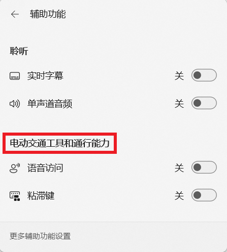

## Canary - 搁置 (未做出更改)

> [!TIP]
>
> &emsp;并非所有软件缺陷都要修复。
>
> &emsp;已收录的反馈也可能因缺少资源、修复风险过大、商业决策调整等长期或永久不予修复。本板块记录 Microsoft 超过 90 天未修复的问题，中心将每间隔 30 天在 Canary 频道最新版本中进行测试。

|      编号       |                             问题                             | 状态  |
| :-------------: | :----------------------------------------------------------: | :---: |
|      —————      | [**公告已知问题**](README.md) \| [**用户反馈问题**](README.md) \| [**归档 (已做出更改 0 - 7 天)**](README.md) \| [**归档 (已做出更改 >7 天)**](7+.md) | ————— |
| [LG279](#LG279) |   在反馈中心提交的反馈有状态更新或官方回复时无法收到通知。   | 搁置  |
| [LG281](#LG281) |           使用 ms-search: 链接时任务栏搜索框消失。           | 搁置  |
| [LG286](#LG286) | Microsoft Store 宣传视频中的 “投放到设备” 被译为 “强制转换为设备”。 | 搁置  |
| [LG347](#LG347) |            满足条件后在反馈中心无法获得成就徽章。            | 搁置  |
| [LG361](#LG361) |          Microsoft Store 不显示较早的应用更新记录。          | 搁置  |
| [LG379](#LG379) |    Microsoft Store 最小化时，无法右键任务栏图标将其关闭。    | 搁置  |
| [LG395](#LG395) |       在 “设置” 菜单中搜索 “高级网络设置” 时没有结果。       | 搁置  |
| [LG403](#LG403) | 点击设置菜单 “相关支持” 中的 “更改隐私设置” 时，打开的链接有误。 | 搁置  |
| [LG413](#LG413) |     “辅助功能” 快速设置中出现 “电动交通工具” 错误翻译。      | 搁置  |
| [LG424](#LG424) |      “设置”>“鼠标” 菜单中 “主鼠标按钮” 的选项翻译有误。      | 搁置  |
| [LG427](#LG427) |          任务管理器 “性能” 页面中的选项卡无法对齐。          | 搁置  |
| [LG449](#LG449) |        搜索栏打开时，切换输入法会导致任务栏图标溢出。        | 搁置  |

编号：LG279  
日期：2025 年 1 月 29 日  
版本：ALL  
**问题**：**在反馈中心提交的反馈有状态更新或官方回复时无法收到通知**。  
状态：  
典型反馈：[aka.ms/AAu3v9h](https://aka.ms/AAu3v9h) 

---

编号：LG281  
日期：2025 年 1 月 29 日  
版本：Canary 27774 - 28000  
**问题**：**使用 ms-search: 链接时任务栏搜索框消失**。  
状态：  
典型反馈：[aka.ms/AAu42tm](https://aka.ms/AAu42tm)

---

编号：LG286  
日期：2025 年 2 月 1 日  
版本：ALL  
**问题**：**Microsoft Store 宣传视频中的 “投放到设备” 被译为 “强制转换为设备”**。  
状态：  
典型反馈：[aka.ms/AAu5r06](https://aka.ms/AAu5r06)

---

编号：LG347  
日期：2025 年 5 月 1 日  
版本：ALL  
**问题**：**满足条件后在反馈中心无法获得成就徽章**。  
状态：  
典型反馈：[aka.ms/AAw0kh1](https://aka.ms/AAw0kh1) & [aka.ms/AAx2o1t](https://aka.ms/AAx2o1t)

---

编号：LG361  
日期：2025 年 5 月 15 日  
版本：ALL  
**问题**：**Microsoft Store 不显示较早的应用更新记录**。  
状态：  
典型反馈：[aka.ms/AAw8czh](https://aka.ms/AAw8czh)

---

编号：LG379  
日期：2025 年 5 月 26 日  
版本：ALL  
**问题**：**Microsoft Store 最小化时，无法右键任务栏图标将其关闭**。  
状态：  
典型反馈：[aka.ms/AAwd8s4](https://aka.ms/AAwd8s4)

---

编号：LG395  
日期：2025 年 6 月 11 日  
版本：Canary 27871 - 28000  
**问题**：**在 “设置” 菜单中搜索 “高级网络设置” 时没有结果**。  
状态：  
典型反馈：[aka.ms/AAwndix](https://aka.ms/AAwndix)

---

编号：LG403  
日期：2025 年 6 月 14 日  
版本：Canary 27871 - 28000  
**问题**：**点击设置菜单 “相关支持” 中的 “更改隐私设置” 时，打开的链接有误**。  
状态：  
典型反馈：[aka.ms/AAwoi47](https://aka.ms/AAwoi47)

---

编号：LG413  
日期：2025 年 6 月 25 日  
版本：Canary 27881 - 28000  
**问题**：**“辅助功能” 快速设置中出现 “电动交通工具” 错误翻译**。  
状态：  
典型反馈：[aka.ms/AAwtbwl](https://aka.ms/AAwtbwl)

---

编号：LG424  
日期：2025 年 7 月 19 日  
版本：Canary 27902 - 28000  
**问题**：**“设置”>“鼠标” 菜单中 “主鼠标按钮” 的选项翻译有误**。  
状态：  
典型反馈：[aka.ms/AAx2o1o](https://aka.ms/AAx2o1o)

---

编号：LG427  
日期：2025 年 7 月 19 日  
版本：Canary 27902 - 28000  
**问题**：**任务管理器 “性能” 页面中的选项卡无法对齐**。  
状态：  
典型反馈：[aka.ms/AAx0xzj](https://aka.ms/AAx0xzj)

---

编号：LG449  
日期：2025 年 8 月 24 日  
版本：Canary 27928 - 28000  
**问题**：**搜索栏打开时，切换输入法会导致任务栏图标溢出**。  
状态：  
典型反馈：[aka.ms/AAxljuq](https://aka.ms/AAxljuq)

---

[回到顶部](#HEAD)

  

在 “[署名 - 相同方式共享 4.0](https://creativecommons.org/licenses/by-sa/4.0/legalcode.zh-Hans)” 协议 (CC BY-SA 4.0) 之条款下提供。

2023 - 2025, [高楷修 (Ling Gao)](https://github.com/Lingggao), 灵糕中心 (Linggao Hub), [github.com/Lingggao/LGHUB](https://github.com/Lingggao/LGHUB)

[字体许可使用授权书](https://github.com/Lingggao/LGHUB/blob/main/Images/%E5%AD%97%E4%BD%93%E8%AE%B8%E5%8F%AF%E4%BD%BF%E7%94%A8%E6%8E%88%E6%9D%83%E4%B9%A6.png?raw=true) | [Windows Insider 最有价值专家](https://github.com/Lingggao/LGHUB/blob/main/Images/Windows%20Insider%20MVP.png?raw=true)