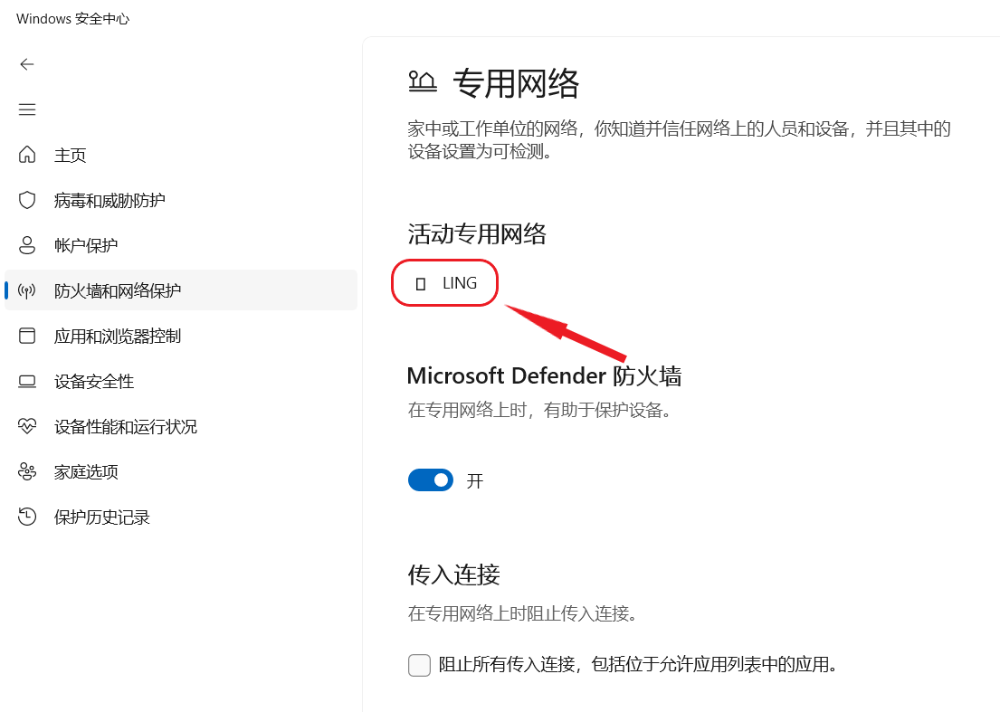

## ✦ Canary - 搁置 (未做出更改) ✦

&emsp;&emsp;“并非所有软件缺陷都要修复。” —— Ron Patton (出自《软件测试》)

&emsp;&emsp;已收录的反馈也可能因缺少资源、修复风险过大、商业决策调整等长期或永久不予修复。本板块记录 Microsoft 超过 90 天未修复的问题，中心将每间隔 30 天在 Canary 频道最新版本中进行测试。

|      编号       |                             问题                             |  状态   |
| :-------------: | :----------------------------------------------------------: | :-----: |
|     **———**     | **✦** [**Canary - 公告已知问题**](README.md) **✦ \| ✦** [**Canary - 用户反馈问题**](README.md) **✦ \| ✦** [**Canary - 归档 (已做出更改 >14 天)**](README.md) **✦ \| ✦** [**Canary - 归档 (已做出更改 >28 天)**](7+.md) **✦** | **———** |
| [LG015](#LG015) |      在文件资源管理器中按下两次 F11 后地址栏将被冻结。       |  搁置   |
| [LG088](#LG088) |       无法使用截图工具对开始菜单 / 右键菜单进行截图。        |  搁置   |
| [LG030](#LG030) | 在 Microsoft Store 中下载 Xbox Identity Provider 时显示 0x80073CFB 错误。 |  搁置   |
| [LG149](#LG149) |  Windows 安全中心 “防火墙和网络保护” 页面中的图标变为方块。  |  搁置   |

---

编号：LG015  
版本：Canary 25992 - 26252  
**问题**：**在文件资源管理器中按下两次 F11 后地址栏将被冻结**。  
状态：  
典型反馈：[aka.ms/AAnkkd6](https://aka.ms/AAnkkd6)

---

编号：LG088  
版本：ALL  
**问题**：**无法使用截图工具对开始菜单 / 右键菜单进行截图**。  
状态：  
典型反馈：[aka.ms/AAp5evo](https://aka.ms/AAp5evo)

---

编号：LG030  
版本：Canary  
**问题**：**在 Microsoft Store 中下载 Xbox Identity Provider 时显示 0x80073CFB 错误**。  
状态：  
典型反馈：[aka.ms/AAlzfg7](https://aka.ms/AAlzfg7)

---

编号：LG149  
日期：2024 年 4 月 10 日  
版本：Canary 26100 - 26252  
**问题**：**Windows 安全中心 “防火墙和网络保护” 页面中的图标变为方块**。  
状态：  
典型反馈：[aka.ms/AApy8i2](https://aka.ms/AApy8i2)

---

[回到顶部](#HEAD)

  

在 “[署名 - 相同方式共享 4.0](https://creativecommons.org/licenses/by-sa/4.0/legalcode.zh-Hans)” 协议 (CC BY-SA 4.0) 之条款下提供。

2023 - 2024, 高楷修 (Ling Gao), 灵糕中心 (Linggao Hub), [github.com/Lingggao/LGHUB](https://github.com/Lingggao/LGHUB)

[字体许可使用授权书](Images/字体许可使用授权书.png) |  (访问次数统计：今日 / 累计)