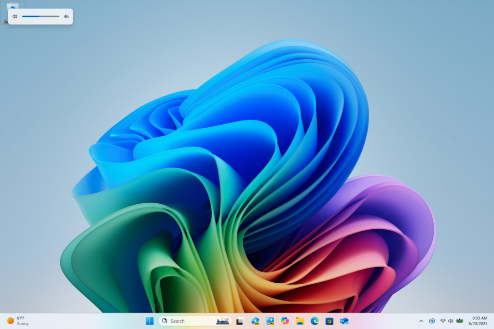
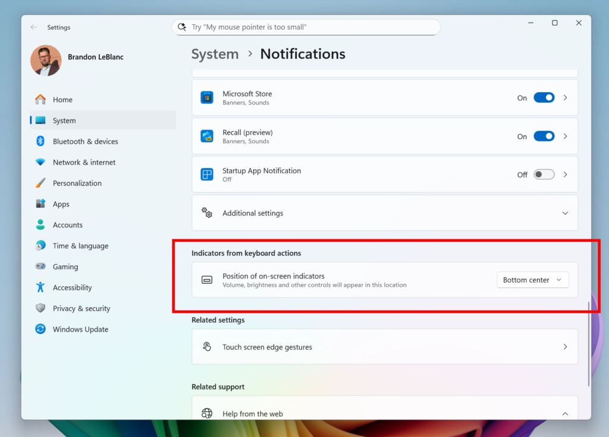

# WIP Canary 27959 更新简报

> [!TIP]
>
> &emsp;Ling Gao 制 (2025/10/7)，不代表 Microsoft 公司立场、态度。
>
> &emsp;鼓励阅读官方原文：[英文更新公告](https://blogs.windows.com/windows-insider/2025/10/06/announcing-windows-11-insider-preview-build-27959-canary-channel)、[中文更新公告]() (暂无)。

## 一、新功能

1. 屏幕硬件指示器支持调整位置。

2. 新增 “插入长 / 短破折号 (— / –)” 快捷键。

## 二、变更和改进

1. 优化了文件资源管理器。
2. Windows 共享窗口支持固定应用。
3. 更多对话框适配 Windows 11 视觉风格。

## 三、修复 & 已知问题

详见[官方原文](https://blogs.windows.com/windows-insider/2025/10/06/announcing-windows-11-insider-preview-build-27959-canary-channel)和[灵糕中心](https://github.com/Lingggao/LGHUB)。

部分重要修复：

1. 修复了 “ARM 设备 IRQL_NOT_LESS_OR_EQUAL 绿屏” 的问题。
2. 修复了 “连接电源后不显示正在充电” 的问题。
3. 修复了 “点击任务栏应用预览时无法让应用回到前台” 的问题。
4. 修复了 “使用 WIN + Shift + S 截图时开始菜单关闭” 的问题。
5. 修复了 “滚动窗口时应用和浏览器中的内容卡在屏幕上” 的问题。
6. 修复了 “PIN 显示 0x80090010 错误” 的问题。
7. 修复了 “语音访问功能无法使用” 的问题。
8. 修复了 “PIX on Windows 无法播放 GPU 捕获” 的问题。
9. 修复了 “软件中文本的撇号无法正确显示” 的问题。

[**WIP Canary 往期简报**](Documents/Canary_Previous)

---

[回到顶部](#HEAD)

  

在 “[署名 - 相同方式共享 4.0](https://creativecommons.org/licenses/by-sa/4.0/legalcode.zh-Hans)” 协议 (CC BY-SA 4.0) 之条款下提供。

2023 - 2025, [高楷修 (Ling Gao)](https://github.com/Lingggao), 灵糕中心 (Linggao Hub), [github.com/Lingggao/LGHUB](https://github.com/Lingggao/LGHUB)

[字体许可使用授权书](https://github.com/Lingggao/LGHUB/blob/main/Images/%E5%AD%97%E4%BD%93%E8%AE%B8%E5%8F%AF%E4%BD%BF%E7%94%A8%E6%8E%88%E6%9D%83%E4%B9%A6.png?raw=true) | [Windows Insider 最有价值专家](https://github.com/Lingggao/LGHUB/blob/main/Images/Windows%20Insider%20MVP.png?raw=true)