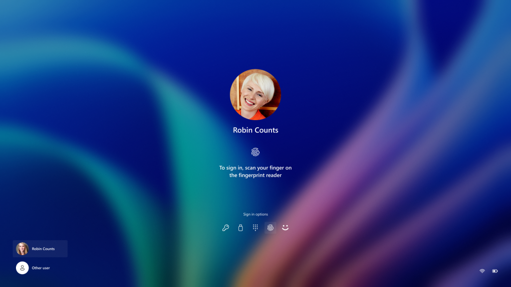
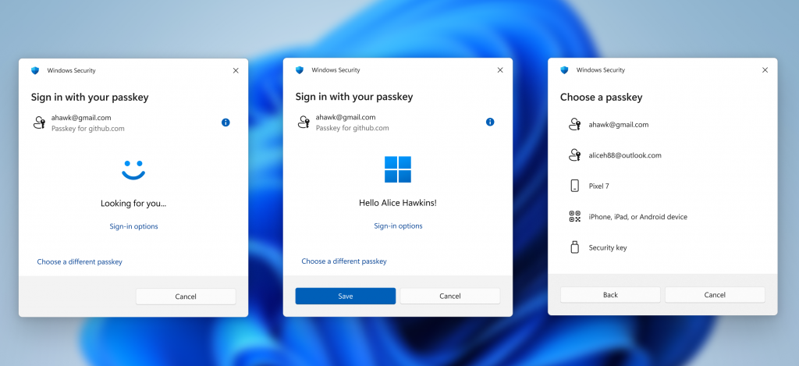
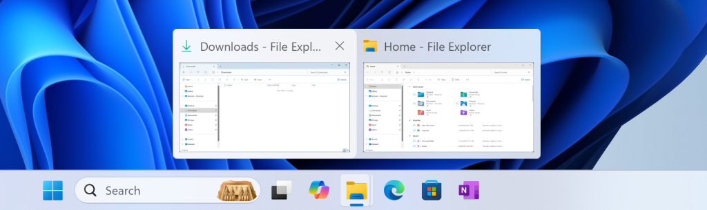

# WIP Canary 27754 更新简报

> [!TIP]
>
> &emsp;Ling Gao 制 (2024/11/21)，不代表 Microsoft 公司立场、态度。
>
> &emsp;鼓励阅读官方原文：[英文更新公告](https://blogs.windows.com/windows-insider/2024/11/20/announcing-windows-11-insider-preview-build-27754-canary-channel)、[中文更新公告]() (暂无)。

## 一、新功能

1. 现代化的 Windows Hello —— 直观、无缝、现代视觉设计。
   - 新的 Windows Hello 图标。
   
   
   
   
   - 更快速、清晰的视觉交互。
     
   
   
   
   - 更简洁、直观的 Windows 安全凭据。
     

## 二、变更和改进

1. 开始菜单和任务栏的跳转列表支持按住 Shift + Ctrl 键以管理员身份运行。
2. 改进了任务栏中应用的鼠标悬停预览，同时优化了动画。

3. 试用简化的系统托盘 —— 缩短日期时间、隐藏通知图标。

## 三、修复 & 已知问题

详见[官方原文](https://blogs.windows.com/windows-insider/2024/11/20/announcing-windows-11-insider-preview-build-27754-canary-channel)和[灵糕中心](https://github.com/Lingggao/LGHUB)。

部分重要修复：

1. 修复了 “启动菜单中出现重复的 Windows 条目” 的问题。
2. 修复了 “文件资源管理器的搜索框超出窗口末尾” 的问题。
3. 修复了 “部分远程连接软件崩溃” 的问题。
4. 修复了 “SYSTEM_THREAD_EXCEPTION_NOT_HANDLED 绿屏” 的问题。

谢谢，

Ling

[**WIP Canary 往期简报**](Documents/Canary_Previous)

---

[回到顶部](#HEAD)

  

在 “[署名 - 相同方式共享 4.0](https://creativecommons.org/licenses/by-sa/4.0/legalcode.zh-Hans)” 协议 (CC BY-SA 4.0) 之条款下提供。

2023 - 2024, 高楷修 (Ling Gao), 灵糕中心 (Linggao Hub), [github.com/Lingggao/LGHUB](https://github.com/Lingggao/LGHUB)

[字体许可使用授权书](Images/字体许可使用授权书.png) |  (访问次数统计：今日 / 累计)