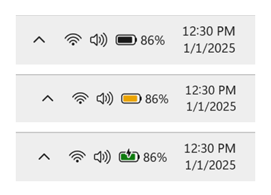
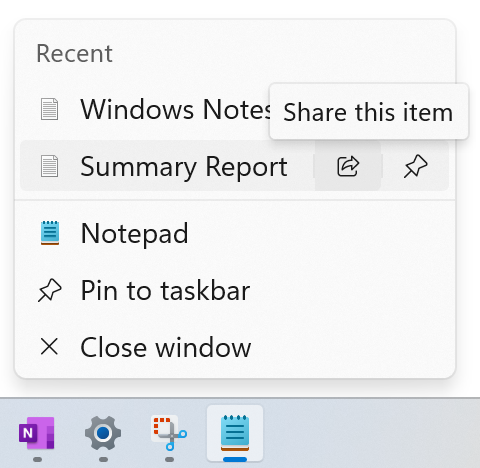

# WIP Canary 27802 更新简报

> [!TIP]
>
> &emsp;Ling Gao 制 (2025/3/1)，不代表 Microsoft 公司立场、态度。
>
> &emsp;鼓励阅读官方原文：[英文更新公告](https://blogs.windows.com/windows-insider/2025/02/28/announcing-windows-11-insider-preview-build-27802-canary-channel)、[中文更新公告]() (暂无)。

## 一、新功能

1. 全新彩色电池图标。
2. 显示电池电量百分比。

## 二、变更和改进

1. 任务栏应用右键菜单新增 “共享” 按钮。

2. Spotlight 的桌面图标支持鼠标悬停交互。

## 三、修复 & 已知问题

详见[官方原文](https://blogs.windows.com/windows-insider/2025/02/28/announcing-windows-11-insider-preview-build-27802-canary-channel)和[灵糕中心](https://github.com/Lingggao/LGHUB)。

部分重要修复：

1. 修复了 “Canary 27788 安装失败 0x8007000d” 的问题。
2. 修复了 “最小化并恢复文件资源管理器时窗口无法正确显示” 的问题。
3. 修复了 “以管理员身份运行应用时鼠标指针样式自动变回默认” 的问题。
4. 修复了 “Windows 安全中心动态锁与管理员保护功能间距过大” 的问题。
5. 修复了 “音频服务崩溃” 的问题。
6. 修复了 “电脑 WIN32K_CRITICAL_FAILURE 绿屏” 的问题。
7. 修复了 “电脑 KERNEL_SECURITY_CHECK_FAILURE 绿屏” 的问题。
8. 修复了 “运行 SFC /scannow 命令时显示错误” 的问题。

谢谢，

Ling

[**WIP Canary 往期简报**](Documents/Canary_Previous)

---

[回到顶部](#HEAD)

  

在 “[署名 - 相同方式共享 4.0](https://creativecommons.org/licenses/by-sa/4.0/legalcode.zh-Hans)” 协议 (CC BY-SA 4.0) 之条款下提供。

2023 - 2025, 高楷修 (Ling Gao), 灵糕中心 (Linggao Hub), [github.com/Lingggao/LGHUB](https://github.com/Lingggao/LGHUB)

[字体许可使用授权书](Images/字体许可使用授权书.png) |  (访问次数统计：今日 / 累计)