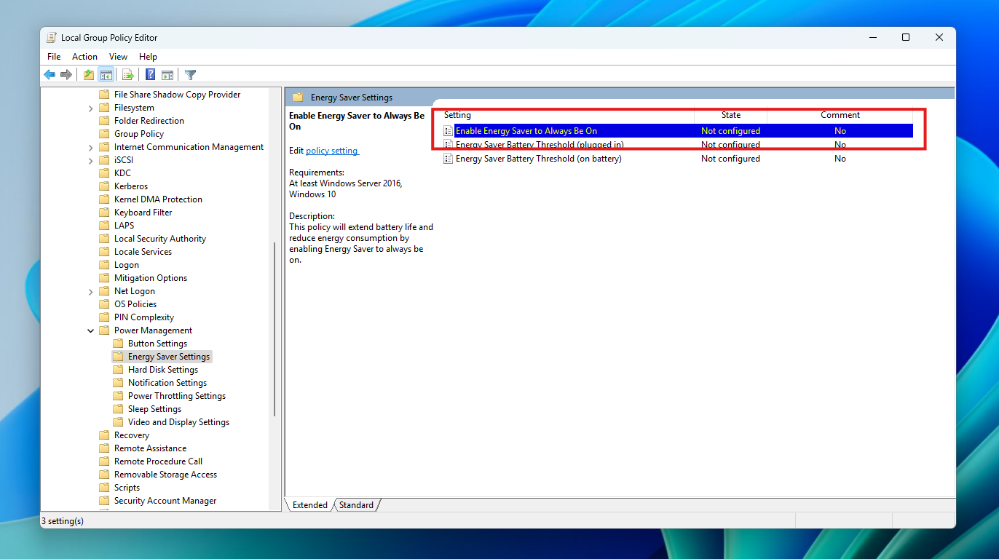
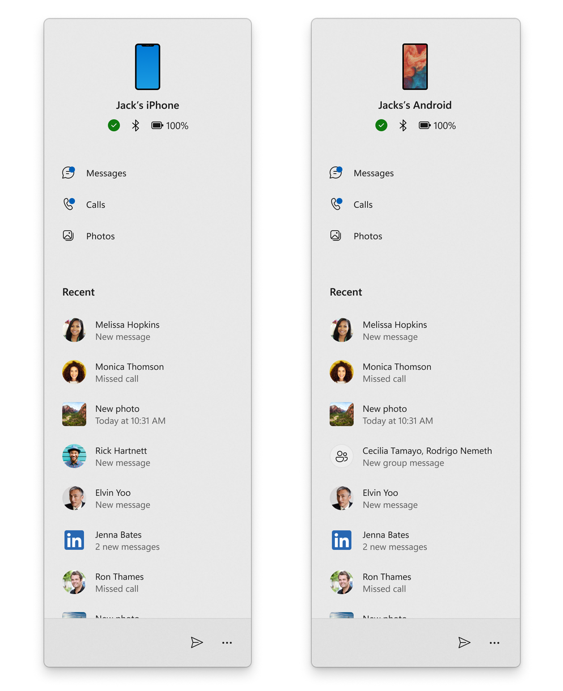

# WIP Canary 27871 更新简报

> [!TIP]
>
> &emsp;Ling Gao 制 (2025/6/5)，不代表 Microsoft 公司立场、态度。
>
> &emsp;鼓励阅读官方原文：[英文更新公告](https://blogs.windows.com/windows-insider/2025/06/04/announcing-windows-11-insider-preview-build-27871-canary-channel)、[中文更新公告]() (暂无)。

## 一、新功能

1. 将 “电池节能” 功能引入 Microsoft Intune。

## 二、变更和改进

1. 开始菜单 “手机伴侣” 面向 Canary 频道推出。

2. 任务栏中 “需要关注的应用” 的图标底部横条更宽、更明显。

## 三、修复 & 已知问题

详见[官方原文](https://blogs.windows.com/windows-insider/2025/06/04/announcing-windows-11-insider-preview-build-27871-canary-channel)和[灵糕中心](https://github.com/Lingggao/LGHUB)。

部分重要修复：

1. 修复了 “打开组策略编辑器时提示错误” 的问题。
2. 修复了 “高采样率 (192 kHz) 设备无法播放音频” 的问题。
3. 修复了 “依赖于虚拟化的应用无法运行” 的问题。
4. 修复了 “任务管理器的搜索和筛选功能失效” 的问题。
5. 修复了 “系统信息菜单顶部选项卡边框显示直角” 的问题。

谢谢，

Ling

[**WIP Canary 往期简报**](Documents/Canary_Previous)

---

[回到顶部](#HEAD)

  

在 “[署名 - 相同方式共享 4.0](https://creativecommons.org/licenses/by-sa/4.0/legalcode.zh-Hans)” 协议 (CC BY-SA 4.0) 之条款下提供。

2023 - 2025, [高楷修 (Ling Gao)](https://github.com/Lingggao), 灵糕中心 (Linggao Hub), [github.com/Lingggao/LGHUB](https://github.com/Lingggao/LGHUB)

[字体许可使用授权书](Images/字体许可使用授权书.png) | [Windows Insider 最有价值专家](https://github.com/Lingggao/LGHUB/blob/main/Images/Windows%20Insider%20MVP.png?raw=true)