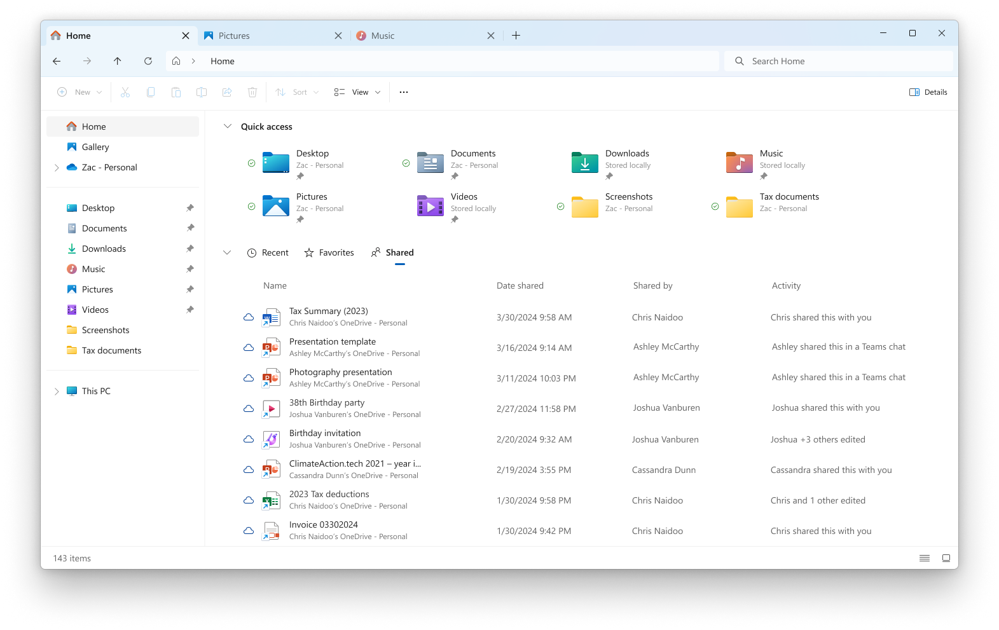

# WIP Canary 27783 更新简报

> [!TIP]
>
> &emsp;Ling Gao 制 (2025/1/30)，不代表 Microsoft 公司立场、态度。
>
> &emsp;鼓励阅读官方原文：[英文更新公告](https://blogs.windows.com/windows-insider/2025/01/29/announcing-windows-11-insider-preview-build-27783-canary-channel)、[中文更新公告](https://aka.ms/AAu4bad)。

## 一、新功能

1. 文件资源管理器现已支持快速访问已共享的文件。

## 二、变更和改进

1. 改善了系统整体体验。
2. 改进了放大镜功能。

## 三、修复 & 已知问题

详见[官方原文](https://blogs.windows.com/windows-insider/2025/01/29/announcing-windows-11-insider-preview-build-27783-canary-channel)和[灵糕中心](https://github.com/Lingggao/LGHUB)。

部分重要修复：

1. 修复了 “任务栏应用预览窗口无法正常显示” 的问题。
2. 修复了 “切换窗口时拼音输入法自动切换中英文” 的问题。
3. 修复了 “使用 Alt + Tab 快捷键时应用窗口冻结” 的问题。
4. 修复了 “转到 ‘设置’>‘系统’>‘屏幕’>‘显示卡’ 时崩溃” 的问题。
5. 修复了 “MTSC.exe 远程桌面 0x80080005 错误” 的问题。
6. 修复了 “Explorer.exe 内存泄漏” 的问题。
7. 修复了 “shutdown /r /fw 命令失效” 的问题。

谢谢，

Ling

[**WIP Canary 往期简报**](Documents/Canary_Previous)

---

[回到顶部](#HEAD)

  

在 “[署名 - 相同方式共享 4.0](https://creativecommons.org/licenses/by-sa/4.0/legalcode.zh-Hans)” 协议 (CC BY-SA 4.0) 之条款下提供。

2023 - 2025, 高楷修 (Ling Gao), 灵糕中心 (Linggao Hub), [github.com/Lingggao/LGHUB](https://github.com/Lingggao/LGHUB)

[字体许可使用授权书](Images/字体许可使用授权书.png) |  (访问次数统计：今日 / 累计)