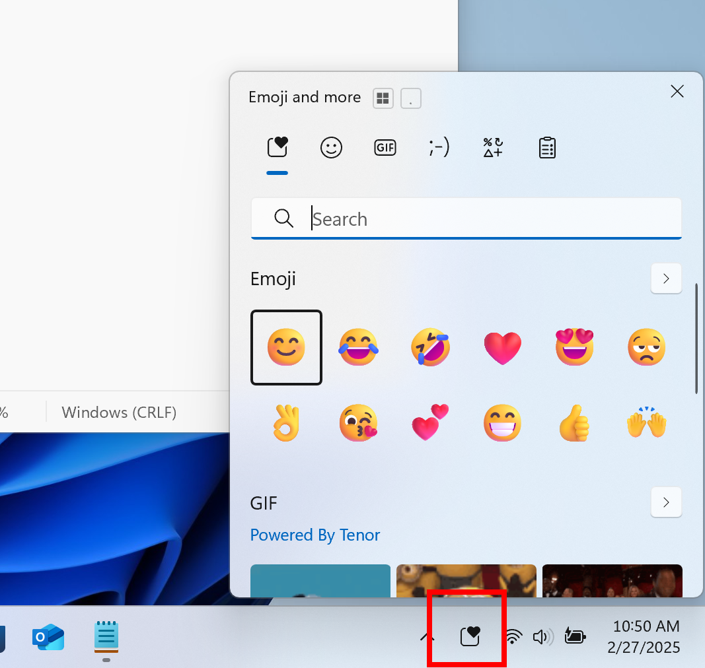

# WIP Canary 27858 更新简报

> [!TIP]
>
> &emsp;Ling Gao 制 (2025/5/17)，不代表 Microsoft 公司立场、态度。
>
> &emsp;鼓励阅读官方原文：[英文更新公告](https://blogs.windows.com/windows-insider/2025/05/16/announcing-windows-11-insider-preview-build-27858-canary-channel)、[中文更新公告]() (暂无)。

## 一、新功能

无

## 二、变更和改进

1. 任务栏新增 “表情符号” 托盘图标。

## 三、修复 & 已知问题

详见[官方原文](https://blogs.windows.com/windows-insider/2025/05/16/announcing-windows-11-insider-preview-build-27858-canary-channel)和[灵糕中心](https://github.com/Lingggao/LGHUB)。

部分重要修复：

1. 修复了 “安装更新时卡在黑屏状态” 的问题。
2. 修复了 “开始菜单等组件无法显示文字” 的问题。
3. 修复了 “以平板电脑使用时任务栏图标不会变大” 的问题。
4. 修复了 “夜间模式失效” 的问题。
5. 修复了 “WLAN 网络故障” 的问题。
6. 修复了 “电脑绿屏” 的问题。

谢谢，

Ling

[**WIP Canary 往期简报**](Documents/Canary_Previous)

---

[回到顶部](#HEAD)

  

在 “[署名 - 相同方式共享 4.0](https://creativecommons.org/licenses/by-sa/4.0/legalcode.zh-Hans)” 协议 (CC BY-SA 4.0) 之条款下提供。

2023 - 2025, [高楷修 (Ling Gao)](https://github.com/Lingggao), 灵糕中心 (Linggao Hub), [github.com/Lingggao/LGHUB](https://github.com/Lingggao/LGHUB)

[字体许可使用授权书](Images/字体许可使用授权书.png) | [Windows Insider 最有价值专家](https://github.com/Lingggao/LGHUB/blob/main/Images/Windows%20Insider%20MVP.png?raw=true)