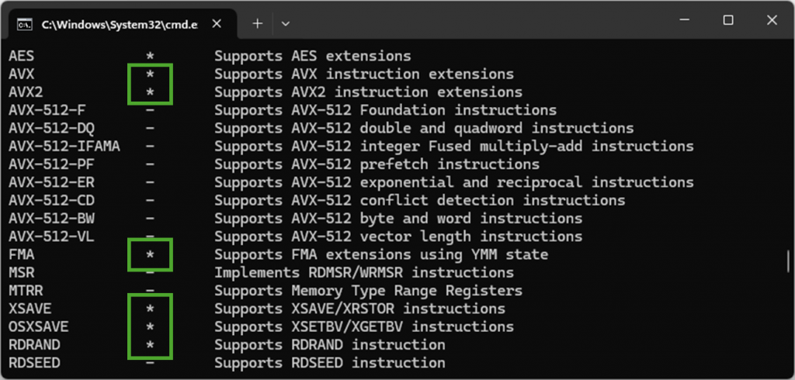
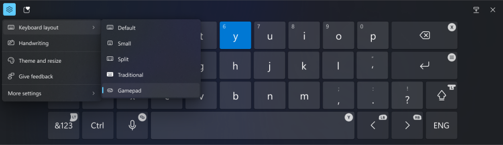
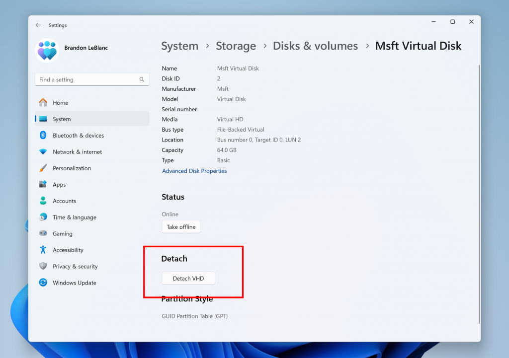

# WIP Canary 27744 更新简报

> [!TIP]
>
> &emsp;Ling Gao 著，不代表 Microsoft 公司立场、态度。
>
> &emsp;鼓励阅读官方原文：[英文更新公告](https://blogs.windows.com/windows-insider/2024/11/06/announcing-windows-11-insider-preview-build-27744-canary-channel)、[中文更新公告](https://aka.ms/AAtefwg)。

## 一、新功能

1. 预览 Prism (适用于 ARM 架构的 Windows 设备模拟器) 重要功能更新。支持更多 CPU 功能，可运行更多 64 位 x86 (x64) 应用。过去因 CPU 要求而无法运行的一些游戏或应用将能通过 Prism 运行。

## 二、变更和改进

1. 推出 “游戏手柄” 屏幕键盘布局。

2. 优化了任务管理器。
3. 设置菜单 “分离虚拟硬盘 (VHD/VHDx)” 按钮回归。

## 三、修复 & 已知问题

详见[灵糕中心](https://github.com/Lingggao/LGHUB)。

---

WIP 往期简报

[Canary 27###]() · [Canary 27744]()

---

[回到顶部](#HEAD)

  

在 “[署名 - 相同方式共享 4.0](https://creativecommons.org/licenses/by-sa/4.0/legalcode.zh-Hans)” 协议 (CC BY-SA 4.0) 之条款下提供。

2023 - 2024, 高楷修 (Ling Gao), 灵糕中心 (Linggao Hub), [github.com/Lingggao/LGHUB](https://github.com/Lingggao/LGHUB)

[字体许可使用授权书](Images/字体许可使用授权书.png) |  (访问次数统计：今日 / 累计)