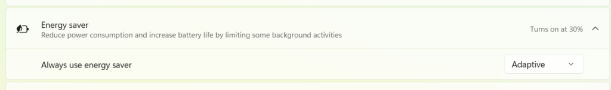

# WIP Canary 27898 更新简报

> [!TIP]
>
> &emsp;Ling Gao 制 (2025/7/12)，不代表 Microsoft 公司立场、态度。
>
> &emsp;鼓励阅读官方原文：[英文更新公告](https://blogs.windows.com/windows-insider/2025/07/11/announcing-windows-11-insider-preview-build-27898-canary-channel)、[中文更新公告]() (暂无)。

## 一、新功能

1. 全新任务栏图标缩放功能。

2. 全新快速计算机恢复功能。
3. 语音访问功能支持将自定义单词添加至词典。

4. 讲述人新增屏幕遮挡功能。

## 二、变更和改进

1. 改进了隐私对话框的设计。

2. 改进了快速设置中的 “辅助功能” 菜单。

3. 在上下文菜单的图标间添加了分隔线。

4. 节能模式新增自适应功能。

5. 改进了 Windows 共享窗口。
6. 语音访问功能支持更多语言。
7. 截图工具新增 WIN + Shift + T 文本提取器快捷键。
8. 改进了 “设置”>“时间和语言” 菜单。
9. 优化了文件资源管理器的性能。
10. 调整了因保留分区空间不足导致更新失败时的错误提示。

## 三、修复 & 已知问题

详见[官方原文](https://blogs.windows.com/windows-insider/2025/07/11/announcing-windows-11-insider-preview-build-27898-canary-channel)和[灵糕中心](https://github.com/Lingggao/LGHUB)。

部分重要修复：

1. 修复了 “日语触摸键盘无法正常工作” 的问题。
2. 修复了 “设置菜单崩溃 / 挂起” 的问题。
3. 修复了 “Math.Pow() 无法输出正确结果” 的问题。

[**WIP Canary 往期简报**](Documents/Canary_Previous)

---

[回到顶部](#HEAD)

  

在 “[署名 - 相同方式共享 4.0](https://creativecommons.org/licenses/by-sa/4.0/legalcode.zh-Hans)” 协议 (CC BY-SA 4.0) 之条款下提供。

2023 - 2025, [高楷修 (Ling Gao)](https://github.com/Lingggao), 灵糕中心 (Linggao Hub), [github.com/Lingggao/LGHUB](https://github.com/Lingggao/LGHUB)

[字体许可使用授权书](Images/字体许可使用授权书.png) | [Windows Insider 最有价值专家](https://github.com/Lingggao/LGHUB/blob/main/Images/Windows%20Insider%20MVP.png?raw=true)