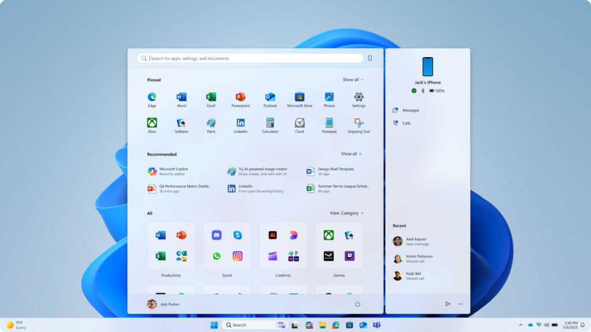
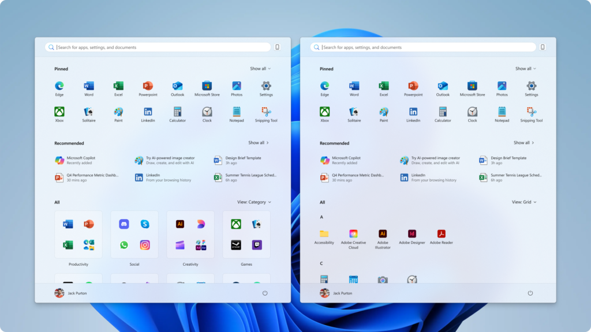
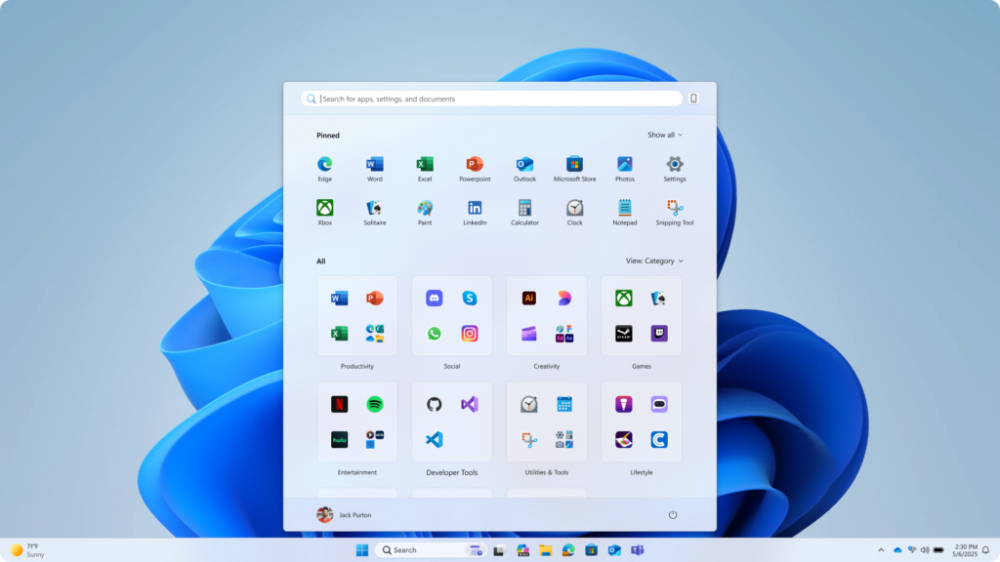
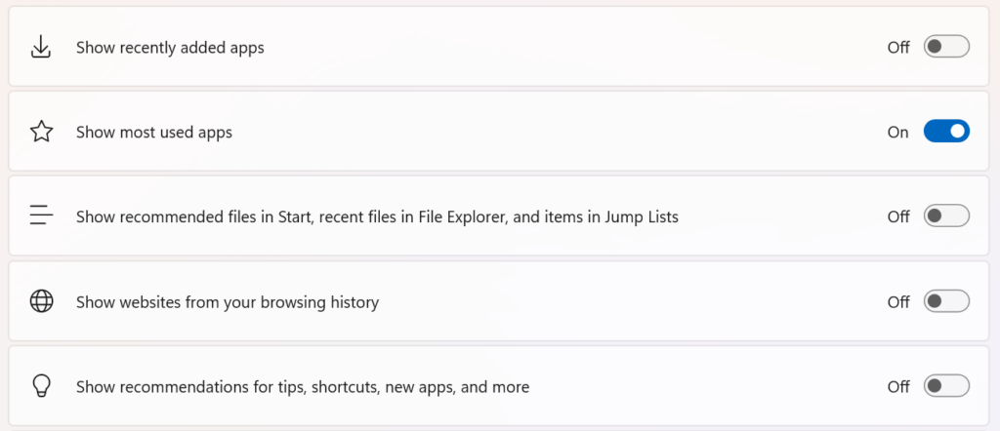

# WIP Canary 27965 更新简报

> [!TIP]
>
> &emsp;Ling Gao 制 (2025/10/9)，不代表 Microsoft 公司立场、态度。
>
> &emsp;鼓励阅读官方原文：[英文更新公告](https://blogs.windows.com/windows-insider/2025/10/08/announcing-windows-11-insider-preview-build-27965-canary-channel)、[中文更新公告]() (暂无)。

## 一、新功能

1. 全新开始菜单亮相。
    - 支持滚动
    - 尺寸更大
    - 自适应布局
    - 无缝跨设备

## 二、变更和改进

1. .NET Framework 3.5 不再作为可选组件提供。
2. 命令行文本编辑器 Edit 随 Windows 系统提供。

## 三、修复 & 已知问题

详见[官方原文](https://blogs.windows.com/windows-insider/2025/10/08/announcing-windows-11-insider-preview-build-27965-canary-channel)和[灵糕中心](https://github.com/Lingggao/LGHUB)。

部分重要修复：

1. 修复了 “无法自动隐藏任务栏” 的问题。
2. 修复了 “视频和游戏画面变红” 的问题。
3. 修复了 “受保护视频无法正常播放” 的问题。

[**WIP Canary 往期简报**](Documents/Canary_Previous)

---

[回到顶部](#HEAD)

  

在 “[署名 - 相同方式共享 4.0](https://creativecommons.org/licenses/by-sa/4.0/legalcode.zh-Hans)” 协议 (CC BY-SA 4.0) 之条款下提供。

2023 - 2025, [高楷修 (Ling Gao)](https://github.com/Lingggao), 灵糕中心 (Linggao Hub), [github.com/Lingggao/LGHUB](https://github.com/Lingggao/LGHUB)

[字体许可使用授权书](https://github.com/Lingggao/LGHUB/blob/main/Images/%E5%AD%97%E4%BD%93%E8%AE%B8%E5%8F%AF%E4%BD%BF%E7%94%A8%E6%8E%88%E6%9D%83%E4%B9%A6.png?raw=true) | [Windows Insider 最有价值专家](https://github.com/Lingggao/LGHUB/blob/main/Images/Windows%20Insider%20MVP.png?raw=true)