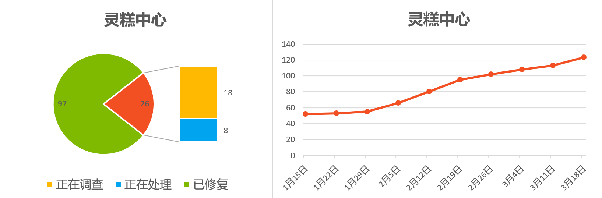
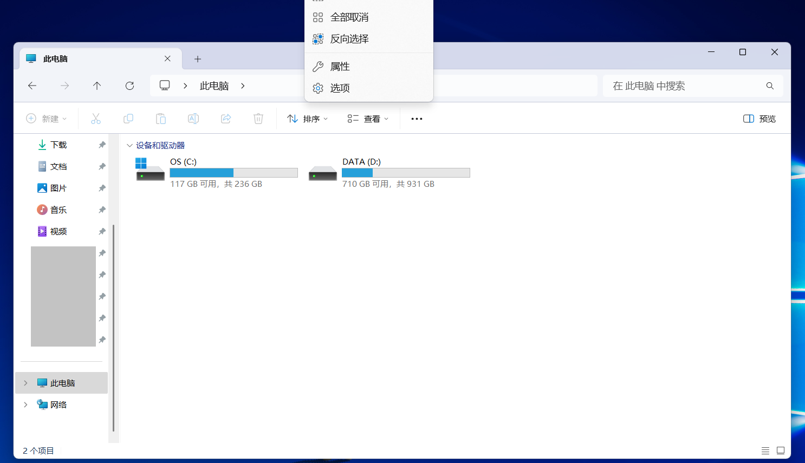
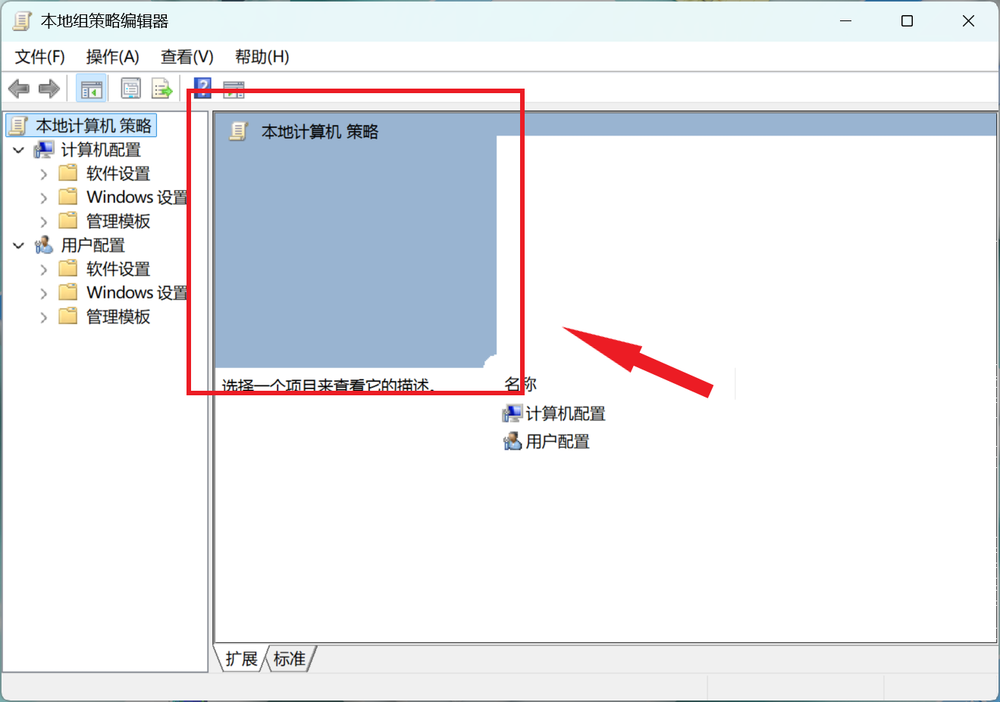
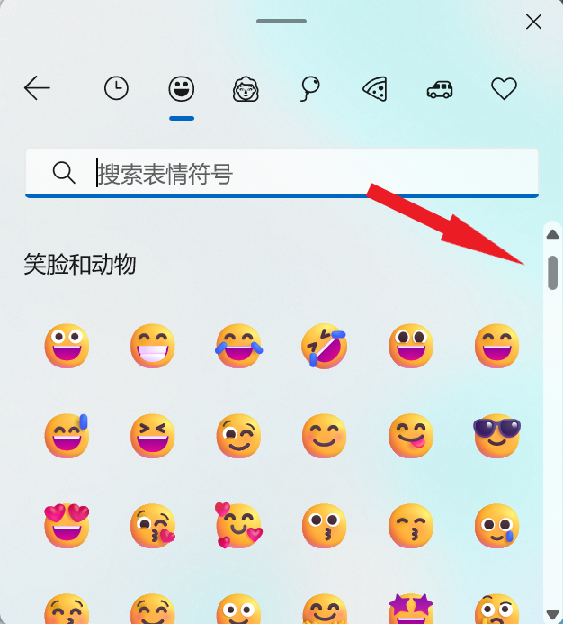
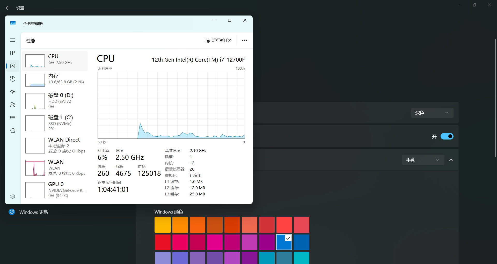
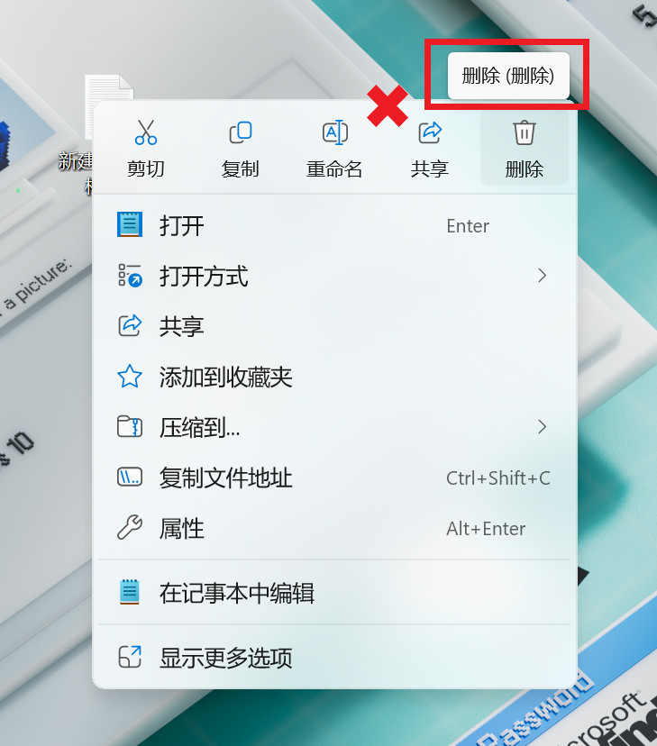

  

<h1 align="center">灵糕中心 (Linggao Hub)</h1>

[github.com/Lingggao/LGHUB](https://github.com/Lingggao/LGHUB) (GitHub)

&emsp;&emsp;**用于跟踪 “Windows 11 预览体验版本 (Canary 频道) 中哪些反馈正在由 Microsoft 调查、处理 / 已做出更改” 的信息枢纽**。由 2021 Windows Insider 最有价值专家 (MVP) · [**Ling Gao**](https://github.com/Lingggao) 先生管理。

&emsp;&emsp;灵糕中心成立于 2023 年 12 月 12 日，其前身可追溯至 2019 年 5 月 14 日由 Microsoft 社区创建的 “[\[BUG 汇总\] Windows 10 2019 年 5 月更新 (1903_18362) 已知问题与处理进度汇总](https://answers.microsoft.com/zh-hans/insider/forum/all/bug-%E6%B1%87%E6%80%BBwindows-10-2019-%E5%B9%B4-5/252d0d6a-022c-4bf7-9976-55b57590aee2)” 讨论话题。

> [!IMPORTANT]
>
> &emsp;灵糕中心为个人项目，管理者不是 Microsoft 公司员工，不能代表 Microsoft 公司立场、态度。中心无意且无法代替 “反馈中心” (Feedback Hub) 应用的重要作用。中心不提供 Microsoft 产品技术支持服务。中心不接受有关 Windows 11 预览体验版本的反馈，用户应始终通过 “反馈中心” 应用提交。
>
> &emsp;Windows、Windows Insider Program 等是 Microsoft 公司的商标。

&emsp;&emsp;**宗旨**：独立管理、服务用户、信息精准、更新及时

[反馈中心](https://aka.ms/fbh) | [深入了解反馈](https://learn.microsoft.com/zh-cn/windows-insider/feedback) | [Flight Hub](https://learn.microsoft.com/en-us/windows-insider/flight-hub) | Windows 预览体验计划 - [网站](https://www.microsoft.com/zh-cn/windowsinsider) · [博客](https://blogs.windows.com/windows-insider) · [X](https://twitter.com/windowsinsider) · Microsoft 社区 ([中](https://answers.microsoft.com/zh-hans/insider/forum) / [英](https://answers.microsoft.com/en-us/insider/forum))

| 🎖️ **推荐** | **[WinDiscover](https://windiscover.com) - 独立 Microsoft 新闻网站** | **关注 [@Microsoft 信仰中心](https://weibo.com/u/3139784387) 微博** |
| :--------: | :----------------------------------------------------------: | :----------------------------------------------------------: |
|            |            [**LCZBlog**](https://blog.licaoz.com)            |       [**GuCATs'摸鱼站**](https://goo-aw233.github.io)       |

## 总览

| 🎆 祝愿伟大祖国国泰民安、风调雨顺、繁荣昌盛！🎇 |
| :-------------------------------------------: |

上次更新时间：2025 年 1 月 29 日 17:00 (UTC+8)。访问次数：7530+

收录反馈 283 个，其中正在调查 22 个 (含[搁置](#3) 1 个)、正在处理 7 个、已修复 254 个。

反馈更新记录：**今日更新 LG277 - 282**。- Ling 🧨 [总览图](https://raw.githubusercontent.com/Lingggao/LGHUB/main/Images/Linggao%20Hub.png) | [反馈更新记录](Documents/Update_Feedback.md) | [平台更新记录](Documents/Update_Platform.md)

[**WIP Canary 27774 更新简报**](Canary.md) | [往期简报](Documents/Canary_Previous)

|         频道         |              最新版本               | 时间 (UTC+8) | 公告 |
| :------------------: | :---------------------------------: | :----------: | :------------------: |
|        Canary        |                27774                |  2025/1/17  | [aka.ms/wip27774](https://blogs.windows.com/windows-insider/2025/01/16/announcing-windows-11-insider-preview-build-27774-canary-channel) |
|       Dev        |              26120.3000              |   2025/1/25   | [aka.ms/wip-dev-1-24-25](https://blogs.windows.com/windows-insider/2025/01/24/announcing-windows-11-insider-preview-build-26120-3000-dev-channel) |
|         Beta         | 22635.4805 (23H2) |   2025/1/25   | [aka.ms/wip-beta-1-24-25](https://blogs.windows.com/windows-insider/2025/01/24/announcing-windows-11-insider-preview-build-22635-4805-beta-channel) |
| Release Preview  | **[新]** 26100.3037 |  2025/1/29  | [support.microsoft.com](https://support.microsoft.com/en-us/help/5050094) |
| General Availability |    26100.2894    |  2025/1/15  | [support.microsoft.com](https://support.microsoft.com/en-us/help/5050009) |

统计图 - 2024 年 ([1 - 4 月](Images/Graph_2401_2404.png) · [5 - 8 月](Images/Graph_2405_2408.png) · [9 - 12 月](Images/Graph_2409_2412.png)) | 2025 年 ([1 - 4 月](Images/Graph_0.png) · 5 - 8 月 · 9 - 12 月)

---

> [!NOTE]
>
> &emsp;多数问题是仅有 1 - 2 位 Insiders 反馈的 “偶发性” 问题，而非所有人都会遇到的 “广泛性” 问题。请放心地更新 Windows 11 预览体验版本，不必担心新版使用体验过差。

|      编号       |                             问题                             |   状态   |
| :-------------: | :----------------------------------------------------------: | :------: |
|       ——        |              [**Canary - 公告已知问题**](#0) ▼               |    ——    |
| [LG212](#LG212) | **[Copilot+ 电脑]** 加入 Canary 频道后，PIN 和生物识别信息将丢失。 | 正在处理 |
| [LG256](#LG256) |              运行 SFC /scannow 命令时显示错误。              | 正在处理 |
| [LG257](#LG257) |        最小化并恢复文件资源管理器时窗口无法正确显示。        | 正在处理 |
| [LG264](#LG264) |    使用 MTSC.exe 进行远程桌面操作时显示 0x80080005 错误。    | 正在处理 |
|       ——        | [**Canary - 公告已知问题**](#0) ▲ \| ▼ [**Canary - 用户反馈问题**](#1) |    ——    |
| [LG225](#LG225) |        文件资源管理器 “...” 二级菜单无法向下方弹出。         | 正在处理 |
| [LG252](#LG252) |              组策略编辑器和服务管理器 UI 错误。              | 正在调查 |
| [LG258](#LG258) |            拖动表情符号面板中的滚动条时卡顿严重。            | 正在调查 |
| [LG259](#LG259) |           文件资源管理器的 “全部解压缩” 按钮失效。           | 正在调查 |
| [LG260](#LG260) |                Windows 更新试图安装旧版驱动。                | 正在调查 |
| [LG263](#LG263) |         颜色配置文件在睡眠后 / 启动时无法正确加载。          | 正在调查 |
| [LG265](#LG265) |        Windows 安全中心 “智能应用控制” 功能丢失图标。        | 正在调查 |
| [LG266](#LG266) |               无法运行 Topaz DeNoise AI 应用。               | 正在调查 |
| [LG267](#LG267) |                任务管理器无法显示深色主题色。                | 正在调查 |
| [LG268](#LG268) |       Microsoft .NET Framework 3.5 和 2.0 被自动移除。       | 正在调查 |
| [LG269](#LG269) |             开始菜单和搜索功能无法显示搜索结果。             | 正在调查 |
| [LG270](#LG270) |                无法使用 “相机” 应用拍摄视频。                | 正在调查 |
| [LG271](#LG271) |  开启 “管理员保护” 功能后无法安装 Visual Studio Code 应用。  | 正在调查 |
| [LG272](#LG272) |       无法启动 Windows Sandbox，显示 0x80070005 错误。       | 正在调查 |
| [LG273](#LG273) |               启动 Insurgency 游戏时电脑绿屏。               | 正在调查 |
| [LG274](#LG274) |   Windows 安全中心 “动态锁” 与 “管理员保护” 功能间距过大。   | 正在调查 |
| [LG275](#LG275) |       [2025 年 1 月 23 日] Outlook 与 Word 应用崩溃。        | 正在处理 |
| [LG276](#LG276) |     连接 Microsoft 账户进行共享时显示 0x80860010 错误。      | 正在调查 |
| [LG277](#LG277) |   **右键文件时，删除按钮的鼠标悬停提示为 “删除 (删除)”**。   | 正在调查 |
| [LG278](#LG278) |           **电脑 WIN32K_CRITICAL_FAILURE 绿屏**。            | 正在处理 |
| [LG279](#LG279) | **在反馈中心提交的反馈有状态更新或官方回复时无法收到通知**。 | 正在调查 |
| [LG280](#LG280) |                **DAC 音频设备无法正常工作**。                | 正在调查 |
| [LG281](#LG281) |         **使用 ms-search: 链接时任务栏搜索框消失**。         | 正在调查 |
| [LG282](#LG282) |        **无法启动 Infinite Wealth (Yakuza 8) 游戏**。        | 正在调查 |
|       ——        | [**Canary - 用户反馈问题**](#1) ▲ \| ▼ [**Canary - 归档 (已做出更改 0 - 7 天)**](#2) |    ——    |
| [LG239](#LG239) |                无法显示窗口边框强调色和阴影。                | 已修复 ✓ |
| [LG240](#LG240) |                   无法关闭窗口启动等动画。                   | 已修复 ✓ |
| [LG261](#LG261) |                     无法运行 Xbox 应用。                     | 已修复 ✓ |
| [LG262](#LG262) |          鼠标光标在 Microsoft Edge Canary 中消失。           | 已修复 ✓ |
|       ——        | *部分未收录反馈详见 [WIP Canary 27774 更新简报](Canary.md)*  |    ——    |
|       ——        |       ▲ [**Canary - 归档 (已做出更改 0 - 7 天)**](#2)        |    ——    |
|       ——        | [**Canary - 归档 (已做出更改 >7 天)**](7+.md) \| [**Canary - 搁置 (未做出更改)**](#3) |    ——    |

[分享反馈线索](https://forms.office.com/Pages/ResponsePage.aspx?id=DQSIkWdsW0yxEjajBLZtrQAAAAAAAAAAAAO__Q3sH7RUNjUyUzJLN0JBREZGMzBBVlpVOEVBQkRENy4u) | [反馈平台问题](https://forms.office.com/Pages/ResponsePage.aspx?id=DQSIkWdsW0yxEjajBLZtrQAAAAAAAAAAAAO__Q3sH7RUQ0haOElMVkxOWDE4U1pHQUZWMDhEM1gwSC4u)

## Canary - 公告已知问题

> [!TIP]
>
> &emsp;记录 [Windows Insider 博客](https://blogs.windows.com/windows-insider)中明确公开的已知问题。

---

编号：LG212  
日期：2024 年 8 月 16 日  
版本：Canary 27686 - 27774  
**问题**：**[Copilot+ 电脑] 加入 Canary 频道后，PIN 和生物识别信息将丢失**。  
状态：  
Microsoft 官方回复：“如果您使用 Copilot+ 设备从 Dev、Release Preview 或 Retail 频道加入至 Canary 频道，Windows Hello PIN 和生物识别信息将会丢失。您将无法登录系统，显示 0xd0000225 错误和 ‘出错了，您的 PIN 不可用’ 信息。点击 ‘设置我的 PIN’ 选项应当可以重设 PIN。” *(Ling 译)* 

---

编号：LG256  
日期：2025 年 1 月 10 日  
版本：Canary 27768 - 27774  
**问题**：**运行 SFC /scannow 命令时显示错误**。  
状态：

---

编号：LG257  
日期：2025 年 1 月 10 日  
版本：Canary 27768 - 27774  
**问题**：**最小化并恢复文件资源管理器时窗口无法正确显示**。  
状态：

---

编号：LG264  
日期：2025 年 1 月 17 日  
版本：Canary 27774  
**问题**：**使用 MTSC.exe 进行远程桌面操作时显示 0x80080005 错误**。  
状态：  
Microsoft 官方回复：“临时解决方案，以管理员身份运行 MTSC.exe。” *(Ling 译)* 

## Canary - 用户反馈问题

> [!TIP]
>
> &emsp;记录[反馈中心应用](https://aka.ms/fbh)中 Microsoft 明确响应的问题。

---

编号：LG225  
日期：2024 年 10 月 9 日  
版本：Canary 27718 - 27774  
**问题**：**文件资源管理器 “...” 二级菜单无法向下方弹出**。  
状态：  
典型反馈：[aka.ms/AAspbvg](https://aka.ms/AAspbvg) & [aka.ms/AAtyk9a](https://aka.ms/AAtyk9a) 

---

编号：LG252  
日期：2024 年 12 月 20 日  
版本：Canary 27764 - 27774  
**问题**：**组策略编辑器和服务管理器 UI 错误**。  
状态：  
典型反馈：[aka.ms/AAty56l](https://aka.ms/AAty56l)

---

编号：LG258  
日期：2025 年 1 月 10 日  
版本：Canary 27766 - 27774  
**问题**：**拖动表情符号面板中的滚动条时卡顿严重**。  
状态：  
典型反馈：[aka.ms/AAtws2s](https://aka.ms/AAtws2s)

---

编号：LG259  
日期：2025 年 1 月 10 日  
版本：Canary 27766 - 27774  
**问题**：**文件资源管理器的 “全部解压缩” 按钮失效**。  
状态：  
典型反馈：[aka.ms/AAtxe6w](https://aka.ms/AAtxe6w)

---

编号：LG260  
日期：2025 年 1 月 10 日  
版本：Canary 27766 - 27774  
**问题**：**Windows 更新试图安装旧版驱动**。  
状态：  
典型反馈：[aka.ms/AAtwcvk](https://aka.ms/AAtwcvk)

---

编号：LG263  
日期：2025 年 1 月 12 日  
版本：Canary 27768 - 27774  
**问题**：**颜色配置文件在睡眠后 / 启动时无法正确加载**。  
状态：  
典型反馈：[aka.ms/AAtv2mp](https://aka.ms/AAtv2mp)

---

编号：LG265  
日期：2025 年 1 月 20 日  
版本：Canary 27774  
**问题**：**Windows 安全中心 “智能应用控制” 功能丢失图标**。  
状态：  
典型反馈：[aka.ms/AAu1k0e](https://aka.ms/AAu1k0e)

---

编号：LG266  
日期：2025 年 1 月 20 日  
版本：Canary 27774  
**问题**：**无法运行 Topaz DeNoise AI 应用**。  
状态：  
典型反馈：[aka.ms/AAu0xnf](https://aka.ms/AAu0xnf)

---

编号：LG267  
日期：2025 年 1 月 20 日  
版本：Canary 27774  
**问题**：**任务管理器无法显示深色主题色**。  
状态：  
典型反馈：[aka.ms/AAu0xni](https://aka.ms/AAu0xni)

---

编号：LG268  
日期：2025 年 1 月 20 日  
版本：Canary 27774  
**问题**：**Microsoft .NET Framework 3.5 和 2.0 被自动移除**。  
状态：  
典型反馈：[aka.ms/AAu1k0g](https://aka.ms/AAu1k0g)

---

编号：LG269  
日期：2025 年 1 月 20 日  
版本：Canary 27774  
**问题**：**开始菜单和搜索功能无法显示搜索结果**。  
状态：   
Microsoft 官方回复：“我们未能在 27774 版本中复现此问题。请向 ‘Windows 环境’>‘搜索’ 类别提交含有捕获数据的反馈，在步骤 #4 中通过 ‘重现问题’ 功能记录数据即可。” *(Ling 译)*   
典型反馈：[aka.ms/AAu1cdr](https://aka.ms/AAu1cdr) & [aka.ms/AAu42te](https://aka.ms/AAu42te)

---

编号：LG270  
日期：2025 年 1 月 20 日  
版本：Canary 27774  
**问题**：**无法使用 “相机” 应用拍摄视频**。  
状态：  
典型反馈：[aka.ms/AAu1m76](https://aka.ms/AAu1m76)

---

编号：LG271  
日期：2025 年 1 月 20 日  
版本：Canary 27774  
**问题**：**开启 “管理员保护” 功能后无法安装 Visual Studio Code 应用**。  
状态：  
典型反馈：[aka.ms/AAu1m77](https://aka.ms/AAu1m77)

---

编号：LG272  
日期：2025 年 1 月 20 日  
版本：Canary 27774  
**问题**：**无法启动 Windows Sandbox，显示 0x80070005 错误**。  
状态：  
典型反馈：[aka.ms/AAu1m78](https://aka.ms/AAu1m78)

---

编号：LG273  
日期：2025 年 1 月 26 日  
版本：Canary 27774  
**问题**：**启动 Insurgency 游戏时电脑绿屏**。  
状态：  
典型反馈：[aka.ms/AAu3w7d](https://aka.ms/AAu3w7d) 

---

编号：LG274  
日期：2025 年 1 月 26 日  
版本：Canary 27774  
**问题**：**Windows 安全中心 “动态锁” 与 “管理员保护” 功能间距过大**。  
状态：  
典型反馈：[aka.ms/AAu3omf](https://aka.ms/AAu3omf)

---

编号：LG275  
日期：2025 年 1 月 26 日  
版本：ALL  
**问题**：**[2025 年 1 月 23 日] Outlook 与 Word 应用崩溃**。  
状态：  
典型反馈：[aka.ms/AAu3hvj](https://aka.ms/AAu3hvj)

---

编号：LG276  
日期：2025 年 1 月 26 日  
版本：Canary 27774  
**问题**：**连接 Microsoft 账户进行共享时显示 0x80860010 错误**。  
状态：  
典型反馈：[aka.ms/AAu1v6p](https://aka.ms/AAu1v6p)

---

编号：LG277  
日期：2025 年 1 月 29 日  
版本：Canary 27764 - 27774  
**问题**：**右键文件时，删除按钮的鼠标悬停提示为 “删除 (删除)”**。  
状态：  
典型反馈：[aka.ms/AAu4457](https://aka.ms/AAu4457)

---

编号：LG278  
日期：2025 年 1 月 29 日  
版本：Canary 27764 - 27774  
**问题**：**电脑 WIN32K_CRITICAL_FAILURE 绿屏**。  
状态：  
典型反馈：[aka.ms/AAu57ga](https://aka.ms/AAu57ga) & [aka.ms/AAu3v9w](https://aka.ms/AAu3v9w) 

---

编号：LG279  
日期：2025 年 1 月 29 日  
版本：ALL  
**问题**：**在反馈中心提交的反馈有状态更新或官方回复时无法收到通知**。  
状态：  
典型反馈：[aka.ms/AAu3v9h](https://aka.ms/AAu3v9h) 

---

编号：LG280  
日期：2025 年 1 月 29 日  
版本：Canary 27774  
**问题**：**DAC 音频设备无法正常工作**。  
状态：  
典型反馈：[aka.ms/AAu444i](https://aka.ms/AAu444i)

---

编号：LG281  
日期：2025 年 1 月 29 日  
版本：Canary 27774  
**问题**：**使用 ms-search: 链接时任务栏搜索框消失**。  
状态：  
典型反馈：[aka.ms/AAu42tm](https://aka.ms/AAu42tm)

---

编号：LG282  
日期：2025 年 1 月 29 日  
版本：Canary 27774  
**问题**：**无法启动 Infinite Wealth (Yakuza 8) 游戏**。  
状态：  
典型反馈：[aka.ms/AAu4dne](https://aka.ms/AAu4dne)

## Canary - 归档 (已做出更改)

> [!TIP]
>
> &emsp;记录 Microsoft 已做出更改 0 - 7 天的问题 & 超过 14 天无新增赞成票的问题。
>
> &emsp;无特殊情况，问题归档后不再更新。

---

编号：LG239  
日期：2024 年 11 月 22 日  
版本：Canary 27754 - 27768  
**问题**：**无法显示窗口边框强调色和阴影**。  
状态：Canary 27774 -  - 已修复 ✓

---

编号：LG240  
日期：2024 年 11 月 22 日  
版本：Canary 27754 - 27768  
**问题**：**无法关闭窗口启动等动画**。  
状态：Canary 27774 -  - 已修复 ✓

---

编号：LG261  
日期：2025 年 1 月 10 日  
版本：Canary 27766 - 27768  
**问题**：**无法运行 Xbox 应用**。  
状态：Canary 27774 -  - 已修复 ✓  
典型反馈：[aka.ms/AAtwkas](https://aka.ms/AAtwkas)

---

编号：LG262  
日期：2025 年 1 月 10 日  
版本：Canary 27766 - 27768  
**问题**：**鼠标光标在 Microsoft Edge Canary 中消失**。  
状态：Canary 27774 -  - 已修复 ✓  
典型反馈：[aka.ms/AAtwcvo](https://aka.ms/AAtwcvo)

---

*部分未收录反馈详见 [WIP Canary 27774 更新简报](Canary.md)*

[Microsoft 已做出更改 >7 天的问题](7+.md)

## Canary - 搁置 (未做出更改)

> [!TIP]
>
> &emsp;并非所有软件缺陷都要修复。
>
> &emsp;已收录的反馈也可能因缺少资源、修复风险过大、商业决策调整等长期或永久不予修复。本板块记录 Microsoft 超过 90 天未修复的问题，中心将每间隔 30 天在 Canary 频道最新版本中进行测试。

[Microsoft 超过 90 天未修复的问题](90+.md)

---

[回到顶部](#HEAD)

  

在 “[署名 - 相同方式共享 4.0](https://creativecommons.org/licenses/by-sa/4.0/legalcode.zh-Hans)” 协议 (CC BY-SA 4.0) 之条款下提供。

2023 - 2025, 高楷修 (Ling Gao), 灵糕中心 (Linggao Hub), [github.com/Lingggao/LGHUB](https://github.com/Lingggao/LGHUB)

[字体许可使用授权书](Images/字体许可使用授权书.png) |  (访问次数统计：今日 / 累计)