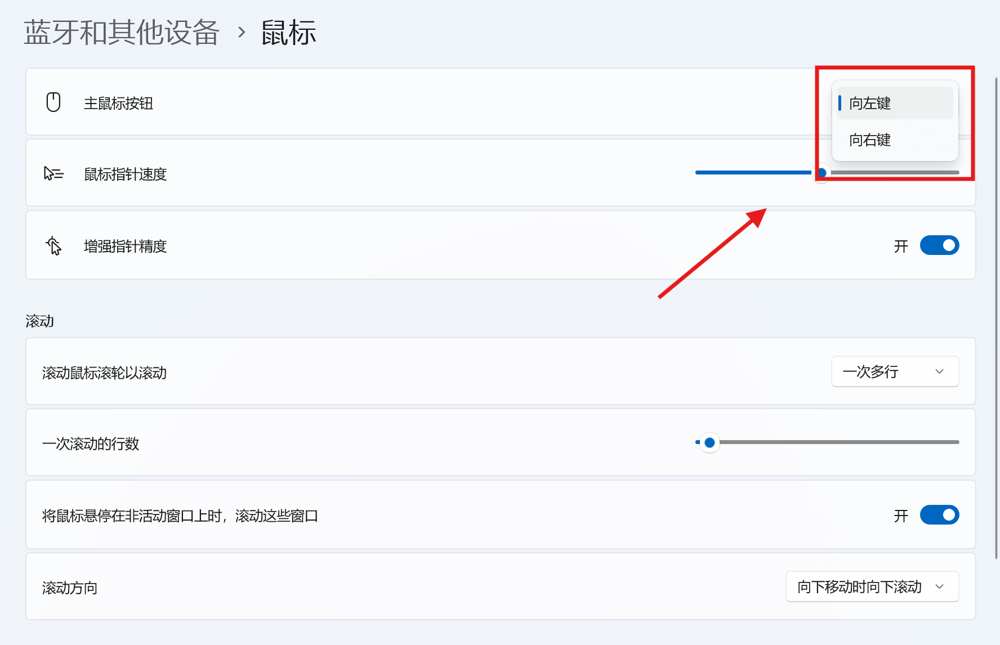
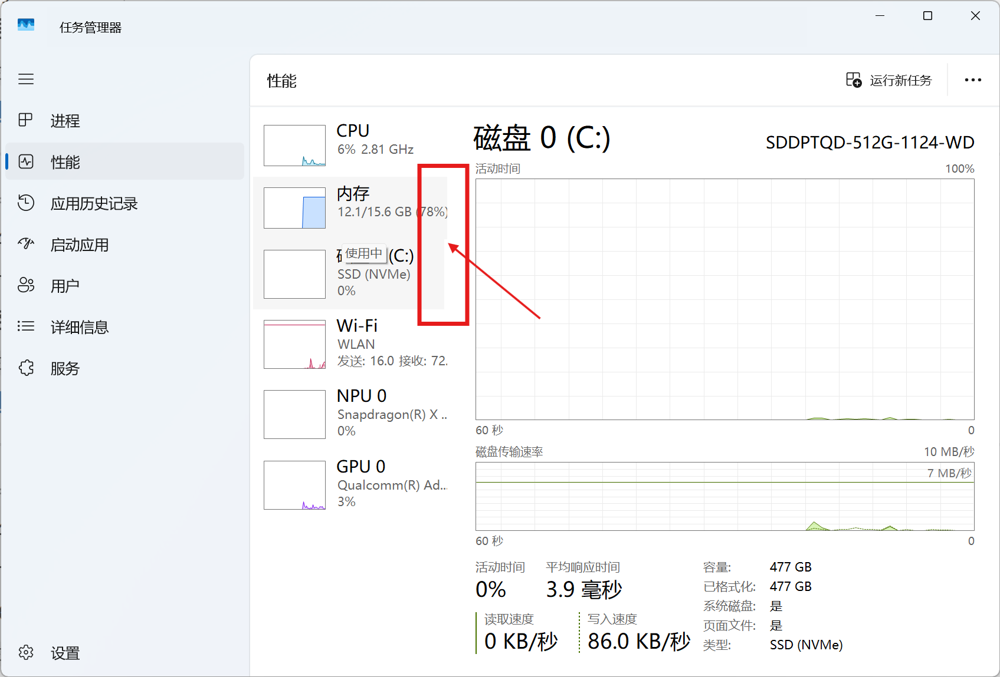
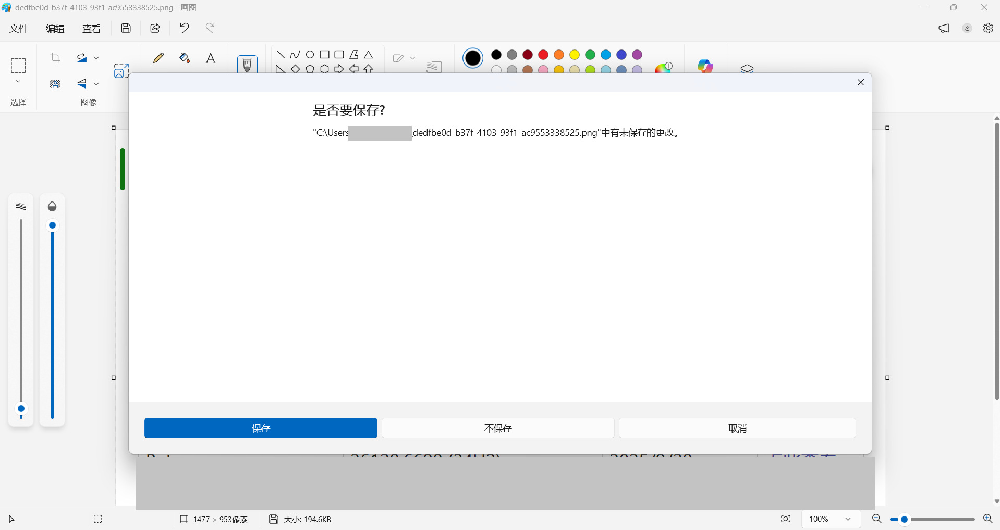

  

<h1 align="center">灵糕中心 (Linggao Hub)</h1>

[github.com/Lingggao/LGHUB](https://github.com/Lingggao/LGHUB) (GitHub)

&emsp;&emsp;**用于跟踪 “Windows 11 预览体验版本 (Canary 频道) 中哪些反馈正在由 Microsoft 调查、处理 / 已做出更改” 的信息枢纽**。由 2021 Windows Insider 最有价值专家 (MVP) · [**Ling Gao**](https://github.com/Lingggao) 先生管理。

&emsp;&emsp;灵糕中心成立于 2023 年 12 月 12 日，其前身可追溯至 2019 年 5 月 14 日由 Microsoft 社区创建的 “[\[BUG 汇总\] Windows 10 2019 年 5 月更新 (1903_18362) 已知问题与处理进度汇总](https://github.com/Lingggao/LGHUB/blob/main/Images/Inherited.png?raw=true)” 讨论话题。

> [!IMPORTANT]
>
> &emsp;灵糕中心为个人项目，管理者不是 Microsoft 公司员工，不能代表 Microsoft 公司立场、态度。本中心无意且无法代替 “反馈中心” (Feedback Hub) 应用的重要作用。本中心不提供 Microsoft 产品技术支持服务。本中心不接受有关 Windows 11 预览体验版本的反馈，用户应始终通过 “反馈中心” 应用提交。
>
> &emsp;Windows、Windows Insider Program 等是 Microsoft 公司的商标。

&emsp;&emsp;**宗旨**：独立管理、服务用户、信息精准、更新及时

[反馈中心](https://aka.ms/fbh) | [深入了解反馈](https://learn.microsoft.com/zh-cn/windows-insider/feedback) | [Flight Hub](https://learn.microsoft.com/en-us/windows-insider/flight-hub) | Windows 预览体验计划 - [网站](https://www.microsoft.com/zh-cn/windowsinsider) · [博客](https://blogs.windows.com/windows-insider) · [X](https://twitter.com/windowsinsider) · Microsoft 社区 ([中](https://learn.microsoft.com/zh-cn/answers/tags/953/windows-insider) / [英](https://learn.microsoft.com/en-us/answers/tags/953/windows-insider))

| 🎖️ **推荐** | **[WinDiscover](https://windiscover.com) - 独立 Microsoft 新闻网站** | **关注 [@Microsoft 信仰中心](https://weibo.com/u/3139784387) 微博** |
| :--------: | :----------------------------------------------------------: | :----------------------------------------------------------: |
|            |            [**LCZBlog**](https://blog.licaoz.com)            |       [**GuCATs'摸鱼站**](https://goo-aw233.github.io)       |

## 总览

| 😸 欢迎加入 [“Ling 的 Windows Insider 小屋”](https://teams.live.com/l/community/FEADGVjrvbHmT_d2Qg) Microsoft Teams 社区 😽 |
| :----------------------------------------------------------: |

| &emsp;&emsp;&emsp;&emsp;&emsp;&emsp;&emsp;&emsp;在 [Microsoft Lists](https://lghub01-my.sharepoint.com/:l:/g/personal/ling_lghub01_onmicrosoft_com/FClnGu07sUVIgSgS1Wokae4BWoMWWF76fu0nGw-ioJ5FSw) 中访问灵糕中心&emsp;&emsp;&emsp;&emsp;&emsp;&emsp;&emsp;&emsp; |
| :----------------------------------------------------------: |

上次更新时间：2025 年 10 月 14 日 23:00 (UTC+8)。Star 数量：55 ⭐

收录反馈 514 个，其中正在调查 34 个 (含[搁置](#3) 12 个)、正在处理 8 个、已修复 472 个。

反馈更新记录：**今日更新 LG509 - LG513**。- Ling 🌧️ [总览图](https://raw.githubusercontent.com/Lingggao/LGHUB/main/Images/Linggao%20Hub.png) | [反馈更新记录](Documents/Update_Feedback.md) | [平台更新记录](Documents/Update_Platform.md)

[**WIP Canary 27965 更新简报**](Canary.md) | [往期简报](Documents/Canary_Previous)

|         频道         |              最新版本               | 时间 (UTC+8) | 公告 |
| :------------------: | :---------------------------------: | :----------: | :------------------: |
|        Canary        |                27965                |  2025/10/9  | [aka.ms/wip27965](https://blogs.windows.com/windows-insider/2025/10/08/announcing-windows-11-insider-preview-build-27965-canary-channel) |
|       Dev        | 26220.6780 |   2025/10/11   | [aka.ms/wip-dev-10-10-25](https://blogs.windows.com/windows-insider/2025/10/10/announcing-windows-11-insider-preview-build-26220-6780-dev-channel) |
|         Beta         | 26120.6780 |   2025/10/11   | [aka.ms/wip-beta-10-10-25](https://blogs.windows.com/windows-insider/2025/10/10/announcing-windows-11-insider-preview-build-26120-6780-beta-channel) |
| Release Preview  | 26200.6718 |  2025/9/18  | [blogs.windows.com](https://blogs.windows.com/windows-insider/2025/09/12/releasing-windows-11-builds-26100-6713-and-26200-6713-to-the-release-preview-channel) |
| General Availability |    **[新]** 26200.6899    |  2025/10/15  | [support.microsoft.com](https://support.microsoft.com/en-us/help/5066835) |

统计图 - 2024 年 ([1 - 4 月](Images/Graph_2401_2404.png) · [5 - 8 月](Images/Graph_2405_2408.png) · [9 - 12 月](Images/Graph_2409_2412.png)) | 2025 年 ([1 - 4 月](Images/Graph_2501_2504.png) · [5 - 8 月](Images/Graph_2505_2508.png) · [9 - 12 月](Images/Graph_0.png))

---

> [!NOTE]
>
> &emsp;多数问题是仅有 1 - 2 位 Insiders 反馈的 “偶发性” 问题，而非所有人都会遇到的 “广泛性” 问题。请放心地更新 Windows 11 预览体验版本，不必担心新版使用体验过差。

|      编号       |                             问题                             |   状态   |
| :-------------: | :----------------------------------------------------------: | :------: |
|       ——        |              [**Canary - 公告已知问题**](#0) ▼               |    ——    |
| [LG504](#LG504) |   将文件从本地复制到网络共享驱动器时，文件资源管理器崩溃。   | 正在处理 |
| [LG507](#LG507) |  点击 “设置”>“系统”>“存储” 中的驱动器信息时，设置菜单崩溃。  | 正在处理 |
| [LG508](#LG508) |                媒体控件无法在锁定屏幕上显示。                | 正在处理 |
| [LG429](#LG429) |                      电脑无法正常关机。                      | 正在处理 |
| [LG496](#LG496) |                睡眠 / 待机功能无法正常工作。                 | 正在处理 |
|       ——        | [**Canary - 公告已知问题**](#0) ▲ \| ▼ [**Canary - 用户反馈问题**](#1) |    ——    |
|       ——        |        ***注**：长期未修复的问题收录于[搁置](#3)板块*        |    ——    |
| [LGH05](#LGH05) |              **[集合]** 多款游戏无法正常运行。               | 正在调查 |
| [LG424](#LG424) |      “设置”>“鼠标” 菜单中 “主鼠标按钮” 的选项翻译有误。      | 正在调查 |
| [LG427](#LG427) |          任务管理器 “性能” 页面中的选项卡无法对齐。          | 正在调查 |
| [LG449](#LG449) |        搜索栏打开时，切换输入法会导致任务栏图标溢出。        | 正在调查 |
| [LG451](#LG451) |               “更新并关机” 选项无法正常工作。                | 正在处理 |
| [LG457](#LG457) |           Microsoft Visio 应用窗口冻结 / 无响应。            | 正在处理 |
| [LG472](#LG472) |  “动态锁” 功能频繁激活蓝牙控制器，阻止电脑进入低功耗状态。   | 正在调查 |
| [LG482](#LG482) |                    电脑卡顿现象有所加重。                    | 正在调查 |
| [LG483](#LG483) | 安装华硕提供的 Intel 串行 I/O 驱动后，无法读取启用 VMD/IRST 的硬盘。 | 正在调查 |
| [LG485](#LG485) |      无法在 Hyper-V 中登录 Windows 10 增强会话虚拟机。       | 正在调查 |
| [LG486](#LG486) |           Hyper-V 虚拟机启动失败，显示 TPM 故障。            | 正在调查 |
| [LG488](#LG488) |              “画图” 应用的保存对话框变得巨大。               | 正在处理 |
| [LG490](#LG490) |       更新 Windows 后，已禁用的网络接口在设置中消失。        | 正在调查 |
| [LG500](#LG500) |                  Xbox 应用中的游戏栏崩溃。                   | 正在调查 |
| [LG501](#LG501) |             无法启动 Xbox Cloud Gaming 云游戏。              | 正在调查 |
| [LG502](#LG502) |   即使已关闭应用，更新记事本时仍会提示 “应用正在使用中”。    | 正在调查 |
| [LG503](#LG503) |         鼠标悬停提示可能挡住应用窗口的 “关闭” 按钮。         | 正在调查 |
| [LG505](#LG505) |  将文件从 C 盘复制 / 移动到其他盘符时，文件资源管理器崩溃。  | 正在调查 |
| [LG509](#LG509) |           **无法在小组件中登录 Microsoft 账户**。            | 正在调查 |
| [LG510](#LG510) |              **部分软件显示 0x800F080C 错误**。              | 正在调查 |
| [LG511](#LG511) |                **屏幕投影 (扩展) 功能卡顿**。                | 正在调查 |
| [LG512](#LG512) |            **“照片” 应用中的编辑功能无法使用**。             | 正在调查 |
| [LG513](#LG513) |                  **夜间模式无法自动关闭**。                  | 正在调查 |
|       ——        | [**Canary - 用户反馈问题**](#1) ▲ \| ▼ [**Canary - 归档 (已做出更改 0 - 7 天)**](#2) |    ——    |
| [LG460](#LG460) |           “电池限制” 功能在 Surface UEFI 中消失。            | 已修复 ✓ |
| [LG491](#LG491) |                      USB 端口无法使用。                      | 已修复 ✓ |
| [LG499](#LG499) |             任务栏无法隐藏，右下角托盘出现残留。             | 已修复 ✓ |
| [LG506](#LG506) |             重启电脑后，固定在任务栏的应用消失。             | 已修复 ✓ |
|       ——        | ***注**：部分未收录的问题详见 [WIP Canary 27965 更新简报](Canary.md)* |    ——    |
|       ——        |       ▲ [**Canary - 归档 (已做出更改 0 - 7 天)**](#2)        |    ——    |
|       ——        | [**Canary - 归档 (已做出更改 >7 天)**](7+.md) \| [**Canary - 搁置 (未做出更改)**](#3) |    ——    |

[分享反馈线索](https://forms.office.com/Pages/ResponsePage.aspx?id=DQSIkWdsW0yxEjajBLZtrQAAAAAAAAAAAAO__Q3sH7RUNjUyUzJLN0JBREZGMzBBVlpVOEVBQkRENy4u) | [反馈平台问题](https://forms.office.com/Pages/ResponsePage.aspx?id=DQSIkWdsW0yxEjajBLZtrQAAAAAAAAAAAAO__Q3sH7RUQ0haOElMVkxOWDE4U1pHQUZWMDhEM1gwSC4u)

## Canary - 公告已知问题

> [!TIP]
>
> &emsp;记录 [Windows Insider 博客](https://blogs.windows.com/windows-insider)中明确公开的已知问题。

---

编号：LG504  
日期：2025 年 10 月 5 日  
版本：Canary 27954 - 27965  
**问题**：**将文件从本地复制到网络共享驱动器时，文件资源管理器崩溃**。  
状态：  
典型反馈：[aka.ms/AAy5541](https://aka.ms/AAy5541)

---

编号：LG507  
日期：2025 年 10 月 9 日  
版本：Canary 27965  
**问题**：**点击 “设置”>“系统”>“存储” 中的驱动器信息时，设置菜单崩溃**。  
状态：

---

编号：LG508  
日期：2025 年 10 月 9 日  
版本：Canary 27965  
**问题**：**媒体控件无法在锁定屏幕上显示**。  
状态：

---

编号：LG429  
日期：2025 年 7 月 19 日  
版本：Canary 27891 - 27965  
**问题**：**电脑无法正常关机**。  
状态：  
典型反馈：[aka.ms/AAx2o1u](https://aka.ms/AAx2o1u) & [aka.ms/AAy553s](https://aka.ms/AAy553s)

---

编号：LG496  
日期：2025 年 9 月 29 日  
版本：Canary 27954 - 27965  
**问题**：**睡眠 / 待机功能无法正常工作**。  
状态：  
典型反馈：[aka.ms/AAy2t62](https://aka.ms/AAy2t62)

## Canary - 用户反馈问题

> [!TIP]
>
> &emsp;记录[反馈中心应用](https://aka.ms/fbh)中 Microsoft 明确响应的问题。

---

编号：LGH05  
日期：2025 年 9 月 9 日  
版本：Canary  
**集合**：**多款游戏无法正常运行**。  
状态：

**列表**

- PUBG - LG381 
- 守望先锋 2 (Overwatch 2) - LG400 
- NBA2K - LG410 

---

编号：LG424  
日期：2025 年 7 月 19 日  
版本：Canary 27902 - 27965  
**问题**：**“设置”>“鼠标” 菜单中 “主鼠标按钮” 的选项翻译有误**。  
状态：  
典型反馈：[aka.ms/AAx2o1o](https://aka.ms/AAx2o1o)

---

编号：LG427  
日期：2025 年 7 月 19 日  
版本：Canary 27902 - 27965  
**问题**：**任务管理器 “性能” 页面中的选项卡无法对齐**。  
状态：  
典型反馈：[aka.ms/AAx0xzj](https://aka.ms/AAx0xzj)

---

编号：LG449  
日期：2025 年 8 月 24 日  
版本：Canary 27928 - 27965  
**问题**：**搜索栏打开时，切换输入法会导致任务栏图标溢出**。  
状态：  
典型反馈：[aka.ms/AAxljuq](https://aka.ms/AAxljuq)

---

编号：LG451  
日期：2025 年 8 月 24 日  
版本：ALL  
**问题**：**“更新并关机” 选项无法正常工作**。  
状态：  
典型反馈：[aka.ms/AAxogk4](https://aka.ms/AAxogk4)

---

编号：LG457  
日期：2025 年 9 月 2 日  
版本：Canary 27934 - 27965  
**问题**：**Microsoft Visio 应用窗口冻结 / 无响应**。  
状态：  
典型反馈：[aka.ms/AAxoh9o](https://aka.ms/AAxoh9o) 

---

编号：LG472  
日期：2025 年 9 月 8 日  
版本：Canary 27934 - 27965  
**问题**：**“动态锁” 功能频繁激活蓝牙控制器，阻止电脑进入低功耗状态**。  
状态：  
典型反馈：[aka.ms/AAxuefp](https://aka.ms/AAxuefp)

---

编号：LG482  
日期：2025 年 9 月 13 日  
版本：Canary 27943 - 27965  
**问题**：**电脑卡顿现象有所加重**。  
状态：  
典型反馈：[aka.ms/AAxuckd](https://aka.ms/AAxuckd) & [aka.ms/AAyafln](https://aka.ms/AAyafln)

---

编号：LG483  
日期：2025 年 9 月 13 日  
版本：Canary 27938 - 27965  
**问题**：**安装华硕提供的 Intel 串行 I/O 驱动后，无法读取启用 VMD/IRST 的硬盘**。  
状态：  
典型反馈：[aka.ms/AAxxkpl](https://aka.ms/AAxxkpl)

---

编号：LG485  
日期：2025 年 9 月 19 日  
版本：Canary 27943 - 27965  
**问题**：**无法在 Hyper-V 中登录 Windows 10 增强会话虚拟机**。  
状态：  
典型反馈：[aka.ms/AAxz9zr](https://aka.ms/AAxz9zr)

---

编号：LG486  
日期：2025 年 9 月 19 日  
版本：Canary 27943 - 27965  
**问题**：**Hyper-V 虚拟机启动失败，显示 TPM 故障**。  
状态：  
典型反馈：[aka.ms/AAxzhl8](https://aka.ms/AAxzhl8)

---

编号：LG488  
日期：2025 年 9 月 23 日  
版本：ALL  
**问题**：**“画图” 应用的保存对话框变得巨大**。  
状态：  
典型反馈：[aka.ms/AAxzlfl](https://aka.ms/AAxzlfl)

---

编号：LG490  
日期：2025 年 9 月 23 日  
版本：Canary 27950 - 27965  
**问题**：**更新 Windows 后，已禁用的网络接口在设置中消失**。  
状态：  
典型反馈：[aka.ms/AAy1kn7](https://aka.ms/AAy1kn7)

---

编号：LG500  
日期：2025 年 10 月 5 日  
版本：ALL  
**问题**：**Xbox 应用中的游戏栏崩溃**。  
状态：  
典型反馈：[aka.ms/AAy553y](https://aka.ms/AAy553y)

---

编号：LG501  
日期：2025 年 10 月 5 日  
版本：ALL  
**问题**：**无法启动 Xbox Cloud Gaming 云游戏**。  
状态：  
典型反馈：[aka.ms/AAy5cvj](https://aka.ms/AAy5cvj)

---

编号：LG502  
日期：2025 年 10 月 5 日  
版本：ALL  
**问题**：**即使已关闭应用，更新记事本时仍会提示 “应用正在使用中”**。  
状态：  
典型反馈：[aka.ms/AAy5cuj](https://aka.ms/AAy5cuj)

---

编号：LG503  
日期：2025 年 10 月 5 日  
版本：Canary 27954 - 27965  
**问题**：**鼠标悬停提示可能挡住应用窗口的 “关闭” 按钮**。  
状态：  
典型反馈：[aka.ms/AAy5cul](https://aka.ms/AAy5cul)

---

编号：LG505  
日期：2025 年 10 月 5 日  
版本：Canary 27954 - 27965  
**问题**：**将文件从 C 盘复制 / 移动到其他盘符时，文件资源管理器崩溃**。  
状态：  
典型反馈：[aka.ms/AAy5klx](https://aka.ms/AAy5klx)

---

编号：LG509  
日期：2025 年 10 月 14 日  
版本：Canary 27965  
**问题**：**无法在小组件中登录 Microsoft 账户**。  
状态：  
典型反馈：[aka.ms/AAyafl8](https://aka.ms/AAyafl8) & [aka.ms/AAyan51](https://aka.ms/AAyan51) 

---

编号：LG510  
日期：2025 年 10 月 14 日  
版本：Canary 27965  
**问题**：**部分软件显示 0x800F080C 错误**。  
状态：  
Microsoft 官方回复：“从 Canary 27965 版本开始 .NET Framework 3.5 不再是 Windows 的可选组件。我们认为您遇到的错误与此有关。建议依赖旧版框架的客户迁移至现代 .NET 版本。若您运行的关键业务应用仍需依赖 .NET Framework 3.5，可在[此处](https://go.microsoft.com/fwlink/?linkid=2337635)获取独立安装程序。” *(Ling 译)*   
典型反馈：[aka.ms/AAyan55](https://aka.ms/AAyan55) & [aka.ms/AAya7tb](https://aka.ms/AAya7tb)

---

编号：LG511  
日期：2025 年 10 月 14 日  
版本：Canary 27965  
**问题**：**屏幕投影 (扩展) 功能卡顿**。  
状态：  
典型反馈：[aka.ms/AAyan5c](https://aka.ms/AAyan5c)

---

编号：LG512  
日期：2025 年 10 月 14 日  
版本：ALL  
**问题**：**“照片” 应用中的编辑功能无法使用**。  
状态：  
典型反馈：[aka.ms/AAyan5f](https://aka.ms/AAyan5f)

---

编号：LG513  
日期：2025 年 10 月 14 日  
版本：Canary 27965  
**问题**：**夜间模式无法自动关闭**。  
状态：  
典型反馈：[aka.ms/AAya7tp](https://aka.ms/AAya7tp)

## Canary - 归档 (已做出更改)

> [!TIP]
>
> &emsp;记录 Microsoft 已做出更改 0 - 7 天的问题 & 超过 14 天无新增赞成票的问题。
>
> &emsp;无特殊情况，问题归档后不再更新。

---

编号：LG460  
日期：2025 年 9 月 2 日  
版本：Canary 27934 - 27959  
**问题**：**“电池限制” 功能在 Surface UEFI 中消失**。  
状态：Canary 27965 -  - 已修复 ✓  
典型反馈：[aka.ms/AAxqzz0](https://aka.ms/AAxqzz0)

---

编号：LG491  
日期：2025 年 9 月 23 日  
版本：Canary 27950 - 27959  
**问题**：**USB 端口无法使用**。  
状态：Canary 27965 -  - 已修复 ✓  
典型反馈：[aka.ms/AAxzlfp](https://aka.ms/AAxzlfp)

---

编号：LG499  
日期：2025 年 10 月 5 日  
版本：Canary 27954 - 27959  
**问题**：**任务栏无法隐藏，右下角托盘出现残留**。  
状态：Canary 27965 -  - 已修复 ✓  
典型反馈：[aka.ms/AAy5klm](https://aka.ms/AAy5klm) 

---

编号：LG506  
日期：2025 年 10 月 5 日  
版本：Canary 27954 - 27959  
**问题**：**重启电脑后，固定在任务栏的应用消失**。  
状态：Canary 27965 -  - 已修复 ✓  
典型反馈：[aka.ms/AAy5klu](https://aka.ms/AAy5klu)

---

*部分未收录反馈详见 [WIP Canary 27965 更新简报](Canary.md)*

[Microsoft 已做出更改 >7 天的问题](7+.md)

## Canary - 搁置 (未做出更改)

> [!TIP]
>
> &emsp;并非所有软件缺陷都要修复。
>
> &emsp;已收录的反馈也可能因缺少资源、修复风险过大、商业决策调整等长期或永久不予修复。本板块记录 Microsoft 超过 90 天未修复的问题，中心将每间隔 30 天在 Canary 频道最新版本中进行测试。

[Microsoft 超过 90 天未修复的问题](90+.md)

---

[回到顶部](#HEAD)

  

在 “[署名 - 相同方式共享 4.0](https://creativecommons.org/licenses/by-sa/4.0/legalcode.zh-Hans)” 协议 (CC BY-SA 4.0) 之条款下提供。

2023 - 2025, [高楷修 (Ling Gao)](https://github.com/Lingggao), 灵糕中心 (Linggao Hub), [github.com/Lingggao/LGHUB](https://github.com/Lingggao/LGHUB)

[字体许可使用授权书](https://github.com/Lingggao/LGHUB/blob/main/Images/%E5%AD%97%E4%BD%93%E8%AE%B8%E5%8F%AF%E4%BD%BF%E7%94%A8%E6%8E%88%E6%9D%83%E4%B9%A6.png?raw=true) | [Windows Insider 最有价值专家](https://github.com/Lingggao/LGHUB/blob/main/Images/Windows%20Insider%20MVP.png?raw=true)