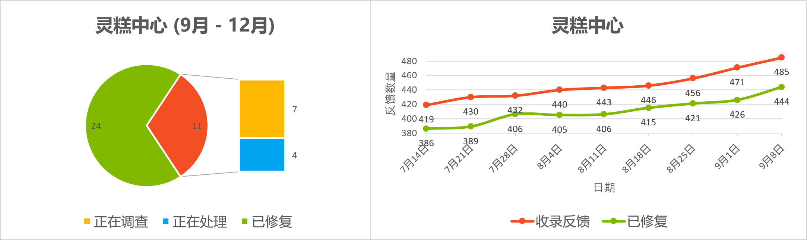
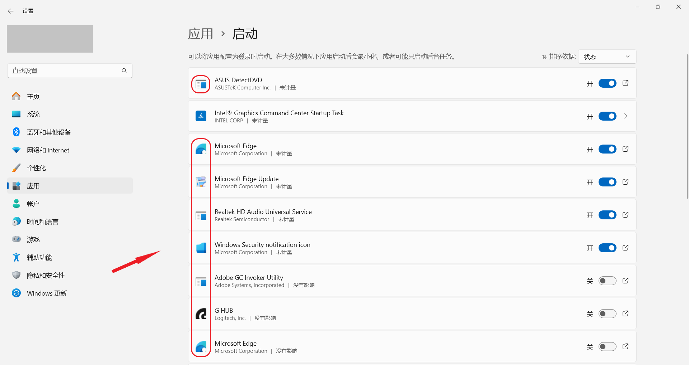

<SPAN ID = 'HEAD'/>

<div align="center">
 
</div>


<h1 align="center">灵糕中心 (Linggao Hub)</h1>

[github.com/Lingggao/LGHUB](https://github.com/Lingggao/LGHUB) (GitHub) & [lingggao.github.io/LGHUB](https://lingggao.github.io/LGHUB) (Pages)

&emsp;&emsp;用于跟踪 “**Windows 11 预览体验版本 (Canary 频道) 哪些反馈正在由 Microsoft 调查 / 处理 / 已做出更改**” 的信息枢纽。由 2021 Windows Insider Most Valuable Professional (MVP) · **Ling Gao** 先生管理。

> &emsp;**声明**：灵糕中心为个人项目，管理者不是 Microsoft 公司员工，不能代表 Microsoft 公司立场、态度。中心无意且无法代替 “反馈中心” (Feedback Hub) 应用的重要作用。中心不提供 Microsoft 产品技术支持服务。中心不接受有关 Windows 11 预览体验版本的反馈，用户应始终通过 “反馈中心” 应用提交。

> &emsp;Windows、Windows Insider Program 等是 Microsoft 公司的商标。

&emsp;&emsp;**宗旨**：独立管理、服务用户、信息精准、更新及时

[反馈中心](https://aka.ms/fbh) | [深入了解反馈](https://learn.microsoft.com/zh-cn/windows-insider/feedback) | [Flight Hub](https://learn.microsoft.com/en-us/windows-insider/flight-hub) | Windows 预览体验计划 - [网站](https://www.microsoft.com/zh-cn/windowsinsider) · [博客](https://blogs.windows.com/windows-insider) · [X (Twitter)](https://twitter.com/windowsinsider) · [社区](https://answers.microsoft.com/zh-hans/insider/forum)

## ✦ 总览 ✦

&emsp;&emsp;上次更新时间：2024 年 3 月 21 日 2:00 (UTC+8)。访问次数：1720+

&emsp;&emsp;收录反馈 126 个，其中正在调查 21 个、正在处理 8 个、已修复 97 个。

&emsp;&emsp;反馈更新目录：**今日更新 LG123 - 125**。- Ling 🌳 [总览图](https://raw.githubusercontent.com/Lingggao/LGHUB/main/Images/Linggao%20Hub.png) | [已修复图](https://raw.githubusercontent.com/Lingggao/LGHUB/main/Images/Linggao%20Hub_Fixed.png)

|     频道     |    最新版本    | 时间 (UTC+8) |                             公告                             |
| :----------: | :------------: | :----------: | :----------------------------------------------------------: |
| Canary & Dev | **[新]** 26085 |  2024/3/21   | [aka.ms/wip26085](https://blogs.windows.com/windows-insider/2024/03/20/announcing-windows-11-insider-preview-build-26085-canary-and-dev-channels) |
|     Beta     |   22635.3350   |  2024/3/14   | [aka.ms/wip-beta-3-13](https://blogs.windows.com/windows-insider/2024/03/13/announcing-windows-11-insider-preview-build-22635-3350-beta-channel) |



|      编号       |                             问题                             |   状态   |
| :-------------: | :----------------------------------------------------------: | :------: |
| [LG069](#LG069) |    安装 Canary 版本时可能自动回退，错误代码 0xC1900101。     | 正在处理 |
| [LG115](#LG115) |                右键菜单变为 Windows 10 样式。                | 正在处理 |
|     **——**      | [**Canary - 公告已知问题**](#0) **▲ \| ▼** [**Canary - 用户反馈问题**](#1) |  **——**  |
| [LG013](#LG013) |           “设置”>“应用”>“启动” 页面中的图标异常。            | 正在调查 |
| [LG015](#LG015) |      在文件资源管理器中按下两次 F11 后地址栏将被冻结。       | 正在调查 |
| [LG030](#LG030) | 在 Microsoft Store 中下载 Xbox Identity Provider 时显示 0x80073CFB 错误。 | 正在调查 |
| [LG088](#LG088) |       无法使用截图工具对开始菜单 / 右键菜单进行截图。        | 正在调查 |
| [LG111](#LG111) |  **[合并]** 任务视图 / 文件资源管理器卡顿或 CPU 占用率高。   | 正在处理 |
| [LGH01](#LGH01) | **[集合]** 仍有几款游戏在 Build 26080 中无法正常运行。(含列表) | 正在处理 |
| [LG122](#LG122) |                      Copilot 功能消失。                      | 正在调查 |
| [LG123](#LG123) |                 接收不到 Build 26080+ 更新。                 | 正在调查 |
| [LG125](#LG125) |         电脑风扇负荷更重 / 温度更高 / 电池续航更短。         | 正在调查 |
|     **——**      | [**Canary - 用户反馈问题**](#1) **▲ \| ▼** [**Canary - 归档 (已做出更改 0 - 28 天)**](#2) |  **——**  |
| [LG073](#LG073) |       **文件资源管理器的右键菜单可能丢失亚克力效果**。       | 已修复 ✓ |
| [LG083](#LG083) | **[合并]** **光标阴影 / 形状 / 颜色异常，光标随机消失 / 卡住**。 | 已修复 ✓ |
| [LG082](#LG082) |     **文件资源管理器右键菜单中的图标显示在错误的位置**。     | 已修复 ✓ |
| [LG113](#LG113) |               **sudo pwsh 命令无法正常执行**。               | 已修复 ✓ |
| [LG087](#LG087) |             **新版 Microsoft Teams 应用崩溃**。              | 已修复 ✓ |
| [LG116](#LG116) |                **电脑无法正常关机 / 睡眠**。                 | 已修复 ✓ |
| [LG119](#LG119) |      **文件夹中图片和视频的缩略图可能显示为黑色方块**。      | 已修复 ✓ |
| [LG124](#LG124) |          **电脑随机 IRQL_NOT_LESS_OR_EQUAL 绿屏**。          | 已修复 ✓ |
| [LG049](#LG049) | **事件查看器显示 DeviceSetupManager 元数据错误 (事件 131)**。 | 已修复 ✓ |
| [LG058](#LG058) | **在 Microsoft Store 更新 “快速助手” 应用时显示 0x80073CFB 错误**。 | 已修复 ✓ |
| [LG094](#LG094) |         **相机和 Studio Effects 可能无法正常工作**。         | 已修复 ✓ |
| [LG107](#LG107) |                 **笔记本电脑指纹模块失灵**。                 | 已修复 ✓ |
| [LG110](#LG110) |      **重启电脑后，桌面背景由 Windows 聚焦变为图片**。       | 已修复 ✓ |
| [LG117](#LG117) |              **任务栏应用缩略图无法正常显示**。              | 已修复 ✓ |
| [LG118](#LG118) |                **音量滑块可能无法正常使用**。                | 已修复 ✓ |
| [LG120](#LG120) |         **有大约 2.5GB - 3GB 的临时文件无法清理**。          | 已修复 ✓ |
| [LG121](#LG121) |          **任务栏 Windows 安全中心图标随机消失**。           | 已修复 ✓ |
|     **——**      |     ✦ [**Canary - 归档 (已做出更改 >28 天)**](28+.md) ✦      |  **——**  |

[**希望分享线索？联系 Ling。**](https://forms.office.com/Pages/ResponsePage.aspx?id=DQSIkWdsW0yxEjajBLZtrQAAAAAAAAAAAAO__Q3sH7RUNjUyUzJLN0JBREZGMzBBVlpVOEVBQkRENy4u) | [**反馈平台问题？联系 Ling。**](https://forms.office.com/Pages/ResponsePage.aspx?id=DQSIkWdsW0yxEjajBLZtrQAAAAAAAAAAAAO__Q3sH7RUQ0haOElMVkxOWDE4U1pHQUZWMDhEM1gwSC4u)

---

**标准格式**

```markdown
<SPAN ID = 'LGxxx'/>编号：LGxxx  
版本：Canary xxxxx  
**问题**：**xxxxx**  
状态：正在调查 / 正在处理 / 需要更多详细信息 / 所做的更改 / (其他)  
Microsoft 官方回复 (如果有)：xxxxx  
典型反馈 (如果有)：[aka.ms/AAxxxxx](https://aka.ms/fbh)  
图像等补充信息 (如果有)
```

[反馈更新记录](Documents/Update_Feedback.md) | [平台更新记录](Documents/Update_Platform.md)

<SPAN ID = '0'/>

## ✦ Canary - 公告已知问题 ✦

&emsp;&emsp;记录 [Windows Insider 博客](https://blogs.windows.com/windows-insider)中明确公开的已知问题。

---

<SPAN ID = 'LG069'/>编号：LG069  
版本：Canary 26058 - 26085  
**问题**：**安装 Canary 版本时可能自动回退，错误代码 0xC1900101**。  
状态：  
Microsoft 官方回复：“我们做了很多更改以帮助缓解回退现象，并将继续调查用户反馈。” *(Ling 译)*  
 

---

<SPAN ID = 'LG115'/>编号：LG115  
版本：Canary 26080 - 26085  
**问题**：**右键菜单变为 Windows 10 样式**。  
状态：  
典型反馈：[aka.ms/AApjkju](https://aka.ms/AApjkju) 

<SPAN ID = '1'/>

## ✦ Canary - 用户反馈问题 ✦

&emsp;&emsp;记录[反馈中心应用](https://aka.ms/fbh)中 Microsoft 明确响应的问题。

---

<SPAN ID = 'LG013'/>编号：LG013  
版本：Canary 26002 - 26080  
**问题**：**“设置”>“应用”>“启动” 页面中的图标异常**。  
状态：  
典型反馈：[aka.ms/AAo5wd6](https://aka.ms/AAo5wd6)



---

<SPAN ID = 'LG015'/>编号：LG015  
版本：Canary 25992 - 26080  
**问题**：**在文件资源管理器中按下两次 F11 后地址栏将被冻结**。  
状态：  
典型反馈：[aka.ms/AAnkkd6](https://aka.ms/AAnkkd6)

---

<SPAN ID = 'LG030'/>编号：LG030  
版本：Canary  
**问题**：**在 Microsoft Store 中下载 Xbox Identity Provider 时显示 0x80073CFB 错误**。  
状态：  
典型反馈：[aka.ms/AAlzfg7](https://aka.ms/AAlzfg7)

---

<SPAN ID = 'LG088'/>编号：LG088  
版本：ALL  
**问题**：**无法使用截图工具对开始菜单 / 右键菜单进行截图**。  
状态：  
典型反馈：[aka.ms/AAp5evo](https://aka.ms/AAp5evo)

---

<SPAN ID = 'LG111'/>编号：LG111  
版本：Canary 26063 - 26080  
**问题**：**任务视图 / 文件资源管理器卡顿或 CPU 占用率高**。  
状态：  
典型反馈：[aka.ms/AAph34g](https://aka.ms/AAph34g)

---

<SPAN ID = 'LGH01'/>编号：LGH01  
版本：Canary 26080  
**集合**：**仍有几款游戏在 Build 26080 中无法正常运行**。  
状态：   
Microsoft 官方回复：“大多数游戏应当可以在 Build 26080 中恢复正常运行。如果您在预览体验版本中玩游戏时发现任何问题，请务必在反馈中心提交。” *(Ling 译)* 

列表 (排名不分先后)

- Grand Theft Auto V (GTA 5) - [aka.ms/AApjkjp](https://aka.ms/AApjkjp)
- PUBG (绝地求生) - [aka.ms/AApjd7p](https://aka.ms/AApjd7p)
- Battlefield 2042 (战地风云 2042) - [aka.ms/AApjkk7](https://aka.ms/AApjkk7)
- EVE Online (星战前夜) - [aka.ms/AApjz1t](https://aka.ms/AApjz1t)
- Avatar Frontiers of Pandora (阿凡达：潘多拉边境) - [aka.ms/AApmqnc](https://aka.ms/AApmqnc)
- Assassin's Creed Origins (刺客信条：起源) - [aka.ms/AApmqnc](https://aka.ms/AApmqnc)

---

<SPAN ID = 'LG122'/>编号：LG122  
版本：Canary 26080  
**问题**：**Copilot 功能消失**。  
状态：  
典型反馈：[aka.ms/AApmcet](https://aka.ms/AApmcet)

---

<SPAN ID = 'LG123'/>编号：LG123  
版本：Canary  
**问题**：**接收不到 Build 26080+ 更新**。  
状态：  
典型反馈：[aka.ms/AApjbci](https://aka.ms/AApjbci)

---

<SPAN ID = 'LG125'/>编号：LG125  
版本：Canary 26080  
**问题**：**电脑风扇负荷更重 / 温度更高 / 电池续航更短**。  
状态：  
典型反馈：[aka.ms/AApmnl6](https://aka.ms/AApmnl6)

<SPAN ID = '2'/>

## ✦ Canary - 归档 (已做出更改) ✦

&emsp;&emsp;记录 Microsoft 已做出更改 0 - 28 天的问题 & 超过 30 日无新增赞成票的问题。

&emsp;&emsp;无特殊情况，问题归档后不再更新。

---

<SPAN ID = 'LG073'/>编号：LG073  
版本：Canary 26058 - 26080  
**问题**：**文件资源管理器的右键菜单可能丢失亚克力效果**。  
状态：Canary 26085 -  - 已修复 ✓  
Microsoft 官方回复：“此问题将在未来的版本中得到修复。” *(Ling 译)* 

---

<SPAN ID = 'LG083'/>编号：LG083  
版本：Canary 26058 - 26080  
**问题**：**光标阴影 / 形状 / 颜色异常，光标随机消失 / 卡住**。  
状态：Canary 26085 -  - 已修复 ✓  
Microsoft 官方回复：“Canary 26080 版本包含大量修复程序，有助于解决光标异常问题。” *(Ling 译)*  
  
典型反馈：[aka.ms/AAp4zrc](https://aka.ms/AAp4zrc)

---

<SPAN ID = 'LG082'/>编号：LG082  
版本：Canary 26058 - 26080  
**问题**：**文件资源管理器右键菜单中的图标显示在错误的位置**。  
状态：Canary 26085 -  - 已修复 ✓  
典型反馈：[aka.ms/AAp536r](https://aka.ms/AAp536r)

---

<SPAN ID = 'LG113'/>编号：LG113  
版本：Canary 26080  
**问题**：**sudo pwsh 命令无法正常执行**。  
状态：Canary 26085 -  - 已修复 ✓

---

<SPAN ID = 'LG087'/>编号：LG087  
版本：Canary 26040 - 26080  
**问题**：**新版 Microsoft Teams 应用崩溃**。  
状态：Canary 26085 -  - 已修复 ✓  
典型反馈：[aka.ms/AAp5inl](https://aka.ms/AAp5inl)

---

<SPAN ID = 'LG116'/>编号：LG116  
版本：Canary 26080  
**问题**：**电脑无法正常关机 / 睡眠**。  
状态：Canary 26085 -  - 已修复 ✓  
典型反馈：[aka.ms/AApjd80](https://aka.ms/AApjd80) 

---

<SPAN ID = 'LG119'/>编号：LG119  
版本：Canary 26080  
**问题**：**文件夹中图片和视频的缩略图可能显示为黑色方块**。  
状态：Canary 26085 -  - 已修复 ✓  
典型反馈：[aka.ms/AApkl32](https://aka.ms/AApkl32)

---

<SPAN ID = 'LG124'/>编号：LG124  
版本：Canary 26080  
**问题**：**电脑随机 IRQL_NOT_LESS_OR_EQUAL 绿屏**。  
状态：Canary 26085 -  - 已修复 ✓  
典型反馈：[aka.ms/AApmnko](https://aka.ms/AApmnko)

---

<SPAN ID = 'LG049'/>编号：LG049  
版本：Canary 26020 - 26080  
**问题**：**事件查看器显示 DeviceSetupManager 元数据错误 (事件 131)**。  
状态：Canary 26085 -  - 已修复 ✓  
典型反馈：[aka.ms/AAoipfs](https://aka.ms/AAoipfs)

---

<SPAN ID = 'LG058'/>编号：LG058  
版本：Canary 26040 - 26080  
**问题**：**在 Microsoft Store 更新 “快速助手” 应用时显示 0x80073CFB 错误**。  
状态：Canary 26085 -  - 已修复 ✓  
典型反馈：[aka.ms/AAov9fo](https://aka.ms/AAov9fo)

---

<SPAN ID = 'LG094'/>编号：LG094  
版本：Canary 26052 - 26080  
**问题**：**相机和 Studio Effects 可能无法正常工作**。  
状态：Canary 26085 -  - 已修复 ✓  
典型反馈：[aka.ms/AAp3q1v](https://aka.ms/AAp3q1v)

---

<SPAN ID = 'LG107'/>编号：LG107  
版本：Canary 26063 - 26080  
**问题**：**笔记本电脑指纹模块失灵**。  
状态：Canary 26085 -  - 已修复 ✓  
典型反馈：[aka.ms/AApe79t](https://aka.ms/AApe79t)

---

<SPAN ID = 'LG110'/>编号：LG110  
版本：Canary 26063 - 26080  
**问题**：**重启电脑后，桌面背景由 Windows 聚焦变为图片**。  
状态：Canary 26085 -  - 已修复 ✓  
典型反馈：[aka.ms/AApgw7x](https://aka.ms/AApgw7x)

---

<SPAN ID = 'LG117'/>编号：LG117  
版本：Canary 26080  
**问题**：**任务栏应用缩略图无法正常显示**。  
状态：Canary 26085 -  - 已修复 ✓  
典型反馈：[aka.ms/AApjd83](https://aka.ms/AApjd83)

---

<SPAN ID = 'LG118'/>编号：LG118  
版本：Canary 26080  
**问题**：**音量滑块可能无法正常使用**。  
状态：Canary 26085 -  - 已修复 ✓  
典型反馈：[aka.ms/AApjd8k](https://aka.ms/AApjd8k)

---

<SPAN ID = 'LG120'/>编号：LG120  
版本：Canary 26080  
**问题**：**有大约 2.5GB - 3GB 的临时文件无法清理**。  
状态：Canary 26085 -  - 已修复 ✓  
典型反馈：[aka.ms/AAplnvk](https://aka.ms/AAplnvk)

---

<SPAN ID = 'LG121'/>编号：LG121  
版本：Canary 26080  
**问题**：**任务栏 Windows 安全中心图标随机消失**。  
状态：Canary 26085 -  - 已修复 ✓  
典型反馈：[aka.ms/AApmjv6](https://aka.ms/AApmjv6)

[Microsoft 已做出更改 >28 天的问题](28+.md)

---

[回到顶部](#HEAD)

  

在 “[署名 - 相同方式共享 4.0](https://creativecommons.org/licenses/by-sa/4.0/legalcode.zh-Hans)” 协议 (CC BY-SA 4.0) 之条款下提供。

2023 - 2024, 高楷修 (Ling Gao), 灵糕中心 (Linggao Hub), [github.com/Lingggao/LGHUB](https://github.com/Lingggao/LGHUB)

[字体许可使用授权书](Images/字体许可使用授权书.png) | [](https://hits.seeyoufarm.com) (访问次数统计：今日 / 累计)