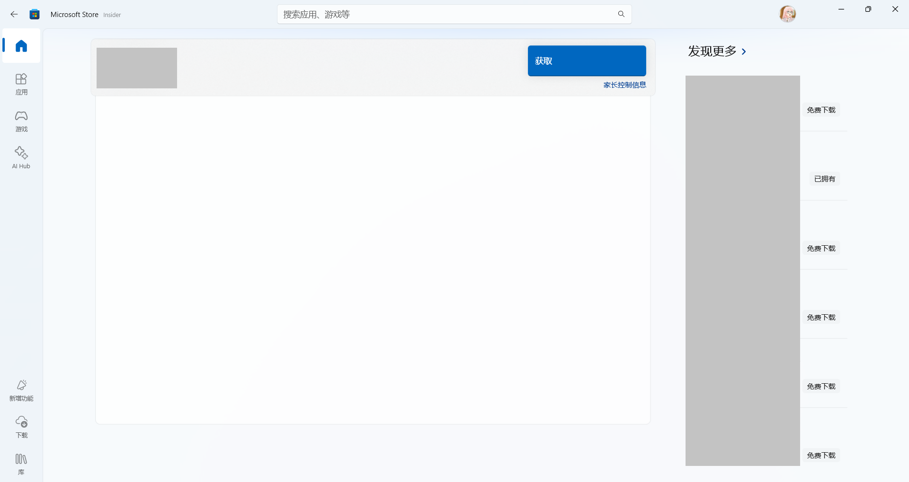

    

<h1 align="center">灵糕中心 (Linggao Hub)</h1>

[github.com/Lingggao/LGHUB](https://github.com/Lingggao/LGHUB) (GitHub)

&emsp;&emsp;**用于跟踪 “Windows 11 预览体验版本 (Canary 频道) 中哪些反馈正在由 Microsoft 调查、处理 / 已做出更改” 的信息枢纽**。由 2021 Windows Insider 最有价值专家 (MVP) · [**Ling Gao**](https://github.com/Lingggao) 先生管理。

&emsp;&emsp;灵糕中心成立于 2023 年 12 月 12 日，其前身可追溯至 2019 年 5 月 14 日由 Microsoft 社区创建的 “[\[BUG 汇总\] Windows 10 2019 年 5 月更新 (1903_18362) 已知问题与处理进度汇总](https://github.com/Lingggao/LGHUB/blob/main/Images/Inherited.png?raw=true)” 讨论话题。

> [!IMPORTANT]
>
> &emsp;灵糕中心为个人项目，管理者不是 Microsoft 公司员工，不能代表 Microsoft 公司立场、态度。本中心无意且无法代替 “反馈中心” (Feedback Hub) 应用的重要作用。本中心不提供 Microsoft 产品技术支持服务。本中心不接受有关 Windows 11 预览体验版本的反馈，用户应始终通过 “反馈中心” 应用提交。
>
> &emsp;Windows、Windows Insider Program 等是 Microsoft 公司的商标。

&emsp;&emsp;**宗旨**：独立管理、服务用户、信息精准、更新及时

[反馈中心](https://aka.ms/fbh) | [深入了解反馈](https://learn.microsoft.com/zh-cn/windows-insider/feedback) | [Flight Hub](https://learn.microsoft.com/en-us/windows-insider/flight-hub) | Windows 预览体验计划 - [网站](https://www.microsoft.com/zh-cn/windowsinsider) · [博客](https://blogs.windows.com/windows-insider) · [X](https://twitter.com/windowsinsider) · Microsoft 社区 ([中](https://learn.microsoft.com/zh-cn/answers/tags/953/windows-insider) / [英](https://learn.microsoft.com/en-us/answers/tags/953/windows-insider))

| 🎖️ **推荐** | **[WinDiscover](https://windiscover.com) - 独立 Microsoft 新闻网站** | **关注 [@Microsoft 信仰中心](https://weibo.com/u/3139784387) 微博** |
| :--------: | :----------------------------------------------------------: | :----------------------------------------------------------: |
|            |            [**LCZBlog**](https://blog.licaoz.com)            |       [**GuCATs'摸鱼站**](https://goo-aw233.github.io)       |

## 总览

| 😸 欢迎加入 [“Ling 的 Windows Insider 小屋”](https://teams.live.com/l/community/FEADGVjrvbHmT_d2RY) Microsoft Teams 社区 😽 |
| :----------------------------------------------------------: |

上次更新时间：2026 年 2 月 4 日 14:00 (UTC+8)。Star 数量：56 ⭐

收录反馈 550 个，其中正在调查 21 个 (含[搁置](#3) 13 个)、正在处理 3 个、已修复 526 个。

反馈更新记录：**今日无更新**。- Ling 😇 [总览图](https://raw.githubusercontent.com/Lingggao/LGHUB/main/Images/Linggao%20Hub.png) | [Microsoft Lists](https://lghub01-my.sharepoint.com/:l:/g/personal/ling_lghub_org/JAApZxrtO7FFSIEoEtVqJGnuAVqDFlhe-n7tJxsPoqCeRUs?e=S6HY0N) | [反馈更新记录](Documents/Update_Feedback.md) | [平台更新记录](Documents/Update_Platform.md)

[**WIP Canary 28020.1371 更新简报**](Canary.md) | [往期简报](Documents/Canary_Previous)

|         频道         |              最新版本               | 时间 (UTC+8) | 公告 |
| :------------------: | :---------------------------------: | :----------: | :------------------: |
|        Canary        |                28020.1495                |  2026/1/29  | [aka.ms/WIP-Canary-1-28-2026](https://blogs.windows.com/windows-insider/2026/01/28/announcing-windows-11-insider-preview-build-28020-1495-canary-channel) |
|       Dev        | **[新]** 26300.7733 |   2026/2/4   | [aka.ms/WIP-Dev-2-3-2026](https://blogs.windows.com/windows-insider/2026/02/03/announcing-windows-11-insider-preview-build-26300-7733-dev-channel) |
|         Beta         | **[新]** 26220.7752 |   2026/2/4   | [aka.ms/WIP-Beta-2-3-2026](https://blogs.windows.com/windows-insider/2026/02/03/announcing-windows-11-insider-preview-build-26220-7752-beta-channel) |
| Release Preview  | 26200.7701 |  2026/1/28  | [blogs.windows.com](https://blogs.windows.com/windows-insider/2026/01/27/releasing-windows-11-builds-26100-7701-and-26200-7701-to-the-release-preview-channel) |
| General Availability |    26200.7705    |  2026/1/30  | [support.microsoft.com](https://support.microsoft.com/en-us/help/5074105) |

统计图 - 2024 年 ([1 - 4 月](Images/Graph_2401_2404.png) · [5 - 8 月](Images/Graph_2405_2408.png) · [9 - 12 月](Images/Graph_2409_2412.png)) | 2025 年 ([1 - 4 月](Images/Graph_2501_2504.png) · [5 - 8 月](Images/Graph_2505_2508.png) · [9 - 12 月](Images/Graph_2509_2512.png))  
统计图 - 2026 年 ([1 - 4 月](Images/Graph_1.png) · 5 - 8 月 · 9 - 12 月)

---

> [!NOTE]
>
> &emsp;多数问题是仅有 1 - 2 位 Insiders 反馈的 “偶发性” 问题，而非所有人都会遇到的 “广泛性” 问题。请放心地更新 Windows 11 预览体验版本，不必担心新版使用体验过差。

|      编号       |                             问题                             |   状态   |
| :-------------: | :----------------------------------------------------------: | :------: |
|       ——        |              [**Canary - 公告已知问题**](#0) ▼               |    ——    |
| [LG549](#LG549) |            电脑桌面 Insider 水印显示错误的版本号             | 正在处理 |
|       ——        | [**Canary - 公告已知问题**](#0) ▲ \| ▼ [**Canary - 用户反馈问题**](#1) |    ——    |
|       ——        |        ***注**：长期未修复的问题收录于[搁置](#3)板块*        |    ——    |
| [LG429](#LG429) |                       电脑无法正常关机                       | 正在处理 |
| [LG496](#LG496) |                 睡眠 / 待机功能无法正常工作                  | 正在处理 |
| [LGH05](#LGH05) |               **[集合]** 多款游戏无法正常运行                | 正在调查 |
| [LG520](#LG520) |   使用 PIN 登录至 Windows 时，Hyper-V 增强会话无法正常工作   | 正在调查 |
| [LG531](#LG531) |     “媒体播放器” 应用的排序功能未合并汉语拼音与英文字母      | 正在调查 |
| [LG532](#LG532) |        开启节能模式后，Win32 应用的亚克力效果出现异常        | 正在调查 |
| [LG538](#LG538) |                “管理员保护” 功能导致设备冻结                 | 正在调查 |
| [LG541](#LG541) |              设置菜单 “主页” 性能异常、加载缓慢              | 正在调查 |
| [LG542](#LG542) |                  显示 UAC 界面时系统无响应                   | 正在调查 |
| [LG545](#LG545) |                     电脑开机启动速度变慢                     | 正在调查 |
|       ——        | [**Canary - 用户反馈问题**](#1) ▲ \| ▼ [**Canary - 归档 (已做出更改 0 - 7 天)**](#2) |    ——    |
| [LG527](#LG527) |       CrossDeviceService.exe (跨设备服务) 存在内存泄漏       | 已修复 ✓ |
| [LG534](#LG534) |          Windows 小组件的 WebView2 进程存在内存泄漏          | 已修复 ✓ |
| [LG536](#LG536) |                Dev-C++ 应用的文本显示出现错乱                | 已修复 ✓ |
| [LG540](#LG540) |          无法查看 Microsoft Store 中软件的全部评价           | 已修复 ✓ |
| [LG547](#LG547) |       任务管理器处于打开状态时，无法安全弹出 USB 设备        | 已修复 ✓ |
|       ——        | ***注**：部分未收录的问题详见 [WIP Canary 28020.1371 更新简报](Canary.md)* |    ——    |
|       ——        |       ▲ [**Canary - 归档 (已做出更改 0 - 7 天)**](#2)        |    ——    |
|       ——        | [**Canary - 归档 (已做出更改 >7 天)**](7+.md) \| [**Canary - 搁置 (未做出更改)**](#3) |    ——    |

[分享反馈线索](https://forms.office.com/Pages/ResponsePage.aspx?id=DQSIkWdsW0yxEjajBLZtrQAAAAAAAAAAAAO__Q3sH7RUNjUyUzJLN0JBREZGMzBBVlpVOEVBQkRENy4u) | [反馈平台问题](https://forms.office.com/Pages/ResponsePage.aspx?id=DQSIkWdsW0yxEjajBLZtrQAAAAAAAAAAAAO__Q3sH7RUQ0haOElMVkxOWDE4U1pHQUZWMDhEM1gwSC4u)

## Canary - 公告已知问题

> [!TIP]
>
> &emsp;记录 [Windows Insider 博客](https://blogs.windows.com/windows-insider)中明确公开的已知问题。

---

编号：LG549  
日期：2026 年 1 月 15 日  
版本：Canary 28020.1371  
**问题**：**电脑桌面 Insider 水印显示错误的版本号**  
状态：

## Canary - 用户反馈问题

> [!TIP]
>
> &emsp;记录[反馈中心应用](https://aka.ms/fbh)中 Microsoft 明确响应的问题。

---

编号：LG429  
日期：2025 年 7 月 19 日  
版本：Canary 27891 - 28020  
**问题**：**电脑无法正常关机**。  
状态：  
典型反馈：[aka.ms/AAx2o1u](https://aka.ms/AAx2o1u) & [aka.ms/AAy553s](https://aka.ms/AAy553s)

---

编号：LG496  
日期：2025 年 9 月 29 日  
版本：Canary 27954 - 28020  
**问题**：**睡眠 / 待机功能无法正常工作**。  
状态：  
典型反馈：[aka.ms/AAy2t62](https://aka.ms/AAy2t62)

---

编号：LGH05  
日期：2025 年 9 月 9 日  
版本：Canary  
**集合**：**多款游戏无法正常运行**。  
状态：

**列表**

- PUBG - LG381 
- 守望先锋 2 (Overwatch 2) - LG400 
- NBA2K - LG410 
- 使用 Easy Anti-Cheat 的游戏 - [aka.ms/AAtkikf](https://aka.ms/AAtkikf)

---

编号：LG520  
日期：2025 年 10 月 22 日  
版本：Canary 27971 - 28020  
**问题**：**使用 PIN 登录至 Windows 时，Hyper-V 增强会话无法正常工作**。  
状态：  
典型反馈：[aka.ms/AAybm47](https://aka.ms/AAybm47)

---

编号：LG531  
日期：2025 年 11 月 22 日  
版本：ALL  
**问题**：**“媒体播放器” 应用的排序功能未合并汉语拼音与英文字母**。  
状态：  
典型反馈：[aka.ms/AAymi1w](https://aka.ms/AAymi1w)

---

编号：LG532  
日期：2025 年 11 月 22 日  
版本：Canary 28000 - 28020  
**问题**：**开启节能模式后，Win32 应用的亚克力效果出现异常**。  
状态：  
典型反馈：[aka.ms/AAypm46](https://aka.ms/AAypm46)

---

编号：LG538  
日期：2025 年 11 月 22 日  
版本：Canary 28000 - 28020  
**问题**：**“管理员保护” 功能导致设备冻结**。  
状态：  
典型反馈：[aka.ms/AAyupuk](https://aka.ms/AAyupuk)

---

编号：LG541  
日期：2025 年 12 月 10 日  
版本：Canary 28000 - 28020  
**问题**：**设置菜单 “主页” 性能异常、加载缓慢**。  
状态：  
典型反馈：[aka.ms/AAz0q49](https://aka.ms/AAz0q49)

---

编号：LG542  
日期：2025 年 12 月 10 日  
版本：Canary 28000 - 28020  
**问题**：**显示 UAC 界面时系统无响应**。  
状态：  
典型反馈：[aka.ms/AAz0apf](https://aka.ms/AAz0apf)

---

编号：LG545  
日期：2025 年 12 月 10 日  
版本：Canary 28000 - 28020  
**问题**：**电脑开机启动速度变慢**。  
状态：  
典型反馈：[aka.ms/AAz0q4i](https://aka.ms/AAz0q4i)

## Canary - 归档 (已做出更改)

> [!TIP]
>
> &emsp;记录 Microsoft 已做出更改 0 - 7 天的问题 & 超过 14 天无新增赞成票的问题。
>
> &emsp;无特殊情况，问题归档后不再更新。

---

编号：LG527  
日期：2025 年 11 月 5 日  
版本：Canary 27975 - 28020  
**问题**：**CrossDeviceService.exe (跨设备服务) 存在内存泄漏**。  
状态：Canary 28020.1371 -  - 已修复 ✓  
典型反馈：[aka.ms/AAyjd7o](https://aka.ms/AAyjd7o)

---

编号：LG534  
日期：2025 年 11 月 22 日  
版本：Canary 28000 - 28020  
**问题**：**Windows 小组件的 WebView2 进程存在内存泄漏**。  
状态：Canary 28020.1371 -  - 已修复 ✓  
典型反馈：[aka.ms/AAyj6sv](https://aka.ms/AAyj6sv)

---

编号：LG536  
日期：2025 年 11 月 22 日  
版本：Canary 28000 - 28020  
**问题**：**Dev-C++ 应用的文本显示出现错乱**。  
状态：Canary 28020.1371 -  - 已修复 ✓  
典型反馈：[aka.ms/AAyui4r](https://aka.ms/AAyui4r)

---

编号：LG540  
日期：2025 年 12 月 10 日  
版本：ALL  
**问题**：**无法查看 Microsoft Store 中软件的全部评价**。  
状态：ALL -  - 已修复 ✓  
典型反馈：[aka.ms/AAz0iev](https://aka.ms/AAz0iev)

---

编号：LG547  
日期：2025 年 12 月 10 日  
版本：Canary 28000 - 28020  
**问题**：**任务管理器处于打开状态时，无法安全弹出 USB 设备**。  
状态：Canary 28020.1371 -  - 已修复 ✓  
典型反馈：[aka.ms/AAz0aq0](https://aka.ms/AAz0aq0)

---

*部分未收录反馈详见 [WIP Canary 28020.1371 更新简报](Canary.md)*

[Microsoft 已做出更改 >7 天的问题](7+.md)

## Canary - 搁置 (未做出更改)

> [!TIP]
>
> &emsp;并非所有软件缺陷都要修复。
>
> &emsp;已收录的反馈也可能因缺少资源、修复风险过大、商业决策调整等长期或永久不予修复。本板块记录 Microsoft 超过 90 天未修复的问题，中心将每间隔 30 天在 Canary 频道最新版本中进行测试。

[Microsoft 超过 90 天未修复的问题](90+.md)

---

[回到顶部](#HEAD)

  

在 “[署名 - 相同方式共享 4.0](https://creativecommons.org/licenses/by-sa/4.0/legalcode.zh-Hans)” 协议 (CC BY-SA 4.0) 之条款下提供。

2023 - 2026, [高楷修 (Ling Gao)](https://github.com/Lingggao), 灵糕中心 (Linggao Hub), [github.com/Lingggao/LGHUB](https://github.com/Lingggao/LGHUB)

[字体许可使用授权书](https://github.com/Lingggao/LGHUB/blob/main/Images/%E5%AD%97%E4%BD%93%E8%AE%B8%E5%8F%AF%E4%BD%BF%E7%94%A8%E6%8E%88%E6%9D%83%E4%B9%A6.png?raw=true) | [Windows Insider 最有价值专家](https://github.com/Lingggao/LGHUB/blob/main/Images/Windows%20Insider%20MVP.png?raw=true)