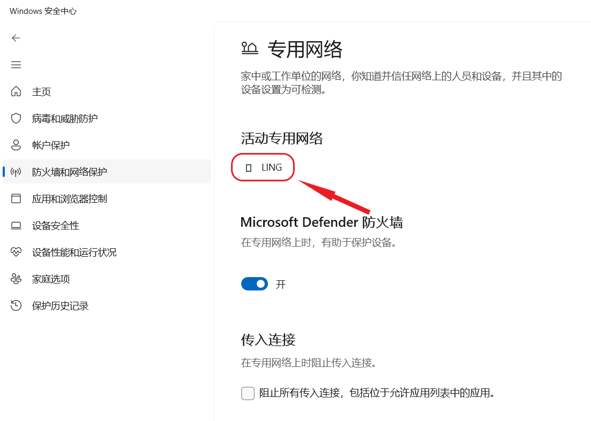
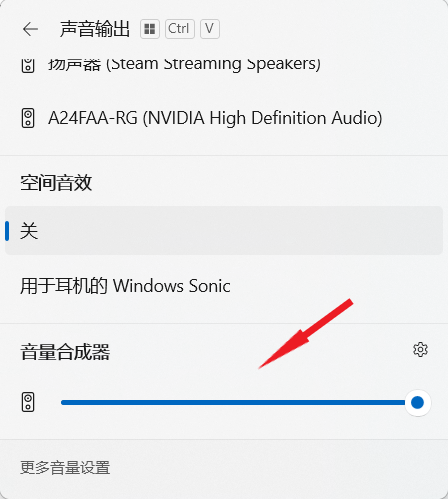

 

<h1 align="center">灵糕中心 (Linggao Hub)</h1>

[github.com/Lingggao/LGHUB](https://github.com/Lingggao/LGHUB) (GitHub) & [lingggao.github.io/LGHUB](https://lingggao.github.io/LGHUB) (Pages)

&emsp;&emsp;用于跟踪 “**Windows 11 预览体验版本 (Canary 频道) 哪些反馈正在由 Microsoft 调查 / 处理 / 已做出更改**” 的信息枢纽。由 2021 Windows Insider Most Valuable Professional (MVP) · **Ling Gao** 先生管理。

&emsp;&emsp;灵糕中心成立于 2023 年 12 月 12 日，其前身可追溯至 2019 年 5 月 14 日由 Microsoft 社区创建的 “[\[BUG 汇总\] Windows 10 2019 年 5 月更新 (1903_18362) 已知问题与处理进度汇总](https://answers.microsoft.com/zh-hans/insider/forum/all/bug-%E6%B1%87%E6%80%BBwindows-10-2019-%E5%B9%B4-5/252d0d6a-022c-4bf7-9976-55b57590aee2)” 讨论话题。

> &emsp;**声明**：灵糕中心为个人项目，管理者不是 Microsoft 公司员工，不能代表 Microsoft 公司立场、态度。中心无意且无法代替 “反馈中心” (Feedback Hub) 应用的重要作用。中心不提供 Microsoft 产品技术支持服务。中心不接受有关 Windows 11 预览体验版本的反馈，用户应始终通过 “反馈中心” 应用提交。

> &emsp;Windows、Windows Insider Program 等是 Microsoft 公司的商标。

&emsp;&emsp;**宗旨**：独立管理、服务用户、信息精准、更新及时

[反馈中心](https://aka.ms/fbh) | [深入了解反馈](https://learn.microsoft.com/zh-cn/windows-insider/feedback) | [Flight Hub](https://learn.microsoft.com/en-us/windows-insider/flight-hub) | Windows 预览体验计划 - [网站](https://www.microsoft.com/zh-cn/windowsinsider) · [博客](https://blogs.windows.com/windows-insider) · [X (Twitter)](https://twitter.com/windowsinsider) · [社区](https://answers.microsoft.com/zh-hans/insider/forum)

## ✦ 总览 ✦

&emsp;&emsp;上次更新时间：2024 年 4 月 12 日 2:00 (UTC+8)。访问次数：3040+

&emsp;&emsp;收录反馈 154 个，其中正在调查 16 个 (含搁置 4 个)、正在处理 6 个、已修复 132 个。

&emsp;&emsp;反馈更新记录：今日待更新。- Ling 😀 [总览图](https://raw.githubusercontent.com/Lingggao/LGHUB/main/Images/Linggao%20Hub.png) | [反馈更新记录](Documents/Update_Feedback.md) | [平台更新记录](Documents/Update_Platform.md)

|      频道       |        最新版本         | 时间 (UTC+8) |                             公告                             |
| :-------------: | :---------------------: | :----------: | :----------------------------------------------------------: |
|  Canary & Dev   |          26100          |   2024/4/4   | [aka.ms/wip26100](https://blogs.windows.com/windows-insider/2024/04/03/announcing-windows-11-insider-preview-build-26100-canary-and-dev-channels) |
|      Beta       |       22635.3430        |   2024/4/6   | [aka.ms/wip-beta-4-5](https://blogs.windows.com/windows-insider/2024/04/05/announcing-windows-11-insider-preview-build-22635-3430-beta-channel) |
| Release Preview | **[新]** 226(3/2)1.3520 |  2024/4/12   | [blogs.windows.com](https://blogs.windows.com/windows-insider/2024/04/11/releasing-windows-11-builds-22621-3520-and-22631-3520-to-the-release-preview-channel) |

|      编号       |                             问题                             |       状态       |
| :-------------: | :----------------------------------------------------------: | :--------------: |
| [LG123](#LG123) |                 接收不到 Build 26080+ 更新。                 |     正在处理     |
|     **——**      | [**Canary - 公告已知问题**](#0) **▲ \| ▼** [**Canary - 用户反馈问题**](#1) |      **——**      |
| [LG111](#LG111) |  **[合并]** 任务视图 / 文件资源管理器卡顿或 CPU 占用率高。   |     正在处理     |
| [LGH01](#LGH01) | **[集合]** 仍有一些游戏在 Build 26080+ 中无法正常运行。(含列表) |     正在处理     |
| [LG130](#LG130) |        更新 Windows 后，已禁用的音频设备被自动启用。         |     正在调查     |
| [LG139](#LG139) |     以 “禁用驱动程序强制签名” 选项启动 Windows 时崩溃。      |     正在调查     |
| [LG140](#LG140) |                 记事本应用崩溃 / 无法关闭。                  |     正在调查     |
| [LG142](#LG142) |      文件资源管理器导航窗格中的 OneDrive 随机变化位置。      |     正在调查     |
| [LGH02](#LGH02) |       **[集合]** 文件资源管理器中的软件缺陷。(含列表)        |     正在处理     |
| [LG144](#LG144) |            无法使用 Visual Studio 调试应用程序。             |     正在处理     |
| [LG145](#LG145) |          无法在 VMware Workstation 中开启 3D 加速。          |     正在处理     |
| [LG146](#LG146) |       无法连接蓝牙耳机 / 连接蓝牙耳机后无法播放音频。        |     正在调查     |
| [LG147](#LG147) |         Microsoft Family Safety 无法添加家庭组成员。         |     正在调查     |
| [LG148](#LG148) |            无法调整启动 “照片” 应用时窗口的大小。            |     正在调查     |
| [LG149](#LG149) |  Windows 安全中心 “防火墙和网络保护” 页面中的图标变为方块。  |     正在调查     |
| [LG150](#LG150) |                 无法使用 PIN 登录安全模式。                  |     正在调查     |
| [LG151](#LG151) |                    鼠标指针可能随机变大。                    |     正在调查     |
| [LG152](#LG152) |        **拖动音量合成器滑块时 “快速设置” 窗口崩溃**。        |     正在调查     |
| [LG153](#LG153) | **C:\Windows\Microsoft.NET\\... 配置解析器 0x80004005 错误**。 | 需要更多详细信息 |
|     **——**      | [**Canary - 用户反馈问题**](#1) **▲ \| ▼** [**Canary - 归档 (已做出更改 0 - 7 天)**](#2) |      **——**      |
| [LG116](#LG116) |                  电脑无法正常关机 / 睡眠。                   |     已修复 ✓     |
| [LG129](#LG129) | 在 Microsoft Store 和 Windows 更新页面下载时显示 0x80240067 错误。 |     已修复 ✓     |
|     **——**      | **✦** [**Canary - 归档 (已做出更改 >7 天)**](7+.md) **✦ \| ✦** [**Canary - 搁置 (未做出更改)**](#3) **✦** |      **——**      |

[**分享反馈线索**](https://forms.office.com/Pages/ResponsePage.aspx?id=DQSIkWdsW0yxEjajBLZtrQAAAAAAAAAAAAO__Q3sH7RUNjUyUzJLN0JBREZGMzBBVlpVOEVBQkRENy4u) | [**反馈平台问题**](https://forms.office.com/Pages/ResponsePage.aspx?id=DQSIkWdsW0yxEjajBLZtrQAAAAAAAAAAAAO__Q3sH7RUQ0haOElMVkxOWDE4U1pHQUZWMDhEM1gwSC4u) | [Microsoft Lists](https://lists.live.com/:l:/g/personal/6a1055bafb2c85fc/FI4wNqDXCfdMoWT2PA3N-24Bj0QUVzeZ_uoTZK14x21mrg?e=D97fY3) | [下载 CSV 文件](Documents/%E7%81%B5%E7%B3%95%E4%B8%AD%E5%BF%83%20(Linggao%20Hub).csv)

## ✦ Canary - 公告已知问题 ✦

&emsp;&emsp;记录 [Windows Insider 博客](https://blogs.windows.com/windows-insider)中明确公开的已知问题。

---

编号：LG123  
版本：ALL  
**问题**：**接收不到 Build 26080+ 更新**。  
状态：  
Microsoft 官方回复：“我们正在调查有关部分 Insider 卡在 26040 / 23620 版本的反馈。如果您迫切期望立即回到正轨，可使用最新 ISO 全新安装 Windows，然后重新加入 Canary 或 Dev 频道。” *(Ling 译)*  
  
典型反馈：[aka.ms/AApjbci](https://aka.ms/AApjbci)

## ✦ Canary - 用户反馈问题 ✦

&emsp;&emsp;记录[反馈中心应用](https://aka.ms/fbh)中 Microsoft 明确响应的问题。

---

编号：LG111  
版本：Canary 26063 - 26100  
**问题**：**任务视图 / 文件资源管理器卡顿或 CPU 占用率高**。  
状态：  
典型反馈：[aka.ms/AAph34g](https://aka.ms/AAph34g)

---

编号：LGH01  
版本：Canary 26080 - 26100  
**集合**：**仍有一些游戏在 Build 26080+ 中无法正常运行**。  
状态：  
Microsoft 官方回复：“大多数游戏应当可以在 Build 26080 中恢复正常运行。如果您在预览体验版本中玩游戏时发现任何问题，请务必在反馈中心提交。” *(Ling 译)* 

列表 (排名不分先后)

- Grand Theft Auto V (GTA 5) - [aka.ms/AApjkjp](https://aka.ms/AApjkjp)
- PUBG (绝地求生) - [aka.ms/AApjd7p](https://aka.ms/AApjd7p)
- Battlefield 2042 (战地风云 2042) - [aka.ms/AApjkk7](https://aka.ms/AApjkk7)
- EVE Online (星战前夜) - [aka.ms/AApjz1t](https://aka.ms/AApjz1t)
- Avatar Frontiers of Pandora (阿凡达：潘多拉边境) - [aka.ms/AApmqnc](https://aka.ms/AApmqnc)
- Assassin's Creed Origins (刺客信条：起源) - [aka.ms/AApmqnc](https://aka.ms/AApmqnc)
- Electronic Arts (EA) 旗下游戏 - [aka.ms/AApsxln](https://aka.ms/AApsxln)
- It Takes Two (双人成行) - [aka.ms/AApqr1c](https://aka.ms/AApqr1c)
- Watch Dogs: Legion (看门狗：军团) - [aka.ms/AApr6d6](https://aka.ms/AApr6d6)
- FARCRY 6/5 (孤岛惊魂 6/5) - [aka.ms/AApr6d6](https://aka.ms/AApr6d6)

---

编号：LG130  
版本：Canary 26085 - 26100  
**问题**：**更新 Windows 后，已禁用的音频设备被自动启用**。  
状态：  
典型反馈：[aka.ms/AApsxmc](https://aka.ms/AApsxmc)

---

编号：LG139  
日期：2024 年 4 月 2 日  
版本：Canary 26090 - 26100  
**问题**：**以 “禁用驱动程序强制签名” 选项启动 Windows 时崩溃**。  
状态：  
典型反馈：[aka.ms/AApv3y2](https://aka.ms/AApv3y2)

---

编号：LG140  
日期：2024 年 4 月 2 日  
版本：Canary 26090 - 26100  
**问题**：**记事本应用崩溃 / 无法关闭**。  
状态：  
典型反馈：[aka.ms/AApuzi9](https://aka.ms/AApuzi9)

---

编号：LG142  
日期：2024 年 4 月 5 日  
版本：Canary 26100  
**问题**：**文件资源管理器导航窗格中的 OneDrive 随机变化位置**。  
状态：  
典型反馈：[aka.ms/AApxwbw](https://aka.ms/AApxwbw)

---

编号：LGH02  
日期：2024 年 4 月 7 日  
版本：Canary 26100  
**集合**：**文件资源管理器中的软件缺陷**。  
状态：

列表 (排名不分先后)

- 卡顿 / 严重卡顿
- 内存泄漏
- CPU 占用率高
- 切换 “项目复选框” 选项时出现异常 - [aka.ms/AApydtm](https://aka.ms/AApydtm)
- 缩放设定为 175% 时图标模糊不清 - [aka.ms/AApytl6](https://aka.ms/AApytl6)
- 菜单中的文本可能过长 - [aka.ms/AApyuo4](https://aka.ms/AApyuo4)
- 出现多个地址栏 / 搜索栏 - [aka.ms/AApymuw](https://aka.ms/AApymuw)

---

编号：LG144  
日期：2024 年 4 月 7 日  
版本：Canary 26100  
**问题**：**无法使用 Visual Studio 调试应用程序**。  
状态：  
典型反馈：[aka.ms/AApyec1](https://aka.ms/AApyec1)

---

编号：LG145  
日期：2024 年 4 月 7 日  
版本：Canary 26100  
**问题**：**无法在 VMware Workstation 中开启 3D 加速**。  
状态：  
典型反馈：[aka.ms/AApyec1](https://aka.ms/AApyec1)

---

编号：LG146  
日期：2024 年 4 月 10 日  
版本：Canary 26100  
**问题**：**无法连接蓝牙耳机 / 连接蓝牙耳机后无法播放音频**。  
状态：  
典型反馈：[aka.ms/AApz29f](https://aka.ms/AApz29f) & [aka.ms/AApz29h](https://aka.ms/AApz29h)

---

编号：LG147  
日期：2024 年 4 月 10 日  
版本：ALL  
**问题**：**Microsoft Family Safety 无法添加家庭组成员**。  
状态：  
典型反馈：[aka.ms/AApzoge](https://aka.ms/AApzoge)

---

编号：LG148  
日期：2024 年 4 月 10 日  
版本：ALL  
**问题**：**无法调整启动 “照片” 应用时窗口的大小**。  
状态：  
典型反馈：[aka.ms/AApztdn](https://aka.ms/AApztdn)

---

编号：LG149  
日期：2024 年 4 月 10 日  
版本：Canary 26100  
**问题**：**Windows 安全中心 “防火墙和网络保护” 页面中的图标变为方块**。  
状态：  
典型反馈：[aka.ms/AApy8i2](https://aka.ms/AApy8i2)

---

编号：LG150  
日期：2024 年 4 月 10 日  
版本：Canary 26100  
**问题**：**无法使用 PIN 登录安全模式**。  
状态：  
典型反馈：[aka.ms/AApyjss](https://aka.ms/AApyjss)

---

编号：LG151  
日期：2024 年 4 月 10 日  
版本：Canary 26100  
**问题**：**鼠标指针可能随机变大**。  
状态：  
典型反馈：[aka.ms/AApzunq](https://aka.ms/AApzunq)

---

编号：LG152  
日期：2024 年 4 月 11 日  
版本：Canary 26100  
**问题**：**拖动音量合成器滑块时 “快速设置” 窗口崩溃**。  
状态：  
典型反馈：[aka.ms/AAq0phj](https://aka.ms/AAq0phj)

---

编号：LG153  
日期：2024 年 4 月 11 日  
版本：Canary 26100  
**问题**：**C:\Windows\Microsoft.NET\\... 配置解析器 0x80004005 错误**。  
状态：  
Microsoft 官方回复：“请参照下方的步骤分享更多日志信息。” *(Ling 译)*   
典型反馈：[aka.ms/AApy7yg](https://aka.ms/AApy7yg)

步骤

1. 转到 [aka.ms/vscollect](https://aka.ms/vscollect) 下载 collect.exe。
2. 此程序将创建 %TEMP%\vslogs.zip 压缩文件，包含所有 VS 和 .NET 日志。
3. 将 vslogs.zip 上传至反馈中心。
4. 将以下文件保存至 config.zip 压缩文件：
   - %windir%\Microsoft.NET\Framework\v4.0.30319\config\machine.config
   - %windir%\Microsoft.NET\Framework64\v4.0.30319\config\machine.config
   - %windir%\Microsoft.NET\Framework\v4.0.30319\config\web.config
   - %windir%\Microsoft.NET\Framework64\v4.0.30319\config\web.config
5. 将 config.zip 上传至反馈中心。
6. 请在评论中告诉我们：
   - 错误信息何时出现？
   - 错误信息与哪个应用有关？

## ✦ Canary - 归档 (已做出更改) ✦

&emsp;&emsp;记录 Microsoft 已做出更改 0 - 7 天的问题 & 超过 14 天无新增赞成票的问题。

&emsp;&emsp;无特殊情况，问题归档后不再更新。

---

编号：LG116  
版本：Canary 26080 - 26090  
**问题**：**电脑无法正常关机 / 睡眠**。  
状态：Canary 26100 -  - 已修复 ✓  
Microsoft 官方回复：“不幸的是，我们看到一些反馈称 Build 26085+ 版本中仍然存在这一问题。我们正在努力修复，请暂时使用 shutdown -t 0 -s 命令关机。” *(Ling 译)*   
典型反馈：[aka.ms/AApjd80](https://aka.ms/AApjd80)

---

编号：LG129  
版本：Canary 26085 - 26090  
**问题**：**在 Microsoft Store 和 Windows 更新页面下载时显示 0x80240067 错误**。  
状态：Canary 26100 -  - 已修复 ✓  
典型反馈：[aka.ms/AApqooc](https://aka.ms/AApqooc)

[Microsoft 已做出更改 >7 天的问题](7+.md)

## ✦ Canary - 搁置 (未做出更改) ✦

&emsp;&emsp;“并非所有软件缺陷都要修复。” —— Ron Patton (出自《软件测试》)

&emsp;&emsp;已收录的反馈也可能因缺少资源、修复风险过大、商业决策调整等长期或永久不予修复。本板块记录 Microsoft 超过 90 天未修复的问题，中心将每间隔 30 天在 Canary 频道最新版本中进行测试。

[Microsoft 超过 90 天未修复的问题](90+.md)

---

[回到顶部](#HEAD)

  

在 “[署名 - 相同方式共享 4.0](https://creativecommons.org/licenses/by-sa/4.0/legalcode.zh-Hans)” 协议 (CC BY-SA 4.0) 之条款下提供。

2023 - 2024, 高楷修 (Ling Gao), 灵糕中心 (Linggao Hub), [github.com/Lingggao/LGHUB](https://github.com/Lingggao/LGHUB)

[字体许可使用授权书](Images/字体许可使用授权书.png) |  (访问次数统计：今日 / 累计)