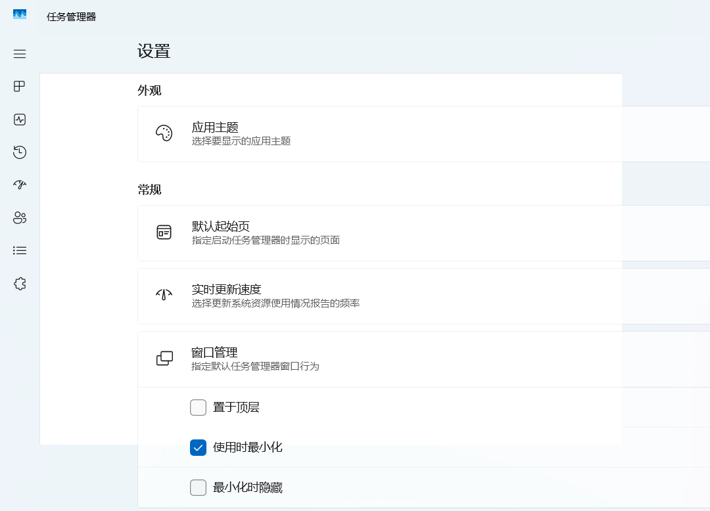
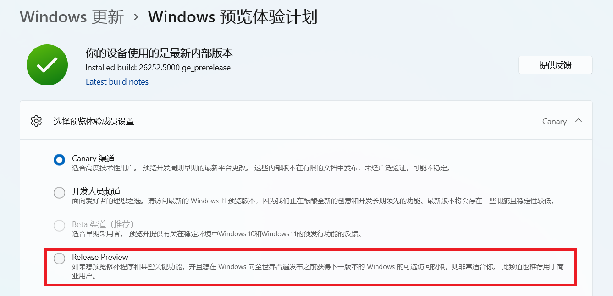
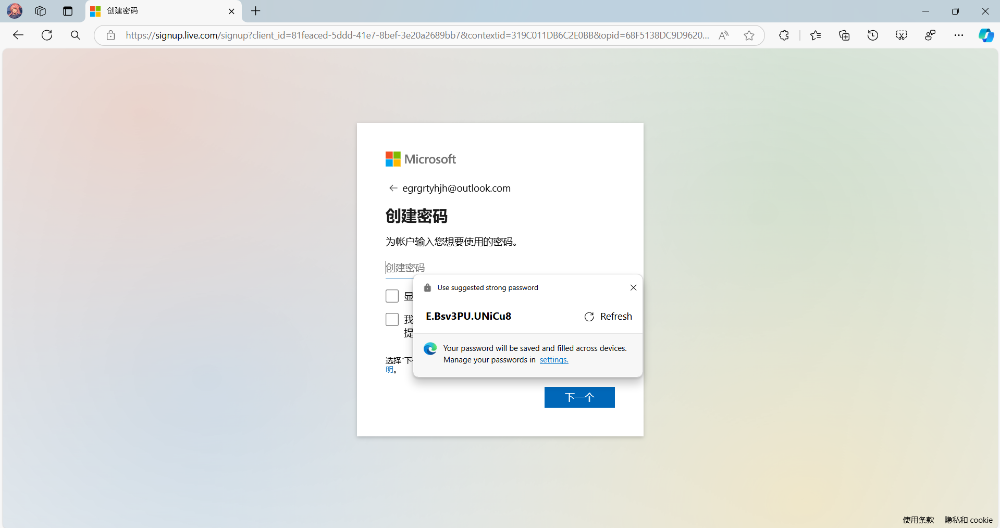
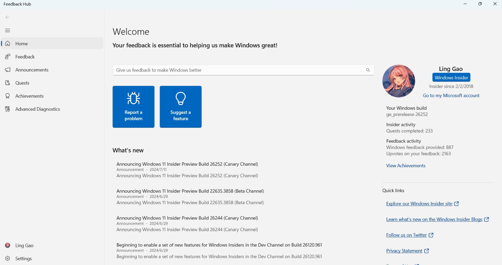
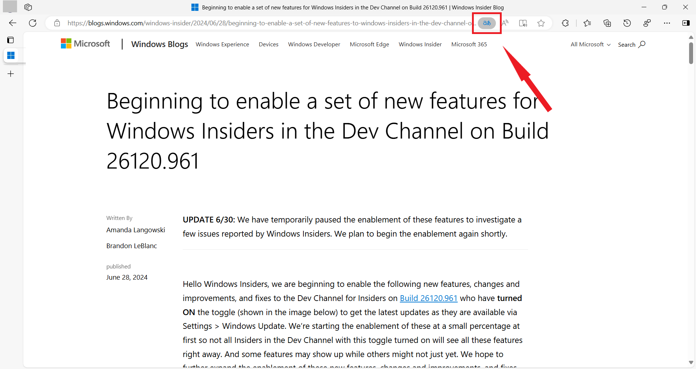
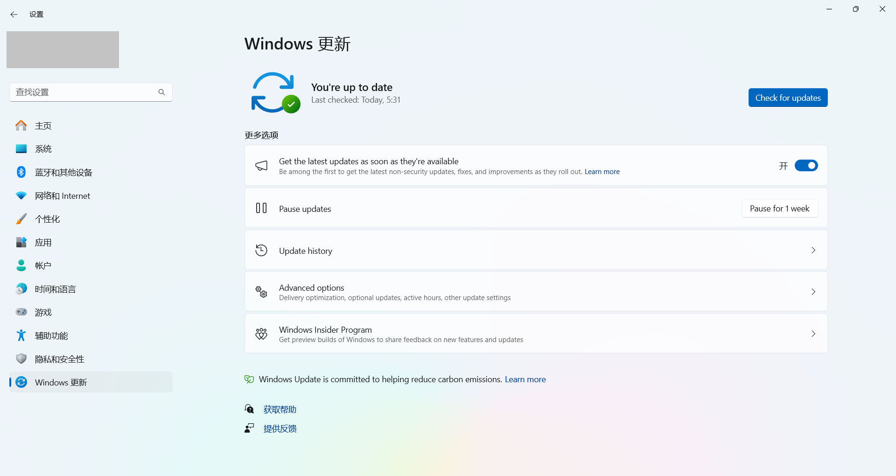
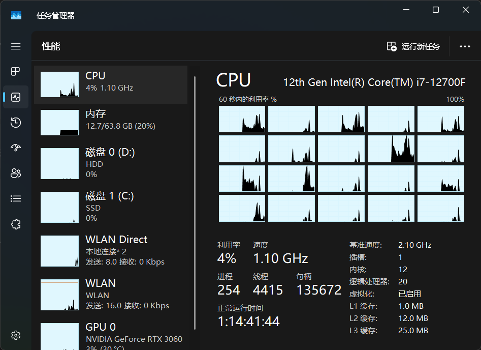

 

<h1 align="center">灵糕中心 (Linggao Hub)</h1>

[github.com/Lingggao/LGHUB](https://github.com/Lingggao/LGHUB) (GitHub) & [lingggao.github.io/LGHUB](https://lingggao.github.io/LGHUB) (Pages)

&emsp;&emsp;**用于跟踪 “Windows 11 预览体验版本 (Canary 频道) 哪些反馈正在由 Microsoft 调查 / 处理 / 已做出更改” 的信息枢纽**。由 2021 Windows Insider Most Valuable Professional (MVP) · **Ling Gao** 先生管理。

&emsp;&emsp;灵糕中心成立于 2023 年 12 月 12 日，其前身可追溯至 2019 年 5 月 14 日由 Microsoft 社区创建的 “[\[BUG 汇总\] Windows 10 2019 年 5 月更新 (1903_18362) 已知问题与处理进度汇总](https://answers.microsoft.com/zh-hans/insider/forum/all/bug-%E6%B1%87%E6%80%BBwindows-10-2019-%E5%B9%B4-5/252d0d6a-022c-4bf7-9976-55b57590aee2)” 讨论话题。

> [!IMPORTANT]
>
> &emsp;灵糕中心为个人项目，管理者不是 Microsoft 公司员工，不能代表 Microsoft 公司立场、态度。中心无意且无法代替 “反馈中心” (Feedback Hub) 应用的重要作用。中心不提供 Microsoft 产品技术支持服务。中心不接受有关 Windows 11 预览体验版本的反馈，用户应始终通过 “反馈中心” 应用提交。
>
> &emsp;Windows、Windows Insider Program 等是 Microsoft 公司的商标。

&emsp;&emsp;**宗旨**：独立管理、服务用户、信息精准、更新及时

[反馈中心](https://aka.ms/fbh) | [深入了解反馈](https://learn.microsoft.com/zh-cn/windows-insider/feedback) | [Flight Hub](https://learn.microsoft.com/en-us/windows-insider/flight-hub) | Windows 预览体验计划 - [网站](https://www.microsoft.com/zh-cn/windowsinsider) · [博客](https://blogs.windows.com/windows-insider) · [X](https://twitter.com/windowsinsider) · Microsoft 社区 ([中](https://answers.microsoft.com/zh-hans/insider/forum) / [英](https://answers.microsoft.com/en-us/insider/forum))

## ✦ 总览 ✦

&emsp;&emsp;上次更新时间：2024 年 7 月 23 日 7:00 (UTC+8)。访问次数：4970+

&emsp;&emsp;收录反馈 201 个，其中正在调查 15 个 (含[搁置](#3) 4 个)、正在处理 3 个、已修复 183 个。

&emsp;&emsp;反馈更新记录：**今日更新 LG199 - 200**。- Ling 😎 [总览图](https://raw.githubusercontent.com/Lingggao/LGHUB/main/Images/Linggao%20Hub.png) | [反馈更新记录](Documents/Update_Feedback.md) | [平台更新记录](Documents/Update_Platform.md)

|  🎖️ **推 荐**   | **[Microsoft 电脑管家](https://pcmanager.microsoft.com) - 简单无打扰 · 安全又安心** | **[Microsoft WowTab](https://wowtab.microsoft.com) - 浏览器主页新形态** |
| :------------: | :----------------------------------------------------------: | :----------------------------------------------------------: |
|                | **Windows 预览体验计划 - [版本信息与实用链接](https://answers.microsoft.com/zh-hans/insider/forum/all/windows/2a5add38-c6d9-4c9d-958d-7451f7632b1c)** |                                                              |
| 🏅 **友情推荐** | **[WinDiscover](https://windiscover.com) - 独立 Microsoft 新闻博客** | **欢迎关注 [@Microsoft 信仰中心](https://weibo.com/u/3139784387) 微博** |
|                | **[Windows Up-to-Date](https://wutd.crrashh.com) - Windows 实时版本** |                                                              |

|         频道         |              最新版本               | 时间 (UTC+8) |                             公告                             |
| :------------------: | :---------------------------------: | :----------: | :----------------------------------------------------------: |
|        Canary        |                26252                |  2024/7/11  | [aka.ms/wip26252](https://blogs.windows.com/windows-insider/2024/07/10/announcing-windows-11-insider-preview-build-26252-canary-channel) |
|         Dev          |              26120.1252 (24H2)              |   2024/7/16   | [aka.ms/wip-dev-7-15](https://blogs.windows.com/windows-insider/2024/07/15/announcing-windows-11-insider-preview-build-26120-1252-dev-channel) |
|         Beta         | **[新]** 22635.3936 *(23H2)* |   2024/7/23   | [aka.ms/wip-beta-7-22](https://blogs.windows.com/windows-insider/2024/07/22/announcing-windows-11-insider-preview-build-22635-3936-beta-channel) |
|   Release Preview    | 26100.1150 (24H2) |  2024/7/10  | [support.microsoft.com](https://support.microsoft.com/zh-cn/topic/2024-%E5%B9%B4-7-%E6%9C%88-9-%E6%97%A5-kb5040435-os-%E5%86%85%E9%83%A8%E7%89%88%E6%9C%AC-26100-1150-954078e3-6c6b-4b6d-885e-f5aa534524a6?wt.mc_id=studentamb_203301) |
| General Availability |    22631.3880 *(23H2)*    |  2024/7/10  | [support.microsoft.com](https://support.microsoft.com/zh-cn/topic/2024-%E5%B9%B4-7-%E6%9C%88-9-%E6%97%A5-kb5040442-os-%E5%86%85%E9%83%A8%E7%89%88%E6%9C%AC-22621-3880-%E5%92%8C-22631-3880-0864308e-61cc-413b-8194-0294331aba52) |

统计图 - 2024 年 | [1 月 - 4 月](Images/Graph_2401_2404.png) · [5 月 - 8 月](Images/Graph_1.png) · [9 月 - 12 月](https://github.com/Lingggao/LGHUB)

---

> [!NOTE]
>
> &emsp;多数问题是仅有 1 - 2 位 Insiders 反馈的 “偶发性” 问题，而非所有人都会遇到的 “广泛性” 问题。请放心地更新 Windows 11 预览体验版本，不必担心新版使用体验过差。

|      编号       |                             问题                             |   状态   |
| :-------------: | :----------------------------------------------------------: | :------: |
| [LG123](#LG123) |                 接收不到 Build 26080+ 更新。                 | 正在处理 |
|     **——**      | [**Canary - 公告已知问题**](#0) **▲ \| ▼** [**Canary - 用户反馈问题**](#1) |  **——**  |
| [LGH02](#LGH02) |      **[集合]** 文件资源管理器中的软件缺陷。(* 含列表)       | 正在处理 |
| [LG178](#LG178) |          任务管理器设置菜单 Mica (云母) 效果异常。           | 正在调查 |
| [LG187](#LG187) |       可以由 Canary 频道切换至 Release Preview 频道。        | 正在调查 |
| [LG188](#LG188) |                 安装 WSL 时显示灾难性错误。                  | 正在调查 |
| [LG189](#LG189) |           将大图片设置为桌面背景时，其显示为黑色。           | 正在调查 |
| [LG190](#LG190) |     启动 VoiceMeeter 应用时出现 MEMORY_MANAGEMENT 绿屏。     | 正在调查 |
| [LG191](#LG191) | 将桌面背景设置为 “Windows 聚焦” 时，其在一段时间后变为 “图片”。 | 正在调查 |
| [LG192](#LG192) |   便签打印机 / 雕刻机 / 绘图仪等特殊设备可能无法正常使用。   | 正在调查 |
| [LG193](#LG193) |          在 Copilot+ 设备中，鼠标指针可能变为黑色。          | 正在调查 |
| [LG194](#LG194) |                  Mica (云母) 效果可能失效。                  | 正在调查 |
| [LG195](#LG195) |              手写笔在 Surface 设备中精度变低。               | 正在调查 |
| [LG198](#LG198) |              Microsoft Edge 生成强密码时崩溃。               | 正在调查 |
| [LG199](#LG199) |             **Windows 通知被前台应用窗口遮挡**。             | 正在处理 |
|     **——**      | [**Canary - 用户反馈问题**](#1) **▲ \| ▼** [**Canary - 归档 (已做出更改 0 - 7 天)**](#2) |  **——**  |
| [LG200](#LG200) |     **反馈中心应用内置的 “使用必应翻译” 功能无法使用**。     | 已修复 ✓ |
| [LG196](#LG196) |                   反馈中心应用变为纯英文。                   | 已修复 ✓ |
| [LG197](#LG197) |          点击 Microsoft Edge 的 “翻译” 按钮无响应。          | 已修复 ✓ |
| [LG185](#LG185) |          Windows 更新菜单中的文本显示为英文或消失。          | 已修复 ✓ |
| [LG177](#LG177) |              任务管理器 “性能” 选项卡颜色异常。              | 已修复 ✓ |
| [LG174](#LG174) |              无法使用语音键入 (WIN + H) 功能。               | 已修复 ✓ |
| [LG179](#LG179) |                部分设备随机出现绿屏 (GSOD)。                 | 已修复 ✓ |
| [LG181](#LG181) |          OpenRGB 和 ColorEngine 应用无法正常运行。           | 已修复 ✓ |
| [LG182](#LG182) |             开始菜单中的应用可能无法按字母排序。             | 已修复 ✓ |
| [LG013](#LG013) |           “设置”>“应用”>“启动” 页面中的图标异常。            | 已修复 ✓ |
| [LG168](#LG168) | 将 “合并任务栏按钮并隐藏标签” 调整为 “从不” 时部分图标消失。 | 已修复 ✓ |
|     **——**      | **✦** [**Canary - 归档 (已做出更改 >7 天)**](7+.md) **✦ \| ✦** [**Canary - 搁置 (未做出更改)**](#3) **✦** |  **——**  |

[分享反馈线索](https://forms.office.com/Pages/ResponsePage.aspx?id=DQSIkWdsW0yxEjajBLZtrQAAAAAAAAAAAAO__Q3sH7RUNjUyUzJLN0JBREZGMzBBVlpVOEVBQkRENy4u) | [反馈平台问题](https://forms.office.com/Pages/ResponsePage.aspx?id=DQSIkWdsW0yxEjajBLZtrQAAAAAAAAAAAAO__Q3sH7RUQ0haOElMVkxOWDE4U1pHQUZWMDhEM1gwSC4u)

## ✦ Canary - 公告已知问题 ✦

> [!TIP]
>
> &emsp;记录 [Windows Insider 博客](https://blogs.windows.com/windows-insider)中明确公开的已知问题。

---

编号：LG123  
版本：ALL  
**问题**：**接收不到 Build 26080+ 更新**。  
状态：  
Microsoft 官方回复：“我们正在调查有关部分 Insider 卡在 26040 / 23620 版本的反馈。如果您迫切期望立即回到正轨，可使用最新 ISO 全新安装 Windows，然后重新加入 Canary 或 Dev 频道。” *(Ling 译)*  
  
典型反馈：[aka.ms/AApjbci](https://aka.ms/AApjbci)

## ✦ Canary - 用户反馈问题 ✦

> [!TIP]
>
> &emsp;记录[反馈中心应用](https://aka.ms/fbh)中 Microsoft 明确响应的问题。

---

编号：LGH02  
日期：2024 年 4 月 7 日  
版本：Canary 26100 - 26252  
**集合**：**文件资源管理器中的软件缺陷**。  
状态：

列表

- 卡顿 / 内存泄漏 / CPU 占用率高
- 打开主文件夹或添加新标签时崩溃 - [aka.ms/AAqyaoe](https://aka.ms/AAqyaoe)
- 双击压缩文件时没有反应 - [aka.ms/AAqk1zl](https://aka.ms/AAqk1zl)
- 打开含有 SLN 文件的文件夹时崩溃 - [aka.ms/AAqyaoa](https://aka.ms/AAqyaoa) - 已修复 ✓
- 预览性能下降 - [aka.ms/AAqmzfc](https://aka.ms/AAqmzfc) - 已修复 ✓
- 在搜索栏中输入的字符随机被删除 - [aka.ms/AAq9sqa](https://aka.ms/AAq9sqa) - 已修复 ✓
- 菜单中的文本可能过长 - [aka.ms/AApyuo4](https://aka.ms/AApyuo4) - 已修复 ✓
- 缩放设定为 175% 时图标模糊不清 - [aka.ms/AApytl6](https://aka.ms/AApytl6) - 已修复 ✓
- 出现旧版白色工具栏 - [aka.ms/AAn4f6s](https://aka.ms/AAn4f6s) \- 已修复 ✓
- 新建文件夹时，焦点可能定位到地址栏 - [aka.ms/AAqjq2b](https://aka.ms/AAqjq2b) \- 已修复 ✓
- 导航窗格中的 OneDrive 随机变化位置 - [aka.ms/AApxwbw](https://aka.ms/AApxwbw) \- 已修复 ✓
- 切换 “项目复选框” 选项时出现异常 - [aka.ms/AApydtm](https://aka.ms/AApydtm) - 已修复 ✓
- 出现多个地址栏 / 搜索栏 - [aka.ms/AApymuw](https://aka.ms/AApymuw) - 已修复 ✓
- 在深色模式添加新标签时窗口闪烁 - [aka.ms/AAq33qn](https://aka.ms/AAq33qn) - 已修复 ✓

---

编号：LG178  
日期：2024 年 6 月 9 日  
版本：Canary 26231 - 26252  
**问题**：**任务管理器设置菜单 Mica (云母) 效果异常**。  
状态：  
典型反馈：[aka.ms/AAqsxwz](https://aka.ms/AAqsxwz)

---

编号：LG187  
日期：2024 年 7 月 11 日  
版本：Canary 26244 - 26252  
**问题**：**可以由 Canary 频道切换至 Release Preview 频道**。  
状态：  
典型反馈：[aka.ms/AArc2y7](https://aka.ms/AArc2y7) 

---

编号：LG188  
日期：2024 年 7 月 13 日  
版本：Canary 26252  
**问题**：**安装 WSL 时显示灾难性错误**。  
状态：  
典型反馈：[aka.ms/AArbr2b](https://aka.ms/AArbr2b)

---

编号：LG189  
日期：2024 年 7 月 13 日  
版本：Canary 26252  
**问题**：**将大图片设置为桌面背景时，其显示为黑色**。  
状态：  
典型反馈：[aka.ms/AArbr2d](https://aka.ms/AArbr2d)

---

编号：LG190  
日期：2024 年 7 月 13 日  
版本：Canary 26252  
**问题**：**启动 VoiceMeeter 应用时出现 MEMORY_MANAGEMENT 绿屏**。  
状态：  
典型反馈：[aka.ms/AArdunk](https://aka.ms/AArdunk)

---

编号：LG191  
日期：2024 年 7 月 13 日  
版本：Canary 26252  
**问题**：**将桌面背景设置为 “Windows 聚焦” 时，其在一段时间后变为 “图片”**。  
状态：  
典型反馈：[aka.ms/AArdunq](https://aka.ms/AArdunq) & [aka.ms/AAregd1](https://aka.ms/AAregd1)

---

编号：LG192  
日期：2024 年 7 月 13 日  
版本：Canary 26252  
**问题**：**便签打印机 / 雕刻机 / 绘图仪等特殊设备可能无法正常使用**。  
状态：  
典型反馈：[aka.ms/AArbr2p](https://aka.ms/AArbr2p)

---

编号：LG193  
日期：2024 年 7 月 13 日  
版本：Canary 26252  
**问题**：**在 Copilot+ 设备中，鼠标指针可能变为黑色**。  
状态：  
典型反馈：[aka.ms/AArc6fu](https://aka.ms/AArc6fu)

---

编号：LG194  
日期：2024 年 7 月 13 日  
版本：Canary 26252  
**问题**：**Mica (云母) 效果可能失效**。  
状态：  
典型反馈：[aka.ms/AArduo2](https://aka.ms/AArduo2) & [aka.ms/AArduo4](https://aka.ms/AArduo4)

---

编号：LG195  
日期：2024 年 7 月 13 日  
版本：Canary 26252  
**问题**：**手写笔在 Surface 设备中精度变低**。  
状态：  
典型反馈：[aka.ms/AArdnci](https://aka.ms/AArdnci)

---

编号：LG198  
日期：2024 年 7 月 18 日  
版本：ALL  
**问题**：**Microsoft Edge 生成强密码时崩溃**。  
状态：

---

编号：LG199  
日期：2024 年 7 月 23 日  
版本：Canary 26252  
**问题**：**Windows 通知被前台应用窗口遮挡**。  
状态：  
典型反馈：[aka.ms/AArhznv](https://aka.ms/AArhznv) 

## ✦ Canary - 归档 (已做出更改) ✦

> [!TIP]
>
> &emsp;记录 Microsoft 已做出更改 0 - 7 天的问题 & 超过 14 天无新增赞成票的问题。
>
> &emsp;无特殊情况，问题归档后不再更新。

---

编号：LG200  
日期：2024 年 7 月 23 日  
版本：FBH 1.2407.21972.0  
**问题**：**反馈中心应用内置的 “使用必应翻译” 功能无法使用**。  
状态：ALL -  - 已修复 ✓  
典型反馈：[aka.ms/AArfc95](https://aka.ms/AArfc95)

---

编号：LG196  
日期：2024 年 7 月 18 日  
版本：FBH 1.2407.21941.0  
**问题**：**反馈中心应用变为纯英文**。  
状态：FBH 1.2407.21972.0 -  - 已修复 ✓  
典型反馈：[aka.ms/AArdntq](https://aka.ms/AArdntq) 

---

编号：LG197  
日期：2024 年 7 月 18 日  
版本：ALL  
**问题**：**点击 Microsoft Edge 的 “翻译” 按钮无响应**。  
状态：Canary 128.0.2719.0 -  - 已修复 ✓

---

编号：LG185  
日期：2024 年 6 月 29 日  
版本：Canary 26241 - 26244  
**问题**：**Windows 更新菜单中的文本显示为英文或消失**。  
状态：Canary 26252 -  - 已修复 ✓  
典型反馈：[aka.ms/AAr49wy](https://aka.ms/AAr49wy) 

---

编号：LG177  
日期：2024 年 6 月 9 日  
版本：Canary 26231 - 26244  
**问题**：**任务管理器 “性能” 选项卡颜色异常**。  
状态：Canary 26252 -  - 已修复 ✓  
典型反馈：[aka.ms/AAqtf01](https://aka.ms/AAqtf01) 

---

编号：LG174  
日期：2024 年 6 月 6 日  
版本：Canary 26227 - 26244  
**问题**：**无法使用语音键入 (WIN + H) 功能**。  
状态：Canary 26252 -  - 已修复 ✓  
典型反馈：[aka.ms/AAqr1cs](https://aka.ms/AAqr1cs) 

---

编号：LG179  
日期：2024 年 6 月 9 日  
版本：Canary 26231 - 26244  
**问题**：**部分设备随机出现绿屏 (GSOD)**。  
状态：Canary 26252 -  - 已修复 ✓  
典型反馈：[aka.ms/AAqst0h](https://aka.ms/AAqst0h)

---

编号：LG181  
日期：2024 年 6 月 16 日  
版本：Canary 26236 - 26244  
**问题**：**OpenRGB 和 ColorEngine 应用无法正常运行**。  
状态：Canary 26252 -  - 已修复 ✓  
典型反馈：[aka.ms/AAqvdpw](https://aka.ms/AAqvdpw) & [aka.ms/AAqwld4](https://aka.ms/AAqwld4)

---

编号：LG182  
日期：2024 年 6 月 19 日  
版本：Canary 26236 - 26244  
**问题**：**开始菜单中的应用可能无法按字母排序**。  
状态：Canary 26252 -  - 已修复 ✓  
典型反馈：[aka.ms/AAqy31w](https://aka.ms/AAqy31w) & [aka.ms/AAqyao8](https://aka.ms/AAqyao8)

---

编号：LG013  
版本：Canary 26002 - 26244  
**问题**：**“设置”>“应用”>“启动” 页面中的图标异常**。  
状态：Canary 26252 -  - 已修复 ✓  
典型反馈：[aka.ms/AAo5wd6](https://aka.ms/AAo5wd6)

---

编号：LG168  
日期：2024 年 5 月 4 日  
版本：Canary 26200 - 26244  
**问题**：**将 “合并任务栏按钮并隐藏标签” 调整为 “从不” 时部分图标消失**。  
状态：Canary 26252 -  - 已修复 ✓  
典型反馈：[aka.ms/AAq9sq4](https://aka.ms/AAq9sq4) 

[Microsoft 已做出更改 >7 天的问题](7+.md)

## ✦ Canary - 搁置 (未做出更改) ✦

> [!TIP]
>
> &emsp;“并非所有软件缺陷都要修复。” —— Ron Patton (出自《软件测试》)
>
> &emsp;已收录的反馈也可能因缺少资源、修复风险过大、商业决策调整等长期或永久不予修复。本板块记录 Microsoft 超过 90 天未修复的问题，中心将每间隔 30 天在 Canary 频道最新版本中进行测试。

[Microsoft 超过 90 天未修复的问题](90+.md)

---

[回到顶部](#HEAD)

  

在 “[署名 - 相同方式共享 4.0](https://creativecommons.org/licenses/by-sa/4.0/legalcode.zh-Hans)” 协议 (CC BY-SA 4.0) 之条款下提供。

2023 - 2024, 高楷修 (Ling Gao), 灵糕中心 (Linggao Hub), [github.com/Lingggao/LGHUB](https://github.com/Lingggao/LGHUB)

[字体许可使用授权书](Images/字体许可使用授权书.png) |  (访问次数统计：今日 / 累计)