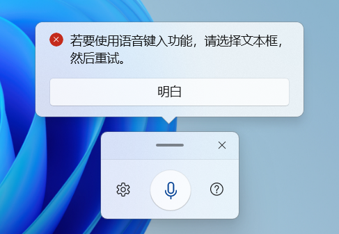

 

<h1 align="center">灵糕中心 (Linggao Hub)</h1>

[github.com/Lingggao/LGHUB](https://github.com/Lingggao/LGHUB) (GitHub) & [lingggao.github.io/LGHUB](https://lingggao.github.io/LGHUB) (Pages)

&emsp;&emsp;**用于跟踪 “Windows 11 预览体验版本 (Canary 频道) 哪些反馈正在由 Microsoft 调查 / 处理 / 已做出更改” 的信息枢纽**。由 2021 Windows Insider Most Valuable Professional (MVP) · **Ling Gao** 先生管理。

&emsp;&emsp;灵糕中心成立于 2023 年 12 月 12 日，其前身可追溯至 2019 年 5 月 14 日由 Microsoft 社区创建的 “[\[BUG 汇总\] Windows 10 2019 年 5 月更新 (1903_18362) 已知问题与处理进度汇总](https://answers.microsoft.com/zh-hans/insider/forum/all/bug-%E6%B1%87%E6%80%BBwindows-10-2019-%E5%B9%B4-5/252d0d6a-022c-4bf7-9976-55b57590aee2)” 讨论话题。

> [!IMPORTANT]
>
> &emsp;灵糕中心为个人项目，管理者不是 Microsoft 公司员工，不能代表 Microsoft 公司立场、态度。中心无意且无法代替 “反馈中心” (Feedback Hub) 应用的重要作用。中心不提供 Microsoft 产品技术支持服务。中心不接受有关 Windows 11 预览体验版本的反馈，用户应始终通过 “反馈中心” 应用提交。
>
> &emsp;Windows、Windows Insider Program 等是 Microsoft 公司的商标。

&emsp;&emsp;**宗旨**：独立管理、服务用户、信息精准、更新及时

[反馈中心](https://aka.ms/fbh) | [深入了解反馈](https://learn.microsoft.com/zh-cn/windows-insider/feedback) | [Flight Hub](https://learn.microsoft.com/en-us/windows-insider/flight-hub) | Windows 预览体验计划 - [网站](https://www.microsoft.com/zh-cn/windowsinsider) · [博客](https://blogs.windows.com/windows-insider) · [X (Twitter)](https://twitter.com/windowsinsider) · 社区 ([中](https://answers.microsoft.com/zh-hans/insider/forum) / [英](https://answers.microsoft.com/en-us/insider/forum))

## ✦ 总览 ✦

&emsp;&emsp;上次更新时间：2024 年 6 月 16 日 11:00 (UTC+8)。访问次数：4340+

&emsp;&emsp;收录反馈 182 个，其中正在调查 14 个 (含[搁置](#3) 6 个)、正在处理 4 个、已修复 164 个。

&emsp;&emsp;反馈更新记录：**今日更新 LG180 - 181**。- Ling 💰 [总览图](https://raw.githubusercontent.com/Lingggao/LGHUB/main/Images/Linggao%20Hub.png) | [反馈更新记录](Documents/Update_Feedback.md) | [平台更新记录](Documents/Update_Platform.md)

| 🍀 友情推荐 🌷 | [WinDiscover](https://windiscover.com) - 独立 Microsoft 新闻博客 | 欢迎关注 [@Microsoft 信仰中心](https://weibo.com/u/3139784387) 微博 |
| :----------: | :----------------------------------------------------------: | :----------------------------------------------------------: |

|         频道         |              最新版本               | 时间 (UTC+8) |                             公告                             |
| :------------------: | :---------------------------------: | :----------: | :----------------------------------------------------------: |
|        Canary        |                26236                |  2024/6/13   | [aka.ms/wip26236](https://blogs.windows.com/windows-insider/2024/06/12/announcing-windows-11-insider-preview-build-26236-canary-channel) |
|         Dev          |              **[新]** 26120.961              |   2024/6/15   | [aka.ms/wip-dev-6-14](https://blogs.windows.com/windows-insider/2024/06/14/announcing-windows-11-insider-preview-build-26120-961-dev-channel) |
|         Beta         |     **[新]** 22635.3785    |   2024/6/15   | [aka.ms/wip-beta-6-14](https://blogs.windows.com/windows-insider/2024/06/14/announcing-windows-11-insider-preview-build-22635-3785-beta-channel) |
|   Release Preview    | **[新]** 24H2 - 26100.863 |  2024/6/16  | [blogs.windows.com](https://blogs.windows.com/windows-insider/2024/05/22/releasing-windows-11-version-24h2-to-the-release-preview-channel) |
| General Availability |    23H2 - 22631.3737    |  2024/6/12   | [support.microsoft.com](https://support.microsoft.com/en-us/topic/june-11-2024-kb5039212-os-builds-22621-3737-and-22631-3737-d7f574c0-2b13-48ca-a9fc-a63093b1a2c2) |

---

> [!NOTE]
>
> &emsp;多数问题是仅有 1 - 2 位 Insiders 反馈的 “偶发性” 问题，而非所有人都会遇到的 “广泛性” 问题。请放心地更新 Windows 11 预览体验版本，不必担心新版使用体验过差。

|      编号       |                             问题                             |   状态   |
| :-------------: | :----------------------------------------------------------: | :------: |
| [LG123](#LG123) |                 接收不到 Build 26080+ 更新。                 | 正在处理 |
| [LG177](#LG177) |              任务管理器 “性能” 选项卡颜色异常。              | 正在调查 |
|     **——**      | [**Canary - 公告已知问题**](#0) **▲ \| ▼** [**Canary - 用户反馈问题**](#1) |  **——**  |
| [LGH02](#LGH02) |       **[集合]** 文件资源管理器中的软件缺陷。(含列表)        | 正在处理 |
| [LGH03](#LGH03) |           **[集合]** 小组件中的软件缺陷。(含列表)            | 正在处理 |
| [LG172](#LG172) |          开关笔记本电脑的盖子时，缩放比例自动重置。          | 正在调查 |
| [LG174](#LG174) |              无法使用语音键入 (WIN + H) 功能。               | 正在调查 |
| [LG175](#LG175) |          文本建议干扰 Visual Studio Code 中的命令。          | 正在调查 |
| [LG176](#LG176) |          CrossDeviceService.exe 大量占用 CPU 资源。          | 正在处理 |
| [LG178](#LG178) |          任务管理器设置菜单 Mica (云母) 效果异常。           | 正在调查 |
| [LG179](#LG179) |                部分设备随机出现绿屏 (GSOD)。                 | 正在调查 |
| [LG180](#LG180) |              **在反馈中心提交的反馈可能丢失**。              | 正在调查 |
| [LG181](#LG181) |        **OpenRGB 和 ColorEngine 应用无法正常运行**。         | 正在调查 |
|     **——**      | [**Canary - 用户反馈问题**](#1) **▲ \| ▼** [**Canary - 归档 (已做出更改 0 - 7 天)**](#2) |  **——**  |
|                 |                             暂无                             |          |
|     **——**      | **✦** [**Canary - 归档 (已做出更改 >7 天)**](7+.md) **✦ \| ✦** [**Canary - 搁置 (未做出更改)**](#3) **✦** |  **——**  |

[分享反馈线索](https://forms.office.com/Pages/ResponsePage.aspx?id=DQSIkWdsW0yxEjajBLZtrQAAAAAAAAAAAAO__Q3sH7RUNjUyUzJLN0JBREZGMzBBVlpVOEVBQkRENy4u) | [反馈平台问题](https://forms.office.com/Pages/ResponsePage.aspx?id=DQSIkWdsW0yxEjajBLZtrQAAAAAAAAAAAAO__Q3sH7RUQ0haOElMVkxOWDE4U1pHQUZWMDhEM1gwSC4u)

## ✦ Canary - 公告已知问题 ✦

> [!TIP]
>
> &emsp;记录 [Windows Insider 博客](https://blogs.windows.com/windows-insider)中明确公开的已知问题。

---

编号：LG123  
版本：ALL  
**问题**：**接收不到 Build 26080+ 更新**。  
状态：  
Microsoft 官方回复：“我们正在调查有关部分 Insider 卡在 26040 / 23620 版本的反馈。如果您迫切期望立即回到正轨，可使用最新 ISO 全新安装 Windows，然后重新加入 Canary 或 Dev 频道。” *(Ling 译)*  
  
典型反馈：[aka.ms/AApjbci](https://aka.ms/AApjbci)

---

编号：LG177  
日期：2024 年 6 月 9 日  
版本：Canary 26231 - 26236  
**问题**：**任务管理器 “性能” 选项卡颜色异常**。  
状态：  
典型反馈：[aka.ms/AAqtf01](https://aka.ms/AAqtf01) 

## ✦ Canary - 用户反馈问题 ✦

> [!TIP]
>
> &emsp;记录[反馈中心应用](https://aka.ms/fbh)中 Microsoft 明确响应的问题。

---

编号：LGH02  
日期：2024 年 4 月 7 日  
版本：Canary 26100 - 26236  
**集合**：**文件资源管理器中的软件缺陷**。  
状态：

列表

- 卡顿 / 内存泄漏 / CPU 占用率高
- 双击压缩文件时没有反应 - [aka.ms/AAqk1zl](https://aka.ms/AAqk1zl)
- 预览性能下降 - [aka.ms/AAqmzfc](https://aka.ms/AAqmzfc)
- 在搜索栏中输入的字符随机被删除 - [aka.ms/AAq9sqa](https://aka.ms/AAq9sqa) - 已修复 ✓
- 菜单中的文本可能过长 - [aka.ms/AApyuo4](https://aka.ms/AApyuo4) - 已修复 ✓
- 缩放设定为 175% 时图标模糊不清 - [aka.ms/AApytl6](https://aka.ms/AApytl6) - 已修复 ✓
- 出现旧版白色工具栏 - [aka.ms/AAn4f6s](https://aka.ms/AAn4f6s) \- 已修复 ✓
- 新建文件夹时，焦点可能定位到地址栏 - [aka.ms/AAqjq2b](https://aka.ms/AAqjq2b) \- 已修复 ✓
- 导航窗格中的 OneDrive 随机变化位置 - [aka.ms/AApxwbw](https://aka.ms/AApxwbw) \- 已修复 ✓
- 切换 “项目复选框” 选项时出现异常 - [aka.ms/AApydtm](https://aka.ms/AApydtm) - 已修复 ✓
- 出现多个地址栏 / 搜索栏 - [aka.ms/AApymuw](https://aka.ms/AApymuw) - 已修复 ✓
- 在深色模式添加新标签时窗口闪烁 - [aka.ms/AAq33qn](https://aka.ms/AAq33qn) - 已修复 ✓

---

编号：LGH03  
日期：2024 年 4 月 19 日  
版本：Canary 26100 - 26236  
**集合**：**小组件中的软件缺陷**。  
状态：

列表

- “悬停时打开小组件板” 选项始终显示为关 - [aka.ms/AAq70ys](https://aka.ms/AAq70ys)
- “Windows 徽标键 + W” 快捷键失效 - [aka.ms/AAqgz49](https://aka.ms/AAqgz49) - 已修复 ✓
- 点击小组件时 Windows 崩溃 / 显示错误 - [aka.ms/AAq43k9](https://aka.ms/AAq43k9) - 已修复 ✓
- “待办事项” 等小组件随机消失 - [aka.ms/AAq1w40](https://aka.ms/AAq1w40) - 已修复 ✓
- 已固定的小组件随机消失 - [aka.ms/AAq33qp](https://aka.ms/AAq33qp) - 已修复 ✓

---

编号：LG172  
日期：2024 年 5 月 20 日  
版本：Canary 26217 - 26236  
**问题**：**开关笔记本电脑的盖子时，缩放比例自动重置**。  
状态：  
典型反馈：[aka.ms/AAqi9eq](https://aka.ms/AAqi9eq)

---

编号：LG174  
日期：2024 年 6 月 6 日  
版本：Canary 26227 - 26236  
**问题**：**无法使用语音键入 (WIN + H) 功能**。  
状态：  
典型反馈：[aka.ms/AAqr1cs](https://aka.ms/AAqr1cs)

---

编号：LG175  
日期：2024 年 6 月 6 日  
版本：Canary 26227 - 26236  
**问题**：**文本建议干扰 Visual Studio Code 中的命令**。  
状态：  
典型反馈：[aka.ms/AAqrnqa](https://aka.ms/AAqrnqa)

---

编号：LG176  
日期：2024 年 6 月 6 日  
版本：Canary 26227 - 26236  
**问题**：**CrossDeviceService.exe 大量占用 CPU 资源**。  
状态：  
典型反馈：[aka.ms/AAqrfzf](https://aka.ms/AAqrfzf) 

---

编号：LG178  
日期：2024 年 6 月 9 日  
版本：Canary 26231 - 26236  
**问题**：**任务管理器设置菜单 Mica (云母) 效果异常**。  
状态：  
典型反馈：[aka.ms/AAqsxwz](https://aka.ms/AAqsxwz)

---

编号：LG179  
日期：2024 年 6 月 9 日  
版本：Canary 26231 - 26236  
**问题**：**部分设备随机出现绿屏 (GSOD)**。  
状态：  
典型反馈：[aka.ms/AAqst0h](https://aka.ms/AAqst0h)

---

编号：LG180  
日期：2024 年 6 月 16 日  
版本：ALL  
**问题**：**在反馈中心提交的反馈可能丢失**。  
状态：  
典型反馈：[aka.ms/AAqkhex](https://aka.ms/AAqkhex) 

---

编号：LG181  
日期：2024 年 6 月 16 日  
版本：Canary 26236  
**问题**：**OpenRGB 和 ColorEngine 应用无法正常运行**。  
状态：  
典型反馈：[aka.ms/AAqvdpw](https://aka.ms/AAqvdpw) & [aka.ms/AAqwld4](https://aka.ms/AAqwld4)

## ✦ Canary - 归档 (已做出更改) ✦

> [!TIP]
>
> &emsp;记录 Microsoft 已做出更改 0 - 7 天的问题 & 超过 14 天无新增赞成票的问题。
>
> &emsp;无特殊情况，问题归档后不再更新。

---

暂无

[Microsoft 已做出更改 >7 天的问题](7+.md)

## ✦ Canary - 搁置 (未做出更改) ✦

> [!TIP]
>
> &emsp;“并非所有软件缺陷都要修复。” —— Ron Patton (出自《软件测试》)
>
> &emsp;已收录的反馈也可能因缺少资源、修复风险过大、商业决策调整等长期或永久不予修复。本板块记录 Microsoft 超过 90 天未修复的问题，中心将每间隔 30 天在 Canary 频道最新版本中进行测试。

[Microsoft 超过 90 天未修复的问题](90+.md)

---

[回到顶部](#HEAD)

  

在 “[署名 - 相同方式共享 4.0](https://creativecommons.org/licenses/by-sa/4.0/legalcode.zh-Hans)” 协议 (CC BY-SA 4.0) 之条款下提供。

2023 - 2024, 高楷修 (Ling Gao), 灵糕中心 (Linggao Hub), [github.com/Lingggao/LGHUB](https://github.com/Lingggao/LGHUB)

[字体许可使用授权书](Images/字体许可使用授权书.png) |  (访问次数统计：今日 / 累计)