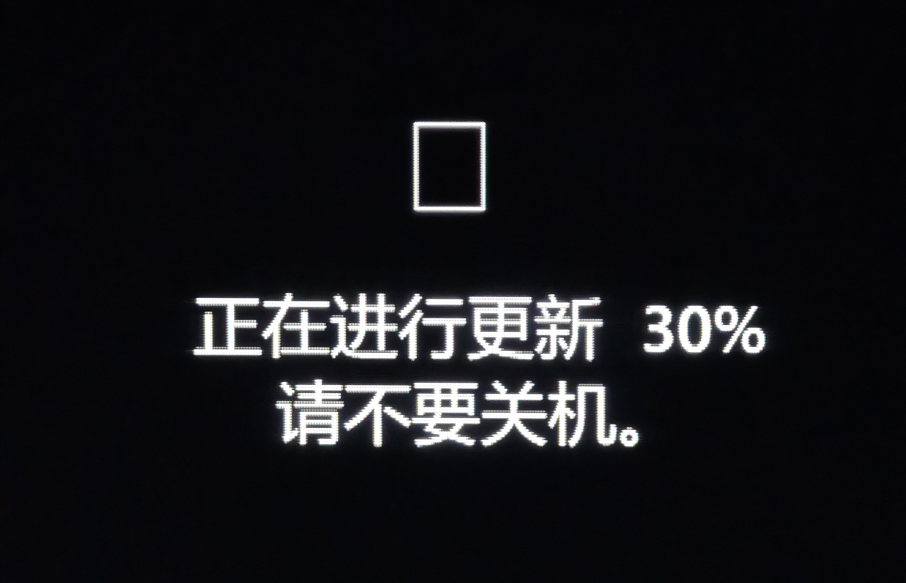
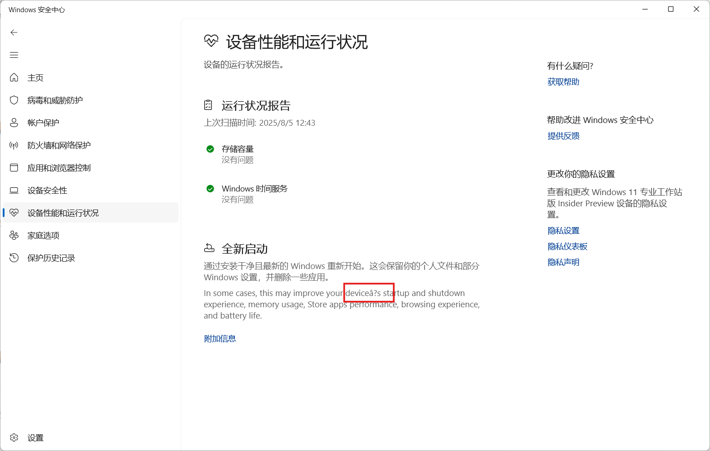

  

<h1 align="center">灵糕中心 (Linggao Hub)</h1>

[github.com/Lingggao/LGHUB](https://github.com/Lingggao/LGHUB) (GitHub)

&emsp;&emsp;**用于跟踪 “Windows 11 预览体验版本 (Canary 频道) 中哪些反馈正在由 Microsoft 调查、处理 / 已做出更改” 的信息枢纽**。由 2021 Windows Insider 最有价值专家 (MVP) · [**Ling Gao**](https://github.com/Lingggao) 先生管理。

&emsp;&emsp;灵糕中心成立于 2023 年 12 月 12 日，其前身可追溯至 2019 年 5 月 14 日由 Microsoft 社区创建的 “[\[BUG 汇总\] Windows 10 2019 年 5 月更新 (1903_18362) 已知问题与处理进度汇总](https://github.com/Lingggao/LGHUB/blob/main/Images/Inherited.png?raw=true)” 讨论话题。

> [!IMPORTANT]
>
> &emsp;灵糕中心为个人项目，管理者不是 Microsoft 公司员工，不能代表 Microsoft 公司立场、态度。本中心无意且无法代替 “反馈中心” (Feedback Hub) 应用的重要作用。本中心不提供 Microsoft 产品技术支持服务。本中心不接受有关 Windows 11 预览体验版本的反馈，用户应始终通过 “反馈中心” 应用提交。
>
> &emsp;Windows、Windows Insider Program 等是 Microsoft 公司的商标。

&emsp;&emsp;**宗旨**：独立管理、服务用户、信息精准、更新及时

[反馈中心](https://aka.ms/fbh) | [深入了解反馈](https://learn.microsoft.com/zh-cn/windows-insider/feedback) | [Flight Hub](https://learn.microsoft.com/en-us/windows-insider/flight-hub) | Windows 预览体验计划 - [网站](https://www.microsoft.com/zh-cn/windowsinsider) · [博客](https://blogs.windows.com/windows-insider) · [X](https://twitter.com/windowsinsider) · Microsoft 社区 ([中](https://answers.microsoft.com/zh-hans/insider/forum) / [英](https://answers.microsoft.com/en-us/insider/forum))

| 🎖️ **推荐** | **[WinDiscover](https://windiscover.com) - 独立 Microsoft 新闻网站** | **关注 [@Microsoft 信仰中心](https://weibo.com/u/3139784387) 微博** |
| :--------: | :----------------------------------------------------------: | :----------------------------------------------------------: |
|            |            [**LCZBlog**](https://blog.licaoz.com)            |       [**GuCATs'摸鱼站**](https://goo-aw233.github.io)       |

## 总览

| 😸 欢迎加入 [“Ling 的 Windows Insider 小屋”](https://teams.live.com/l/community/FEAd0AVp_B_pTH5ZiA) Microsoft Teams 社区 😽 |
| :----------------------------------------------------------: |

| 灵糕中心设立 [“Microsoft 网站错误 & 本地化问题”](WebLoc/README.md) 板块 |
| :----------------------------------------------------------: |

上次更新时间：2025 年 8 月 5 日 13:00 (UTC+8)。Star 数量：52 ⭐

收录反馈 432 个，其中正在调查 24 个 (含[搁置](#3) 4 个)、正在处理 2 个、已修复 406 个。

反馈更新记录：**今日更新 LG**。- Ling 😒 [总览图](https://raw.githubusercontent.com/Lingggao/LGHUB/main/Images/Linggao%20Hub.png) | [反馈更新记录](Documents/Update_Feedback.md) | [平台更新记录](Documents/Update_Platform.md)

[**WIP Canary 27913 更新简报**](Canary.md) | [往期简报](Documents/Canary_Previous)

|         频道         |              最新版本               | 时间 (UTC+8) | 公告 |
| :------------------: | :---------------------------------: | :----------: | :------------------: |
|        Canary        |                27913                |  2025/7/31  | [aka.ms/wip27913](https://blogs.windows.com/windows-insider/2025/07/30/announcing-windows-11-insider-preview-build-27913-canary-channel) |
|       Dev        | 26200.5733 |   2025/8/2   | [aka.ms/wip-dev-8-1-25](https://blogs.windows.com/windows-insider/2025/08/01/announcing-windows-11-insider-preview-build-26200-5733-dev-channel) |
|         Beta         | 26120.5733 |   2025/8/2   | [aka.ms/wip-beta-8-1-25](https://blogs.windows.com/windows-insider/2025/08/01/announcing-windows-11-insider-preview-build-26120-5733-beta-channel) |
| Release Preview  | 26100.4770 |  2025/7/23  | [support.microsoft.com](https://support.microsoft.com/en-us/help/5062660) |
| General Availability |    26100.4656    |  2025/7/14  | [support.microsoft.com](https://support.microsoft.com/en-us/help/5064489) |

统计图 - 2024 年 ([1 - 4 月](Images/Graph_2401_2404.png) · [5 - 8 月](Images/Graph_2405_2408.png) · [9 - 12 月](Images/Graph_2409_2412.png)) | 2025 年 ([1 - 4 月](Images/Graph_2501_2504.png) · [5 - 8 月](Images/Graph_0.png) · 9 - 12 月)

---

> [!NOTE]
>
> &emsp;多数问题是仅有 1 - 2 位 Insiders 反馈的 “偶发性” 问题，而非所有人都会遇到的 “广泛性” 问题。请放心地更新 Windows 11 预览体验版本，不必担心新版使用体验过差。

|      编号       |                             问题                             |   状态   |
| :-------------: | :----------------------------------------------------------: | :------: |
|       ——        |              [**Canary - 公告已知问题**](#0) ▼               |    ——    |
| [LG212](#LG212) | **[Copilot+ 电脑]** 加入 Canary 频道后，PIN 和生物识别信息将丢失。 | 正在处理 |
| [LG431](#LG431) |            更新过程中，进度条显示为 ▯ 方块形状。             | 正在处理 |
|       ——        | [**Canary - 公告已知问题**](#0) ▲ \| ▼ [**Canary - 用户反馈问题**](#1) |    ——    |
|       ——        |        ***注**：长期未修复的问题收录于[搁置](#3)板块*        |    ——    |
| [LG347](#LG347) |            满足条件后在反馈中心无法获得成就徽章。            | 正在调查 |
| [LG357](#LG357) |         截图工具无法截取搜索界面、上下文菜单等 UI。          | 正在调查 |
| [LG361](#LG361) |          Microsoft Store 不显示较早的应用更新记录。          | 正在调查 |
| [LG379](#LG379) |    Microsoft Store 最小化时，无法右键任务栏图标将其关闭。    | 正在调查 |
| [LG381](#LG381) |                 玩 PUBG 游戏时电脑自动重启。                 | 正在调查 |
| [LG384](#LG384) |      将背景设置为 “Windows 聚焦” 后自动恢复为 “图片”。       | 正在调查 |
| [LG386](#LG386) |            已提交的反馈在 “我的反馈” 中随机消失。            | 正在调查 |
| [LG387](#LG387) |        玩 “Path of Exile” (流放之路) 游戏时电脑死机。        | 正在调查 |
| [LG391](#LG391) |                   开始菜单的动画效果异常。                   | 正在调查 |
| [LG394](#LG394) |                玩 X-Plane 12 游戏时电脑绿屏。                | 正在调查 |
| [LG395](#LG395) |       在 “设置” 菜单中搜索 “高级网络设置” 时没有结果。       | 正在调查 |
| [LG396](#LG396) |      截图工具 “颜色选取器” 功能的顶栏无法完整显示文字。      | 正在调查 |
| [LG400](#LG400) |      玩 “守望先锋 2” (Overwatch 2) 游戏时电脑自动重启。      | 正在调查 |
| [LG403](#LG403) | 点击设置菜单 “相关支持” 中的 “更改隐私设置” 时，打开的链接有误。 | 正在调查 |
| [LG409](#LG409) |            搜索菜单 “更多选项” 列表的间距不一致。            | 正在调查 |
| [LG410](#LG410) |                玩 NBA2K 游戏时电脑自动重启。                 | 正在调查 |
| [LG413](#LG413) |     “辅助功能” 快速设置中出现 “电动交通工具” 错误翻译。      | 正在调查 |
| [LG424](#LG424) |      “设置”>“鼠标” 菜单中 “主鼠标按钮” 的选项翻译有误。      | 正在调查 |
| [LG427](#LG427) |          任务管理器 “性能” 页面中的选项卡无法对齐。          | 正在调查 |
| [LG429](#LG429) |                      电脑无法正常关机。                      | 正在调查 |
| [LG252](#LG252) |              组策略编辑器和服务管理器 UI 错误。              | 已修复 ✓ |
| [LG432](#LG432) |            **Windows 安全中心内仍有 “â?” 乱码**。            | 正在调查 |
| [LG433](#LG433) |                  **开启 HDR 后鼠标过曝**。                   | 正在调查 |
| [LG434](#LG434) |              **远程桌面多显示器支持出现异常**。              | 正在处理 |
| [LG435](#LG435) |                **鼠标周围突然出现十字准星**。                | 正在调查 |
| [LG436](#LG436) |                                                              |          |
| [LG437](#LG437) |                                                              |          |
| [LG438](#LG438) |                                                              |          |
| [LG439](#LG439) |                                                              |          |
|       ——        | [**Canary - 用户反馈问题**](#1) ▲ \| ▼ [**Canary - 归档 (已做出更改 0 - 7 天)**](#2) |    ——    |
| [LG258](#LG258) |            拖动表情符号面板中的滚动条时卡顿严重。            | 已修复 ✓ |
| [LG420](#LG420) |     连接 VPN 时出现 KERNEL_SECURITY_CHECK_FAILURE 绿屏。     | 已修复 ✓ |
| [LG419](#LG419) |           电脑开机时发出 Windows Vista 启动声音。            | 已修复 ✓ |
| [LG416](#LG416) |          “设置”>“系统”>“电源和电池” 菜单可能崩溃。           | 已修复 ✓ |
| [LG421](#LG421) |          “设置” 菜单等对话框中的撇号变为随机字符。           | 已修复 ✓ |
| [LG430](#LG430) | “任务栏” 菜单中的 “笔菜单” 和 “虚拟触控板” 图标无法正确呈现。 | 已修复 ✓ |
|       ——        | ***注**：部分未收录的问题详见 [WIP Canary 27913 更新简报](Canary.md)* |    ——    |
|       ——        |       ▲ [**Canary - 归档 (已做出更改 0 - 7 天)**](#2)        |    ——    |
|       ——        | [**Canary - 归档 (已做出更改 >7 天)**](7+.md) \| [**Canary - 搁置 (未做出更改)**](#3) |    ——    |

[分享反馈线索](https://forms.office.com/Pages/ResponsePage.aspx?id=DQSIkWdsW0yxEjajBLZtrQAAAAAAAAAAAAO__Q3sH7RUNjUyUzJLN0JBREZGMzBBVlpVOEVBQkRENy4u) | [反馈平台问题](https://forms.office.com/Pages/ResponsePage.aspx?id=DQSIkWdsW0yxEjajBLZtrQAAAAAAAAAAAAO__Q3sH7RUQ0haOElMVkxOWDE4U1pHQUZWMDhEM1gwSC4u)

## Canary - 公告已知问题

> [!TIP]
>
> &emsp;记录 [Windows Insider 博客](https://blogs.windows.com/windows-insider)中明确公开的已知问题。

---

编号：LG212  
日期：2024 年 8 月 16 日  
版本：Canary 27686 - 27913  
**问题**：**[Copilot+ 电脑] 加入 Canary 频道后，PIN 和生物识别信息将丢失**。  
状态：  
Microsoft 官方回复：“如果您使用 Copilot+ 设备从 Dev、Release Preview 或 Retail 频道加入至 Canary 频道，Windows Hello PIN 和生物识别信息将会丢失。您将无法登录系统，显示 0xd0000225 错误和 ‘出错了，您的 PIN 不可用’ 信息。点击 ‘设置我的 PIN’ 选项应当可以重设 PIN。” *(Ling 译)* 

---

编号：LG431  
日期：2025 年 7 月 31 日  
版本：Canary 27913  
**问题**：**更新过程中，进度条显示为 ▯ 方块形状**。  
状态：  
典型反馈：[aka.ms/AAxhokj](https://aka.ms/AAxhokj)

## Canary - 用户反馈问题

> [!TIP]
>
> &emsp;记录[反馈中心应用](https://aka.ms/fbh)中 Microsoft 明确响应的问题。

---

编号：LG347  
日期：2025 年 5 月 1 日  
版本：ALL  
**问题**：**满足条件后在反馈中心无法获得成就徽章**。  
状态：  
典型反馈：[aka.ms/AAw0kh1](https://aka.ms/AAw0kh1) & [aka.ms/AAx2o1t](https://aka.ms/AAx2o1t)

---

编号：LG357  
日期：2025 年 5 月 10 日  
版本：ALL  
**问题**：**截图工具无法截取搜索界面、上下文菜单等 UI**。  
状态：  
典型反馈：[aka.ms/AAw7f38](https://aka.ms/AAw7f38)

---

编号：LG361  
日期：2025 年 5 月 15 日  
版本：ALL  
**问题**：**Microsoft Store 不显示较早的应用更新记录**。  
状态：  
典型反馈：[aka.ms/AAw8czh](https://aka.ms/AAw8czh)

---

编号：LG379  
日期：2025 年 5 月 26 日  
版本：ALL  
**问题**：**Microsoft Store 最小化时，无法右键任务栏图标将其关闭**。  
状态：  
典型反馈：[aka.ms/AAwd8s4](https://aka.ms/AAwd8s4)

---

编号：LG381  
日期：2025 年 5 月 26 日  
版本：Canary 27863 - 27913  
**问题**：**玩 PUBG 游戏时电脑自动重启**。  
状态：  
典型反馈：[aka.ms/AAwd8az](https://aka.ms/AAwd8az)

---

编号：LG384  
日期：2025 年 5 月 26 日  
版本：ALL  
**问题**：**将背景设置为 “Windows 聚焦” 后自动恢复为 “图片”**。  
状态：  
典型反馈：[aka.ms/AAwe72g](https://aka.ms/AAwe72g)

---

编号：LG386  
日期：2025 年 6 月 2 日  
版本：ALL  
**问题**：**已提交的反馈在 “我的反馈” 中随机消失**。  
状态：  
典型反馈：[aka.ms/AAw9m7w](https://aka.ms/AAw9m7w)

---

编号：LG387  
日期：2025 年 6 月 2 日  
版本：Canary 27868 - 27913  
**问题**：**玩 “Path of Exile” (流放之路) 游戏时电脑死机**。  
状态：  
典型反馈：[aka.ms/AAwhpsd](https://aka.ms/AAwhpsd)

---

编号：LG391  
日期：2025 年 6 月 4 日  
版本：Canary 27868 - 27913  
**问题**：**开始菜单的动画效果异常**。  
状态：  
典型反馈：[aka.ms/AAwi4xm](https://aka.ms/AAwi4xm)

---

编号：LG394  
日期：2025 年 6 月 4 日  
版本：Canary 27868 - 27913  
**问题**：**玩 X-Plane 12 游戏时电脑绿屏**。  
状态：  
典型反馈：[aka.ms/AAwikfb](https://aka.ms/AAwikfb)

---

编号：LG395  
日期：2025 年 6 月 11 日  
版本：Canary 27871 - 27913  
**问题**：**在 “设置” 菜单中搜索 “高级网络设置” 时没有结果**。  
状态：  
典型反馈：[aka.ms/AAwndix](https://aka.ms/AAwndix)

---

编号：LG396  
日期：2025 年 6 月 11 日  
版本：ALL  
**问题**：**截图工具 “颜色选取器” 功能的顶栏无法完整显示文字**。  
状态：  
典型反馈：[aka.ms/AAwi7nq](https://aka.ms/AAwi7nq)

---

编号：LG400  
日期：2025 年 6 月 14 日  
版本：Canary 27871 - 27913  
**问题**：**玩 “守望先锋 2” (Overwatch 2) 游戏时电脑自动重启**。  
状态：  
典型反馈：[aka.ms/AAwp98m](https://aka.ms/AAwp98m)

---

编号：LG403  
日期：2025 年 6 月 14 日  
版本：Canary 27871 - 27913  
**问题**：**点击设置菜单 “相关支持” 中的 “更改隐私设置” 时，打开的链接有误**。  
状态：  
典型反馈：[aka.ms/AAwoi47](https://aka.ms/AAwoi47)

---

编号：LG409  
日期：2025 年 6 月 25 日  
版本：Canary 27881 - 27913  
**问题**：**搜索菜单 “更多选项” 列表的间距不一致**。  
状态：  
典型反馈：[aka.ms/AAwsrbo](https://aka.ms/AAwsrbo)

---

编号：LG410  
日期：2025 年 6 月 25 日  
版本：Canary 27881 - 27913  
**问题**：**玩 NBA2K 游戏时电脑自动重启**。  
状态：  
典型反馈：[aka.ms/AAwtbwa](https://aka.ms/AAwtbwa)

---

编号：LG413  
日期：2025 年 6 月 25 日  
版本：Canary 27881 - 27913  
**问题**：**“辅助功能” 快速设置中出现 “电动交通工具” 错误翻译**。  
状态：  
典型反馈：[aka.ms/AAwtbwl](https://aka.ms/AAwtbwl)

---

编号：LG424  
日期：2025 年 7 月 19 日  
版本：Canary 27902 - 27913  
**问题**：**“设置”>“鼠标” 菜单中 “主鼠标按钮” 的选项翻译有误**。  
状态：  
典型反馈：[aka.ms/AAx2o1o](https://aka.ms/AAx2o1o)

---

编号：LG427  
日期：2025 年 7 月 19 日  
版本：Canary 27902 - 27913  
**问题**：**任务管理器 “性能” 页面中的选项卡无法对齐**。  
状态：  
典型反馈：[aka.ms/AAx0xzj](https://aka.ms/AAx0xzj)

---

编号：LG429  
日期：2025 年 7 月 19 日  
版本：Canary 27891 - 27913  
**问题**：**电脑无法正常关机**。  
状态：  
典型反馈：[aka.ms/AAx2o1u](https://aka.ms/AAx2o1u)

---

编号：LG252  
日期：2024 年 12 月 20 日  
版本：Canary 27764 - 27913  
**问题**：**组策略编辑器和服务管理器 UI 错误**。  
状态：  
典型反馈：[aka.ms/AAty56l](https://aka.ms/AAty56l) 

---

编号：LG432  
日期：2025 年 8 月 5 日  
版本：Canary 27913  
**问题**：**Windows 安全中心内仍有 “â?” 乱码**。  
状态：  
典型反馈：[aka.ms/AAxgmdp](https://aka.ms/AAxgmdp) 

---

编号：LG433  
日期：2025 年 8 月 5 日  
版本：Canary 27913  
**问题**：**开启 HDR 后鼠标过曝**。  
状态：  
典型反馈：[aka.ms/AAxgme4](https://aka.ms/AAxgme4)

---

编号：LG434  
日期：2025 年 8 月 5 日  
版本：Canary 27913  
**问题**：**远程桌面多显示器支持出现异常**。  
状态：  
典型反馈：[aka.ms/AAxhoki](https://aka.ms/AAxhoki) 

---

编号：LG435  
日期：2025 年 8 月 5 日  
版本：Canary 27913  
**问题**：**鼠标周围突然出现十字准星**。  
状态：  
Microsoft 官方回复：“如遇此问题，请按下 WIN + Ctrl + X 快捷键。” *(Ling 译)*   
典型反馈：[aka.ms/AAxgmee](https://aka.ms/AAxgmee)

---

编号：LG436  
日期：2025 年 8 月 5 日  
版本：Canary 27913  
**问题**：**xxxxx**  
状态：  
Microsoft 官方回复：xxxxx  
典型反馈：[aka.ms/AAxxxxx](https://aka.ms/fbh)

---

编号：LG437  
日期：2025 年 8 月 5 日  
版本：Canary 27913  
**问题**：**xxxxx**  
状态：  
Microsoft 官方回复：xxxxx  
典型反馈：[aka.ms/AAxxxxx](https://aka.ms/fbh)

---

编号：LG438  
日期：2025 年 8 月 5 日  
版本：Canary 27913  
**问题**：**xxxxx**  
状态：  
Microsoft 官方回复：xxxxx  
典型反馈：[aka.ms/AAxxxxx](https://aka.ms/fbh)

---

编号：LG439  
日期：2025 年 8 月 5 日  
版本：Canary 27913  
**问题**：**xxxxx**  
状态：  
Microsoft 官方回复：xxxxx  
典型反馈：[aka.ms/AAxxxxx](https://aka.ms/fbh)

## Canary - 归档 (已做出更改)

> [!TIP]
>
> &emsp;记录 Microsoft 已做出更改 0 - 7 天的问题 & 超过 14 天无新增赞成票的问题。
>
> &emsp;无特殊情况，问题归档后不再更新。

---

编号：LG258  
日期：2025 年 1 月 10 日  
版本：Canary 27766 - 27909  
**问题**：**拖动表情符号面板中的滚动条时卡顿严重**。  
状态：Canary 27913 -  - 已修复 ✓  
典型反馈：[aka.ms/AAtws2s](https://aka.ms/AAtws2s)

---

编号：LG420  
日期：2025 年 7 月 19 日  
版本：Canary 27898 - 27909  
**问题**：**连接 VPN 时出现 KERNEL_SECURITY_CHECK_FAILURE 绿屏**。  
状态：Canary 27913 -  - 已修复 ✓  
典型反馈：[aka.ms/AAx2o1l](https://aka.ms/AAx2o1l) & [aka.ms/AAx2vs1](https://aka.ms/AAx2vs1)

---

编号：LG419  
日期：2025 年 7 月 19 日  
版本：Canary 27902 - 27909  
**问题**：**电脑开机时发出 Windows Vista 启动声音**。  
状态：Canary 27913 -  - 已修复 ✓  
典型反馈：[aka.ms/AAx2vrt](https://aka.ms/AAx2vrt)

---

编号：LG416  
日期：2025 年 7 月 5 日  
版本：Canary 27891 - 27909  
**问题**：**“设置”>“系统”>“电源和电池” 菜单可能崩溃**。  
状态：Canary 27913 -  - 已修复 ✓  
典型反馈：[aka.ms/AAx33ga](https://aka.ms/AAx33ga)

---

编号：LG421  
日期：2025 年 7 月 19 日  
版本：Canary 27902 - 27909  
**问题**：**“设置” 菜单等对话框中的撇号变为随机字符**。  
状态：Canary 27913 -  - 已修复 ✓

---

编号：LG430  
日期：2025 年 7 月 26 日  
版本：Canary 27902 - 27909  
**问题**：**“任务栏” 菜单中的 “笔菜单” 和 “虚拟触控板” 图标无法正确呈现**。  
状态：Canary 27913 -  - 已修复 ✓  
典型反馈：[aka.ms/AAx97z3](https://aka.ms/AAx97z3)

---

*部分未收录反馈详见 [WIP Canary 27913 更新简报](Canary.md)*

[Microsoft 已做出更改 >7 天的问题](7+.md)

## Canary - 搁置 (未做出更改)

> [!TIP]
>
> &emsp;并非所有软件缺陷都要修复。
>
> &emsp;已收录的反馈也可能因缺少资源、修复风险过大、商业决策调整等长期或永久不予修复。本板块记录 Microsoft 超过 90 天未修复的问题，中心将每间隔 30 天在 Canary 频道最新版本中进行测试。

[Microsoft 超过 90 天未修复的问题](90+.md)

---

[回到顶部](#HEAD)

  

在 “[署名 - 相同方式共享 4.0](https://creativecommons.org/licenses/by-sa/4.0/legalcode.zh-Hans)” 协议 (CC BY-SA 4.0) 之条款下提供。

2023 - 2025, [高楷修 (Ling Gao)](https://github.com/Lingggao), 灵糕中心 (Linggao Hub), [github.com/Lingggao/LGHUB](https://github.com/Lingggao/LGHUB)

[字体许可使用授权书](Images/字体许可使用授权书.png) | [Windows Insider 最有价值专家](https://github.com/Lingggao/LGHUB/blob/main/Images/Windows%20Insider%20MVP.png?raw=true)