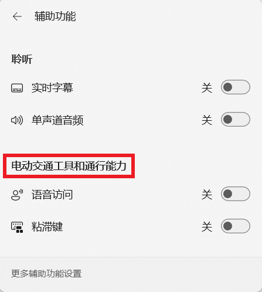
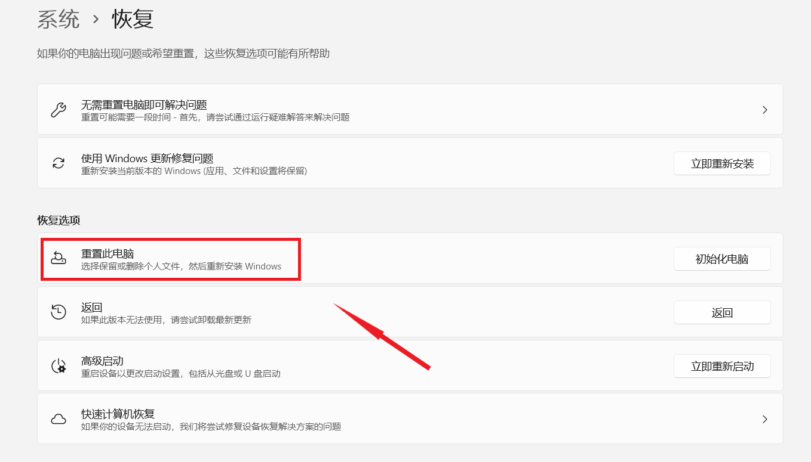
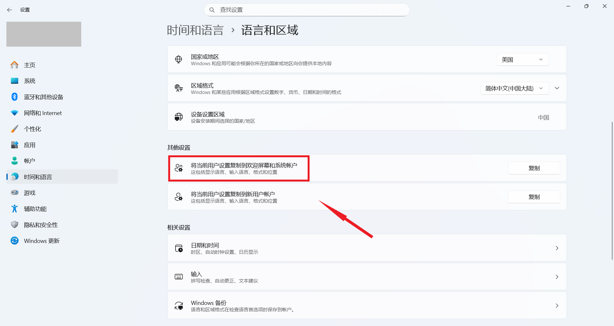
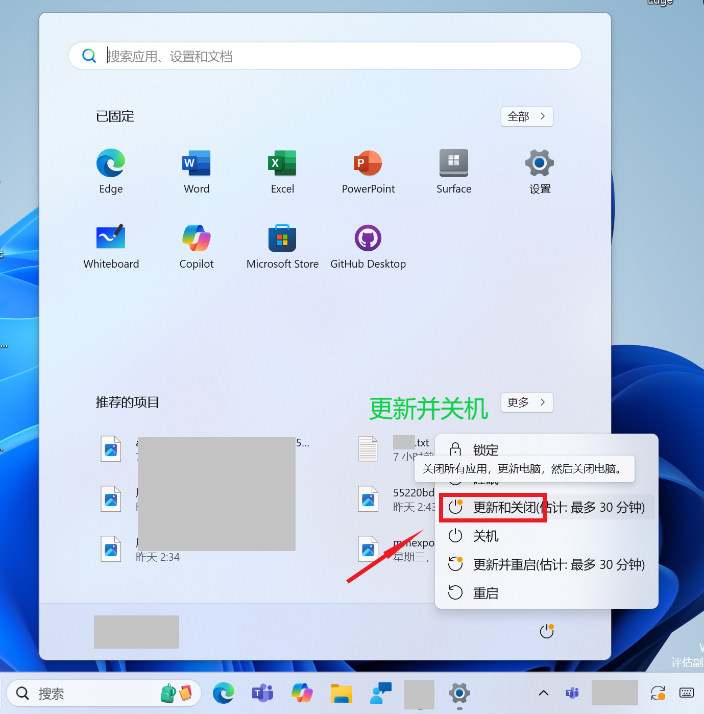

  

<h1 align="center">灵糕中心 (Linggao Hub)</h1>

[github.com/Lingggao/LGHUB](https://github.com/Lingggao/LGHUB) (GitHub)

&emsp;&emsp;**用于跟踪 “Windows 11 预览体验版本 (Canary 频道) 中哪些反馈正在由 Microsoft 调查、处理 / 已做出更改” 的信息枢纽**。由 2021 Windows Insider 最有价值专家 (MVP) · [**Ling Gao**](https://github.com/Lingggao) 先生管理。

&emsp;&emsp;灵糕中心成立于 2023 年 12 月 12 日，其前身可追溯至 2019 年 5 月 14 日由 Microsoft 社区创建的 “[\[BUG 汇总\] Windows 10 2019 年 5 月更新 (1903_18362) 已知问题与处理进度汇总](https://github.com/Lingggao/LGHUB/blob/main/Images/Inherited.png?raw=true)” 讨论话题。

> [!IMPORTANT]
>
> &emsp;灵糕中心为个人项目，管理者不是 Microsoft 公司员工，不能代表 Microsoft 公司立场、态度。本中心无意且无法代替 “反馈中心” (Feedback Hub) 应用的重要作用。本中心不提供 Microsoft 产品技术支持服务。本中心不接受有关 Windows 11 预览体验版本的反馈，用户应始终通过 “反馈中心” 应用提交。
>
> &emsp;Windows、Windows Insider Program 等是 Microsoft 公司的商标。

&emsp;&emsp;**宗旨**：独立管理、服务用户、信息精准、更新及时

[反馈中心](https://aka.ms/fbh) | [深入了解反馈](https://learn.microsoft.com/zh-cn/windows-insider/feedback) | [Flight Hub](https://learn.microsoft.com/en-us/windows-insider/flight-hub) | Windows 预览体验计划 - [网站](https://www.microsoft.com/zh-cn/windowsinsider) · [博客](https://blogs.windows.com/windows-insider) · [X](https://twitter.com/windowsinsider) · Microsoft 社区 ([中](https://learn.microsoft.com/zh-cn/answers/tags/953/windows-insider) / [英](https://learn.microsoft.com/en-us/answers/tags/953/windows-insider))

| 🎖️ **推荐** | **[WinDiscover](https://windiscover.com) - 独立 Microsoft 新闻网站** | **关注 [@Microsoft 信仰中心](https://weibo.com/u/3139784387) 微博** |
| :--------: | :----------------------------------------------------------: | :----------------------------------------------------------: |
|            |            [**LCZBlog**](https://blog.licaoz.com)            |       [**GuCATs'摸鱼站**](https://goo-aw233.github.io)       |

## 总览

| 😸 欢迎加入 [“Ling 的 Windows Insider 小屋”](https://teams.live.com/l/community/FEAd0AVp_B_pTH5Zic) Microsoft Teams 社区 😽 |
| :----------------------------------------------------------: |

| &emsp;&emsp;&emsp;&emsp;&emsp;&emsp;&emsp;&emsp;在 [Microsoft Lists](https://lghub01-my.sharepoint.com/:l:/g/personal/ling_lghub01_onmicrosoft_com/FClnGu07sUVIgSgS1Wokae4BWoMWWF76fu0nGw-ioJ5FSw) 中访问灵糕中心&emsp;&emsp;&emsp;&emsp;&emsp;&emsp;&emsp;&emsp; |
| :----------------------------------------------------------: |

上次更新时间：2025 年 9 月 9 日 13:00 (UTC+8)。Star 数量：54 ⭐

收录反馈 481 个，其中正在调查 32 个 (含[搁置](#3) 13 个)、正在处理 10 个、已修复 439 个。

反馈更新记录：**今日更新反馈状态**。- Ling 🐈🐦 [总览图](https://raw.githubusercontent.com/Lingggao/LGHUB/main/Images/Linggao%20Hub.png) | [反馈更新记录](Documents/Update_Feedback.md) | [平台更新记录](Documents/Update_Platform.md)

[**WIP Canary 27938 更新简报**](Canary.md) | [往期简报](Documents/Canary_Previous)

|         频道         |              最新版本               | 时间 (UTC+8) | 公告 |
| :------------------: | :---------------------------------: | :----------: | :------------------: |
|        Canary        |                **[新]** 27938                |  2025/9/9  | [aka.ms/wip27938](https://blogs.windows.com/windows-insider/2025/09/08/announcing-windows-11-insider-preview-build-27938-canary-channel) |
|       Dev        | 26220.5790 |   2025/9/6   | [aka.ms/wip-dev-9-5-25](https://blogs.windows.com/windows-insider/2025/09/05/announcing-windows-11-insider-preview-build-26220-5790-dev-channel) |
|         Beta         | 26120.5790 |   2025/9/6   | [aka.ms/wip-beta-9-5-25](https://blogs.windows.com/windows-insider/2025/09/05/announcing-windows-11-insider-preview-build-26120-5790-beta-channel) |
| Release Preview  | 26200.5074 |  2025/8/30  | [blogs.windows.com](https://blogs.windows.com/windows-insider/2025/08/29/releasing-windows-11-version-25h2-to-the-release-preview-channel) |
| General Availability |    26100.5074    |  2025/8/30  | [support.microsoft.com](https://support.microsoft.com/en-us/help/5064081) |

统计图 - 2024 年 ([1 - 4 月](Images/Graph_2401_2404.png) · [5 - 8 月](Images/Graph_2405_2408.png) · [9 - 12 月](Images/Graph_2409_2412.png)) | 2025 年 ([1 - 4 月](Images/Graph_2501_2504.png) · [5 - 8 月](Images/Graph_2505_2508.png) · [9 - 12 月](Images/Graph_0.png))

---

> [!NOTE]
>
> &emsp;多数问题是仅有 1 - 2 位 Insiders 反馈的 “偶发性” 问题，而非所有人都会遇到的 “广泛性” 问题。请放心地更新 Windows 11 预览体验版本，不必担心新版使用体验过差。

|      编号       |                             问题                             |   状态   |
| :-------------: | :----------------------------------------------------------: | :------: |
|       ——        |              [**Canary - 公告已知问题**](#0) ▼               |    ——    |
| [LG477](#LG477) | **[置顶] 安装 Canary 27938 版本时可能回滚并显示 0xC1900101 错误**。 | 正在处理 |
| [LG443](#LG443) |         “设置”>“系统”>“存储”>“临时文件” 扫描时卡住。         | 正在处理 |
| [LG478](#LG478) |          **PIX on Windows 无法播放 GPU 捕获内容**。          | 正在处理 |
| [LG479](#LG479) |        **使用浏览器时 (可能还有其他场景) 屏幕闪烁**。        | 正在处理 |
| [LG480](#LG480) |                      **音频停止工作**。                      | 正在处理 |
|       ——        | [**Canary - 公告已知问题**](#0) ▲ \| ▼ [**Canary - 用户反馈问题**](#1) |    ——    |
|       ——        |        ***注**：长期未修复的问题收录于[搁置](#3)板块*        |    ——    |
| [LGH05](#LGH05) |              **[集合] 多款游戏无法正常运行**。               | 正在调查 |
| [LG403](#LG403) | 点击设置菜单 “相关支持” 中的 “更改隐私设置” 时，打开的链接有误。 | 正在调查 |
| [LG413](#LG413) |     “辅助功能” 快速设置中出现 “电动交通工具” 错误翻译。      | 正在调查 |
| [LG424](#LG424) |      “设置”>“鼠标” 菜单中 “主鼠标按钮” 的选项翻译有误。      | 正在调查 |
| [LG427](#LG427) |          任务管理器 “性能” 页面中的选项卡无法对齐。          | 正在调查 |
| [LG429](#LG429) |                      电脑无法正常关机。                      | 正在调查 |
| [LG448](#LG448) |        **[Copilot+ 电脑]** “回顾” 功能无法正常工作。         | 正在调查 |
| [LG449](#LG449) |        搜索栏打开时，切换输入法会导致任务栏图标溢出。        | 正在调查 |
| [LG451](#LG451) |               “更新并关机” 选项无法正常工作。                | 正在处理 |
| [LG457](#LG457) |           Microsoft Visio 应用窗口冻结 / 无响应。            | 正在处理 |
| [LG458](#LG458) |                  使用 Word 应用时电脑卡死。                  | 正在调查 |
| [LG460](#LG460) |           “电池限制” 功能在 Surface UEFI 中消失。            | 正在调查 |
| [LG462](#LG462) |        使用 Windows 图形捕获 API 的应用无法正常工作。        | 正在调查 |
| [LG463](#LG463) |           WinGet 在 PowerShell 和 CMD 中无法识别。           | 正在调查 |
| [LG464](#LG464) |      每次登录 Windows 时，都会自动创建一个系统还原点。       | 正在调查 |
| [LG466](#LG466) |        无法关闭 Xbox 应用中的 “显示其他游戏库” 设置。        | 正在处理 |
| [LG469](#LG469) |               dao360.dll 崩溃问题未完全修复。                | 正在处理 |
| [LG470](#LG470) |        在虚拟机中安装 Canary 版本时出现 0x17E 绿屏。         | 正在处理 |
| [LG472](#LG472) |  “动态锁” 功能频繁激活蓝牙控制器，阻止电脑进入低功耗状态。   | 正在调查 |
| [LG473](#LG473) |                    HDR 功能无法正常工作。                    | 正在调查 |
| [LG474](#LG474) |   运行 netsh.exe 时事件查看器会记录 Change-Monitor 错误。    | 正在调查 |
| [LG476](#LG476) |              “位置” 选项未经用户许可自动开启。               | 正在调查 |
|       ——        | [**Canary - 用户反馈问题**](#1) ▲ \| ▼ [**Canary - 归档 (已做出更改 0 - 7 天)**](#2) |    ——    |
| [LG456](#LG456) |               “重置此电脑” 功能无法正常使用。                | 已修复 ✓ |
| [LG445](#LG445) |           深色模式下文件资源管理器中的颜色不正确。           | 已修复 ✓ |
| [LG252](#LG252) |              组策略编辑器和服务管理器 UI 错误。              | 已修复 ✓ |
| [LG437](#LG437) |       登录界面中 “Microsoft 账户密码” 选项不显示图标。       | 已修复 ✓ |
| [LG450](#LG450) |           关闭工作室效果后，控制中心仍显示其开启。           | 已修复 ✓ |
| [LG453](#LG453) |   使用 “将当前用户设置复制到......” 选项时，设置菜单崩溃。   | 已修复 ✓ |
| [LG459](#LG459) |               点击开始菜单时有 1 - 2 秒延迟。                | 已修复 ✓ |
| [LG461](#LG461) |        启动记事本应用时，会在输入法列表添加一个键盘。        | 已修复 ✓ |
| [LG465](#LG465) |                 任务栏应用窗口预览发生错位。                 | 已修复 ✓ |
| [LG467](#LG467) |         使用 “wt” 启动 Windows 终端时出现显示异常。          | 已修复 ✓ |
| [LG468](#LG468) |   更新 Canary 27934 版本后出现 “不满足最低系统要求” 提示。   | 已修复 ✓ |
| [LG471](#LG471) |        “更新并关机” 选项被错误地翻译为 “更新和关闭”。        | 已修复 ✓ |
| [LG475](#LG475) |         更新 Canary 27934 版本后 Windows 激活丢失。          | 已修复 ✓ |
|       ——        | ***注**：部分未收录的问题详见 [WIP Canary 27938 更新简报](Canary.md)* |    ——    |
|       ——        |       ▲ [**Canary - 归档 (已做出更改 0 - 7 天)**](#2)        |    ——    |
|       ——        | [**Canary - 归档 (已做出更改 >7 天)**](7+.md) \| [**Canary - 搁置 (未做出更改)**](#3) |    ——    |

[分享反馈线索](https://forms.office.com/Pages/ResponsePage.aspx?id=DQSIkWdsW0yxEjajBLZtrQAAAAAAAAAAAAO__Q3sH7RUNjUyUzJLN0JBREZGMzBBVlpVOEVBQkRENy4u) | [反馈平台问题](https://forms.office.com/Pages/ResponsePage.aspx?id=DQSIkWdsW0yxEjajBLZtrQAAAAAAAAAAAAO__Q3sH7RUQ0haOElMVkxOWDE4U1pHQUZWMDhEM1gwSC4u)

## Canary - 公告已知问题

> [!TIP]
>
> &emsp;记录 [Windows Insider 博客](https://blogs.windows.com/windows-insider)中明确公开的已知问题。

---

编号：LG477  
日期：2025 年 9 月 9 日  
版本：Canary 27938  
**问题**：**[置顶] 安装 Canary 27938 版本时可能回滚并显示 0xC1900101 错误**。  
状态：  
Microsoft 官方回复：“部分 Windows 预览体验成员安装此版本时可能出现回滚，并显示 0xC1900101-0x20017 或 0xC1900101-0x30017 错误。遗憾的是，重新尝试安装仍将再次回滚。我们正在努力修复中。” *(Ling 译)*  

---

编号：LG443  
日期：2025 年 8 月 16 日  
版本：Canary 27924 - 27938  
**问题**：**“设置”>“系统”>“存储”>“临时文件” 扫描时卡住**。  
状态：  
典型反馈：[aka.ms/AAxl4nc](https://aka.ms/AAxl4nc) & [aka.ms/AAxoo3v](https://aka.ms/AAxoo3v) 

---

编号：LG478  
日期：2025 年 9 月 9 日  
版本：Canary 27938  
**问题**：**PIX on Windows 无法播放 GPU 捕获内容**。  
状态：  
Microsoft 官方回复：“此问题将在预计 9 月底发布的新版本 PIX 中修复。受此影响的用户可通过 PIX 中的 ‘发送反馈’ 按钮提交问题，或前往 DirectX Discord 服务器联系我们获取私有版本。” *(Ling 译)* 

- [**PIX on Windows**](https://devblogs.microsoft.com/pix/download)
- [**DirectX Discord 服务器**](https://discord.com/invite/BBZyTEA3MR)

---

编号：LG479  
日期：2025 年 9 月 9 日  
版本：Canary 27938  
**问题**：**使用浏览器时 (可能还有其他场景) 屏幕闪烁**。  
状态：

---

编号：LG480  
日期：2025 年 9 月 9 日  
版本：Canary 27938  
**问题**：**音频停止工作**。  
状态：  
Microsoft 官方回复：“部分 Windows 预览体验成员可能会遇到 ‘音频停止工作’ 的问题。设备管理器中的部分设备 (如 ACPI 音频合成器) 显示黄色感叹号，并提示 ‘Windows 无法加载此硬件的驱动程序，它可能已损坏或丢失’。如果您遇到了此问题，可以参照以下步骤进行恢复。” *(Ling 译)* 

**步骤**

1. 右键点击设备管理器中显示黄色感叹号的设备，选择 “更新驱动程序”。
2. 选择 “浏览我的电脑以查找驱动程序”>“让我从计算机上的可用驱动程序列表中选取”。
3. 选中日期最近的驱动，点击 “下一步”，黄色感叹号将会消失。
4. 对其他的异常设备重复上述步骤。

## Canary - 用户反馈问题

> [!TIP]
>
> &emsp;记录[反馈中心应用](https://aka.ms/fbh)中 Microsoft 明确响应的问题。

---

编号：LGH05  
日期：2025 年 9 月 9 日  
版本：Canary  
**集合**：**多款游戏无法正常运行**。  
状态：

**列表**

- PUBG - LG381 
- 守望先锋 2 (Overwatch 2) - LG400 
- NBA2K - LG410 

---

编号：LG403  
日期：2025 年 6 月 14 日  
版本：Canary 27871 - 27938  
**问题**：**点击设置菜单 “相关支持” 中的 “更改隐私设置” 时，打开的链接有误**。  
状态：  
典型反馈：[aka.ms/AAwoi47](https://aka.ms/AAwoi47)

---

编号：LG413  
日期：2025 年 6 月 25 日  
版本：Canary 27881 - 27938  
**问题**：**“辅助功能” 快速设置中出现 “电动交通工具” 错误翻译**。  
状态：  
典型反馈：[aka.ms/AAwtbwl](https://aka.ms/AAwtbwl)

---

编号：LG424  
日期：2025 年 7 月 19 日  
版本：Canary 27902 - 27938  
**问题**：**“设置”>“鼠标” 菜单中 “主鼠标按钮” 的选项翻译有误**。  
状态：  
典型反馈：[aka.ms/AAx2o1o](https://aka.ms/AAx2o1o)

---

编号：LG427  
日期：2025 年 7 月 19 日  
版本：Canary 27902 - 27938  
**问题**：**任务管理器 “性能” 页面中的选项卡无法对齐**。  
状态：  
典型反馈：[aka.ms/AAx0xzj](https://aka.ms/AAx0xzj)

---

编号：LG429  
日期：2025 年 7 月 19 日  
版本：Canary 27891 - 27938  
**问题**：**电脑无法正常关机**。  
状态：  
典型反馈：[aka.ms/AAx2o1u](https://aka.ms/AAx2o1u)

---

编号：LG448  
日期：2025 年 8 月 24 日  
版本：Canary 27928 - 27938  
**问题**：**[Copilot+ 电脑] “回顾” 功能无法正常工作**。  
状态：  
典型反馈：[aka.ms/AAxlcug](https://aka.ms/AAxlcug)

---

编号：LG449  
日期：2025 年 8 月 24 日  
版本：Canary 27928 - 27938  
**问题**：**搜索栏打开时，切换输入法会导致任务栏图标溢出**。  
状态：  
典型反馈：[aka.ms/AAxljuq](https://aka.ms/AAxljuq)

---

编号：LG451  
日期：2025 年 8 月 24 日  
版本：ALL  
**问题**：**“更新并关机” 选项无法正常工作**。  
状态：  
典型反馈：[aka.ms/AAxogk4](https://aka.ms/AAxogk4)

---

编号：LG457  
日期：2025 年 9 月 2 日  
版本：Canary 27934 - 27938  
**问题**：**Microsoft Visio 应用窗口冻结 / 无响应**。  
状态：  
典型反馈：[aka.ms/AAxoh9o](https://aka.ms/AAxoh9o) 

---

编号：LG458  
日期：2025 年 9 月 2 日  
版本：Canary 27934 - 27938  
**问题**：**使用 Word 应用时电脑卡死**。  
状态：  
典型反馈：[aka.ms/AAxqsce](https://aka.ms/AAxqsce)

---

编号：LG460  
日期：2025 年 9 月 2 日  
版本：Canary 27934 - 27938  
**问题**：**“电池限制” 功能在 Surface UEFI 中消失**。  
状态：  
典型反馈：[aka.ms/AAxqzz0](https://aka.ms/AAxqzz0)

---

编号：LG462  
日期：2025 年 9 月 2 日  
版本：Canary 27934 - 27938  
**问题**：**使用 Windows 图形捕获 API 的应用无法正常工作**。  
状态：  
典型反馈：[aka.ms/AAxqsck](https://aka.ms/AAxqsck)

---

编号：LG463  
日期：2025 年 9 月 2 日  
版本：Canary 27934 - 27938  
**问题**：**WinGet 在 PowerShell 和 CMD 中无法识别**。  
状态：  
典型反馈：[aka.ms/AAulrb4](https://aka.ms/AAulrb4)

---

编号：LG464  
日期：2025 年 9 月 2 日  
版本：Canary 27934 - 27938  
**问题**：**每次登录 Windows 时，都会自动创建一个系统还原点**。  
状态：  
典型反馈：[aka.ms/AAxr7jj](https://aka.ms/AAxr7jj)

---

编号：LG466  
日期：2025 年 9 月 5 日  
版本：ALL  
**问题**：**无法关闭 Xbox 应用中的 “显示其他游戏库” 设置**。  
状态：  
典型反馈：[aka.ms/AAxu39x](https://aka.ms/AAxu39x)

---

编号：LG469  
日期：2025 年 9 月 5 日  
版本：Canary 27928 - 27938  
**问题**：**dao360.dll 崩溃问题未完全修复**。  
状态：  
典型反馈：[aka.ms/AAxuayr](https://aka.ms/AAxuayr) 

---

编号：LG470  
日期：2025 年 9 月 5 日  
版本：Canary 27934 - 27938  
**问题**：**在虚拟机中安装 Canary 版本时出现 0x17E 绿屏**。  
状态：  
典型反馈：[aka.ms/AAxu3a9](https://aka.ms/AAxu3a9) 

---

编号：LG472  
日期：2025 年 9 月 8 日  
版本：Canary 27934 - 27938  
**问题**：**“动态锁” 功能频繁激活蓝牙控制器，阻止电脑进入低功耗状态**。  
状态：  
典型反馈：[aka.ms/AAxuefp](https://aka.ms/AAxuefp)

---

编号：LG473  
日期：2025 年 9 月 8 日  
版本：Canary 27934 - 27938  
**问题**：**HDR 功能无法正常工作**。  
状态：  
典型反馈：[aka.ms/AAxu6nk](https://aka.ms/AAxu6nk)

---

编号：LG474  
日期：2025 年 9 月 8 日  
版本：Canary 27934 - 27938  
**问题**：**运行 netsh.exe 时事件查看器会记录 Change-Monitor 错误**。  
状态：  
典型反馈：[aka.ms/AAxuefr](https://aka.ms/AAxuefr)

---

编号：LG476  
日期：2025 年 9 月 8 日  
版本：Canary 27934 - 27938  
**问题**：**“位置” 选项未经用户许可自动开启**。  
状态：  
典型反馈：[aka.ms/AAxueg3](https://aka.ms/AAxueg3)

## Canary - 归档 (已做出更改)

> [!TIP]
>
> &emsp;记录 Microsoft 已做出更改 0 - 7 天的问题 & 超过 14 天无新增赞成票的问题。
>
> &emsp;无特殊情况，问题归档后不再更新。

---

编号：LG456  
日期：2025 年 9 月 2 日  
版本：Canary 27934  
**问题**：**“重置此电脑” 功能无法正常使用**。  
状态：Canary 27938 -  - 已修复 ✓

---

编号：LG445  
日期：2025 年 8 月 16 日  
版本：Canary 27924 - 27934  
**问题**：**深色模式下文件资源管理器中的颜色不正确**。  
状态：Canary 27938 -  - 已修复 ✓

---

编号：LG252  
日期：2024 年 12 月 20 日  
版本：Canary 27764 - 27934  
**问题**：**组策略编辑器和服务管理器 UI 错误**。  
状态：Canary 27938 -  - 已修复 ✓  
典型反馈：[aka.ms/AAty56l](https://aka.ms/AAty56l) 

---

编号：LG437  
日期：2025 年 8 月 5 日  
版本：Canary 27913 - 27934  
**问题**：**登录界面中 “Microsoft 账户密码” 选项不显示图标**。  
状态：Canary 27938 -  - 已修复 ✓  
典型反馈：[aka.ms/AAxhokm](https://aka.ms/AAxhokm)

---

编号：LG450  
日期：2025 年 8 月 24 日  
版本：Canary 27928 - 27934  
**问题**：**关闭工作室效果后，控制中心仍显示其开启**。  
状态：Canary 27938 -  - 已修复 ✓  
典型反馈：[aka.ms/AAxoo4i](https://aka.ms/AAxoo4i)

---

编号：LG453  
日期：2025 年 8 月 24 日  
版本：Canary 27928 - 27934  
**问题**：**使用 “将当前用户设置复制到......” 选项时，设置菜单崩溃**。  
状态：Canary 27938 -  - 已修复 ✓  
典型反馈：[aka.ms/AAxogjz](https://aka.ms/AAxogjz) 

---

编号：LG459  
日期：2025 年 9 月 2 日  
版本：Canary 27934  
**问题**：**点击开始菜单时有 1 - 2 秒延迟**。  
状态：Canary 27938 -  - 已修复 ✓  
典型反馈：[aka.ms/AAxr7jf](https://aka.ms/AAxr7jf)

---

编号：LG461  
日期：2025 年 9 月 2 日  
版本：Canary 27934  
**问题**：**启动记事本应用时，会在输入法列表添加一个键盘**。  
状态：Canary 27938 -  - 已修复 ✓  
典型反馈：[aka.ms/AAxr7j8](https://aka.ms/AAxr7j8)

---

编号：LG465  
日期：2025 年 9 月 5 日  
版本：Canary 27934  
**问题**：**任务栏应用窗口预览发生错位**。  
状态：Canary 27938 -  - 已修复 ✓  
典型反馈：[aka.ms/AAxtvks](https://aka.ms/AAxtvks)

---

编号：LG467  
日期：2025 年 9 月 5 日  
版本：Canary 27934  
**问题**：**使用 “wt” 启动 Windows 终端时出现显示异常**。  
状态：Canary 27938 -  - 已修复 ✓  
典型反馈：[aka.ms/AAxtvkx](https://aka.ms/AAxtvkx)

---

编号：LG468  
日期：2025 年 9 月 5 日  
版本：Canary 27934  
**问题**：**更新 Canary 27934 版本后出现 “不满足最低系统要求” 提示**。  
状态：Canary 27938 -  - 已修复 ✓  
典型反馈：[aka.ms/AAxuaym](https://aka.ms/AAxuaym)

---

编号：LG471  
日期：2025 年 9 月 8 日  
版本：ALL  
**问题**：**“更新并关机” 选项被错误地翻译为 “更新和关闭”**。  
状态：ALL -  - 已修复 ✓  
典型反馈：[aka.ms/AAxtyzd](https://aka.ms/AAxtyzd)

---

编号：LG475  
日期：2025 年 9 月 8 日  
版本：Canary 27934  
**问题**：**更新 Canary 27934 版本后 Windows 激活丢失**。  
状态：Canary 27938 -  - 已修复 ✓  
典型反馈：[aka.ms/AAxtyzv](https://aka.ms/AAxtyzv)

---

*部分未收录反馈详见 [WIP Canary 27938 更新简报](Canary.md)*

[Microsoft 已做出更改 >7 天的问题](7+.md)

## Canary - 搁置 (未做出更改)

> [!TIP]
>
> &emsp;并非所有软件缺陷都要修复。
>
> &emsp;已收录的反馈也可能因缺少资源、修复风险过大、商业决策调整等长期或永久不予修复。本板块记录 Microsoft 超过 90 天未修复的问题，中心将每间隔 30 天在 Canary 频道最新版本中进行测试。

[Microsoft 超过 90 天未修复的问题](90+.md)

---

[回到顶部](#HEAD)

  

在 “[署名 - 相同方式共享 4.0](https://creativecommons.org/licenses/by-sa/4.0/legalcode.zh-Hans)” 协议 (CC BY-SA 4.0) 之条款下提供。

2023 - 2025, [高楷修 (Ling Gao)](https://github.com/Lingggao), 灵糕中心 (Linggao Hub), [github.com/Lingggao/LGHUB](https://github.com/Lingggao/LGHUB)

[字体许可使用授权书](Images/字体许可使用授权书.png) | [Windows Insider 最有价值专家](https://github.com/Lingggao/LGHUB/blob/main/Images/Windows%20Insider%20MVP.png?raw=true)