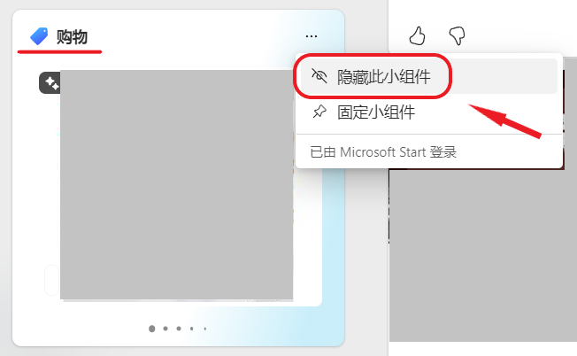

<SPAN ID = 'HEAD'/>


# 灵糕中心 (Linggao Hub)

[github.com/Lingggao/LGHUB](https://github.com/Lingggao/LGHUB)

&emsp;&emsp;用于跟踪 “**Windows 11 预览体验版本 (Canary 频道) 哪些反馈正在由 Microsoft 调查 / 处理 / 已做出更改**” 的信息枢纽。由 2021 Windows Insider Most Valuable Professional (MVP) · **Ling Gao** 先生管理。

> &emsp;**声明**：灵糕中心的管理者不是 Microsoft 公司全职员工 (FTE)，不能代表 Microsoft 公司立场、态度。中心无意且无法代替 “反馈中心” (Feedback Hub) 应用的重要作用。中心不提供 Microsoft 产品技术支持服务。中心不接受有关 Windows 11 预览体验版本的反馈，用户应始终通过 “反馈中心” 应用提交。

> &emsp;Windows、Windows Insider Program 等是 Microsoft 公司的商标。

&emsp;&emsp;**宗旨**：独立管理、服务用户、信息精准、更新及时。

[反馈中心](https://aka.ms/fbh) | [深入了解反馈](https://learn.microsoft.com/zh-cn/windows-insider/feedback) | [Flight Hub](https://learn.microsoft.com/en-us/windows-insider/flight-hub) | Windows 预览体验计划 - [网站](https://www.microsoft.com/zh-cn/windowsinsider) · [博客](https://blogs.windows.com/windows-insider) · [X (Twitter)](https://twitter.com/windowsinsider) · [社区](https://answers.microsoft.com/zh-hans/insider/forum)

## ✦ 总览 ✦

&emsp;&emsp;上次更新时间：2024 年 2 月 9 日 7:00 (UTC+8)。记录的反馈数量：66，访问次数：680+

&emsp;&emsp;中心更新目录：**祝大家身体健康、工作顺利、阖家幸福、龙年吉祥！**- Ling 2/9 🐉 [获取总览图](https://raw.githubusercontent.com/Lingggao/LGHUB/main/Linggao%20Hub.png) | [已修复图]()

|     频道     |      最新版本       |   时间   |                             公告                             |
| :----------: | :-----------------: | :------: | :----------------------------------------------------------: |
| Canary & Dev |   [新] **26052**    | 2024/2/9 | [aka.ms/wip26052](https://blogs.windows.com/windows-insider/2024/02/08/announcing-windows-11-insider-preview-build-26052-canary-and-dev-channels) |
|     Beta     | [新] **22635.3140** | 2024/2/9 | [aka.ms/wip-beta-2-8](https://blogs.windows.com/windows-insider/2024/02/08/announcing-windows-11-insider-preview-build-22635-3140-beta-channel) |

| 编号 (点击跳转) |                             问题                             |       状态       |
| :-------------: | :----------------------------------------------------------: | :--------------: |
| [LG002](#LG002) |                部分热门游戏可能无法正常运行。                | 需要更多详细信息 |
| [LG054](#LG054) |   Microsoft Store 中的部分视频流媒体应用可能无法正常播放。   |     正在处理     |
| [LG056](#LG056) |             显示器黑屏 / 电脑无法从睡眠中唤醒。              |     正在处理     |
| [LG066](#LG066) | 设置 > 系统 > 屏幕 > 显示卡位置出现 “显示连接” 选项，点击时菜单崩溃。 |     正在处理     |
|     **——**      | [**Canary - 公告已知问题**](#0) **▲ \| ▼** [**Canary - 用户反馈问题**](#1) |      **——**      |
| [LG013](#LG013) |           “设置”>“应用”>“启动” 页面中的图标异常。            |     正在调查     |
| [LG015](#LG015) |      在文件资源管理器中按下两次 F11 后地址栏将被冻结。       |     正在调查     |
| [LG018](#LG018) | Oracle VM VirtualBox 软件无法启动，显示 “Unknown rc=-3748” 错误。 |     正在处理     |
| [LG019](#LG019) |            远程桌面显示 “图形组件无法启动” 错误。            |     正在处理     |
| [LG022](#LG022) |            Windows Sandbox 显示 0x80072746 错误。            |     正在处理     |
| [LG024](#LG024) | Tips (提示) 应用现已移除，但 “Windows 更新”>“更新历史记录” 页面中的 “查看新增功能” 选项仍指向此应用，导致显示 “没有可打开 ms-get-started 链接的应用” 错误。 |     正在调查     |
| [LG028](#LG028) | 文件资源管理器地址栏中图标和箭头间有一个缝隙，可能导致不小心切换为编辑模式。 |     正在调查     |
| [LG030](#LG030) | 在 Microsoft Store 中下载 Xbox Identity Provider 时显示 0x80073CFB 错误。 |     正在调查     |
| [LG031](#LG031) |    Microsoft Edge (正式版) “固定到任务栏” 功能可能失效。     |     正在调查     |
| [LG033](#LG033) | “阿凡达：潘多拉边境” (Avatar Frontiers of Pandora) 游戏崩溃。 |     正在调查     |
| [LG034](#LG034) |          Grand Theft Auto V (GTA 5) 游戏无法运行。           |     正在调查     |
| [LG037](#LG037) |    显示 WDAG (Edge) - Container: Error: 0x80004005 错误。    |     正在处理     |
| [LG040](#LG040) |    文件资源管理器 “登录时还原上一个文件夹窗口” 选项失效。    |     正在调查     |
| [LG045](#LG045) |                        共享窗口崩溃。                        |     正在处理     |
| [LG046](#LG046) |           远程桌面显示 0x3 错误 / 0x11 扩展错误。            |     正在调查     |
| [LG049](#LG049) |  事件查看器显示 DeviceSetupManager 元数据错误 (事件 131)。   |     正在调查     |
| [LG055](#LG055) |              隐藏 “购物” 等小组件后其再次出现。              |     正在调查     |
| [LG057](#LG057) |              战眼 (BattlEye) 反作弊系统不兼容。              |     正在调查     |
| [LG058](#LG058) | 在 Microsoft Store 更新 “快速助手” 应用时显示 0x80073CFB 错误。 |     正在调查     |
| [LG059](#LG059) |               罗布乐思 (Roblox) 无法正常运行。               |     正在调查     |
| [LG060](#LG060) |            堡垒之夜 (Fortnite) 游戏无法正常运行。            |     正在调查     |
| [LG061](#LG061) |                    EA 反作弊系统不兼容。                     |     正在调查     |
| [LG062](#LG062) |    彩虹六号：围攻 (Rainbow Six Siege) 游戏无法正常运行。     |     正在调查     |
| [LG063](#LG063) |              绝地求生 (PUBG) 游戏无法正常运行。              |     正在调查     |
| [LG064](#LG064) |   全新安装 Windows 11 时，系统生成 Windows.old 空文件夹。    |     正在调查     |
| [LG065](#LG065) |              使用浏览器观看视频时屏幕可能冻结。              |     正在处理     |
|     **——**      | [**Canary - 用户反馈问题**](#1) **▲ \| ▼** [**Canary - 归档 (已做出更改 14 - 28 天)**](#2) |      **——**      |
| [LG067](#LG067) |       设置 > 个性化 > 任务栏位置的 Copilot 图标偏黄。        |     已修复 ✓     |
| [LG053](#LG053) |                使用多显示器时，屏幕可能冻结。                |     已修复 ✓     |
| [LG004](#LG004) |            打开打印队列时提示 “找不到应用程序”。             |     已修复 ✓     |
| [LG008](#LG008) |        “Wallpaper Engine：壁纸引擎” 等壁纸软件崩溃。         |     已修复 ✓     |
| [LG007](#LG007) |            切换桌面时任务栏应用图标可能随机消失。            |     已修复 ✓     |
| [LG021](#LG021) |      调节任务栏 “快速设置” 中的音量滑块时不再发出声音。      |     已修复 ✓     |
| [LG035](#LG035) |  极限竞速 (Forza Motorsport) Racing World 无法运行 / 崩溃。  |     已修复 ✓     |
| [LG047](#LG047) |         运行 WinSCP 时电脑出现 win32kbase.sys 绿屏。         |     已修复 ✓     |
| [LG048](#LG048) | 极限竞速：地平线 5 (Forza Horizon 5) 游戏停止运行，显示 0xc0000005 错误。 |     已修复 ✓     |
| [LG050](#LG050) |          启动 Print Spooler 服务时显示错误 / 崩溃。          |     已修复 ✓     |
|     **——**      |     ✦ [**Canary - 归档 (已做出更改 >28 天)**](28+.md) ✦      |      **——**      |

[**希望分享线索？联系 Ling Gao**](https://forms.office.com/Pages/ResponsePage.aspx?id=DQSIkWdsW0yxEjajBLZtrQAAAAAAAAAAAAO__Q3sH7RUNjUyUzJLN0JBREZGMzBBVlpVOEVBQkRENy4u)

**标准格式**

```markdown
<SPAN ID = 'LGxxx'/>编号：LGxxx  
版本：Canary xxxxx  
**问题**：**xxxxx**  
状态：正在调查 / 正在处理 / 需要更多详细信息 / 所做的更改 / (其他)  
Microsoft 官方回复 (如果有)：xxxxx  
典型反馈 (如果有)：[aka.ms/AAxxxxx](https://aka.ms/fbh)  
图像等补充信息 (如果有)
```

<SPAN ID = '0'/>

## ✦ Canary - 公告已知问题 ✦

&emsp;&emsp;记录 [Windows Insider 博客](https://blogs.windows.com/windows-insider)中明确公开的已知问题。

---

<SPAN ID = 'LG002'/>编号：LG002  
版本：Canary 25951 - 26052  
**问题**：**部分热门游戏可能无法正常运行**。  
状态：  
Microsoft 官方回复：“从 Build 26016 开始，更多游戏正在受到多个错误的影响。从 Build 26040 开始，部分游戏可能导致电脑绿屏。如果您在预览体验版本中玩游戏时发现任何问题，请务必在反馈中心提交。” *(Ling 译)*  


---

<SPAN ID = 'LG054'/>编号：LG054  
版本：Canary 26040 - 26052  
**问题**：**Microsoft Store 中的部分视频流媒体应用可能无法正常播放**。  
状态：  
Microsoft 官方回复：“请暂时使用浏览器播放视频，作为一种变通方案。” *(Ling 译)* 

---

<SPAN ID = 'LG056'/>编号：LG056  
版本：Canary 26040 - 26052  
**问题**：**显示器黑屏 / 电脑无法从睡眠中唤醒**。  
状态：  
Microsoft 官方回复：“如果您遇到了这种情况，请尝试按下键盘快捷键 WIN + CTRL + Shift + B，看看能否解决问题。” *(Ling 译)*   
典型反馈：[aka.ms/AAovgp0](https://aka.ms/AAovgp0)

---

<SPAN ID = 'LG066'/>编号：LG066  
版本：Canary 26052  
**问题**：**设置 > 系统 > 屏幕 > 显示卡位置出现 “显示连接” 选项，点击时菜单崩溃**。  
状态：  
Microsoft 官方回复：“此选项将在未来的版本中移除。” *(Ling 译)* 


---

[**希望分享线索？联系 Ling Gao**](https://forms.office.com/Pages/ResponsePage.aspx?id=DQSIkWdsW0yxEjajBLZtrQAAAAAAAAAAAAO__Q3sH7RUNjUyUzJLN0JBREZGMzBBVlpVOEVBQkRENy4u)

<SPAN ID = '1'/>

## ✦ Canary - 用户反馈问题 ✦

&emsp;&emsp;记录[反馈中心应用](https://aka.ms/fbh)中 Microsoft 明确响应的问题。

---

<SPAN ID = 'LG013'/>编号：LG013  
版本：Canary 26002 - 26052  
**问题**：**“设置”>“应用”>“启动” 页面中的图标异常**。  
状态：  
典型反馈：[aka.ms/AAo5wd6](https://aka.ms/AAo5wd6)


---

<SPAN ID = 'LG015'/>编号：LG015  
版本：Canary 25992 - 26052  
**问题**：**在文件资源管理器中按下两次 F11 后地址栏将被冻结**。  
状态：  
典型反馈：[aka.ms/AAnkkd6](https://aka.ms/AAnkkd6)

---

<SPAN ID = 'LG018'/>编号：LG018  
版本：Canary 25987 - 26052  
**问题**：**Oracle VM VirtualBox 软件无法启动，显示 “Unknown rc=-3748” 错误**。  
状态：  
典型反馈：[aka.ms/AAo7kst](https://aka.ms/AAo7kst)

---

<SPAN ID = 'LG019'/>编号：LG019  
版本：Canary 25997 - 26052  
**问题**：**远程桌面显示 “图形组件无法启动” 错误**。  
状态：  
典型反馈：[aka.ms/AAnyzb4](https://aka.ms/AAnyzb4)

---

<SPAN ID = 'LG022'/>编号：LG022  
版本：Canary 25997 - 26052  
**问题**：**Windows Sandbox 显示 0x80072746 错误**。  
状态：  
典型反馈：[aka.ms/AAo6y4i](https://aka.ms/AAo6y4i)

---

<SPAN ID = 'LG024'/>编号：LG024  
版本：Canary 26002 - 26052  
**问题**：**Tips (提示) 应用现已移除，但 “Windows 更新”>“更新历史记录” 页面中的 “查看新增功能” 选项仍指向此应用，导致显示 “没有可打开 ms-get-started 链接的应用” 错误**。  
状态：  
典型反馈：[aka.ms/AAo7div](https://aka.ms/AAo7div)


---

<SPAN ID = 'LG028'/>编号：LG028  
版本：未知 - Canary 26052  
**问题**：**文件资源管理器地址栏中图标和箭头间有一个缝隙，可能导致不小心切换为编辑模式**。  
状态：  
典型反馈：[aka.ms/AAo7kib](https://aka.ms/AAo7kib)


---

<SPAN ID = 'LG030'/>编号：LG030  
版本：Canary 25905 - 26052  
**问题**：**在 Microsoft Store 中下载 Xbox Identity Provider 时显示 0x80073CFB 错误**。  
状态：  
典型反馈：[aka.ms/AAlzfg7](https://aka.ms/AAlzfg7)

---

<SPAN ID = 'LG031'/>编号：LG031  
版本：ALL  
**问题**：**Microsoft Edge (正式版) “固定到任务栏” 功能可能失效**。  
状态：  
Microsoft 官方回复：“Edge 团队正在积极研究中。” *(Ling 译)* 


---

<SPAN ID = 'LG033'/>编号：LG033  
版本：Canary 26016 - 26052  
**问题**：**“阿凡达：潘多拉边境” (Avatar Frontiers of Pandora) 游戏崩溃**。  
状态：  
典型反馈：[aka.ms/AAoa2ag](https://aka.ms/AAoa2ag)

---

<SPAN ID = 'LG034'/>编号：LG034  
版本：Canary 26016 - 26052  
**问题**：**Grand Theft Auto V (GTA 5) 游戏无法运行**。  
状态：  
典型反馈：[aka.ms/AAo9e71](https://aka.ms/AAo9e71)

---

<SPAN ID = 'LG037'/>编号：LG037  
版本：Canary 25997 - 26052  
**问题**：**显示 WDAG (Edge) - Container: Error: 0x80004005 错误**。  
状态：  
Microsoft 官方回复：“我们正在努力修复此问题。” *(Ling 译)*   
典型反馈：[aka.ms/AAnzef8](https://aka.ms/AAnzef8)

---

<SPAN ID = 'LG040'/>编号：LG040  
版本：未知 - Canary 26052  
**问题**：**文件资源管理器 “登录时还原上一个文件夹窗口” 选项失效**。  
状态：  
典型反馈：[aka.ms/AAoawwk](https://aka.ms/AAoawwk)


---

<SPAN ID = 'LG045'/>编号：LG045  
版本：ALL  
**问题**：**共享窗口崩溃**。  
状态：  
典型反馈：[aka.ms/AAohsni](https://aka.ms/AAohsni)

---

<SPAN ID = 'LG046'/>编号：LG046  
版本：Canary 26020 - 26052  
**问题**：**远程桌面显示 0x3 错误 / 0x11 扩展错误**。  
状态：  
典型反馈：[aka.ms/AAnyjyk](https://aka.ms/AAnyjyk)

---

<SPAN ID = 'LG049'/>编号：LG049  
版本：Canary 26020 - 26052  
**问题**：**事件查看器显示 DeviceSetupManager 元数据错误 (事件 131)**。  
状态：  
典型反馈：[aka.ms/AAoipfs](https://aka.ms/AAoipfs)

---

<SPAN ID = 'LG055'/>编号：LG055  
版本：Canary 26040 - 26052  
**问题**：**隐藏 “购物” 等小组件后其再次出现**。  
状态：  
典型反馈：[aka.ms/AAotzrh](https://aka.ms/AAotzrh)



---

<SPAN ID = 'LG057'/>编号：LG057  
版本：Canary 26040 - 26052  
**问题**：**战眼 (BattlEye) 反作弊系统不兼容**。  
状态：  
典型反馈：[aka.ms/AAox7us](https://aka.ms/AAox7us)

---

<SPAN ID = 'LG058'/>编号：LG058  
版本：Canary 26040 - 26052  
**问题**：**在 Microsoft Store 更新 “快速助手” 应用时显示 0x80073CFB 错误**。  
状态：  
典型反馈：[aka.ms/AAov9fo](https://aka.ms/AAov9fo)

---

<SPAN ID = 'LG059'/>编号：LG059  
版本：Canary 26040 - 26052  
**问题**：**罗布乐思 (Roblox) 无法正常运行**。  
状态：  
典型反馈：[aka.ms/AAovw5h](https://aka.ms/AAovw5h)

---

<SPAN ID = 'LG060'/>编号：LG060  
版本：Canary 26040 - 26052  
**问题**：**堡垒之夜 (Fortnite) 游戏无法正常运行**。  
状态：  
典型反馈：[aka.ms/AAow3xj](https://aka.ms/AAow3xj)

---

<SPAN ID = 'LG061'/>编号：LG061  
版本：Canary 26040 - 26052  
**问题**：**EA 反作弊系统不兼容**。  
状态：  
典型反馈：[aka.ms/AAox7vk](https://aka.ms/AAox7vk)

---

<SPAN ID = 'LG062'/>编号：LG062  
版本：Canary 26040 - 26052  
**问题**：**彩虹六号：围攻 (Rainbow Six Siege) 游戏无法正常运行**。  
状态：  
典型反馈：[aka.ms/AAow3xx](https://aka.ms/AAow3xx)

---

<SPAN ID = 'LG063'/>编号：LG063  
版本：Canary 26040 - 26052  
**问题**：**绝地求生 (PUBG) 游戏无法正常运行**。  
状态：  
典型反馈：[aka.ms/AAn5erb](https://aka.ms/AAn5erb)

---

<SPAN ID = 'LG064'/>编号：LG064  
版本：Canary 26040 - 26052  
**问题**：**全新安装 Windows 11 时，系统生成 Windows.old 空文件夹**。  
状态：  
典型反馈：[aka.ms/AAovgrv](https://aka.ms/AAovgrv)

---

<SPAN ID = 'LG065'/>编号：LG065  
版本：Canary 26040 - 26052  
**问题**：**使用浏览器观看视频时屏幕可能冻结**。  
状态：  
典型反馈：[aka.ms/AAoxr0y](https://aka.ms/AAoxr0y)  

---

[**希望分享线索？联系 Ling Gao**](https://forms.office.com/Pages/ResponsePage.aspx?id=DQSIkWdsW0yxEjajBLZtrQAAAAAAAAAAAAO__Q3sH7RUNjUyUzJLN0JBREZGMzBBVlpVOEVBQkRENy4u)

<SPAN ID = '2'/>

## ✦ Canary - 归档 (已做出更改 >14 天) ✦

&emsp;&emsp;记录 Microsoft 已做出更改 14 - 28 天的问题 & 超过 30 日无新增赞成票的问题。

&emsp;&emsp;无特殊情况，问题归档后不再更新。

---

<SPAN ID = 'LG067'/>编号：LG067  
版本：Canary 26040  
**问题**：**设置 > 个性化 > 任务栏位置的 Copilot 图标偏黄**。  
状态：Canary 26052 -  - 已修复 ✓  
典型反馈：[aka.ms/AAou9q9](https://aka.ms/AAou9q9)


---

<SPAN ID = 'LG053'/>编号：LG053  
版本：Canary 26040  
**问题**：**使用多显示器时，屏幕可能冻结**。  
状态：Canary 26052 -  - 已修复 ✓  
Microsoft 官方回复：“如果遇到此问题，请按下 CTRL + WIN + Shift + B 快捷键重启 DWM。” *(Ling 译)*  


---

<SPAN ID = 'LG004'/>编号：LG004  
版本：Canary 26010 - 26040  
**问题**：**打开打印队列时提示 “找不到应用程序”**。  
状态：Canary 26052 -  - 已修复 ✓  
Microsoft 官方回复：“我们已经找出问题所在，正在修复中。您可以复制 explorer.exe shell:appsFolder\Microsoft.Windows.PrintQueueActionCenter_cw5n1h2txyewy!App 到运行窗口 (WIN + R 快捷键) 打开打印队列，作为一种变通方案。” *(Caozhi Li 线索，Ling 译)*   
典型反馈：[aka.ms/AAod17l](https://aka.ms/AAod17l)

---

<SPAN ID = 'LG008'/>编号：LG008  
版本：Canary 26002 - 26040  
**问题**：**“Wallpaper Engine：壁纸引擎” 等壁纸软件崩溃**。  
状态：Wallpaper Engine Beta -  - 已修复 ✓  
典型反馈：[aka.ms/AAnwevt](https://aka.ms/AAnwevt)

---

<SPAN ID = 'LG007'/>编号：LG007  
版本：ALL - Canary 26040  
**问题**：**切换桌面时任务栏应用图标可能随机消失**。  
状态：Dev 23580 -  - 已修复 ✓  
Microsoft 官方回复：“我们在 Dev 频道中对此进行了修复，正在持续调查有关此问题的报告。” *(Ling 译)*  
  
典型反馈：[aka.ms/AAo73ko](https://aka.ms/AAo73ko)


---

<SPAN ID = 'LG021'/>编号：LG021  
版本：Canary 26002 - 26040  
**问题**：**调节任务栏 “快速设置” 中的音量滑块时不再发出声音**。  
状态：Canary 26052 -  - 已修复 ✓  
典型反馈：[aka.ms/AAo4oyt](https://aka.ms/AAo4oyt)

---

<SPAN ID = 'LG035'/>编号：LG035  
版本：Canary 26016 - 26040  
**问题**：**极限竞速 (Forza Motorsport) Racing World 无法运行 / 崩溃**。  
状态：Canary 26052 -  - 已修复 ✓  
典型反馈：[aka.ms/AAo9e77](https://aka.ms/AAo9e77)

---

<SPAN ID = 'LG047'/>编号：LG047  
版本：Canary 26020 - 26040  
**问题**：**运行 WinSCP 时电脑出现 win32kbase.sys 绿屏**。  
状态：Canary 26052 -  - 已修复 ✓  
典型反馈：[aka.ms/AAoiwp6](https://aka.ms/AAoiwp6)

---

<SPAN ID = 'LG048'/>编号：LG048  
版本：Canary 26016 - 26040  
**问题**：**极限竞速：地平线 5 (Forza Horizon 5) 游戏停止运行，显示 0xc0000005 错误**。  
状态：Canary 26052 -  - 已修复 ✓  
典型反馈：[aka.ms/AAojirz](https://aka.ms/AAojirz)

---

<SPAN ID = 'LG050'/>编号：LG050  
版本：Canary 26016 - 26040  
**问题**：**启动 Print Spooler 服务时显示错误 / 崩溃**。  
状态：Canary 26052 -  - 已修复 ✓  
典型反馈：[aka.ms/AAoiwqe](https://aka.ms/AAoiwqe)

---

[Microsoft 已做出更改 >28 天的问题](28+.md)

[**希望分享线索？联系 Ling Gao**](https://forms.office.com/Pages/ResponsePage.aspx?id=DQSIkWdsW0yxEjajBLZtrQAAAAAAAAAAAAO__Q3sH7RUNjUyUzJLN0JBREZGMzBBVlpVOEVBQkRENy4u)

---

[回到顶部](#HEAD)

  

在 “[署名 - 相同方式共享 4.0](https://creativecommons.org/licenses/by-sa/4.0/legalcode.zh-Hans)” 协议 (CC BY-SA 4.0) 之条款下提供。

2023 - 2024, 高楷修 (Ling Gao), 灵糕中心 (Linggao Hub), [github.com/Lingggao/LGHUB](https://github.com/Lingggao/LGHUB)

[字体许可使用授权书](Images/字体许可使用授权书.png) | [](https://hits.seeyoufarm.com) (访问次数统计：今日 / 累计)