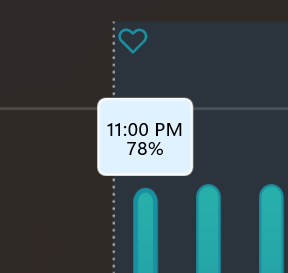
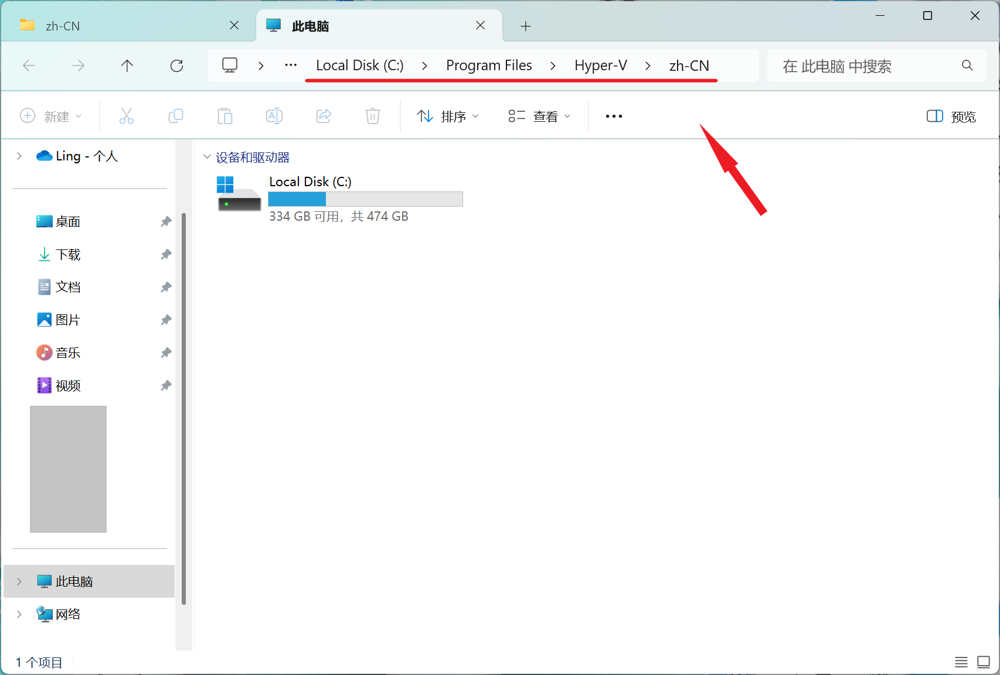
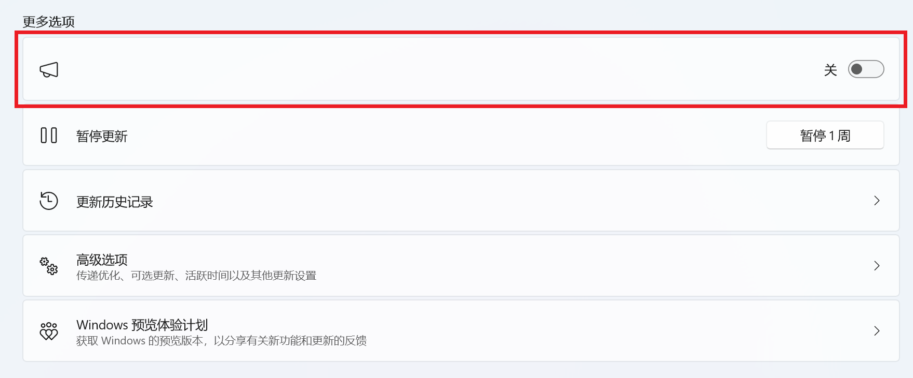
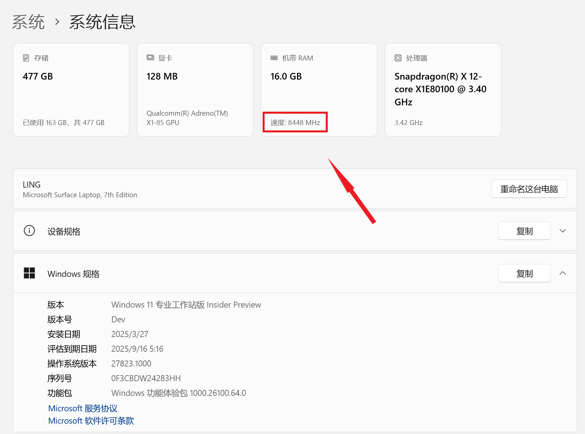

  

<h1 align="center">灵糕中心 (Linggao Hub)</h1>

[github.com/Lingggao/LGHUB](https://github.com/Lingggao/LGHUB) (GitHub)

&emsp;&emsp;**用于跟踪 “Windows 11 预览体验版本 (Canary 频道) 中哪些反馈正在由 Microsoft 调查、处理 / 已做出更改” 的信息枢纽**。由 2021 Windows Insider 最有价值专家 (MVP) · [**Ling Gao**](https://github.com/Lingggao) 先生管理。

&emsp;&emsp;灵糕中心成立于 2023 年 12 月 12 日，其前身可追溯至 2019 年 5 月 14 日由 Microsoft 社区创建的 “[\[BUG 汇总\] Windows 10 2019 年 5 月更新 (1903_18362) 已知问题与处理进度汇总](https://answers.microsoft.com/zh-hans/insider/forum/all/bug-%E6%B1%87%E6%80%BBwindows-10-2019-%E5%B9%B4-5/252d0d6a-022c-4bf7-9976-55b57590aee2)” 讨论话题。

> [!IMPORTANT]
>
> &emsp;灵糕中心为个人项目，管理者不是 Microsoft 公司员工，不能代表 Microsoft 公司立场、态度。中心无意且无法代替 “反馈中心” (Feedback Hub) 应用的重要作用。中心不提供 Microsoft 产品技术支持服务。中心不接受有关 Windows 11 预览体验版本的反馈，用户应始终通过 “反馈中心” 应用提交。
>
> &emsp;Windows、Windows Insider Program 等是 Microsoft 公司的商标。

&emsp;&emsp;**宗旨**：独立管理、服务用户、信息精准、更新及时

[反馈中心](https://aka.ms/fbh) | [深入了解反馈](https://learn.microsoft.com/zh-cn/windows-insider/feedback) | [Flight Hub](https://learn.microsoft.com/en-us/windows-insider/flight-hub) | Windows 预览体验计划 - [网站](https://www.microsoft.com/zh-cn/windowsinsider) · [博客](https://blogs.windows.com/windows-insider) · [X](https://twitter.com/windowsinsider) · Microsoft 社区 ([中](https://answers.microsoft.com/zh-hans/insider/forum) / [英](https://answers.microsoft.com/en-us/insider/forum))

| 🎖️ **推荐** | **[WinDiscover](https://windiscover.com) - 独立 Microsoft 新闻网站** | **关注 [@Microsoft 信仰中心](https://weibo.com/u/3139784387) 微博** |
| :--------: | :----------------------------------------------------------: | :----------------------------------------------------------: |
|            |            [**LCZBlog**](https://blog.licaoz.com)            |       [**GuCATs'摸鱼站**](https://goo-aw233.github.io)       |

## 总览

| 😸 欢迎加入 [“Ling 的 Windows Insider 小屋”](https://teams.live.com/l/community/FEAd0AVp_B_pTH5Zgk) Microsoft Teams 社区 😽 |
| :----------------------------------------------------------: |

上次更新时间：2025 年 5 月 15 日 21:00 (UTC+8)。Star 数量：48 ⭐

收录反馈 365 个，其中正在调查 36 个 (含[搁置](#3) 0 个)、正在处理 9 个、已修复 320 个。

反馈更新记录：**今日更新 LG359 - 364**。- Ling 🥝 [总览图](https://raw.githubusercontent.com/Lingggao/LGHUB/main/Images/Linggao%20Hub.png) | [反馈更新记录](Documents/Update_Feedback.md) | [平台更新记录](Documents/Update_Platform.md)

[**WIP Canary 27842 更新简报**](Canary.md) | [往期简报](Documents/Canary_Previous)

|         频道         |              最新版本               | 时间 (UTC+8) | 公告 |
| :------------------: | :---------------------------------: | :----------: | :------------------: |
|        Canary        |                27842                |  2025/4/24  | [aka.ms/wip27842](https://blogs.windows.com/windows-insider/2025/04/23/announcing-windows-11-insider-preview-build-27842-canary-channel) |
|       Dev        | **[新]** 26200.5600 |   2025/5/13   | [aka.ms/wip-dev-5-12-25](https://blogs.windows.com/windows-insider/2025/05/12/announcing-windows-11-insider-preview-build-26200-5600-dev-channel) |
|         Beta         | **[新]** 26120.3964 |   2025/5/13   | [aka.ms/wip-beta-5-12-25](https://blogs.windows.com/windows-insider/2025/05/12/announcing-windows-11-insider-preview-build-26120-3964-beta-channel) |
| Release Preview  | 26100.3915 |  2025/4/26  | [support.microsoft.com](https://support.microsoft.com/en-us/help/5055627) |
| General Availability |    **[新]** 26100.4061    |  2025/5/14  | [support.microsoft.com](https://support.microsoft.com/en-us/help/5058411) |

统计图 - 2024 年 ([1 - 4 月](Images/Graph_2401_2404.png) · [5 - 8 月](Images/Graph_2405_2408.png) · [9 - 12 月](Images/Graph_2409_2412.png)) | 2025 年 ([1 - 4 月](Images/Graph_2501_2504.png) · [5 - 8 月](Images/Graph_0.png) · 9 - 12 月)

---

> [!NOTE]
>
> &emsp;多数问题是仅有 1 - 2 位 Insiders 反馈的 “偶发性” 问题，而非所有人都会遇到的 “广泛性” 问题。请放心地更新 Windows 11 预览体验版本，不必担心新版使用体验过差。

|      编号       |                             问题                             |   状态   |
| :-------------: | :----------------------------------------------------------: | :------: |
|       ——        |              [**Canary - 公告已知问题**](#0) ▼               |    ——    |
| [LG212](#LG212) | **[Copilot+ 电脑]** 加入 Canary 频道后，PIN 和生物识别信息将丢失。 | 正在处理 |
| [LG322](#LG322) |                        夜间模式失效。                        | 正在处理 |
| [LG330](#LG330) |     连接 Xbox 手柄时电脑 SYSTEM_SERVICE_EXCEPTION 绿屏。     | 正在处理 |
| [LG309](#LG309) |        以平板电脑方式使用时，任务栏中的图标不会变大。        | 正在处理 |
|       ——        | [**Canary - 公告已知问题**](#0) ▲ \| ▼ [**Canary - 用户反馈问题**](#1) |    ——    |
| [LG318](#LG318) |   **[置顶]** 无法使用 Hyper-V 及依赖它的功能 (如 WSL 等)。   | 正在调查 |
| [LGH04](LGH04)  |          **[集合]** 启动部分游戏时崩溃 / 电脑绿屏。          | 正在调查 |
| [LG252](#LG252) |              组策略编辑器和服务管理器 UI 错误。              | 正在调查 |
| [LG258](#LG258) |            拖动表情符号面板中的滚动条时卡顿严重。            | 正在调查 |
| [LG277](#LG277) |     右键文件时，删除按钮的鼠标悬停提示为 “删除 (删除)”。     | 正在调查 |
| [LG279](#LG279) |   在反馈中心提交的反馈有状态更新或官方回复时无法收到通知。   | 正在调查 |
| [LG281](#LG281) |           使用 ms-search: 链接时任务栏搜索框消失。           | 正在调查 |
| [LG286](#LG286) | Microsoft Store 宣传视频中的 “投放到设备” 被译为 “强制转换为设备”。 | 正在调查 |
| [LG289](#LG289) | 使用深色模式时，“电池使用情况” 菜单中的鼠标悬停提示显示为浅色。 | 正在调查 |
| [LG301](#LG301) |     在文件资源管理器中新建标签页时，地址栏中的路径不变。     | 正在调查 |
| [LG311](#LG311) |          文件资源管理器地址栏溢出列表无法正确呈现。          | 正在调查 |
| [LG323](#LG323) | 将鼠标悬停在 “系统信息” 菜单顶部的选项卡时，边框显示为直角。 | 正在调查 |
| [LG334](#LG334) |            无法使用 Windows Hello 面部识别登录。             | 正在处理 |
| [LG337](#LG337) |           间歇性无法在开始菜单中输入文本进行搜索。           | 正在调查 |
| [LG338](#LG338) |      无法安装 Canary 27842 更新，错误代码 0x8007000d。       | 正在调查 |
| [LG339](#LG339) |     开始菜单、任务栏、文件资源管理器等组件无法显示文字。     | 正在调查 |
| [LG340](#LG340) |         Canary 27842 安装极度缓慢，耗时超过 2 小时。         | 正在调查 |
| [LG341](#LG341) |                       WLAN 网络故障。                        | 正在调查 |
| [LG342](#LG342) |                 打开组策略编辑器时提示错误。                 | 正在调查 |
| [LG343](#LG343) |       打开文件资源管理器时，地址栏中不显示 “此电脑”。        | 正在调查 |
| [LG344](#LG344) |         Canary 27842 稳定性表现不佳，电脑随机绿屏。          | 正在调查 |
| [LG345](#LG345) |             “画图” 应用在 Canary 27842 中崩溃。              | 正在调查 |
| [LG346](#LG346) |            安装 Canary 27842 更新时卡在黑屏状态。            | 正在处理 |
| [LG347](#LG347) |            满足条件后在反馈中心无法获得成就徽章。            | 正在调查 |
| [LG348](#LG348) |       安装 Windows 11 时，菜单按照从右到左的方式排列。       | 正在调查 |
| [LG349](#LG349) |             无法在小组件中登录 Microsoft 账户。              | 正在调查 |
| [LG350](#LG350) |                    AMD 显卡驱动持续崩溃。                    | 正在调查 |
| [LG351](#LG351) |             可变刷新率功能 (VRR) 无法正常工作。              | 正在调查 |
| [LG352](#LG352) |                电脑因 dxgmms2.sys 错误绿屏。                 | 正在处理 |
| [LG353](#LG353) |              无法启动 Windows 终端 (Terminal)。              | 正在调查 |
| [LG354](#LG354) |                  更新后无法登录 OneDrive。                   | 正在调查 |
| [LG355](#LG355) |       电脑 SYSTEM_THREAD_EXCEPTION_NOT_HANDLED 绿屏。        | 正在处理 |
| [LG356](#LG356) |          连接多个显示器时，鼠标自动向左或向上滑动。          | 正在调查 |
| [LG357](#LG357) |         截图工具无法截取搜索界面、上下文菜单等 UI。          | 正在调查 |
| [LG358](#LG358) |        在 Hyper-V 中使用虚拟机时，鼠标控制上下颠倒。         | 正在调查 |
| [LG359](#LG359) |             **显卡驱动因实时内核事件频繁崩溃**。             | 正在处理 |
| [LG360](#LG360) |              **反馈中心应用中的成就变为灰色**。              | 正在调查 |
| [LG361](#LG361) |        **Microsoft Store 不显示较早的应用更新记录**。        | 正在调查 |
| [LG362](#LG362) |              **打开 OneDrive 时桌面图标变乱**。              | 正在调查 |
| [LG363](#LG363) |                  **点击开始菜单没有反应**。                  | 正在调查 |
| [LG364](#LG364) |            **在小组件中滚动鼠标浏览新闻时卡住**。            | 正在调查 |
|       ——        | [**Canary - 用户反馈问题**](#1) ▲ \| ▼ [**Canary - 归档 (已做出更改 0 - 7 天)**](#2) |    ——    |
| [LG316](#LG316) |   “在最新更新可用后立即获取” 选项无法正确呈现并自动关闭。    | 已修复 ✓ |
| [LG310](#LG310) |    启动部分应用 / 功能时 WHEA_UNCORRECTABLE_ERROR 绿屏。     | 已修复 ✓ |
| [LG265](#LG265) |        Windows 安全中心 “智能应用控制” 功能丢失图标。        | 已修复 ✓ |
| [LG319](#LG319) |       “系统信息” 菜单顶部选项卡显示的内存速度不正确。        | 已修复 ✓ |
| [LG320](#LG320) |             “天气” 应用加载缓慢 / 无法显示内容。             | 已修复 ✓ |
| [LG321](#LG321) |    点击文件资源管理器左侧的导航窗格时，右侧仍停留在主页。    | 已修复 ✓ |
| [LG324](#LG324) |     无法启动 Tailscale VPN 等基于 IP Helper 服务的应用。     | 已修复 ✓ |
| [LG326](#LG326) |             “照片” 应用自动从任务栏中取消固定。              | 已修复 ✓ |
| [LG327](#LG327) |                MIDI 键盘 / 设备无法正常工作。                | 已修复 ✓ |
| [LG328](#LG328) |                        DWM 随机崩溃。                        | 已修复 ✓ |
| [LG329](#LG329) |                        电脑随机关机。                        | 已修复 ✓ |
| [LG331](#LG331) |              退出云流媒体游戏时 Xbox 应用崩溃。              | 已修复 ✓ |
| [LG332](#LG332) |     “AVC 编码器视频扩展” 无法在 Microsoft Store 中安装。     | 已修复 ✓ |
| [LG335](#LG335) |              无法启动 DELL SupportAssist 应用。              | 已修复 ✓ |
| [LG336](#LG336) |                “MSN 资讯” 应用无法显示内容。                 | 已修复 ✓ |
|       ——        | *部分未收录反馈详见 [WIP Canary 27842 更新简报](Canary.md)*  |    ——    |
|       ——        |       ▲ [**Canary - 归档 (已做出更改 0 - 7 天)**](#2)        |    ——    |
|       ——        | [**Canary - 归档 (已做出更改 >7 天)**](7+.md) \| [**Canary - 搁置 (未做出更改)**](#3) |    ——    |

[分享反馈线索](https://forms.office.com/Pages/ResponsePage.aspx?id=DQSIkWdsW0yxEjajBLZtrQAAAAAAAAAAAAO__Q3sH7RUNjUyUzJLN0JBREZGMzBBVlpVOEVBQkRENy4u) | [反馈平台问题](https://forms.office.com/Pages/ResponsePage.aspx?id=DQSIkWdsW0yxEjajBLZtrQAAAAAAAAAAAAO__Q3sH7RUQ0haOElMVkxOWDE4U1pHQUZWMDhEM1gwSC4u)

## Canary - 公告已知问题

> [!TIP]
>
> &emsp;记录 [Windows Insider 博客](https://blogs.windows.com/windows-insider)中明确公开的已知问题。

---

编号：LG212  
日期：2024 年 8 月 16 日  
版本：Canary 27686 - 27842  
**问题**：**[Copilot+ 电脑] 加入 Canary 频道后，PIN 和生物识别信息将丢失**。  
状态：  
Microsoft 官方回复：“如果您使用 Copilot+ 设备从 Dev、Release Preview 或 Retail 频道加入至 Canary 频道，Windows Hello PIN 和生物识别信息将会丢失。您将无法登录系统，显示 0xd0000225 错误和 ‘出错了，您的 PIN 不可用’ 信息。点击 ‘设置我的 PIN’ 选项应当可以重设 PIN。” *(Ling 译)* 

---

编号：LG322  
日期：2025 年 3 月 30 日  
版本：Canary 27823 - 27842  
**问题**：**夜间模式失效**。  
状态：  
典型反馈：[aka.ms/AAv9mb7](https://aka.ms/AAv9mb7)

---

编号：LG330  
日期：2025 年 4 月 17 日  
版本：Canary 27823 - 27842  
**问题**：**连接 Xbox 手柄时电脑 SYSTEM_SERVICE_EXCEPTION 绿屏**。  
状态：  
Microsoft 官方回复：“如果您遇到了此问题，请打开设备管理器，点击 ‘查看’ - ‘按驱动程序列出设备’，卸载 XboxGameControllerDriver 驱动，看看能否解决问题。” *(Ling 译)*   
典型反馈：[aka.ms/AAvnjbu](https://aka.ms/AAvnjbu)

---

编号：LG309  
日期：2025 年 3 月 21 日  
版本：Canary 27818 - 27842  
**问题**：**以平板电脑方式使用时，任务栏中的图标不会变大**。  
状态：  
典型反馈：[aka.ms/AAv7ss7](https://aka.ms/AAv7ss7) 

## Canary - 用户反馈问题

> [!TIP]
>
> &emsp;记录[反馈中心应用](https://aka.ms/fbh)中 Microsoft 明确响应的问题。

---

编号：LG318  
日期：2025 年 3 月 30 日  
版本：Canary 27818 - 27842  
**问题**：**[置顶] 无法使用 Hyper-V 及依赖它的功能 (如 WSL 等)**。  
状态：  
典型反馈：[aka.ms/AAv9u24](https://aka.ms/AAv9u24) & [aka.ms/AAvbvv3](https://aka.ms/AAvbvv3) & [aka.ms/AAvgds1](https://aka.ms/AAvgds1)

---

编号：LGH04  
日期：2025 年 4 月 17 日  
版本：Canary 27823 - 27842  
**集合**：**启动部分游戏时崩溃 / 电脑绿屏**。  
状态：  
典型反馈：[aka.ms/AAvnsn4](https://aka.ms/AAvnsn4)

列表：

- 鸣潮 (Wuthering Waves) - [aka.ms/AAvbzju](https://aka.ms/AAvbzju)
- 永劫无间 (Naraka: Bladepoint) - [aka.ms/AAw3yn3](https://aka.ms/AAw3yn3)
- PUBG - [aka.ms/AAv9mb1](https://aka.ms/AAv9mb1)
- 守望先锋 - [aka.ms/AAvo0dn](https://aka.ms/AAvo0dn)
- Microsoft Solitaire - [aka.ms/AAvnsni](https://aka.ms/AAvnsni)

---

编号：LG252  
日期：2024 年 12 月 20 日  
版本：Canary 27764 - 27842  
**问题**：**组策略编辑器和服务管理器 UI 错误**。  
状态：  
典型反馈：[aka.ms/AAty56l](https://aka.ms/AAty56l)

---

编号：LG258  
日期：2025 年 1 月 10 日  
版本：Canary 27766 - 27842  
**问题**：**拖动表情符号面板中的滚动条时卡顿严重**。  
状态：  
典型反馈：[aka.ms/AAtws2s](https://aka.ms/AAtws2s)

---

编号：LG277  
日期：2025 年 1 月 29 日  
版本：Canary 27764 - 27842  
**问题**：**右键文件时，删除按钮的鼠标悬停提示为 “删除 (删除)”**。  
状态：  
典型反馈：[aka.ms/AAu4457](https://aka.ms/AAu4457)

---

编号：LG279  
日期：2025 年 1 月 29 日  
版本：ALL  
**问题**：**在反馈中心提交的反馈有状态更新或官方回复时无法收到通知**。  
状态：  
典型反馈：[aka.ms/AAu3v9h](https://aka.ms/AAu3v9h) 

---

编号：LG281  
日期：2025 年 1 月 29 日  
版本：Canary 27774 - 27842  
**问题**：**使用 ms-search: 链接时任务栏搜索框消失**。  
状态：  
典型反馈：[aka.ms/AAu42tm](https://aka.ms/AAu42tm)

---

编号：LG286  
日期：2025 年 2 月 1 日  
版本：ALL  
**问题**：**Microsoft Store 宣传视频中的 “投放到设备” 被译为 “强制转换为设备”**。  
状态：  
典型反馈：[aka.ms/AAu5r06](https://aka.ms/AAu5r06)

---

编号：LG289  
日期：2025 年 2 月 22 日  
版本：Canary 27788 - 27842  
**问题**：**使用深色模式时，“电池使用情况” 菜单中的鼠标悬停提示显示为浅色**。  
状态：  
典型反馈：[aka.ms/AAuk2qa](https://aka.ms/AAuk2qa)

---

编号：LG301  
日期：2025 年 3 月 1 日  
版本：Canary 27788 - 27842  
**问题**：**在文件资源管理器中新建标签页时，地址栏中的路径不变**。  
状态：  
典型反馈：[aka.ms/AAuq4uj](https://aka.ms/AAuq4uj)

---

编号：LG311  
日期：2025 年 3 月 24 日  
版本：Canary 27818 - 27842  
**问题**：**文件资源管理器地址栏溢出列表无法正确呈现**。  
状态：  
典型反馈：[aka.ms/AAv26rl](https://aka.ms/AAv26rl)

---

编号：LG323  
日期：2025 年 4 月 3 日  
版本：Canary 27823 - 27842  
**问题**：**将鼠标悬停在 “系统信息” 菜单顶部的选项卡时，边框显示为直角**。  
状态：  
典型反馈：[aka.ms/AAvc3jh](https://aka.ms/AAvc3jh)

---

编号：LG334  
日期：2025 年 4 月 20 日  
版本：Canary 27823 - 27842  
**问题**：**无法使用 Windows Hello 面部识别登录**。  
状态：  
典型反馈：[aka.ms/AAvpvfn](https://aka.ms/AAvpvfn) 

---

编号：LG337  
日期：2025 年 4 月 20 日  
版本：Canary 27823 - 27842  
**问题**：**间歇性无法在开始菜单中输入文本进行搜索**。  
状态：  
典型反馈：[aka.ms/AAvpvfu](https://aka.ms/AAvpvfu)

---

编号：LG338  
日期：2025 年 4 月 26 日  
版本：Canary 27842  
**问题**：**无法安装 Canary 27842 更新，错误代码 0x8007000d**。  
状态：  
典型反馈：[aka.ms/AAvs3c5](https://aka.ms/AAvs3c5)

---

编号：LG339  
日期：2025 年 4 月 26 日  
版本：Canary 27842  
**问题**：**开始菜单、任务栏、文件资源管理器等组件无法显示文字**。  
状态：  
典型反馈：[aka.ms/AAvsow5](https://aka.ms/AAvsow5) & [aka.ms/AAvs3a3](https://aka.ms/AAvs3a3) 

---

编号：LG340  
日期：2025 年 4 月 26 日  
版本：Canary 27842  
**问题**：**Canary 27842 安装极度缓慢，耗时超过 2 小时**。  
状态：  
典型反馈：[aka.ms/AAvsowb](https://aka.ms/AAvsowb) & [aka.ms/AAvro05](https://aka.ms/AAvro05)

---

编号：LG341  
日期：2025 年 4 月 26 日  
版本：Canary 27842  
**问题**：**WLAN 网络故障**。  
状态：  
典型反馈：[aka.ms/AAvs3ag](https://aka.ms/AAvs3ag) 

---

编号：LG342  
日期：2025 年 4 月 26 日  
版本：Canary 27842  
**问题**：**打开组策略编辑器时提示错误**。  
状态：  
典型反馈：[aka.ms/AAvskqo](https://aka.ms/AAvskqo)

---

编号：LG343  
日期：2025 年 4 月 28 日  
版本：Canary 27842  
**问题**：**打开文件资源管理器时，地址栏中不显示 “此电脑”**。  
状态：  
典型反馈：[aka.ms/AAvsqke](https://aka.ms/AAvsqke)

---

编号：LG344  
日期：2025 年 4 月 28 日  
版本：Canary 27842  
**问题**：**Canary 27842 稳定性表现不佳，电脑随机绿屏**。  
状态：  
典型反馈：[aka.ms/AAw0ilg](https://aka.ms/AAw0ilg)

---

编号：LG345  
日期：2025 年 4 月 28 日  
版本：Canary 27842  
**问题**：**“画图” 应用在 Canary 27842 中崩溃**。  
状态：  
典型反馈：[aka.ms/AAw0ikn](https://aka.ms/AAw0ikn)

---

编号：LG346  
日期：2025 年 5 月 1 日  
版本：Canary 27842  
**问题**：**安装 Canary 27842 更新时卡在黑屏状态**。  
状态：  
典型反馈：[aka.ms/AAw2a0c](https://aka.ms/AAw2a0c) 

---

编号：LG347  
日期：2025 年 5 月 1 日  
版本：ALL  
**问题**：**满足条件后在反馈中心无法获得成就徽章**。  
状态：  
典型反馈：[aka.ms/AAw0kh1](https://aka.ms/AAw0kh1)

---

编号：LG348  
日期：2025 年 5 月 4 日  
版本：ALL  
**问题**：**安装 Windows 11 时，菜单按照从右到左的方式排列**。  
状态：  
典型反馈：[aka.ms/AAw2o68](https://aka.ms/AAw2o68) & [aka.ms/AAw5fk3](https://aka.ms/AAw5fk3)

---

编号：LG349  
日期：2025 年 5 月 4 日  
版本：Canary 27842  
**问题**：**无法在小组件中登录 Microsoft 账户**。  
状态：  
典型反馈：[aka.ms/AAw3xr3](https://aka.ms/AAw3xr3)

---

编号：LG350  
日期：2025 年 5 月 4 日  
版本：Canary 27842  
**问题**：**AMD 显卡驱动持续崩溃**。  
状态：  
典型反馈：[aka.ms/AAw5fmn](https://aka.ms/AAw5fmn) & [aka.ms/AAw58ws](https://aka.ms/AAw58ws)

---

编号：LG351  
日期：2025 年 5 月 4 日  
版本：Canary 27842  
**问题**：**可变刷新率功能 (VRR) 无法正常工作**。  
状态：  
典型反馈：[aka.ms/AAw3xtn](https://aka.ms/AAw3xtn)

---

编号：LG352  
日期：2025 年 5 月 4 日  
版本：Canary 27842  
**问题**：**电脑因 dxgmms2.sys 错误绿屏**。  
状态：  
典型反馈：[aka.ms/AAw5fn3](https://aka.ms/AAw5fn3)

---

编号：LG353  
日期：2025 年 5 月 4 日  
版本：Canary 27842  
**问题**：**无法启动 Windows 终端 (Terminal)**。  
状态：  
典型反馈：[aka.ms/AAw583q](https://aka.ms/AAw583q)

---

编号：LG354  
日期：2025 年 5 月 4 日  
版本：Canary 27842  
**问题**：**更新后无法登录 OneDrive**。  
状态：  
典型反馈：[aka.ms/AAw5842](https://aka.ms/AAw5842)

---

编号：LG355  
日期：2025 年 5 月 5 日  
版本：Canary 27842  
**问题**：**电脑 SYSTEM_THREAD_EXCEPTION_NOT_HANDLED 绿屏**。  
状态：  
典型反馈：[aka.ms/AAw5gfm](https://aka.ms/AAw5gfm) 

---

编号：LG356  
日期：2025 年 5 月 10 日  
版本：Canary 27842  
**问题**：**连接多个显示器时，鼠标自动向左或向上滑动**。  
状态：  
典型反馈：[aka.ms/AAw87ng](https://aka.ms/AAw87ng)

---

编号：LG357  
日期：2025 年 5 月 10 日  
版本：ALL  
**问题**：**截图工具无法截取搜索界面、上下文菜单等 UI**。  
状态：  
典型反馈：[aka.ms/AAw7f38](https://aka.ms/AAw7f38)

---

编号：LG358  
日期：2025 年 5 月 10 日  
版本：Canary 27842  
**问题**：**在 Hyper-V 中使用虚拟机时，鼠标控制上下颠倒**。  
状态：  
典型反馈：[aka.ms/AAw87o0](https://aka.ms/AAw87o0)

---

编号：LG359  
日期：2025 年 5 月 15 日  
版本：Canary 27842  
**问题**：**显卡驱动因实时内核事件频繁崩溃**。  
状态：  
典型反馈：[aka.ms/AAw9dn6](https://aka.ms/AAw9dn6) 

---

编号：LG360  
日期：2025 年 5 月 15 日  
版本：ALL  
**问题**：**反馈中心应用中的成就变为灰色**。  
状态：  
典型反馈：[aka.ms/AAw9dna](https://aka.ms/AAw9dna)

---

编号：LG361  
日期：2025 年 5 月 15 日  
版本：ALL  
**问题**：**Microsoft Store 不显示较早的应用更新记录**。  
状态：  
典型反馈：[aka.ms/AAw8czh](https://aka.ms/AAw8czh)

---

编号：LG362  
日期：2025 年 5 月 15 日  
版本：Canary 27842  
**问题**：**打开 OneDrive 时桌面图标变乱**。  
状态：  
典型反馈：[aka.ms/AAw9dni](https://aka.ms/AAw9dni)

---

编号：LG363  
日期：2025 年 5 月 15 日  
版本：Canary 27842  
**问题**：**点击开始菜单没有反应**。  
状态：  
典型反馈：[aka.ms/AAw8uu5](https://aka.ms/AAw8uu5) 

---

编号：LG364  
日期：2025 年 5 月 15 日  
版本：Canary 27842  
**问题**：**在小组件中滚动鼠标浏览新闻时卡住**。  
状态：  
典型反馈：[aka.ms/AAw9hur](https://aka.ms/AAw9hur)

## Canary - 归档 (已做出更改)

> [!TIP]
>
> &emsp;记录 Microsoft 已做出更改 0 - 7 天的问题 & 超过 14 天无新增赞成票的问题。
>
> &emsp;无特殊情况，问题归档后不再更新。

---

编号：LG316  
日期：2025 年 3 月 29 日  
版本：Canary 27823  
**问题**：**“在最新更新可用后立即获取” 选项无法正确呈现并自动关闭**。  
状态：Canary 27842 -  - 已修复 ✓

---

编号：LG310  
日期：2025 年 3 月 24 日  
版本：Canary 27818 - 27823  
**问题**：**[置顶] 启动部分应用 / 功能时 WHEA_UNCORRECTABLE_ERROR 绿屏**。  
状态：Canary 27842 -  - 已修复 ✓  
典型反馈：[aka.ms/AAv7zrj](https://aka.ms/AAv7zrj) & [aka.ms/AAv7s0c](https://aka.ms/AAv7s0c) & [aka.ms/AAv7l43](https://aka.ms/AAv7l43) & [aka.ms/AAv7l46](https://aka.ms/AAv7l46)

已知异常应用 / 功能列表：

- VMware Workstation Pro
- 火绒安全软件 6.0
- 网易 MuMu 模拟器
- 适用于 Linux 的 Windows 子系统 (WSL)
- Oracle VM VirtualBox

---

编号：LG265  
日期：2025 年 1 月 20 日  
版本：Canary 27774 - 27823  
**问题**：**Windows 安全中心 “智能应用控制” 功能丢失图标**。  
状态：Canary 27842 -  - 已修复 ✓  
典型反馈：[aka.ms/AAu1k0e](https://aka.ms/AAu1k0e)

---

编号：LG319  
日期：2025 年 3 月 30 日  
版本：Canary 27823  
**问题**：**“系统信息” 菜单顶部选项卡显示的内存速度不正确**。  
状态：Canary 27842 -  - 已修复 ✓  
典型反馈：[aka.ms/AAv9eqx](https://aka.ms/AAv9eqx)

---

编号：LG320  
日期：2025 年 3 月 30 日  
版本：ALL  
**问题**：**“天气” 应用加载缓慢 / 无法显示内容**。  
状态：ALL -  - 已修复 ✓  
典型反馈：[aka.ms/AAv9mb3](https://aka.ms/AAv9mb3) & [aka.ms/AAvgh5u](https://aka.ms/AAvgh5u)

---

编号：LG321  
日期：2025 年 3 月 30 日  
版本：Canary 27823  
**问题**：**点击文件资源管理器左侧的导航窗格时，右侧仍停留在主页**。  
状态：Canary 27842 -  - 已修复 ✓  
典型反馈：[aka.ms/AAv9u26](https://aka.ms/AAv9u26)

---

编号：LG324  
日期：2025 年 4 月 3 日  
版本：Canary 27823  
**问题**：**无法启动 Tailscale VPN 等基于 IP Helper 服务的应用**。  
状态：Canary 27842 -  - 已修复 ✓  
典型反馈：[aka.ms/AAvbo9r](https://aka.ms/AAvbo9r) & [aka.ms/AAvbx6d](https://aka.ms/AAvbx6d) 

---

编号：LG326  
日期：2025 年 4 月 7 日  
版本：2025.11030.27002.0  
**问题**：**“照片” 应用自动从任务栏中取消固定**。  
状态：ALL -  - 已修复 ✓  
典型反馈：[aka.ms/AAvbrzs](https://aka.ms/AAvbrzs) 

---

编号：LG327  
日期：2025 年 4 月 10 日  
版本：Canary 27788 - 27823  
**问题**：**MIDI 键盘 / 设备无法正常工作**。  
状态：Canary 27842 -  - 已修复 ✓  
Microsoft 官方回复：“我们已在 Canary 27813 版本中进行了一些改进，但是一些预览体验成员仍反馈称遇到了此问题。如果您仍可复现问题，请提交新的反馈，并尽可能详细地说明。” *(Ling 译)*  
  
典型反馈：[aka.ms/AAv7m8v](https://aka.ms/AAv7m8v)

---

编号：LG328  
日期：2025 年 4 月 10 日  
版本：Canary 27823  
**问题**：**DWM 随机崩溃**。  
状态：Canary 27842 -  - 已修复 ✓  
典型反馈：[aka.ms/AAvgrr1](https://aka.ms/AAvgrr1) & [aka.ms/AAvgrqg](https://aka.ms/AAvgrqg) 

---

编号：LG329  
日期：2025 年 4 月 10 日  
版本：Canary 27823  
**问题**：**电脑随机关机**。  
状态：Canary 27842 -  - 已修复 ✓  
典型反馈：[aka.ms/AAvgrqj](https://aka.ms/AAvgrqj)

---

编号：LG331  
日期：2025 年 4 月 17 日  
版本：Canary 27823  
**问题**：**退出云流媒体游戏时 Xbox 应用崩溃**。  
状态：Canary 27842 -  - 已修复 ✓  
典型反馈：[aka.ms/AAvo0dz](https://aka.ms/AAvo0dz)

---

编号：LG332  
日期：2025 年 4 月 17 日  
版本：Canary 27823  
**问题**：**“AVC 编码器视频扩展” 无法在 Microsoft Store 中安装**。  
状态：Canary 27842 -  - 已修复 ✓  
典型反馈：[aka.ms/AAvo0du](https://aka.ms/AAvo0du) 

---

编号：LG335  
日期：2025 年 4 月 20 日  
版本：Canary 27823  
**问题**：**无法启动 DELL SupportAssist 应用**。  
状态：Canary 27842 -  - 已修复 ✓  
典型反馈：[aka.ms/AAvpvfo](https://aka.ms/AAvpvfo)

---

编号：LG336  
日期：2025 年 4 月 20 日  
版本：Canary 27823  
**问题**：**“MSN 资讯” 应用无法显示内容**。  
状态：Canary 27842 -  - 已修复 ✓  
典型反馈：[aka.ms/AAvpg5t](https://aka.ms/AAvpg5t) 

---

*部分未收录反馈详见 [WIP Canary 27842 更新简报](Canary.md)*

[Microsoft 已做出更改 >7 天的问题](7+.md)

## Canary - 搁置 (未做出更改)

> [!TIP]
>
> &emsp;并非所有软件缺陷都要修复。
>
> &emsp;已收录的反馈也可能因缺少资源、修复风险过大、商业决策调整等长期或永久不予修复。本板块记录 Microsoft 超过 90 天未修复的问题，中心将每间隔 30 天在 Canary 频道最新版本中进行测试。

[Microsoft 超过 90 天未修复的问题](90+.md)

---

[回到顶部](#HEAD)

  

在 “[署名 - 相同方式共享 4.0](https://creativecommons.org/licenses/by-sa/4.0/legalcode.zh-Hans)” 协议 (CC BY-SA 4.0) 之条款下提供。

2023 - 2025, [高楷修 (Ling Gao)](https://github.com/Lingggao), 灵糕中心 (Linggao Hub), [github.com/Lingggao/LGHUB](https://github.com/Lingggao/LGHUB)

[字体许可使用授权书](Images/字体许可使用授权书.png) | [Windows Insider 最有价值专家](https://github.com/Lingggao/LGHUB/blob/main/Images/Windows%20Insider%20MVP.png?raw=true)