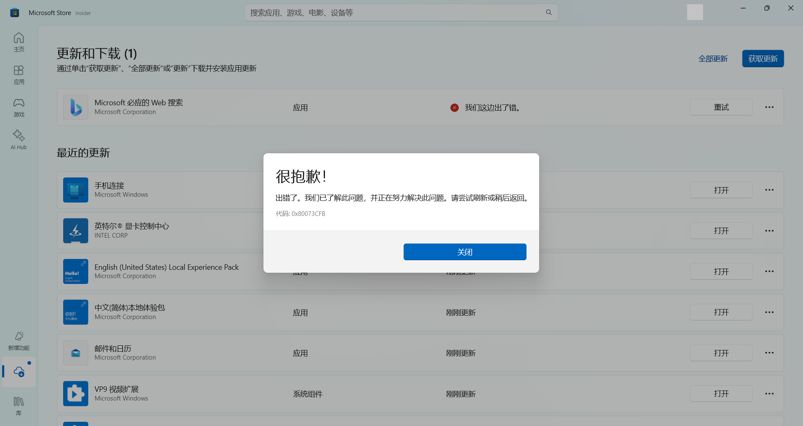
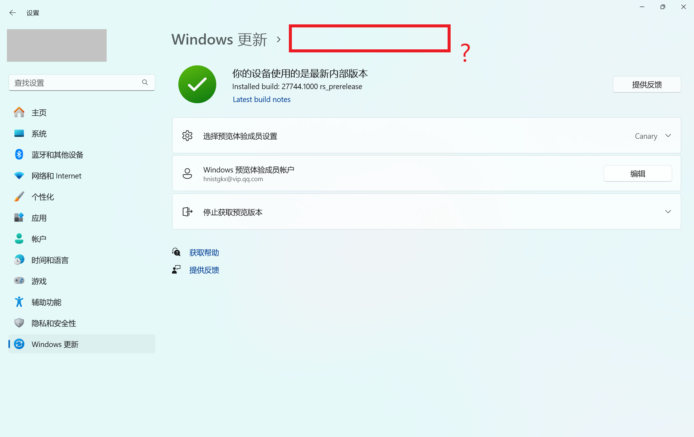

  

<h1 align="center">灵糕中心 (Linggao Hub)</h1>

[github.com/Lingggao/LGHUB](https://github.com/Lingggao/LGHUB) (GitHub)

&emsp;&emsp;**用于跟踪 “Windows 11 预览体验版本 (Canary 频道) 中哪些反馈正在由 Microsoft 调查、处理 / 已做出更改” 的信息枢纽**。由 2021 Windows Insider 最有价值专家 (MVP) · **Ling Gao** 先生管理。

&emsp;&emsp;灵糕中心成立于 2023 年 12 月 12 日，其前身可追溯至 2019 年 5 月 14 日由 Microsoft 社区创建的 “[\[BUG 汇总\] Windows 10 2019 年 5 月更新 (1903_18362) 已知问题与处理进度汇总](https://answers.microsoft.com/zh-hans/insider/forum/all/bug-%E6%B1%87%E6%80%BBwindows-10-2019-%E5%B9%B4-5/252d0d6a-022c-4bf7-9976-55b57590aee2)” 讨论话题。

> [!IMPORTANT]
>
> &emsp;灵糕中心为个人项目，管理者不是 Microsoft 公司员工，不能代表 Microsoft 公司立场、态度。中心无意且无法代替 “反馈中心” (Feedback Hub) 应用的重要作用。中心不提供 Microsoft 产品技术支持服务。中心不接受有关 Windows 11 预览体验版本的反馈，用户应始终通过 “反馈中心” 应用提交。
>
> &emsp;Windows、Windows Insider Program 等是 Microsoft 公司的商标。

&emsp;&emsp;**宗旨**：独立管理、服务用户、信息精准、更新及时

[反馈中心](https://aka.ms/fbh) | [深入了解反馈](https://learn.microsoft.com/zh-cn/windows-insider/feedback) | [Flight Hub](https://learn.microsoft.com/en-us/windows-insider/flight-hub) | Windows 预览体验计划 - [网站](https://www.microsoft.com/zh-cn/windowsinsider) · [博客](https://blogs.windows.com/windows-insider) · [X](https://twitter.com/windowsinsider) · Microsoft 社区 ([中](https://answers.microsoft.com/zh-hans/insider/forum) / [英](https://answers.microsoft.com/en-us/insider/forum))

|            | [**Microsoft 电脑管家**](https://pcmanager.microsoft.com) 产品 |  [**Microsoft WowTab**](https://wowtab.microsoft.com) 产品   |
| :--------: | :----------------------------------------------------------: | :----------------------------------------------------------: |
| 🎖️ **推荐** | **[WinDiscover](https://windiscover.com) - 独立 Microsoft 新闻网站** | **关注 [@Microsoft 信仰中心](https://weibo.com/u/3139784387) 微博** |
|            | **Windows 预览体验计划 - [信息 · 日志 · 链接](https://answers.microsoft.com/zh-hans/insider/forum/all/windows/2a5add38-c6d9-4c9d-958d-7451f7632b1c)** | **[Windows Up-to-Date](https://wutd.crrashh.com) - Windows 实时版本** |

## 总览

上次更新时间：2024 年 11 月 25 日 3:00 (UTC+8)。访问次数：6830+

收录反馈 247 个，其中正在调查 6 个 (含[搁置](#3) 1 个)、正在处理 7 个、已修复 234 个。

反馈更新记录：**今日更新 LG241 - 246**。- Ling 🤷‍♂️ [总览图](https://raw.githubusercontent.com/Lingggao/LGHUB/main/Images/Linggao%20Hub.png) | [反馈更新记录](Documents/Update_Feedback.md) | [平台更新记录](Documents/Update_Platform.md)

[**WIP Canary 27754 更新简报**](Canary.md) | [往期简报](Documents/Canary_Previous)

|         频道         |              最新版本               | 时间 (UTC+8) | 公告 |
| :------------------: | :---------------------------------: | :----------: | :------------------: |
|        Canary        |                27754                |  2024/11/21  | [aka.ms/wip27754](https://blogs.windows.com/windows-insider/2024/11/20/announcing-windows-11-insider-preview-build-27754-canary-channel) |
|       Dev        |              **[新]** 26120.2415              |   2024/11/23   | [aka.ms/wip-dev-11-22](https://blogs.windows.com/windows-insider/2024/11/22/previewing-recall-with-click-to-do-on-copilot-pcs-with-windows-insiders-in-the-dev-channel) |
|         Beta         | **[新]** 22635.4515 (23H2) |   2024/11/23   | [aka.ms/wip-beta-11-22](https://blogs.windows.com/windows-insider/2024/11/22/announcing-windows-11-insider-preview-build-22635-4515-beta-channel) |
| Release Preview  | 26100.2454 |  2024/11/22  | [support.microsoft.com](https://support.microsoft.com/zh-cn/help/5046740) |
| General Availability |    26100.2314    |  2024/11/13  | [support.microsoft.com](https://support.microsoft.com/zh-cn/help/5046617) |

统计图 - 2024 年 | [1 - 4 月](Images/Graph_2401_2404.png) · [5 - 8 月](Images/Graph_2405_2408.png) · [9 - 12 月](Images/Graph_0.png)

---

> [!NOTE]
>
> &emsp;多数问题是仅有 1 - 2 位 Insiders 反馈的 “偶发性” 问题，而非所有人都会遇到的 “广泛性” 问题。请放心地更新 Windows 11 预览体验版本，不必担心新版使用体验过差。

|      编号       |                             问题                             |   状态   |
| :-------------: | :----------------------------------------------------------: | :------: |
|       ——        |              [**Canary - 公告已知问题**](#0) ▼               |    ——    |
| [LG212](#LG212) | **[Copilot+ 电脑]** 加入 Canary 频道后，PIN 和生物识别信息将丢失。 | 正在处理 |
| [LG227](#LG227) |        安装 Canary 版本时仍可能出现 0xC1900101 回退。        | 正在处理 |
| [LG239](#LG239) |                无法显示窗口边框强调色和阴影。                | 正在处理 |
| [LG240](#LG240) |                   无法关闭窗口启动等动画。                   | 正在处理 |
| [LG231](#LG231) |         使用多个显示器时，桌面背景可能无法正常显示。         | 正在处理 |
| [LG241](#LG241) |             **讲述人在使用部分自然语音时崩溃**。             | 正在处理 |
|       ——        | [**Canary - 公告已知问题**](#0) ▲ \| ▼ [**Canary - 用户反馈问题**](#1) |    ——    |
| [LG225](#LG225) |        文件资源管理器 “...” 二级菜单无法向下方弹出。         | 正在调查 |
| [LG242](#LG242) |            **实时字幕功能崩溃 / 无法正常使用**。             | 正在调查 |
| [LG243](#LG243) |       **电脑出现 PAGE_FAULT_IN_NON PAGED_AREA 绿屏**。       | 正在处理 |
| [LG244](#LG244) |         **无法启动 “战争雷霆” (War Thunder) 游戏**。         | 正在调查 |
| [LG245](#LG245) |               **无法使用密码登录至 Windows**。               | 正在调查 |
| [LG246](#LG246) | **在 Chrome 浏览器中保存密码时，Windows 安全中心显示错误**。 | 正在调查 |
|       ——        | [**Canary - 用户反馈问题**](#1) ▲ \| ▼ [**Canary - 归档 (已做出更改 0 - 7 天)**](#2) |    ——    |
| [LG237](#LG237) |                    部分远程连接软件崩溃。                    | 已修复 ✓ |
| [LG238](#LG238) |  此版本在欧洲经济区 (EEA) 适用《数字市场法》方面存在问题。   | 已修复 ✓ |
| [LG233](#LG233) |   无法更新 “Microsoft 必应的 Web 搜索” 应用，0x80073CFB。    | 已修复 ✓ |
| [LG235](#LG235) | 通过 “ms-settings:windowsinsider” 进入菜单时，顶部缺失部分文本。 | 已修复 ✓ |
|       ——        | *部分未收录反馈详见 [WIP Canary 27754 更新简报](Canary.md)*  |    ——    |
|       ——        |       ▲ [**Canary - 归档 (已做出更改 0 - 7 天)**](#2)        |    ——    |
|       ——        | [**Canary - 归档 (已做出更改 >7 天)**](7+.md) \| [**Canary - 搁置 (未做出更改)**](#3) |    ——    |

[分享反馈线索](https://forms.office.com/Pages/ResponsePage.aspx?id=DQSIkWdsW0yxEjajBLZtrQAAAAAAAAAAAAO__Q3sH7RUNjUyUzJLN0JBREZGMzBBVlpVOEVBQkRENy4u) | [反馈平台问题](https://forms.office.com/Pages/ResponsePage.aspx?id=DQSIkWdsW0yxEjajBLZtrQAAAAAAAAAAAAO__Q3sH7RUQ0haOElMVkxOWDE4U1pHQUZWMDhEM1gwSC4u)

## Canary - 公告已知问题

> [!TIP]
>
> &emsp;记录 [Windows Insider 博客](https://blogs.windows.com/windows-insider)中明确公开的已知问题。

---

编号：LG212  
日期：2024 年 8 月 16 日  
版本：Canary 27686 - 27754  
**问题**：**[Copilot+ 电脑] 加入 Canary 频道后，PIN 和生物识别信息将丢失**。  
状态：  
Microsoft 官方å›å¤ï¼šâ€œå¦‚æœæ‚¨ä½¿ç”¨ Copilot+ è®¾å¤‡ä» Dev、Release Preview 或 Retail 频é“加入至 Canary 频é“，Windows Hello PIN 和生物识别信æ¯å°†ä¼šä¸¢å¤±ã€‚您将无法登录系统，显示 0xd0000225 错误和 ‘出错了，您的 PIN ä¸å¯ç”¨â€™ ä¿¡æ¯ã€‚点击 ‘设置我的 PIN’ 选项应当å¯ä»¥é‡è®¾ PIN。†*(Ling 译)* 

---

编号：LG227  
日期：2024 年 10 月 10 日  
版本：Canary 27723 - 27754  
**问题**：**安装 Canary 版本时仍可能出现 0xC1900101 回退**。  
状态：

---

编号：LG239  
日期：2024 年 11 月 22 日  
版本：Canary 27754  
**问题**：**无法显示窗口边框强调色和阴影**。  
状态：

---

编号：LG240  
日期：2024 年 11 月 22 日  
版本：Canary 27754  
**问题**：**无法关闭窗口启动等动画**。  
状态：

---

编号：LG231  
日期：2024 年 11 月 7 日  
版本：Canary 27744 - 27754  
**问题**：**使用多个显示器时，桌面背景可能无法正常显示**。  
状态：

---

编号：LG241  
日期：2024 年 11 月 25 日  
版本：Canary 27754  
**问题**：**讲述人在使用部分自然语音时崩溃**。  
状态：

## Canary - 用户反馈问题

> [!TIP]
>
> &emsp;记录[反馈中心应用](https://aka.ms/fbh)中 Microsoft 明确响应的问题。

---

编号：LG225  
日期：2024 年 10 月 9 日  
版本：Canary 27718 - 27754  
**问题**：**文件资源管理器 “...” 二级菜单无法向下方弹出**。  
状态：  
典型反馈：[aka.ms/AAspbvg](https://aka.ms/AAspbvg) 

---

编号：LG242  
日期：2024 年 11 月 25 日  
版本：Canary 27754  
**问题**：**实时字幕功能崩溃 / 无法正常使用**。  
状态：  
典型反馈：[aka.ms/AAtjs6l](https://aka.ms/AAtjs6l) 

---

编号：LG243  
日期：2024 年 11 月 25 日  
版本：Canary 27754  
**问题**：**电脑出现 PAGE_FAULT_IN_NON PAGED_AREA 绿屏**。  
状态：  
典型反馈：[aka.ms/AAtji9a](https://aka.ms/AAtji9a) 

---

编号：LG244  
日期：2024 年 11 月 25 日  
版本：Canary 27754  
**问题**：**无法启动 “战争雷霆” (War Thunder) 游戏**。  
状态：  
典型反馈：[aka.ms/AAtjs8a](https://aka.ms/AAtjs8a)

---

编号：LG245  
日期：2024 年 11 月 25 日  
版本：Canary 27754  
**问题**：**无法使用密码登录至 Windows**。  
状态：  
典型反馈：[aka.ms/AAtji9i](https://aka.ms/AAtji9i)

---

编号：LG246  
日期：2024 年 11 月 25 日  
版本：Canary 27754  
**问题**：**在 Chrome 浏览器中保存密码时，Windows 安全中心显示错误**。  
状态：  
典型反馈：[aka.ms/AAtji9j](https://aka.ms/AAtji9j)

## Canary - 归档 (已做出更改)

> [!TIP]
>
> &emsp;记录 Microsoft 已做出更改 0 - 7 天的问题 & 超过 14 天无新增赞成票的问题。
>
> &emsp;无特殊情况，问题归档后不再更新。

---

编号：LG237  
日期：2024 年 11 月 14 日  
版本：Canary 27749  
**问题**：**部分远程连接软件崩溃**。  
状态：Canary 27754 -  - 已修复 ✓

---

编号：LG238  
日期：2024 年 11 月 14 日  
版本：Canary 27749  
**问题**：**此版本在欧洲经济区 (EEA) 适用《数字市场法》方面存在问题**。  
状态：Canary 27754 -  - 已修复 ✓

---

编号：LG233  
日期：2024 年 11 月 9 日  
版本：ALL  
**问题**：**无法更新 “Microsoft 必应的 Web 搜索” 应用，0x80073CFB**。  
状态：ALL -  - 已修复 ✓  
典型反馈：[aka.ms/AAtf4vn](https://aka.ms/AAtf4vn)

---

编号：LG235  
日期：2024 年 11 月 9 日  
版本：Canary 27744 - 27749  
**问题**：**通过 “ms-settings:windowsinsider” 进入菜单时，顶部缺失部分文本**。  
状态：Canary 27754 -  - 已修复 ✓  
典型反馈：[aka.ms/AAtebjq](https://aka.ms/AAtebjq)

[Microsoft 已做出更改 >7 天的问题](7+.md)

## Canary - 搁置 (未做出更改)

> [!TIP]
>
> &emsp;并非所有软件缺陷都要修复。
>
> &emsp;已收录的反馈也可能因缺少资源、修复风险过大、商业决策调整等长期或永久不予修复。本板块记录 Microsoft 超过 90 天未修复的问题，中心将每间隔 30 天在 Canary 频道最新版本中进行测试。

[Microsoft 超过 90 天未修复的问题](90+.md)

---

[回到顶部](#HEAD)

  

在 “[署名 - 相同方式共享 4.0](https://creativecommons.org/licenses/by-sa/4.0/legalcode.zh-Hans)” 协议 (CC BY-SA 4.0) 之条款下提供。

2023 - 2024, 高楷修 (Ling Gao), 灵糕中心 (Linggao Hub), [github.com/Lingggao/LGHUB](https://github.com/Lingggao/LGHUB)

[字体许可使用授权书](Images/字体许可使用授权书.png) |  (访问次数统计：今日 / 累计)