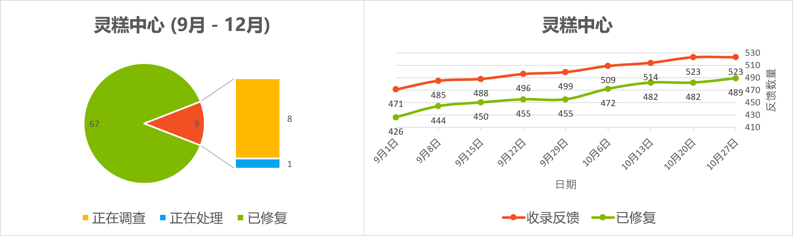
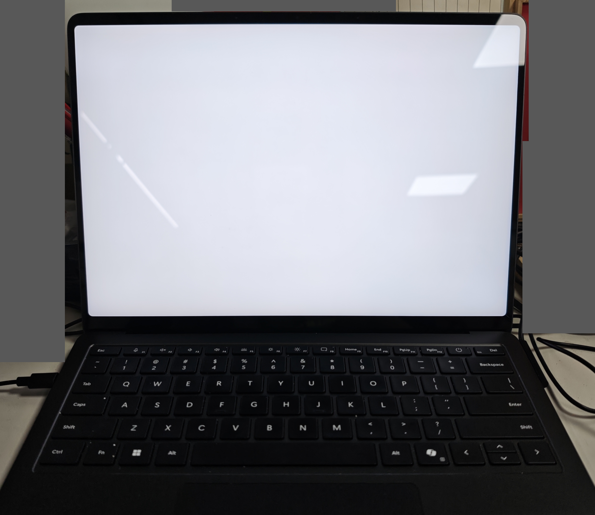

  

<h1 align="center">灵糕中心 (Linggao Hub)</h1>

[github.com/Lingggao/LGHUB](https://github.com/Lingggao/LGHUB) (GitHub)

&emsp;&emsp;**用于跟踪 “Windows 11 预览体验版本 (Canary 频道) 中哪些反馈正在由 Microsoft 调查、处理 / 已做出更改” 的信息枢纽**。由 2021 Windows Insider 最有价值专家 (MVP) · [**Ling Gao**](https://github.com/Lingggao) 先生管理。

&emsp;&emsp;灵糕中心成立于 2023 年 12 月 12 日，其前身可追溯至 2019 年 5 月 14 日由 Microsoft 社区创建的 “[\[BUG 汇总\] Windows 10 2019 年 5 月更新 (1903_18362) 已知问题与处理进度汇总](https://answers.microsoft.com/zh-hans/insider/forum/all/bug-%E6%B1%87%E6%80%BBwindows-10-2019-%E5%B9%B4-5/252d0d6a-022c-4bf7-9976-55b57590aee2)” 讨论话题。

> [!IMPORTANT]
>
> &emsp;灵糕中心为个人项目，管理者不是 Microsoft 公司员工，不能代表 Microsoft 公司立场、态度。本中心无意且无法代替 “反馈中心” (Feedback Hub) 应用的重要作用。本中心不提供 Microsoft 产品技术支持服务。本中心不接受有关 Windows 11 预览体验版本的反馈，用户应始终通过 “反馈中心” 应用提交。
>
> &emsp;Windows、Windows Insider Program 等是 Microsoft 公司的商标。

&emsp;&emsp;**宗旨**：独立管理、服务用户、信息精准、更新及时

[反馈中心](https://aka.ms/fbh) | [深入了解反馈](https://learn.microsoft.com/zh-cn/windows-insider/feedback) | [Flight Hub](https://learn.microsoft.com/en-us/windows-insider/flight-hub) | Windows 预览体验计划 - [网站](https://www.microsoft.com/zh-cn/windowsinsider) · [博客](https://blogs.windows.com/windows-insider) · [X](https://twitter.com/windowsinsider) · Microsoft 社区 ([中](https://answers.microsoft.com/zh-hans/insider/forum) / [英](https://answers.microsoft.com/en-us/insider/forum))

| 🎖️ **推荐** | **[WinDiscover](https://windiscover.com) - 独立 Microsoft 新闻网站** | **关注 [@Microsoft 信仰中心](https://weibo.com/u/3139784387) 微博** |
| :--------: | :----------------------------------------------------------: | :----------------------------------------------------------: |
|            |            [**LCZBlog**](https://blog.licaoz.com)            |       [**GuCATs'摸鱼站**](https://goo-aw233.github.io)       |

## 总览

| 😸 欢迎加入 [“Ling 的 Windows Insider 小屋”](https://teams.live.com/l/community/FEAd0AVp_B_pTH5Zhk) Microsoft Teams 社区 😽 |
| :----------------------------------------------------------: |

| 灵糕中心设立 [“Microsoft 网站错误 & 本地化问题”](WebLoc/README.md) 板块 |
| :----------------------------------------------------------: |

上次更新时间：2025 年 6 月 14 日 19:00 (UTC+8)。Star 数量：51 ⭐

收录反馈 404 个，其中正在调查 41 个 (含[搁置](#3) 6 个)、正在处理 4 个、已修复 359 个。

反馈更新记录：**今日更新 LG400 - 403**。- Ling 🪙 [总览图](https://raw.githubusercontent.com/Lingggao/LGHUB/main/Images/Linggao%20Hub.png) | [反馈更新记录](Documents/Update_Feedback.md) | [平台更新记录](Documents/Update_Platform.md)

[**WIP Canary 27871 更新简报**](Canary.md) | [往期简报](Documents/Canary_Previous)

|         频道         |              最新版本               | 时间 (UTC+8) | 公告 |
| :------------------: | :---------------------------------: | :----------: | :------------------: |
|        Canary        |                27871                |  2025/6/5  | [aka.ms/wip27871](https://blogs.windows.com/windows-insider/2025/06/04/announcing-windows-11-insider-preview-build-27871-canary-channel) |
|       Dev        | **[新]** 26200.5651 |   2025/6/14   | [aka.ms/wip-dev-6-13-25](https://blogs.windows.com/windows-insider/2025/06/13/announcing-windows-11-insider-preview-build-26200-5651-dev-channel) |
|         Beta         | **[新]** 26120.4441 |   2025/6/14   | [aka.ms/wip-beta-6-13-25](https://blogs.windows.com/windows-insider/2025/06/13/announcing-windows-11-insider-preview-build-26120-4441-beta-channel) |
| Release Preview  | 26100.4202 |  2025/5/28  | [blogs.windows.com](https://blogs.windows.com/windows-insider/2025/05/19/releasing-windows-11-build-26100-4188-to-the-release-preview-channel) |
| General Availability |    26100.4351    |  2025/6/12  | [support.microsoft.com](https://support.microsoft.com/en-us/help/5063060) |

统计图 - 2024 年 ([1 - 4 月](Images/Graph_2401_2404.png) · [5 - 8 月](Images/Graph_2405_2408.png) · [9 - 12 月](Images/Graph_2409_2412.png)) | 2025 年 ([1 - 4 月](Images/Graph_2501_2504.png) · [5 - 8 月](Images/Graph_1.png) · 9 - 12 月)

---

> [!NOTE]
>
> &emsp;多数问题是仅有 1 - 2 位 Insiders 反馈的 “偶发性” 问题，而非所有人都会遇到的 “广泛性” 问题。请放心地更新 Windows 11 预览体验版本，不必担心新版使用体验过差。

|      编号       |                             问题                             |   状态   |
| :-------------: | :----------------------------------------------------------: | :------: |
|       ——        |              [**Canary - 公告已知问题**](#0) ▼               |    ——    |
| [LG212](#LG212) | **[Copilot+ 电脑]** 加入 Canary 频道后，PIN 和生物识别信息将丢失。 | 正在处理 |
| [LG368](#LG368) |              任务栏材质效果消失，变成了深灰色。              | 正在处理 |
| [LG342](#LG342) |                 打开组策略编辑器时提示错误。                 | 正在处理 |
|       ——        | [**Canary - 公告已知问题**](#0) ▲ \| ▼ [**Canary - 用户反馈问题**](#1) |    ——    |
|       ——        |        ***注**：长期未修复的问题收录于[搁置](#3)板块*        |    ——    |
| [LG311](#LG311) |          文件资源管理器地址栏溢出列表无法正确呈现。          | 正在调查 |
| [LG347](#LG347) |            满足条件后在反馈中心无法获得成就徽章。            | 正在调查 |
| [LG348](#LG348) |       安装 Windows 11 时，菜单按照从右到左的方式排列。       | 正在调查 |
| [LG357](#LG357) |         截图工具无法截取搜索界面、上下文菜单等 UI。          | 正在调查 |
| [LG361](#LG361) |          Microsoft Store 不显示较早的应用更新记录。          | 正在调查 |
| [LG367](#LG367) |            安装 Canary 更新时，屏幕显示白色画面。            | 正在调查 |
| [LG370](#LG370) |                  重启 explorer.exe 时白屏。                  | 正在调查 |
| [LG371](#LG371) |              开启 “自动隐藏任务栏” 后出现黑边。              | 正在调查 |
| [LG372](#LG372) |                   玩 DNF 游戏时电脑绿屏。                    | 正在调查 |
| [LG373](#LG373) |         电脑 WIN32K_CRITICAL_FAILURE (0x164) 绿屏。          | 正在调查 |
| [LG376](#LG376) |           使用 NVIDIA GeForce NOW 平台时电脑绿屏。           | 正在调查 |
| [LG377](#LG377) |                红外 (IR) 摄像头无法正常工作。                | 正在调查 |
| [LG378](#LG378) |           记事本文档中的下划线 “_” 无法正常显示。            | 正在调查 |
| [LG379](#LG379) |    Microsoft Store 最小化时，无法右键任务栏图标将其关闭。    | 正在调查 |
| [LG380](#LG380) |      使用 “照片” 应用裁剪图片后，保存时屏幕会闪烁一下。      | 正在调查 |
| [LG381](#LG381) |                 玩 PUBG 游戏时电脑自动重启。                 | 正在调查 |
| [LG382](#LG382) |              微信输入法候选框周围出现黑粗边框。              | 正在调查 |
| [LG383](#LG383) | 开启 “管理员保护” 功能并以管理员身份运行终端时，UAC 对话框死锁。 | 正在调查 |
| [LG384](#LG384) |      将背景设置为 “Windows 聚焦” 后自动恢复为 “图片”。       | 正在调查 |
| [LG386](#LG386) |            已提交的反馈在 “我的反馈” 中随机消失。            | 正在调查 |
| [LG387](#LG387) |        玩 “Path of Exile” (流放之路) 游戏时电脑死机。        | 正在调查 |
| [LG388](#LG388) |             “设置”>“应用”>“操作” 菜单变为空白。              | 正在调查 |
| [LG390](#LG390) | 开启 “管理员保护” 功能后，无法使用 Windows 11 媒体创建工具。 | 正在调查 |
| [LG391](#LG391) |                   开始菜单的动画效果异常。                   | 正在调查 |
| [LG392](#LG392) |               任务栏 “搜索” 功能显示纯白界面。               | 正在调查 |
| [LG393](#LG393) | 截图工具可以正常启动，但无法截图 (WIN + Shift + S 也失效)。  | 正在调查 |
| [LG394](#LG394) |                玩 X-Plane 12 游戏时电脑绿屏。                | 正在调查 |
| [LG395](#LG395) |       在 “设置” 菜单中搜索 “高级网络设置” 时没有结果。       | 正在调查 |
| [LG396](#LG396) |      截图工具 “颜色选取器” 功能的顶栏无法完整显示文字。      | 正在调查 |
| [LG397](#LG397) |                   ActionsServer 反复崩溃。                   | 正在调查 |
| [LG398](#LG398) |      Microsoft Edge 不断检查更新，但始终无法完成更新。       | 正在调查 |
| [LG399](#LG399) |                ZTHELPER.dll 显示 15100 错误。                | 正在调查 |
| [LG400](#LG400) |    **玩 “守望先锋 2” (Overwatch 2) 游戏时电脑自动重启**。    | 正在调查 |
| [LG401](#LG401) |     **连接较旧的 Dolby Vision 显示器时，屏幕严重偏色**。     | 正在处理 |
| [LG402](#LG402) | **Microsoft Defender 安全智能定义更新失败，显示 8024402e 错误**。 | 正在调查 |
| [LG403](#LG403) | **点击设置菜单 “相关支持” 中的 “更改隐私设置” 时，打开的链接有误**。 | 正在调查 |
|       ——        | [**Canary - 用户反馈问题**](#1) ▲ \| ▼ [**Canary - 归档 (已做出更改 0 - 7 天)**](#2) |    ——    |
| [LG374](#LG374) |            高采样率 (192 kHz) 设备无法播放音频。             | 已修复 ✓ |
| [LG385](#LG385) | 启用基于虚拟化的安全 (VBS) 后，依赖于虚拟化的应用将无法运行。 | 已修复 ✓ |
| [LG366](#LG366) |               任务管理器的搜索和筛选功能失效。               | 已修复 ✓ |
| [LG323](#LG323) | 将鼠标悬停在 “系统信息” 菜单顶部的选项卡时，边框显示为直角。 | 已修复 ✓ |
| [LG389](#LG389) |     “禁用小组件面板” (Disable Widgets Board) 策略失效。      | 已修复 ✓ |
|       ——        | ***注**：部分未收录的问题详见 [WIP Canary 27871 更新简报](Canary.md)* |    ——    |
|       ——        |       ▲ [**Canary - 归档 (已做出更改 0 - 7 天)**](#2)        |    ——    |
|       ——        | [**Canary - 归档 (已做出更改 >7 天)**](7+.md) \| [**Canary - 搁置 (未做出更改)**](#3) |    ——    |

[分享反馈线索](https://forms.office.com/Pages/ResponsePage.aspx?id=DQSIkWdsW0yxEjajBLZtrQAAAAAAAAAAAAO__Q3sH7RUNjUyUzJLN0JBREZGMzBBVlpVOEVBQkRENy4u) | [反馈平台问题](https://forms.office.com/Pages/ResponsePage.aspx?id=DQSIkWdsW0yxEjajBLZtrQAAAAAAAAAAAAO__Q3sH7RUQ0haOElMVkxOWDE4U1pHQUZWMDhEM1gwSC4u)

## Canary - 公告已知问题

> [!TIP]
>
> &emsp;记录 [Windows Insider 博客](https://blogs.windows.com/windows-insider)中明确公开的已知问题。

---

编号：LG212  
日期：2024 年 8 月 16 日  
版本：Canary 27686 - 27871  
**问题**：**[Copilot+ 电脑] 加入 Canary 频道后，PIN 和生物识别信息将丢失**。  
状态：  
Microsoft 官方回复：“如果您使用 Copilot+ 设备从 Dev、Release Preview 或 Retail 频道加入至 Canary 频道，Windows Hello PIN 和生物识别信息将会丢失。您将无法登录系统，显示 0xd0000225 错误和 ‘出错了，您的 PIN 不可用’ 信息。点击 ‘设置我的 PIN’ 选项应当可以重设 PIN。” *(Ling 译)* 

---

编号：LG368  
日期：2025 年 5 月 18 日  
版本：Canary 27858 - 27871  
**问题**：**任务栏材质效果消失，变成了深灰色**。  
状态：  
典型反馈：[aka.ms/AAw9ms9](https://aka.ms/AAw9ms9) & [aka.ms/AAwak57](https://aka.ms/AAwak57)

---

编号：LG342  
日期：2025 年 4 月 26 日  
版本：Canary 27842 - 27871  
**问题**：**打开组策略编辑器时提示错误**。  
状态：  
典型反馈：[aka.ms/AAvskqo](https://aka.ms/AAvskqo) & [aka.ms/AAwif5b](https://aka.ms/AAwif5b)

## Canary - 用户反馈问题

> [!TIP]
>
> &emsp;记录[反馈中心应用](https://aka.ms/fbh)中 Microsoft 明确响应的问题。

---

编号：LG311  
日期：2025 年 3 月 24 日  
版本：Canary 27818 - 27871  
**问题**：**文件资源管理器地址栏溢出列表无法正确呈现**。  
状态：  
典型反馈：[aka.ms/AAv26rl](https://aka.ms/AAv26rl)

---

编号：LG347  
日期：2025 年 5 月 1 日  
版本：ALL  
**问题**：**满足条件后在反馈中心无法获得成就徽章**。  
状态：  
典型反馈：[aka.ms/AAw0kh1](https://aka.ms/AAw0kh1)

---

编号：LG348  
日期：2025 年 5 月 4 日  
版本：ALL  
**问题**：**安装 Windows 11 时，菜单按照从右到左的方式排列**。  
状态：  
典型反馈：[aka.ms/AAw2o68](https://aka.ms/AAw2o68) & [aka.ms/AAw5fk3](https://aka.ms/AAw5fk3)

---

编号：LG357  
日期：2025 年 5 月 10 日  
版本：ALL  
**问题**：**截图工具无法截取搜索界面、上下文菜单等 UI**。  
状态：  
典型反馈：[aka.ms/AAw7f38](https://aka.ms/AAw7f38)

---

编号：LG361  
日期：2025 年 5 月 15 日  
版本：ALL  
**问题**：**Microsoft Store 不显示较早的应用更新记录**。  
状态：  
典型反馈：[aka.ms/AAw8czh](https://aka.ms/AAw8czh)

---

编号：LG367  
日期：2025 年 5 月 18 日  
版本：Canary 27858 - 27871  
**问题**：**安装 Canary 更新时，屏幕显示白色画面**。  
状态：  
典型反馈：[aka.ms/AAw9msg](https://aka.ms/AAw9msg) & [aka.ms/AAwdmg2](https://aka.ms/AAwdmg2)

---

编号：LG370  
日期：2025 年 5 月 18 日  
版本：Canary 27858 - 27871  
**问题**：**重启 explorer.exe 时白屏**。  
状态：  
典型反馈：[aka.ms/AAw9m8s](https://aka.ms/AAw9m8s)

---

编号：LG371  
日期：2025 年 5 月 18 日  
版本：Canary 27858 - 27871  
**问题**：**开启 “自动隐藏任务栏” 后出现黑边**。  
状态：  
典型反馈：[aka.ms/AAwafxd](https://aka.ms/AAwafxd) & [aka.ms/AAwc9vp](https://aka.ms/AAwc9vp)

---

编号：LG372  
日期：2025 年 5 月 18 日  
版本：Canary 27858 - 27871  
**问题**：**玩 DNF 游戏时电脑绿屏**。  
状态：  
典型反馈：[aka.ms/AAwal5x](https://aka.ms/AAwal5x)

---

编号：LG373  
日期：2025 年 5 月 18 日  
版本：Canary 27858 - 27871  
**问题**：**电脑 WIN32K_CRITICAL_FAILURE (0x164) 绿屏**。  
状态：  
典型反馈：[aka.ms/AAwafxe](https://aka.ms/AAwafxe)

---

编号：LG376  
日期：2025 年 5 月 20 日  
版本：Canary 27858 - 27871  
**问题**：**使用 NVIDIA GeForce NOW 平台时电脑绿屏**。  
状态：  
典型反馈：[aka.ms/AAwc3xt](https://aka.ms/AAwc3xt)

---

编号：LG377  
日期：2025 年 5 月 20 日  
版本：Canary 27858 - 27871  
**问题**：**红外 (IR) 摄像头无法正常工作**。  
状态：  
典型反馈：[aka.ms/AAwapc6](https://aka.ms/AAwapc6)

---

编号：LG378  
日期：2025 年 5 月 20 日  
版本：ALL  
**问题**：**记事本文档中的下划线 “_” 无法正常显示**。  
状态：  
典型反馈：[aka.ms/AAwcalk](https://aka.ms/AAwcalk)

---

编号：LG379  
日期：2025 年 5 月 26 日  
版本：ALL  
**问题**：**Microsoft Store 最小化时，无法右键任务栏图标将其关闭**。  
状态：  
典型反馈：[aka.ms/AAwd8s4](https://aka.ms/AAwd8s4)

---

编号：LG380  
日期：2025 年 5 月 26 日  
版本：ALL  
**问题**：**使用 “照片” 应用裁剪图片后，保存时屏幕会闪烁一下**。  
状态：  
典型反馈：[aka.ms/AAw9alj](https://aka.ms/AAw9alj)

---

编号：LG381  
日期：2025 年 5 月 26 日  
版本：Canary 27863 - 27871  
**问题**：**玩 PUBG 游戏时电脑自动重启**。  
状态：  
典型反馈：[aka.ms/AAwd8az](https://aka.ms/AAwd8az)

---

编号：LG382  
日期：2025 年 5 月 26 日  
版本：Canary 27863 - 27871  
**问题**：**微信输入法候选框周围出现黑粗边框**。  
状态：  
典型反馈：[aka.ms/AAwdlyb](https://aka.ms/AAwdlyb)

---

编号：LG383  
日期：2025 年 5 月 26 日  
版本：Canary 27863 - 27871  
**问题**：**开启 “管理员保护” 功能并以管理员身份运行终端时，UAC 对话框死锁**。  
状态：  
典型反馈：[aka.ms/AAwdmg7](https://aka.ms/AAwdmg7)

---

编号：LG384  
日期：2025 年 5 月 26 日  
版本：ALL  
**问题**：**将背景设置为 “Windows 聚焦” 后自动恢复为 “图片”**。  
状态：  
典型反馈：[aka.ms/AAwe72g](https://aka.ms/AAwe72g)

---

编号：LG386  
日期：2025 年 6 月 2 日  
版本：ALL  
**问题**：**已提交的反馈在 “我的反馈” 中随机消失**。  
状态：  
典型反馈：[aka.ms/AAw9m7w](https://aka.ms/AAw9m7w)

---

编号：LG387  
日期：2025 年 6 月 2 日  
版本：Canary 27868 - 27871  
**问题**：**玩 “Path of Exile” (流放之路) 游戏时电脑死机**。  
状态：  
典型反馈：[aka.ms/AAwhpsd](https://aka.ms/AAwhpsd)

---

编号：LG388  
日期：2025 年 6 月 2 日  
版本：Canary 27868 - 27871  
**问题**：**“设置”>“应用”>“操作” 菜单变为空白**。  
状态：  
典型反馈：[aka.ms/AAwfiiv](https://aka.ms/AAwfiiv)

---

编号：LG390  
日期：2025 年 6 月 2 日  
版本：Canary 27868 - 27871  
**问题**：**开启 “管理员保护” 功能后，无法使用 Windows 11 媒体创建工具**。  
状态：  
典型反馈：[aka.ms/AAwhpsg](https://aka.ms/AAwhpsg)

---

编号：LG391  
日期：2025 年 6 月 4 日  
版本：Canary 27868 - 27871  
**问题**：**开始菜单的动画效果异常**。  
状态：  
典型反馈：[aka.ms/AAwi4xm](https://aka.ms/AAwi4xm)

---

编号：LG392  
日期：2025 年 6 月 4 日  
版本：Canary 27868 - 27871  
**问题**：**任务栏 “搜索” 功能显示纯白界面**。  
状态：  
典型反馈：[aka.ms/AAwi4xq](https://aka.ms/AAwi4xq)

---

编号：LG393  
日期：2025 年 6 月 4 日  
版本：ALL  
**问题**：**截图工具可以正常启动，但无法截图 (WIN + Shift + S 也失效)**。  
状态：  
典型反馈：[aka.ms/AAwicob](https://aka.ms/AAwicob) & [aka.ms/AAwn3qx](https://aka.ms/AAwn3qx)

---

编号：LG394  
日期：2025 年 6 月 4 日  
版本：Canary 27868 - 27871  
**问题**：**玩 X-Plane 12 游戏时电脑绿屏**。  
状态：  
典型反馈：[aka.ms/AAwikfb](https://aka.ms/AAwikfb)

---

编号：LG395  
日期：2025 年 6 月 11 日  
版本：Canary 27871  
**问题**：**在 “设置” 菜单中搜索 “高级网络设置” 时没有结果**。  
状态：  
典型反馈：[aka.ms/AAwndix](https://aka.ms/AAwndix)

---

编号：LG396  
日期：2025 年 6 月 11 日  
版本：ALL  
**问题**：**截图工具 “颜色选取器” 功能的顶栏无法完整显示文字**。  
状态：  
典型反馈：[aka.ms/AAwi7nq](https://aka.ms/AAwi7nq)

---

编号：LG397  
日期：2025 年 6 月 11 日  
版本：Canary 27871  
**问题**：**ActionsServer 反复崩溃**。  
状态：  
典型反馈：[aka.ms/AAwn7mb](https://aka.ms/AAwn7mb)

---

编号：LG398  
日期：2025 年 6 月 11 日  
版本：ALL  
**问题**：**Microsoft Edge 不断检查更新，但始终无法完成更新**。  
状态：  
典型反馈：[aka.ms/AAwn60f](https://aka.ms/AAwn60f)

---

编号：LG399  
日期：2025 年 6 月 11 日  
版本：Canary 27871  
**问题**：**ZTHELPER.dll 显示 15100 错误**。  
状态：  
典型反馈：[aka.ms/AAwn60g](https://aka.ms/AAwn60g)

---

编号：LG400  
日期：2025 年 6 月 14 日  
版本：Canary 27871  
**问题**：**玩 “守望先锋 2” (Overwatch 2) 游戏时电脑自动重启**。  
状态：  
典型反馈：[aka.ms/AAwp98m](https://aka.ms/AAwp98m)

---

编号：LG401  
日期：2025 年 6 月 14 日  
版本：Canary 27871  
**问题**：**连接较旧的 Dolby Vision 显示器时，屏幕严重偏色**。  
状态：  
典型反馈：[aka.ms/AAwndxy](https://aka.ms/AAwndxy) 

---

编号：LG402  
日期：2025 年 6 月 14 日  
版本：Canary 27871  
**问题**：**Microsoft Defender 安全智能定义更新失败，显示 8024402e 错误**。  
状态：  
典型反馈：[aka.ms/AAwo9as](https://aka.ms/AAwo9as)

---

编号：LG403  
日期：2025 年 6 月 14 日  
版本：Canary 27871  
**问题**：**点击设置菜单 “相关支持” 中的 “更改隐私设置” 时，打开的链接有误**。  
状态：  
典型反馈：[aka.ms/AAwoi47](https://aka.ms/AAwoi47)

## Canary - 归档 (已做出更改)

> [!TIP]
>
> &emsp;记录 Microsoft 已做出更改 0 - 7 天的问题 & 超过 14 天无新增赞成票的问题。
>
> &emsp;无特殊情况，问题归档后不再更新。

---

编号：LG374  
日期：2025 年 5 月 20 日  
版本：Canary 27858 - 27868  
**问题**：**高采样率 (192 kHz) 设备无法播放音频**。  
状态：Canary 27871 -  - 已修复 ✓  
典型反馈：[aka.ms/AAwc9vi](https://aka.ms/AAwc9vi) 

---

编号：LG385  
日期：2025 年 5 月 30 日  
版本：Canary 27868  
**问题**：**启用基于虚拟化的安全 (VBS) 后，依赖于虚拟化的应用将无法运行**。  
状态：Canary 27871 -  - 已修复 ✓  
Microsoft 官方回复：“启用 ‘基于虚拟化的安全’ (VBS) 后，依赖于虚拟化的应用 (如 VMware Workstation) 将无法运行，除非还启用了 ‘Windows Hypervisor Platform’ 可选功能。而以前无需启用它。” *(Ling 译)*  

---

编号：LG366  
日期：2025 年 5 月 18 日  
版本：Canary 27858 - 27868  
**问题**：**任务管理器的搜索和筛选功能失效**。  
状态：Canary 27871 -  - 已修复 ✓  
典型反馈：[aka.ms/AAwafdz](https://aka.ms/AAwafdz) 

---

编号：LG323  
日期：2025 年 4 月 3 日  
版本：Canary 27823 - 27868  
**问题**：**将鼠标悬停在 “系统信息” 菜单顶部的选项卡时，边框显示为直角**。  
状态：Canary 27871 -  - 已修复 ✓  
典型反馈：[aka.ms/AAvc3jh](https://aka.ms/AAvc3jh)

---

编号：LG389  
日期：2025 年 6 月 2 日  
版本：Canary 27868  
**问题**：**“禁用小组件面板” (Disable Widgets Board) 策略失效**。  
状态：Canary 27871 -  - 已修复 ✓  
典型反馈：[aka.ms/AAwhae1](https://aka.ms/AAwhae1)

---

*部分未收录反馈详见 [WIP Canary 27871 更新简报](Canary.md)*

[Microsoft 已做出更改 >7 天的问题](7+.md)

## Canary - 搁置 (未做出更改)

> [!TIP]
>
> &emsp;并非所有软件缺陷都要修复。
>
> &emsp;已收录的反馈也可能因缺少资源、修复风险过大、商业决策调整等长期或永久不予修复。本板块记录 Microsoft 超过 90 天未修复的问题，中心将每间隔 30 天在 Canary 频道最新版本中进行测试。

[Microsoft 超过 90 天未修复的问题](90+.md)

---

[回到顶部](#HEAD)

  

在 “[署名 - 相同方式共享 4.0](https://creativecommons.org/licenses/by-sa/4.0/legalcode.zh-Hans)” 协议 (CC BY-SA 4.0) 之条款下提供。

2023 - 2025, [高楷修 (Ling Gao)](https://github.com/Lingggao), 灵糕中心 (Linggao Hub), [github.com/Lingggao/LGHUB](https://github.com/Lingggao/LGHUB)

[字体许可使用授权书](Images/字体许可使用授权书.png) | [Windows Insider 最有价值专家](https://github.com/Lingggao/LGHUB/blob/main/Images/Windows%20Insider%20MVP.png?raw=true)