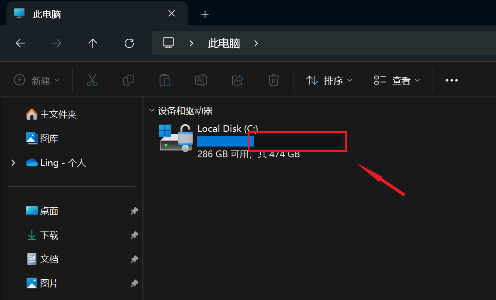
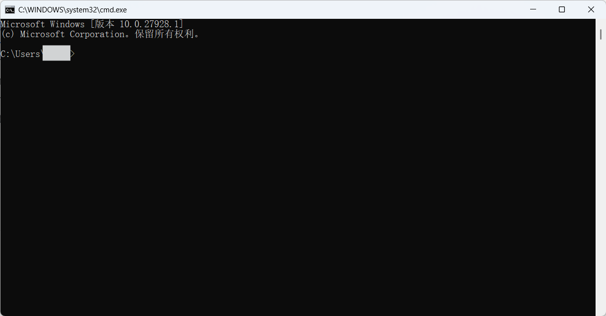

  

<h1 align="center">灵糕中心 (Linggao Hub)</h1>

[github.com/Lingggao/LGHUB](https://github.com/Lingggao/LGHUB) (GitHub)

&emsp;&emsp;**用于跟踪 “Windows 11 预览体验版本 (Canary 频道) 中哪些反馈正在由 Microsoft 调查、处理 / 已做出更改” 的信息枢纽**。由 2021 Windows Insider 最有价值专家 (MVP) · [**Ling Gao**](https://github.com/Lingggao) 先生管理。

&emsp;&emsp;灵糕中心成立于 2023 年 12 月 12 日，其前身可追溯至 2019 年 5 月 14 日由 Microsoft 社区创建的 “[\[BUG 汇总\] Windows 10 2019 年 5 月更新 (1903_18362) 已知问题与处理进度汇总](https://github.com/Lingggao/LGHUB/blob/main/Images/Inherited.png?raw=true)” 讨论话题。

> [!IMPORTANT]
>
> &emsp;灵糕中心为个人项目，管理者不是 Microsoft 公司员工，不能代表 Microsoft 公司立场、态度。本中心无意且无法代替 “反馈中心” (Feedback Hub) 应用的重要作用。本中心不提供 Microsoft 产品技术支持服务。本中心不接受有关 Windows 11 预览体验版本的反馈，用户应始终通过 “反馈中心” 应用提交。
>
> &emsp;Windows、Windows Insider Program 等是 Microsoft 公司的商标。

&emsp;&emsp;**宗旨**：独立管理、服务用户、信息精准、更新及时

[反馈中心](https://aka.ms/fbh) | [深入了解反馈](https://learn.microsoft.com/zh-cn/windows-insider/feedback) | [Flight Hub](https://learn.microsoft.com/en-us/windows-insider/flight-hub) | Windows 预览体验计划 - [网站](https://www.microsoft.com/zh-cn/windowsinsider) · [博客](https://blogs.windows.com/windows-insider) · [X](https://twitter.com/windowsinsider) · Microsoft 社区 ([中](https://learn.microsoft.com/zh-cn/answers/tags/953/windows-insider) / [英](https://learn.microsoft.com/en-us/answers/tags/953/windows-insider))

| 🎖️ **推荐** | **[WinDiscover](https://windiscover.com) - 独立 Microsoft 新闻网站** | **关注 [@Microsoft 信仰中心](https://weibo.com/u/3139784387) 微博** |
| :--------: | :----------------------------------------------------------: | :----------------------------------------------------------: |
|            |            [**LCZBlog**](https://blog.licaoz.com)            |       [**GuCATs'摸鱼站**](https://goo-aw233.github.io)       |

## 总览

| 😸 欢迎加入 [“Ling 的 Windows Insider 小屋”](https://teams.live.com/l/community/FEAd0AVp_B_pTH5ZiY) Microsoft Teams 社区 😽 |
| :----------------------------------------------------------: |

上次更新时间：2025 年 9 月 5 日 2:00 (UTC+8)。Star 数量：54 ⭐

收录反馈 471 个，其中正在调查 34 个 (含[搁置](#3) 7 个)、正在处理 11 个、已修复 426 个。

反馈更新记录：**今日更新 LG465 - 470**。- Ling 😫 [总览图](https://raw.githubusercontent.com/Lingggao/LGHUB/main/Images/Linggao%20Hub.png) | [反馈更新记录](Documents/Update_Feedback.md) | [平台更新记录](Documents/Update_Platform.md)

[**WIP Canary 27934 更新简报**](Canary.md) | [往期简报](Documents/Canary_Previous)

|         频道         |              最新版本               | 时间 (UTC+8) | 公告 |
| :------------------: | :---------------------------------: | :----------: | :------------------: |
|        Canary        |                27934                |  2025/8/30  | [aka.ms/wip27934](https://blogs.windows.com/windows-insider/2025/08/29/announcing-windows-11-insider-preview-build-27934-canary-channel) |
|       Dev        | 26220.5770 |   2025/8/30   | [aka.ms/wip-dev-8-29-25](https://blogs.windows.com/windows-insider/2025/08/29/announcing-windows-11-insider-preview-build-26220-5770-dev-channel) |
|         Beta         | 26120.5770 |   2025/8/30   | [aka.ms/wip-beta-8-29-25](https://blogs.windows.com/windows-insider/2025/08/29/announcing-windows-11-insider-preview-build-26120-5770-beta-channel) |
| Release Preview  | 26200.5074 |  2025/8/30  | [blogs.windows.com](https://blogs.windows.com/windows-insider/2025/08/29/releasing-windows-11-version-25h2-to-the-release-preview-channel) |
| General Availability |    26100.5074    |  2025/8/30  | [support.microsoft.com](https://support.microsoft.com/en-us/help/5064081) |

统计图 - 2024 年 ([1 - 4 月](Images/Graph_2401_2404.png) · [5 - 8 月](Images/Graph_2405_2408.png) · [9 - 12 月](Images/Graph_2409_2412.png)) | 2025 年 ([1 - 4 月](Images/Graph_2501_2504.png) · [5 - 8 月](Images/Graph_2505_2508.png) · [9 - 12 月](Images/Graph_0.png))

---

> [!NOTE]
>
> &emsp;多数问题是仅有 1 - 2 位 Insiders 反馈的 “偶发性” 问题，而非所有人都会遇到的 “广泛性” 问题。请放心地更新 Windows 11 预览体验版本，不必担心新版使用体验过差。

|      编号       |                             问题                             |   状态   |
| :-------------: | :----------------------------------------------------------: | :------: |
|       ——        |              [**Canary - 公告已知问题**](#0) ▼               |    ——    |
| [LG443](#LG443) |         “设置”>“系统”>“存储”>“临时文件” 扫描时卡住。         | 正在处理 |
| [LG445](#LG445) |           深色模式下文件资源管理器中的颜色不正确。           | 正在处理 |
| [LG456](#LG456) |               “重置此电脑” 功能无法正常使用。                | 正在处理 |
|       ——        | [**Canary - 公告已知问题**](#0) ▲ \| ▼ [**Canary - 用户反馈问题**](#1) |    ——    |
|       ——        |        ***注**：长期未修复的问题收录于[搁置](#3)板块*        |    ——    |
| [LG379](#LG379) |    Microsoft Store 最小化时，无法右键任务栏图标将其关闭。    | 正在调查 |
| [LG381](#LG381) |                 玩 PUBG 游戏时电脑自动重启。                 | 正在调查 |
| [LG384](#LG384) |      将背景设置为 “Windows 聚焦” 后自动恢复为 “图片”。       | 正在调查 |
| [LG386](#LG386) |            已提交的反馈在 “我的反馈” 中随机消失。            | 正在调查 |
| [LG391](#LG391) |                   开始菜单的动画效果异常。                   | 正在调查 |
| [LG395](#LG395) |       在 “设置” 菜单中搜索 “高级网络设置” 时没有结果。       | 正在调查 |
| [LG396](#LG396) |      截图工具 “颜色选取器” 功能的顶栏无法完整显示文字。      | 正在调查 |
| [LG400](#LG400) |      玩 “守望先锋 2” (Overwatch 2) 游戏时电脑自动重启。      | 正在调查 |
| [LG403](#LG403) | 点击设置菜单 “相关支持” 中的 “更改隐私设置” 时，打开的链接有误。 | 正在调查 |
| [LG410](#LG410) |                玩 NBA2K 游戏时电脑自动重启。                 | 正在调查 |
| [LG413](#LG413) |     “辅助功能” 快速设置中出现 “电动交通工具” 错误翻译。      | 正在调查 |
| [LG424](#LG424) |      “设置”>“鼠标” 菜单中 “主鼠标按钮” 的选项翻译有误。      | 正在调查 |
| [LG427](#LG427) |          任务管理器 “性能” 页面中的选项卡无法对齐。          | 正在调查 |
| [LG429](#LG429) |                      电脑无法正常关机。                      | 正在调查 |
| [LG252](#LG252) |              组策略编辑器和服务管理器 UI 错误。              | 正在调查 |
| [LG437](#LG437) |       登录界面中 “Microsoft 账户密码” 选项不显示图标。       | 正在处理 |
| [LG448](#LG448) |        **[Copilot+ 电脑]** “回顾” 功能无法正常工作。         | 正在调查 |
| [LG449](#LG449) |        搜索栏打开时，切换输入法会导致任务栏图标溢出。        | 正在调查 |
| [LG450](#LG450) |           关闭工作室效果后，控制中心仍显示其开启。           | 正在调查 |
| [LG451](#LG451) |               “更新并关机” 选项无法正常工作。                | 正在处理 |
| [LG453](#LG453) |   使用 “将当前用户设置复制到......” 选项时，设置菜单崩溃。   | 正在处理 |
| [LG457](#LG457) |           Microsoft Visio 应用窗口冻结 / 无响应。            | 正在处理 |
| [LG458](#LG458) |                  使用 Word 应用时电脑卡死。                  | 正在调查 |
| [LG459](#LG459) |               点击开始菜单时有 1 - 2 秒延迟。                | 正在调查 |
| [LG460](#LG460) |           “电池限制” 功能在 Surface UEFI 中消失。            | 正在调查 |
| [LG461](#LG461) |        启动记事本应用时，会在输入法列表添加一个键盘。        | 正在处理 |
| [LG462](#LG462) |        使用 Windows 图形捕获 API 的应用无法正常工作。        | 正在调查 |
| [LG463](#LG463) |           WinGet 在 PowerShell 和 CMD 中无法识别。           | 正在调查 |
| [LG464](#LG464) |      每次登录 Windows 时，都会自动创建一个系统还原点。       | 正在调查 |
| [LG465](#LG465) |               **任务栏应用窗口预览发生错位**。               | 正在调查 |
| [LG466](#LG466) |      **无法关闭 Xbox 应用中的 “显示其他游戏库” 设置**。      | 正在处理 |
| [LG467](#LG467) |       **使用 “wt” 启动 Windows 终端时出现显示异常**。        | 正在调查 |
| [LG468](#LG468) | **更新 Canary 27934 版本后出现 “不满足最低系统要求” 提示**。 | 正在调查 |
| [LG469](#LG469) |             **dao360.dll 崩溃问题未完全修复**。              | 正在处理 |
| [LG470](#LG470) |   **在虚拟机中安装 Canary 27934 版本时出现 0x17E 绿屏**。    | 正在处理 |
|       ——        | [**Canary - 用户反馈问题**](#1) ▲ \| ▼ [**Canary - 归档 (已做出更改 0 - 7 天)**](#2) |    ——    |
| [LG446](#LG446) | 在 “运行” 中启动 CMD 时，出现的是控制台主机而非 Windows 终端。 | 已修复 ✓ |
| [LG447](#LG447) |              DWM 崩溃 (黑屏 / 闪烁) 次数增加。               | 已修复 ✓ |
| [LG438](#LG438) |                   进入安全模式时电脑绿屏。                   | 已修复 ✓ |
| [LG452](#LG452) |                  Windows 搜索无法正常工作。                  | 已修复 ✓ |
| [LG454](#LG454) | 使用 ISO 安装 Canary 27924 的过程中，无法使用 “讲述人” 功能。 | 已修复 ✓ |
| [LG455](#LG455) |                 文件资源管理器窗口随机死锁。                 | 已修复 ✓ |
|       ——        | ***注**：部分未收录的问题详见 [WIP Canary 27934 更新简报](Canary.md)* |    ——    |
|       ——        |       ▲ [**Canary - 归档 (已做出更改 0 - 7 天)**](#2)        |    ——    |
|       ——        | [**Canary - 归档 (已做出更改 >7 天)**](7+.md) \| [**Canary - 搁置 (未做出更改)**](#3) |    ——    |

[分享反馈线索](https://forms.office.com/Pages/ResponsePage.aspx?id=DQSIkWdsW0yxEjajBLZtrQAAAAAAAAAAAAO__Q3sH7RUNjUyUzJLN0JBREZGMzBBVlpVOEVBQkRENy4u) | [反馈平台问题](https://forms.office.com/Pages/ResponsePage.aspx?id=DQSIkWdsW0yxEjajBLZtrQAAAAAAAAAAAAO__Q3sH7RUQ0haOElMVkxOWDE4U1pHQUZWMDhEM1gwSC4u)

## Canary - 公告已知问题

> [!TIP]
>
> &emsp;记录 [Windows Insider 博客](https://blogs.windows.com/windows-insider)中明确公开的已知问题。

---

编号：LG443  
日期：2025 年 8 月 16 日  
版本：Canary 27924 - 27934  
**问题**：**“设置”>“系统”>“存储”>“临时文件” 扫描时卡住**。  
状态：  
典型反馈：[aka.ms/AAxl4nc](https://aka.ms/AAxl4nc) & [aka.ms/AAxoo3v](https://aka.ms/AAxoo3v) 

---

编号：LG445  
日期：2025 年 8 月 16 日  
版本：Canary 27924 - 27934  
**问题**：**深色模式下文件资源管理器中的颜色不正确**。  
状态：

---

编号：LG456  
日期：2025 年 9 月 2 日  
版本：Canary 27934  
**问题**：**“重置此电脑” 功能无法正常使用**。  
状态：

## Canary - 用户反馈问题

> [!TIP]
>
> &emsp;记录[反馈中心应用](https://aka.ms/fbh)中 Microsoft 明确响应的问题。

---

编号：LG379  
日期：2025 年 5 月 26 日  
版本：ALL  
**问题**：**Microsoft Store 最小化时，无法右键任务栏图标将其关闭**。  
状态：  
典型反馈：[aka.ms/AAwd8s4](https://aka.ms/AAwd8s4)

---

编号：LG381  
日期：2025 年 5 月 26 日  
版本：Canary 27863 - 27934  
**问题**：**玩 PUBG 游戏时电脑自动重启**。  
状态：  
典型反馈：[aka.ms/AAwd8az](https://aka.ms/AAwd8az)

---

编号：LG384  
日期：2025 年 5 月 26 日  
版本：ALL  
**问题**：**将背景设置为 “Windows 聚焦” 后自动恢复为 “图片”**。  
状态：  
典型反馈：[aka.ms/AAwe72g](https://aka.ms/AAwe72g)

---

编号：LG386  
日期：2025 年 6 月 2 日  
版本：ALL  
**问题**：**已提交的反馈在 “我的反馈” 中随机消失**。  
状态：  
典型反馈：[aka.ms/AAw9m7w](https://aka.ms/AAw9m7w)

---

编号：LG391  
日期：2025 年 6 月 4 日  
版本：Canary 27868 - 27934  
**问题**：**开始菜单的动画效果异常**。  
状态：  
典型反馈：[aka.ms/AAwi4xm](https://aka.ms/AAwi4xm)

---

编号：LG395  
日期：2025 年 6 月 11 日  
版本：Canary 27871 - 27934  
**问题**：**在 “设置” 菜单中搜索 “高级网络设置” 时没有结果**。  
状态：  
典型反馈：[aka.ms/AAwndix](https://aka.ms/AAwndix)

---

编号：LG396  
日期：2025 年 6 月 11 日  
版本：ALL  
**问题**：**截图工具 “颜色选取器” 功能的顶栏无法完整显示文字**。  
状态：  
典型反馈：[aka.ms/AAwi7nq](https://aka.ms/AAwi7nq)

---

编号：LG400  
日期：2025 年 6 月 14 日  
版本：Canary 27871 - 27934  
**问题**：**玩 “守望先锋 2” (Overwatch 2) 游戏时电脑自动重启**。  
状态：  
典型反馈：[aka.ms/AAwp98m](https://aka.ms/AAwp98m) & [aka.ms/AAxovrp](https://aka.ms/AAxovrp)

---

编号：LG403  
日期：2025 年 6 月 14 日  
版本：Canary 27871 - 27934  
**问题**：**点击设置菜单 “相关支持” 中的 “更改隐私设置” 时，打开的链接有误**。  
状态：  
典型反馈：[aka.ms/AAwoi47](https://aka.ms/AAwoi47)

---

编号：LG410  
日期：2025 年 6 月 25 日  
版本：Canary 27881 - 27934  
**问题**：**玩 NBA2K 游戏时电脑自动重启**。  
状态：  
典型反馈：[aka.ms/AAwtbwa](https://aka.ms/AAwtbwa)

---

编号：LG413  
日期：2025 年 6 月 25 日  
版本：Canary 27881 - 27934  
**问题**：**“辅助功能” 快速设置中出现 “电动交通工具” 错误翻译**。  
状态：  
典型反馈：[aka.ms/AAwtbwl](https://aka.ms/AAwtbwl)

---

编号：LG424  
日期：2025 年 7 月 19 日  
版本：Canary 27902 - 27934  
**问题**：**“设置”>“鼠标” 菜单中 “主鼠标按钮” 的选项翻译有误**。  
状态：  
典型反馈：[aka.ms/AAx2o1o](https://aka.ms/AAx2o1o)

---

编号：LG427  
日期：2025 年 7 月 19 日  
版本：Canary 27902 - 27934  
**问题**：**任务管理器 “性能” 页面中的选项卡无法对齐**。  
状态：  
典型反馈：[aka.ms/AAx0xzj](https://aka.ms/AAx0xzj)

---

编号：LG429  
日期：2025 年 7 月 19 日  
版本：Canary 27891 - 27934  
**问题**：**电脑无法正常关机**。  
状态：  
典型反馈：[aka.ms/AAx2o1u](https://aka.ms/AAx2o1u)

---

编号：LG252  
日期：2024 年 12 月 20 日  
版本：Canary 27764 - 27934  
**问题**：**组策略编辑器和服务管理器 UI 错误**。  
状态：  
典型反馈：[aka.ms/AAty56l](https://aka.ms/AAty56l) 

---

编号：LG437  
日期：2025 年 8 月 5 日  
版本：Canary 27913 - 27934  
**问题**：**登录界面中 “Microsoft 账户密码” 选项不显示图标**。  
状态：  
典型反馈：[aka.ms/AAxhokm](https://aka.ms/AAxhokm)

---

编号：LG448  
日期：2025 年 8 月 24 日  
版本：Canary 27928 - 27934  
**问题**：**[Copilot+ 电脑] “回顾” 功能无法正常工作**。  
状态：  
典型反馈：[aka.ms/AAxlcug](https://aka.ms/AAxlcug)

---

编号：LG449  
日期：2025 年 8 月 24 日  
版本：Canary 27928 - 27934  
**问题**：**搜索栏打开时，切换输入法会导致任务栏图标溢出**。  
状态：  
典型反馈：[aka.ms/AAxljuq](https://aka.ms/AAxljuq)

---

编号：LG450  
日期：2025 年 8 月 24 日  
版本：Canary 27928 - 27934  
**问题**：**关闭工作室效果后，控制中心仍显示其开启**。  
状态：  
典型反馈：[aka.ms/AAxoo4i](https://aka.ms/AAxoo4i)

---

编号：LG451  
日期：2025 年 8 月 24 日  
版本：ALL  
**问题**：**“更新并关机” 选项无法正常工作**。  
状态：  
典型反馈：[aka.ms/AAxogk4](https://aka.ms/AAxogk4)

---

编号：LG453  
日期：2025 年 8 月 24 日  
版本：Canary 27928 - 27934  
**问题**：**使用 “将当前用户设置复制到......” 选项时，设置菜单崩溃**。  
状态：  
典型反馈：[aka.ms/AAxogjz](https://aka.ms/AAxogjz) 

---

编号：LG457  
日期：2025 年 9 月 2 日  
版本：Canary 27934  
**问题**：**Microsoft Visio 应用窗口冻结 / 无响应**。  
状态：  
典型反馈：[aka.ms/AAxoh9o](https://aka.ms/AAxoh9o) 

---

编号：LG458  
日期：2025 年 9 月 2 日  
版本：Canary 27934  
**问题**：**使用 Word 应用时电脑卡死**。  
状态：  
典型反馈：[aka.ms/AAxqsce](https://aka.ms/AAxqsce)

---

编号：LG459  
日期：2025 年 9 月 2 日  
版本：Canary 27934  
**问题**：**点击开始菜单时有 1 - 2 秒延迟**。  
状态：  
典型反馈：[aka.ms/AAxr7jf](https://aka.ms/AAxr7jf)

---

编号：LG460  
日期：2025 年 9 月 2 日  
版本：Canary 27934  
**问题**：**“电池限制” 功能在 Surface UEFI 中消失**。  
状态：  
典型反馈：[aka.ms/AAxqzz0](https://aka.ms/AAxqzz0)

---

编号：LG461  
日期：2025 年 9 月 2 日  
版本：Canary 27934  
**问题**：**启动记事本应用时，会在输入法列表添加一个键盘**。  
状态：  
典型反馈：[aka.ms/AAxr7j8](https://aka.ms/AAxr7j8)

---

编号：LG462  
日期：2025 年 9 月 2 日  
版本：Canary 27934  
**问题**：**使用 Windows 图形捕获 API 的应用无法正常工作**。  
状态：  
典型反馈：[aka.ms/AAxqsck](https://aka.ms/AAxqsck)

---

编号：LG463  
日期：2025 年 9 月 2 日  
版本：Canary 27934  
**问题**：**WinGet 在 PowerShell 和 CMD 中无法识别**。  
状态：  
典型反馈：[aka.ms/AAulrb4](https://aka.ms/AAulrb4)

---

编号：LG464  
日期：2025 年 9 月 2 日  
版本：Canary 27934  
**问题**：**每次登录 Windows 时，都会自动创建一个系统还原点**。  
状态：  
典型反馈：[aka.ms/AAxr7jj](https://aka.ms/AAxr7jj)

---

编号：LG465  
日期：2025 年 9 月 5 日  
版本：Canary 27934  
**问题**：**任务栏应用窗口预览发生错位**。  
状态：  
典型反馈：[aka.ms/AAxtvks](https://aka.ms/AAxtvks)

---

编号：LG466  
日期：2025 年 9 月 5 日  
版本：Canary 27934  
**问题**：**无法关闭 Xbox 应用中的 “显示其他游戏库” 设置**。  
状态：  
典型反馈：[aka.ms/AAxu39x](https://aka.ms/AAxu39x)

---

编号：LG467  
日期：2025 年 9 月 5 日  
版本：Canary 27934  
**问题**：**使用 “wt” 启动 Windows 终端时出现显示异常**。  
状态：  
典型反馈：[aka.ms/AAxtvkx](https://aka.ms/AAxtvkx)

---

编号：LG468  
日期：2025 年 9 月 5 日  
版本：Canary 27934  
**问题**：**更新 Canary 27934 版本后出现 “不满足最低系统要求” 提示**。  
状态：  
典型反馈：[aka.ms/AAxuaym](https://aka.ms/AAxuaym)

---

编号：LG469  
日期：2025 年 9 月 5 日  
版本：Canary 27928 - 27934  
**问题**：**dao360.dll 崩溃问题未完全修复**。  
状态：  
典型反馈：[aka.ms/AAxuayr](https://aka.ms/AAxuayr) 

---

编号：LG470  
日期：2025 年 9 月 5 日  
版本：Canary 27934  
**问题**：**在虚拟机中安装 Canary 27934 版本时出现 0x17E 绿屏**。  
状态：  
典型反馈：[aka.ms/AAxu3a9](https://aka.ms/AAxu3a9) 

## Canary - 归档 (已做出更改)

> [!TIP]
>
> &emsp;记录 Microsoft 已做出更改 0 - 7 天的问题 & 超过 14 天无新增赞成票的问题。
>
> &emsp;无特殊情况，问题归档后不再更新。

---

编号：LG446  
日期：2025 年 8 月 24 日  
版本：Canary 27928  
**问题**：**在 “运行” (WIN + R) 中启动 CMD 时，出现的是控制台主机而非 Windows 终端**。  
状态：Canary 27934 -  - 已修复 ✓  
典型反馈：[aka.ms/AAxogk0](https://aka.ms/AAxogk0) 

---

编号：LG447  
日期：2025 年 8 月 24 日  
版本：Canary 27928  
**问题**：**DWM 崩溃 (黑屏 / 闪烁) 次数增加**。  
状态：Canary 27934 -  - 已修复 ✓

---

编号：LG438  
日期：2025 年 8 月 5 日  
版本：Canary 27913 - 27928  
**问题**：**进入安全模式时电脑绿屏**。  
状态：Canary 27934 -  - 已修复 ✓  
典型反馈：[aka.ms/AAxbeyf](https://aka.ms/AAxbeyf)

---

编号：LG452  
日期：2025 年 8 月 24 日  
版本：Canary 27928  
**问题**：**Windows 搜索无法正常工作**。  
状态：Canary 27934 -  - 已修复 ✓  
典型反馈：[aka.ms/AAxogjt](https://aka.ms/AAxogjt)

---

编号：LG454  
日期：2025 年 8 月 24 日  
版本：Canary 27924 - 27928  
**问题**：**使用 ISO 安装 Canary 27924 的过程中，无法使用 “讲述人” 功能**。  
状态：Canary 27934 -  - 已修复 ✓  
典型反馈：[aka.ms/AAxovrt](https://aka.ms/AAxovrt)

---

编号：LG455  
日期：2025 年 8 月 24 日  
版本：Canary 27928  
**问题**：**文件资源管理器窗口随机死锁**。  
状态：Canary 27934 -  - 已修复 ✓  
典型反馈：[aka.ms/AAxovru](https://aka.ms/AAxovru)

---

*部分未收录反馈详见 [WIP Canary 27934 更新简报](Canary.md)*

[Microsoft 已做出更改 >7 天的问题](7+.md)

## Canary - 搁置 (未做出更改)

> [!TIP]
>
> &emsp;并非所有软件缺陷都要修复。
>
> &emsp;已收录的反馈也可能因缺少资源、修复风险过大、商业决策调整等长期或永久不予修复。本板块记录 Microsoft 超过 90 天未修复的问题，中心将每间隔 30 天在 Canary 频道最新版本中进行测试。

[Microsoft 超过 90 天未修复的问题](90+.md)

---

[回到顶部](#HEAD)

  

在 “[署名 - 相同方式共享 4.0](https://creativecommons.org/licenses/by-sa/4.0/legalcode.zh-Hans)” 协议 (CC BY-SA 4.0) 之条款下提供。

2023 - 2025, [高楷修 (Ling Gao)](https://github.com/Lingggao), 灵糕中心 (Linggao Hub), [github.com/Lingggao/LGHUB](https://github.com/Lingggao/LGHUB)

[字体许可使用授权书](Images/字体许可使用授权书.png) | [Windows Insider 最有价值专家](https://github.com/Lingggao/LGHUB/blob/main/Images/Windows%20Insider%20MVP.png?raw=true)