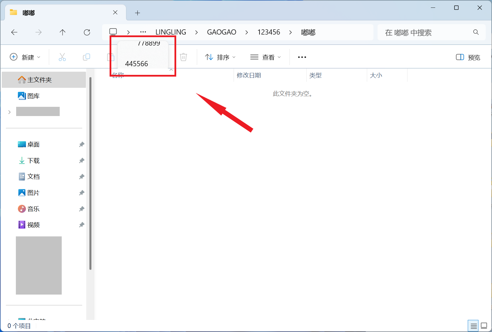

  

<h1 align="center">灵糕中心 (Linggao Hub)</h1>

[github.com/Lingggao/LGHUB](https://github.com/Lingggao/LGHUB) (GitHub)

&emsp;&emsp;**用于跟踪 “Windows 11 预览体验版本 (Canary 频道) 中哪些反馈正在由 Microsoft 调查、处理 / 已做出更改” 的信息枢纽**。由 2021 Windows Insider 最有价值专家 (MVP) · [**Ling Gao**](https://github.com/Lingggao) 先生管理。

&emsp;&emsp;灵糕中心成立于 2023 年 12 月 12 日，其前身可追溯至 2019 年 5 月 14 日由 Microsoft 社区创建的 “[\[BUG 汇总\] Windows 10 2019 年 5 月更新 (1903_18362) 已知问题与处理进度汇总](https://answers.microsoft.com/zh-hans/insider/forum/all/bug-%E6%B1%87%E6%80%BBwindows-10-2019-%E5%B9%B4-5/252d0d6a-022c-4bf7-9976-55b57590aee2)” 讨论话题。

> [!IMPORTANT]
>
> &emsp;灵糕中心为个人项目，管理者不是 Microsoft 公司员工，不能代表 Microsoft 公司立场、态度。中心无意且无法代替 “反馈中心” (Feedback Hub) 应用的重要作用。中心不提供 Microsoft 产品技术支持服务。中心不接受有关 Windows 11 预览体验版本的反馈，用户应始终通过 “反馈中心” 应用提交。
>
> &emsp;Windows、Windows Insider Program 等是 Microsoft 公司的商标。

&emsp;&emsp;**宗旨**：独立管理、服务用户、信息精准、更新及时

[反馈中心](https://aka.ms/fbh) | [深入了解反馈](https://learn.microsoft.com/zh-cn/windows-insider/feedback) | [Flight Hub](https://learn.microsoft.com/en-us/windows-insider/flight-hub) | Windows 预览体验计划 - [网站](https://www.microsoft.com/zh-cn/windowsinsider) · [博客](https://blogs.windows.com/windows-insider) · [X](https://twitter.com/windowsinsider) · Microsoft 社区 ([中](https://answers.microsoft.com/zh-hans/insider/forum) / [英](https://answers.microsoft.com/en-us/insider/forum))

| 🎖️ **推荐** | **[WinDiscover](https://windiscover.com) - 独立 Microsoft 新闻网站** | **关注 [@Microsoft 信仰中心](https://weibo.com/u/3139784387) 微博** |
| :--------: | :----------------------------------------------------------: | :----------------------------------------------------------: |
|            |            [**LCZBlog**](https://blog.licaoz.com)            |       [**GuCATs'摸鱼站**](https://goo-aw233.github.io)       |

## 总览

上次更新时间：2025 年 3 月 30 日 1:00 (UTC+8)。Star 数量：46

收录反馈 323 个，其中正在调查 18 个 (含[搁置](#3) 1 个)、正在处理 3 个、已修复 302 个。

反馈更新记录：**今日更新 LG317 - 322**。- Ling 😽 [总览图](https://raw.githubusercontent.com/Lingggao/LGHUB/main/Images/Linggao%20Hub.png) | [反馈更新记录](Documents/Update_Feedback.md) | [平台更新记录](Documents/Update_Platform.md)

[**WIP Canary 27823 更新简报**](Canary.md) | [往期简报](Documents/Canary_Previous)

|         频道         |              最新版本               | 时间 (UTC+8) | 公告 |
| :------------------: | :---------------------------------: | :----------: | :------------------: |
|        Canary        |                27823                |  2025/3/27  | [aka.ms/wip27823](https://blogs.windows.com/windows-insider/2025/03/26/announcing-windows-11-insider-preview-build-27823-canary-channel) |
|       Dev        | **[新]** 26200.5516 |   2025/3/29   | [aka.ms/wip-dev-3-28-25](https://blogs.windows.com/windows-insider/2025/03/28/announcing-windows-11-insider-preview-build-26200-5516-dev-channel) |
|         Beta         | **[新]** 26120.3653 |   2025/3/29   | [aka.ms/wip-beta-3-28-25](https://blogs.windows.com/windows-insider/2025/03/28/announcing-windows-11-insider-preview-build-26120-3653-beta-channel) |
| Release Preview  | **[新]** 26100.3624 |  2025/3/28  | [support.microsoft.com](https://support.microsoft.com/en-us/help/5053656) |
| General Availability |    26100.3476    |  2025/3/12  | [support.microsoft.com](https://support.microsoft.com/en-us/help/5053598) |

统计图 - 2024 年 ([1 - 4 月](Images/Graph_2401_2404.png) · [5 - 8 月](Images/Graph_2405_2408.png) · [9 - 12 月](Images/Graph_2409_2412.png)) | 2025 年 ([1 - 4 月](Images/Graph_1.png) · 5 - 8 月 · 9 - 12 月)

---

> [!NOTE]
>
> &emsp;多数问题是仅有 1 - 2 位 Insiders 反馈的 “偶发性” 问题，而非所有人都会遇到的 “广泛性” 问题。请放心地更新 Windows 11 预览体验版本，不必担心新版使用体验过差。

|      编号       |                             问题                             |   状态   |
| :-------------: | :----------------------------------------------------------: | :------: |
|       ——        |              [**Canary - 公告已知问题**](#0) ▼               |    ——    |
| [LG212](#LG212) | **[Copilot+ 电脑]** 加入 Canary 频道后，PIN 和生物识别信息将丢失。 | 正在处理 |
| [LG316](#LG316) |   “在最新更新可用后立即获取” 选项无法正确呈现并自动关闭。    | 正在处理 |
| [LG309](#LG309) |        以平板电脑方式使用时，任务栏中的图标不会变大。        | 正在处理 |
|       ——        | [**Canary - 公告已知问题**](#0) ▲ \| ▼ [**Canary - 用户反馈问题**](#1) |    ——    |
| [LG310](#LG310) | **[置顶]** 启动部分应用 / 功能时 WHEA_UNCORRECTABLE_ERROR 绿屏。 | 正在调查 |
| [LG252](#LG252) |              组策略编辑器和服务管理器 UI 错误。              | 正在调查 |
| [LG258](#LG258) |            拖动表情符号面板中的滚动条时卡顿严重。            | 正在调查 |
| [LG265](#LG265) |        Windows 安全中心 “智能应用控制” 功能丢失图标。        | 正在调查 |
| [LG277](#LG277) |     右键文件时，删除按钮的鼠标悬停提示为 “删除 (删除)”。     | 正在调查 |
| [LG279](#LG279) |   在反馈中心提交的反馈有状态更新或官方回复时无法收到通知。   | 正在调查 |
| [LG281](#LG281) |           使用 ms-search: 链接时任务栏搜索框消失。           | 正在调查 |
| [LG286](#LG286) | Microsoft Store 宣传视频中的 “投放到设备” 被译为 “强制转换为设备”。 | 正在调查 |
| [LG289](#LG289) | 使用深色模式时，“电池使用情况” 菜单中的鼠标悬停提示显示为浅色。 | 正在调查 |
| [LG301](#LG301) |     在文件资源管理器中新建标签页时，地址栏中的路径不变。     | 正在调查 |
| [LG311](#LG311) |          文件资源管理器地址栏溢出列表无法正确呈现。          | 正在调查 |
| [LG317](#LG317) |                **启动 PUBG 游戏时电脑绿屏**。                | 正在调查 |
| [LG318](#LG318) |                **无法启动 Hyper-V 虚拟机**。                 | 正在调查 |
| [LG319](#LG319) |     **“系统信息” 菜单顶部选项卡显示的内存速度不正确**。      | 正在调查 |
| [LG320](#LG320) |                  **“天气” 应用加载缓慢**。                   | 正在调查 |
| [LG321](#LG321) |  **点击文件资源管理器左侧的导航窗格时，右侧仍停留在主页**。  | 正在调查 |
| [LG322](#LG322) |                      **夜间模式失效**。                      | 正在调查 |
|       ——        | [**Canary - 用户反馈问题**](#1) ▲ \| ▼ [**Canary - 归档 (已做出更改 0 - 7 天)**](#2) |    ——    |
| [LG225](#LG225) |        文件资源管理器 “...” 二级菜单无法向下方弹出。         | 已修复 ✓ |
| [LG308](#LG308) |    最小化并使用 ALT + TAB 还原文件资源管理器时 UI 异常。     | 已修复 ✓ |
| [LG312](#LG312) |               在截图工具中使用画笔时应用冻结。               | 已修复 ✓ |
| [LG313](#LG313) |      **[3 月 22 日]** 搜索功能的结果出现速度大幅变慢。       | 已修复 ✓ |
| [LG314](#LG314) |                  记事本应用更新后性能变差。                  | 已修复 ✓ |
| [LG315](#LG315) |             无法启动 IP Helper (IpHlpSvc) 服务。             | 已修复 ✓ |
|       ——        | *部分未收录反馈详见 [WIP Canary 27823 更新简报](Canary.md)*  |    ——    |
|       ——        |       ▲ [**Canary - 归档 (已做出更改 0 - 7 天)**](#2)        |    ——    |
|       ——        | [**Canary - 归档 (已做出更改 >7 天)**](7+.md) \| [**Canary - 搁置 (未做出更改)**](#3) |    ——    |

[分享反馈线索](https://forms.office.com/Pages/ResponsePage.aspx?id=DQSIkWdsW0yxEjajBLZtrQAAAAAAAAAAAAO__Q3sH7RUNjUyUzJLN0JBREZGMzBBVlpVOEVBQkRENy4u) | [反馈平台问题](https://forms.office.com/Pages/ResponsePage.aspx?id=DQSIkWdsW0yxEjajBLZtrQAAAAAAAAAAAAO__Q3sH7RUQ0haOElMVkxOWDE4U1pHQUZWMDhEM1gwSC4u)

## Canary - 公告已知问题

> [!TIP]
>
> &emsp;记录 [Windows Insider 博客](https://blogs.windows.com/windows-insider)中明确公开的已知问题。

---

编号：LG212  
日期：2024 年 8 月 16 日  
版本：Canary 27686 - 27823  
**问题**：**[Copilot+ 电脑] 加入 Canary 频道后，PIN 和生物识别信息将丢失**。  
状态：  
Microsoft 官方å›å¤ï¼šâ€œå¦‚æœæ‚¨ä½¿ç”¨ Copilot+ è®¾å¤‡ä» Dev、Release Preview 或 Retail 频é“加入至 Canary 频é“，Windows Hello PIN 和生物识别信æ¯å°†ä¼šä¸¢å¤±ã€‚您将无法登录系统，显示 0xd0000225 错误和 ‘出错了，您的 PIN ä¸å¯ç”¨â€™ ä¿¡æ¯ã€‚点击 ‘设置我的 PIN’ 选项应当å¯ä»¥é‡è®¾ PIN。†*(Ling 译)* 

---

编号：LG316  
日期：2025 年 3 月 29 日  
版本：Canary 27823  
**问题**：**“在最新更新可用后立即获取” 选项无法正确呈现并自动关闭**。  
状态：

---

编号：LG309  
日期：2025 年 3 月 21 日  
版本：Canary 27818 - 27823  
**问题**：**以平板电脑方式使用时，任务栏中的图标不会变大**。  
状态：  
典型反馈：[aka.ms/AAv7ss7](https://aka.ms/AAv7ss7) 

## Canary - 用户反馈问题

> [!TIP]
>
> &emsp;记录[反馈中心应用](https://aka.ms/fbh)中 Microsoft 明确响应的问题。

---

编号：LG310  
日期：2025 年 3 月 24 日  
版本：Canary 27818 - 27823  
**问题**：**启动部分应用 / 功能时 WHEA_UNCORRECTABLE_ERROR 绿屏**。  
状态：  
典型反馈：[aka.ms/AAv7zrj](https://aka.ms/AAv7zrj) & [aka.ms/AAv7s0c](https://aka.ms/AAv7s0c) & [aka.ms/AAv7l43](https://aka.ms/AAv7l43) & [aka.ms/AAv7l46](https://aka.ms/AAv7l46)

已知异常应用 / 功能列表：

- VMware Workstation Pro
- 火绒安全软件 6.0
- 网易 MuMu 模拟器
- 适用于 Linux 的 Windows 子系统 (WSL)
- Oracle VM VirtualBox

---

编号：LG252  
日期：2024 年 12 月 20 日  
版本：Canary 27764 - 27823  
**问题**：**组策略编辑器和服务管理器 UI 错误**。  
状态：  
典型反馈：[aka.ms/AAty56l](https://aka.ms/AAty56l)

---

编号：LG258  
日期：2025 年 1 月 10 日  
版本：Canary 27766 - 27823  
**问题**：**拖动表情符号面板中的滚动条时卡顿严重**。  
状态：  
典型反馈：[aka.ms/AAtws2s](https://aka.ms/AAtws2s)

---

编号：LG265  
日期：2025 年 1 月 20 日  
版本：Canary 27774 - 27823  
**问题**：**Windows 安全中心 “智能应用控制” 功能丢失图标**。  
状态：  
典型反馈：[aka.ms/AAu1k0e](https://aka.ms/AAu1k0e)

---

编号：LG277  
日期：2025 年 1 月 29 日  
版本：Canary 27764 - 27823  
**问题**：**右键文件时，删除按钮的鼠标悬停提示为 “删除 (删除)”**。  
状态：  
典型反馈：[aka.ms/AAu4457](https://aka.ms/AAu4457)

---

编号：LG279  
日期：2025 年 1 月 29 日  
版本：ALL  
**问题**：**在反馈中心提交的反馈有状态更新或官方回复时无法收到通知**。  
状态：  
典型反馈：[aka.ms/AAu3v9h](https://aka.ms/AAu3v9h) 

---

编号：LG281  
日期：2025 年 1 月 29 日  
版本：Canary 27774 - 27823  
**问题**：**使用 ms-search: 链接时任务栏搜索框消失**。  
状态：  
典型反馈：[aka.ms/AAu42tm](https://aka.ms/AAu42tm)

---

编号：LG286  
日期：2025 年 2 月 1 日  
版本：ALL  
**问题**：**Microsoft Store 宣传视频中的 “投放到设备” 被译为 “强制转换为设备”**。  
状态：  
典型反馈：[aka.ms/AAu5r06](https://aka.ms/AAu5r06)

---

编号：LG289  
日期：2025 年 2 月 22 日  
版本：Canary 27788 - 27823  
**问题**：**使用深色模式时，“电池使用情况” 菜单中的鼠标悬停提示显示为浅色**。  
状态：  
典型反馈：[aka.ms/AAuk2qa](https://aka.ms/AAuk2qa)

---

编号：LG301  
日期：2025 年 3 月 1 日  
版本：Canary 27788 - 27823  
**问题**：**在文件资源管理器中新建标签页时，地址栏中的路径不变**。  
状态：  
典型反馈：[aka.ms/AAuq4uj](https://aka.ms/AAuq4uj)

---

编号：LG311  
日期：2025 年 3 月 24 日  
版本：Canary 27818 - 27823  
**问题**：**文件资源管理器地址栏溢出列表无法正确呈现**。  
状态：  
典型反馈：[aka.ms/AAv26rl](https://aka.ms/AAv26rl)

---

编号：LG317  
日期：2025 年 3 月 30 日  
版本：Canary 27823  
**问题**：**启动 PUBG 游戏时电脑绿屏**。  
状态：  
典型反馈：[aka.ms/AAv9mb1](https://aka.ms/AAv9mb1)

---

编号：LG318  
日期：2025 年 3 月 30 日  
版本：Canary 27823  
**问题**：**无法启动 Hyper-V 虚拟机**。  
状态：  
典型反馈：[aka.ms/AAv9u24](https://aka.ms/AAv9u24)

---

编号：LG319  
日期：2025 年 3 月 30 日  
版本：Canary 27823  
**问题**：**“系统信息” 菜单顶部选项卡显示的内存速度不正确**。  
状态：  
典型反馈：[aka.ms/AAv9eqx](https://aka.ms/AAv9eqx)

---

编号：LG320  
日期：2025 年 3 月 30 日  
版本：ALL  
**问题**：**“天气” 应用加载缓慢**。  
状态：  
典型反馈：[aka.ms/AAv9mb3](https://aka.ms/AAv9mb3)

---

编号：LG321  
日期：2025 年 3 月 30 日  
版本：Canary 27823  
**问题**：**点击文件资源管理器左侧的导航窗格时，右侧仍停留在主页**。  
状态：  
典型反馈：[aka.ms/AAv9u26](https://aka.ms/AAv9u26)

---

编号：LG322  
日期：2025 年 3 月 30 日  
版本：Canary 27823  
**问题**：**夜间模式失效**。  
状态：  
典型反馈：[aka.ms/AAv9mb7](https://aka.ms/AAv9mb7)

## Canary - 归档 (已做出更改)

> [!TIP]
>
> &emsp;记录 Microsoft 已做出更改 0 - 7 天的问题 & 超过 14 天无新增赞成票的问题。
>
> &emsp;无特殊情况，问题归档后不再更新。

---

编号：LG225  
日期：2024 年 10 月 9 日  
版本：Canary 27718 - 27818  
**问题**：**文件资源管理器 “...” 二级菜单无法向下方弹出**。  
状态：Canary 27823 -  - 已修复 ✓  
典型反馈：[aka.ms/AAspbvg](https://aka.ms/AAspbvg) & [aka.ms/AAtyk9a](https://aka.ms/AAtyk9a) 

---

编号：LG308  
日期：2025 年 3 月 9 日  
版本：Canary 27802 - 27818  
**问题**：**最小化并使用 ALT + TAB 还原文件资源管理器时 UI 异常**。  
状态：Canary 27823 -  - 已修复 ✓  
典型反馈：[aka.ms/AAuyemc](https://aka.ms/AAuyemc) 

---

编号：LG312  
日期：2025 年 3 月 24 日  
版本：Canary 27818  
**问题**：**在截图工具中使用画笔时应用冻结**。  
状态：Canary 27823 -  - 已修复 ✓  
典型反馈：[aka.ms/AAv26rl](https://aka.ms/AAv26rl)

---

编号：LG313  
日期：2025 年 3 月 24 日  
版本：Canary 27818  
**问题**：**[3 月 22 日] 搜索功能的结果出现速度大幅变慢**。  
状态：Canary 27823 -  - 已修复 ✓  
典型反馈：[aka.ms/AAv7ss9](https://aka.ms/AAv7ss9)

---

编号：LG314  
日期：2025 年 3 月 24 日  
版本：11.2501.30.0  
**问题**：**记事本应用更新后性能变差**。  
状态：ALL -  - 已修复 ✓  
典型反馈：[aka.ms/AAv7l3r](https://aka.ms/AAv7l3r) 

---

编号：LG315  
日期：2025 年 3 月 24 日  
版本：Canary 27818  
**问题**：**无法启动 IP Helper (IpHlpSvc) 服务**。  
状态：Canary 27823 -  - 已修复 ✓  
典型反馈：[aka.ms/AAv80jo](https://aka.ms/AAv80jo)

---

*部分未收录反馈详见 [WIP Canary 27823 更新简报](Canary.md)*

[Microsoft 已做出更改 >7 天的问题](7+.md)

## Canary - 搁置 (未做出更改)

> [!TIP]
>
> &emsp;并非所有软件缺陷都要修复。
>
> &emsp;已收录的反馈也可能因缺少资源、修复风险过大、商业决策调整等长期或永久不予修复。本板块记录 Microsoft 超过 90 天未修复的问题，中心将每间隔 30 天在 Canary 频道最新版本中进行测试。

[Microsoft 超过 90 天未修复的问题](90+.md)

---

[回到顶部](#HEAD)

  

在 “[署名 - 相同方式共享 4.0](https://creativecommons.org/licenses/by-sa/4.0/legalcode.zh-Hans)” 协议 (CC BY-SA 4.0) 之条款下提供。

2023 - 2025, [高楷修 (Ling Gao)](https://github.com/Lingggao), 灵糕中心 (Linggao Hub), [github.com/Lingggao/LGHUB](https://github.com/Lingggao/LGHUB)

[字体许可使用授权书](Images/字体许可使用授权书.png) | [Windows Insider 最有价值专家]()